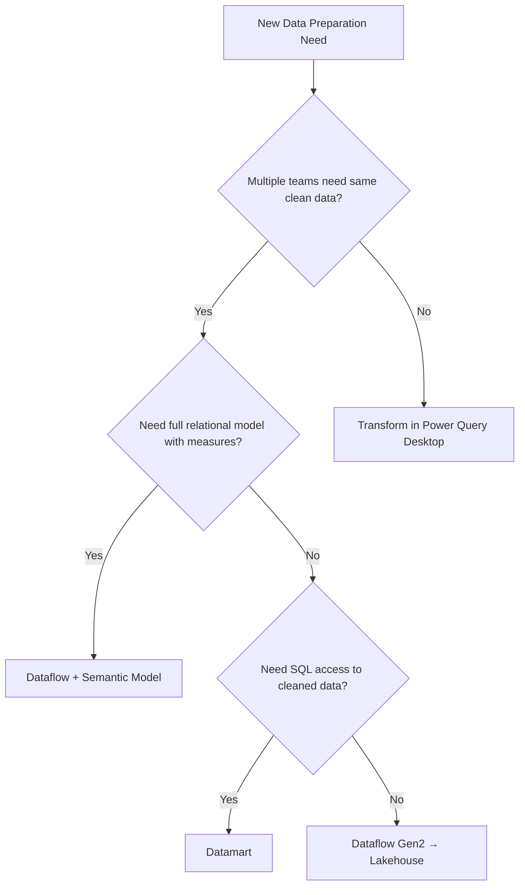

# Dataflows — Senior Deep Dive

## Dataflow Gen2 Architecture in Microsoft Fabric

Dataflow Gen2 is the evolution of dataflows in the Microsoft Fabric platform. It replaces the CDM-based storage of Gen1 with **Delta Lake** format stored in a Fabric Lakehouse.

### Storage Architecture

```
Gen1 Dataflow:
  Power Query Online → CDM format → Azure Data Lake / Power BI internal storage
  Dataset connects via "Power BI dataflows" connector

Gen2 Dataflow:
  Power Query Online → Delta format → Fabric Lakehouse table
  Semantic model uses Direct Lake mode (reads Delta directly)
  OR dataset connects via standard connector
```

### Direct Lake vs Import vs DirectQuery

| Mode | Data Location | Query Time | Refresh Needed |
|---|---|---|---|
| Import | VertiPaq (copied) | Fastest | Yes, on schedule |
| DirectQuery | Source (live) | Slower, live | No |
| Direct Lake | Delta files (Lakehouse) | Near-Import speed | No (reads Delta directly) |

**Direct Lake** is the key advantage of Gen2 + Fabric: semantic models read directly from Delta files without copying data into VertiPaq. Large models that previously required Premium Import can now use Direct Lake on Fabric F-SKUs.

```
Gen2 Dataflow → Delta files in Lakehouse → Semantic model (Direct Lake) → Reports
                                            ↑ No VertiPaq copy needed!
```

---

## Staging in Dataflow Gen2

Gen2 introduces automatic **staging** — an intermediate step between source query and output destination.

```
Source Query (Power Query M)
    ↓
Staging Area (automatic)     ← Automatically created in Fabric
    ↓
Output Destination (Lakehouse, Warehouse, Azure SQL, etc.)
```

**Purpose of staging:**
- Allows computed entities and linked entities to operate without re-querying the source
- Reduces cross-cloud data movement
- Enables preview and data profiling during development

**Staging is automatic in Gen2** — developers don't need to manage it. In Gen1, computed entities required Premium explicitly; in Gen2, this is the default behavior.

---

## Advanced Computed Entity Patterns

### Chain of Computed Entities

```
Raw Source Entities (standard):
  SalesOrders_Raw → SQL Server
  ExchangeRates_Raw → REST API

Silver Computed Entities:
  SalesOrders_Typed → type conversion on SalesOrders_Raw
  ExchangeRates_Latest → deduplication on ExchangeRates_Raw

Gold Computed Entities:
  FactSales_USD → join SalesOrders_Typed with ExchangeRates_Latest + currency conversion
  FactSales_Agg → monthly aggregation of FactSales_USD
```

```powerquery
// FactSales_Agg: computed entity that aggregates FactSales_USD
let
    Source = #"FactSales_USD",  // Reference to previous computed entity
    Grouped = Table.Group(
        Source,
        {"FiscalYear", "FiscalMonth", "ProductCategoryKey", "RegionKey"},
        {
            {"TotalSalesUSD", each List.Sum([SalesAmountUSD]), type number},
            {"OrderCount", each Table.RowCount(_), Int64.Type},
            {"UniqueCustomers", each List.Count(List.Distinct([CustomerKey])), Int64.Type},
            {"AvgOrderValueUSD", each List.Average([SalesAmountUSD]), type number}
        }
    )
in
    Grouped
// This runs in the dataflow staging area — no SQL queries to the source
```

---

## Dataflow Governance at Scale

### Enterprise Dataflow Catalog

In large organizations, unmanaged dataflows proliferate. Establish governance:

```
IT/Data Engineering (Foundation Team):
  Foundation Dataflow → certified, IT-owned, Premium workspace
    ├── DimDate (canonical)
    ├── DimCustomer (CRM → cleaned)
    ├── DimProduct (ERP → cleaned)
    └── ExchangeRates (external API → cleaned)

Domain Teams (self-service, governed):
  Sales Dataflow → links Foundation entities, adds sales-specific logic
  Finance Dataflow → links Foundation entities, adds finance-specific logic

Rules:
- Domain teams MUST use linked Foundation entities (no re-importing shared dims)
- Source connections managed by IT (no ad-hoc new source connections)
- Dataflow owners certified and documented in data catalog
```

### Endorsement and Certification

```
Power BI Admin → Tenant Settings → Endorsement

Workflow:
  Developer creates dataflow
    → "Promoted" by workspace admin (quality reviewed)
    → "Certified" by data governance team (trusted for org-wide use)

In Power BI Desktop:
  Get Data → Power BI dataflows
  → Certified badge visible on certified dataflows
  → Users prefer certified over uncertified
```

---

## Monitoring Dataflow Refreshes at Scale

### Power BI REST API for Dataflow Monitoring

```python
import requests
import pandas as pd
from datetime import datetime, timedelta

class DataflowMonitor:
    def __init__(self, access_token, workspace_id):
        self.headers = {"Authorization": f"Bearer {access_token}"}
        self.base_url = "https://api.powerbi.com/v1.0/myorg"
        self.workspace_id = workspace_id

    def get_all_dataflows(self):
        url = f"{self.base_url}/groups/{self.workspace_id}/dataflows"
        response = requests.get(url, headers=self.headers)
        return response.json()["value"]

    def get_recent_transactions(self, dataflow_id, top=10):
        url = f"{self.base_url}/groups/{self.workspace_id}/dataflows/{dataflow_id}/transactions"
        params = {"$top": top}
        response = requests.get(url, headers=self.headers, params=params)
        return response.json()["value"]

    def check_refresh_health(self):
        dataflows = self.get_all_dataflows()
        health_report = []
        for df in dataflows:
            transactions = self.get_recent_transactions(df["objectId"])
            if transactions:
                latest = transactions[0]
                hours_since = (datetime.utcnow() - datetime.fromisoformat(latest["endTime"].replace("Z",""))).total_seconds() / 3600
                health_report.append({
                    "Dataflow": df["name"],
                    "LastRefresh": latest["endTime"],
                    "Status": latest["status"],
                    "HoursSince": round(hours_since, 1),
                    "IsStale": hours_since > 25,
                    "IsFailed": latest["status"] == "Failed"
                })
        return pd.DataFrame(health_report)

# Usage:
monitor = DataflowMonitor(token, workspace_id)
health = monitor.check_refresh_health()
stale = health[health["IsStale"] | health["IsFailed"]]
# Send alert for stale/failed dataflows
```

---

## Dataflow vs Datamart vs Semantic Model Decision Framework



### When to Use Each

| Scenario | Best Choice |
|---|---|
| ETL shared by 5+ teams | Dataflow (Foundation pattern) |
| Small team, one report | Transform in Power Query Desktop |
| Need SQL querying + Power BI | Datamart |
| Fabric environment, large scale | Dataflow Gen2 → Lakehouse → Semantic model (Direct Lake) |
| Near-real-time dashboard | DirectQuery dataset (no dataflow) |
| Complex business logic, certified data | Dataflow + Semantic model |

---

## Dataflow Lineage and Impact Analysis

Power BI Service provides lineage view for understanding data dependencies:

```
Power BI Service → Workspace → Lineage view

Shows:
  Source (SQL Server) → Dataflow → Dataset → Reports → Dashboards

Hover over any node to see:
  - Refresh status
  - Last refreshed time
  - Number of downstream dependencies
```

**Programmatic lineage via REST API:**

```python
# Get dataset upstream lineage
url = f"https://api.powerbi.com/v1.0/myorg/admin/datasets/{dataset_id}/upstreamDataflows"
response = requests.get(url, headers=headers)
upstream = response.json()["value"]
# Returns list of dataflows that feed this dataset
```

---

## Dataflow Refresh Optimization

### Parallel Entity Refresh

Within a dataflow, independent entities refresh in parallel. Optimize dependency graphs to maximize parallelism:

```
Serial (slow):
  SalesOrders_Raw → SalesOrders_Typed → FactSales_USD → FactSales_Agg

Parallel where possible:
  SalesOrders_Raw    ──┐
                        ├── FactSales_USD → FactSales_Agg
  ExchangeRates_Raw ──┘
  (Raw entities refresh in parallel; computed entities wait for dependencies)
```

### Connection Pooling

For dataflows with many entities from the same source, configure the connection to allow concurrent queries:

```
Power BI Admin → Data Gateway → Configure
  → Max concurrent queries: 8 (increase from default 4)
  → This allows multiple entity refreshes to run simultaneously against the source
```

---

## Summary

- **Dataflow Gen2 + Direct Lake** in Fabric enables near-Import query performance without VertiPaq copy
- **Automatic staging** in Gen2 eliminates the Premium-only restriction on computed entities
- **Chain of computed entities** builds a medallion architecture entirely within a dataflow
- Govern at scale with **Foundation Dataflow patterns** and endorsement workflows
- Monitor refresh health with the **Power BI REST API transactions endpoint**
- The decision between dataflow/datamart/semantic model depends on team scope, SQL access needs, and Fabric vs Power BI Service environment
- **Lineage view** and programmatic lineage API enable impact analysis for data pipeline changes

## ⚡ Cheat Sheet

**Data model (Import vs DirectQuery vs Composite)**
```
Import:       data loaded into Power BI memory → fastest queries; stale by refresh schedule
DirectQuery:  queries sent live to source → always current; limited DAX; source load
Composite:    Import for large tables + DirectQuery for real-time; best of both
Dual storage: table can serve as Import or DirectQuery depending on query context
```

**DAX essentials**
```dax
-- Measure (always uses filter context)
Total Revenue = SUM(orders[amount])
Revenue YTD = CALCULATE([Total Revenue], DATESYTD(dates[date]))
Revenue LY  = CALCULATE([Total Revenue], SAMEPERIODLASTYEAR(dates[date]))
MoM Growth  = DIVIDE([Total Revenue] - [Revenue LY], [Revenue LY])

-- CALCULATE: modifies filter context
Revenue US = CALCULATE([Total Revenue], orders[region] = "US")

-- Iterator functions (row context)
Avg Order = AVERAGEX(orders, orders[amount])
Weighted Score = SUMX(products, products[score] * products[weight]) / SUM(products[weight])

-- Variables (performance + readability)
Margin % = VAR revenue = [Total Revenue]
           VAR cost = [Total Cost]
           RETURN DIVIDE(revenue - cost, revenue)
```

**Row-level security (RLS)**
```dax
-- Static role (in Power BI Desktop)
-- Add table filter: [region] = "US"

-- Dynamic RLS (uses logged-in user)
-- Table filter expression:
[user_email] = USERPRINCIPALNAME()

-- Or via mapping table:
[region] IN VALUES(user_region_map[region])
-- where user_region_map is filtered by USERPRINCIPALNAME()
```

**Power Query M patterns**
```m
// Load from Snowflake
Source = Snowflake.Databases("xy12345.snowflakecomputing.com", "PROD"),
gold = Source{[Name="GOLD"]}[Data],
orders = gold{[Schema="PUBLIC",Item="ORDERS"]}[Data],
// Type columns
typed = Table.TransformColumnTypes(orders,{{"amount", type number}})

// Parameterized query (for incremental refresh)
#"Filtered Rows" = Table.SelectRows(orders, each [order_date] >= RangeStart 
                                              and [order_date] < RangeEnd)
```

**Incremental refresh setup**
```
1. Create parameters: RangeStart (Date/Time), RangeEnd (Date/Time)
2. Filter table in Power Query: order_date >= RangeStart AND < RangeEnd
3. Define incremental refresh policy: Archive 3 years, Refresh last 3 days
4. Publish → Power BI manages partitions automatically
```

**Performance optimization**
```
- Use Import mode for large historical tables (DirectQuery = slower)
- Avoid calculated columns; prefer measures (calculated at query time, not stored)
- Avoid bidirectional relationships (use CROSSFILTER sparingly)
- Star schema: fact table has numeric keys + measures only; dimensions separate
- Aggregations: pre-aggregate large tables; DQ falls through to aggregation table
- Performance Analyzer: shows DAX query time + visual render time per visual
```

**Key interview points**
- DAX filter context vs row context: measures use filter context; calculated columns use row context
- CALCULATE is the most powerful function — changes filter context
- Many-to-many relationships: use bridge table or CROSSFILTER(BOTH) with caution
- Composite models: connect Power BI to Fabric/Databricks via DirectQuery + import local dims
