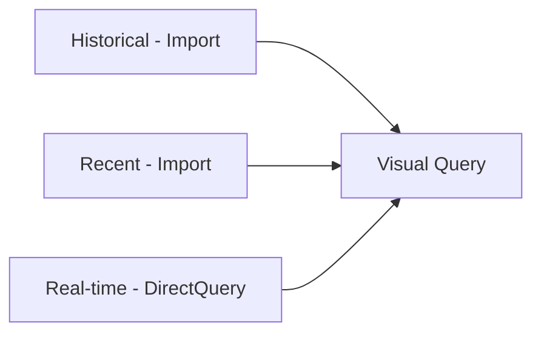

# Incremental Refresh — Intermediate

## Partition Strategy

Power BI creates partitions based on the granularity of the data:

- **Archive range**: Partitioned at the **year** level
- **Refresh range**: Partitioned at the **month** level (or **day** level for short refresh windows)
- **Real-time range** (if enabled): Partitioned at the **hour** level

```
Example: Archive = 3 years, Refresh = 30 days

Partitions created:
Year-2021        (Jan 1 2021 → Dec 31 2021) — Annual, frozen
Year-2022        (Jan 1 2022 → Dec 31 2022) — Annual, frozen
Year-2023        (Jan 1 2023 → Dec 31 2023) — Annual, frozen
Month-2024-01    (Jan 2024) — Monthly, frozen
Month-2024-02    (Feb 2024) — Monthly, frozen
...
Month-2024-10    (Oct 2024) — Monthly, frozen
Month-2024-11    (Nov 2024) — Monthly, may be in refresh window
Month-2024-12    (Dec 2024) — Monthly, in refresh window → refreshed
```

---

## Detecting Data Changes

Power BI 2021+ supports **detecting data changes** — a way to skip partition refresh if the source data hasn't changed. This reduces unnecessary source queries.

```
Incremental Refresh Policy:
✅ Detect data changes
    Last modified column: [ModifiedDate]
```

**How it works:**
1. Before refreshing a partition, Power BI checks `MAX(ModifiedDate)` for that partition's date range
2. If the max modified date matches what was stored from the last refresh, the partition is **skipped**
3. If different, the partition is re-queried and reloaded

**Requirements:**
- Source table must have a `ModifiedDate` or `LastUpdated` column
- The column must be maintained by the source system (ETL or CDC)

```powerquery
// Power Query: the modified date column must be accessible
// Power BI uses a separate query to check it:
// SELECT MAX(ModifiedDate) FROM FactSales WHERE OrderDate >= @RangeStart AND OrderDate < @RangeEnd
```

---

## Limitations That Prevent Incremental Refresh

### M Functions That Break Query Folding

If any M transformation in the query chain **before** the RangeStart/RangeEnd filter prevents folding, incremental refresh either fails silently or does a full refresh.

**Functions that break folding:**

```powerquery
// These functions prevent folding — do NOT use before the date filter:
Table.Buffer(...)           // Forces in-memory evaluation
List.Accumulate(...)        // Not translatable to SQL
Table.Group(..., custom)    // Custom aggregation logic
DateTime.LocalNow()         // Non-deterministic, breaks folding
Date.From(DateTime.LocalNow()) // Same issue
```

### Relationship Key Changes

If the partitioning column (e.g., `OrderDate`) has its values changed or backfilled in the source after the historical partition was frozen, the historical partition will not be refreshed (it's frozen). This can cause data inconsistency.

**Mitigation**: For tables with potential late-arriving data, increase the refresh window to cover the expected lateness period.

### Many-to-Many Relationships

Incremental refresh does not support tables used on the "one" side of relationships if the relationship key could change — this would require refreshing all dependent partitions.

---

## Incremental Refresh for Fact Tables — Best Practices

### Partition Column Selection

Choose the partition column carefully:

| Column Type | Suitable? | Notes |
|---|---|---|
| `OrderDate` (datetime) | ✅ Yes | Immutable once order is placed |
| `ShipDate` (datetime) | ⚠️ Caution | Orders may be shipped later — late-arriving data |
| `ModifiedDate` (datetime) | ❌ No | Changes on updates — partitions won't capture changes in historical data |
| `LoadDate` (datetime) | ✅ Yes | ETL-managed, monotonically increasing |

**Best choice**: The date column that represents when the record was first created (not last modified).

### Late-Arriving Data

```
Scenario: Orders placed on Nov 28 but entered into the system on Dec 3
    → Partition Month-2024-11 would NOT capture this order
    → It falls into Month-2024-12 (where it was loaded)

Mitigation options:
1. Use LoadDate instead of OrderDate as partition column
2. Extend refresh window to cover lateness (refresh last 60 days instead of 30)
3. Set up a separate "late arrivals" table
```

---

## Real-Time Incremental Refresh (Premium)

Power BI Premium supports an extension of incremental refresh: **real-time with DirectQuery**.

```
Configuration:
✅ Archive data starting: 3 Years before refresh date
✅ Refresh data in the last: 30 Days
✅ Get the latest data in real time with DirectQuery
```

**How it works:**
- Historical and recent data is in Import partitions (fast)
- The very latest data (not yet in the refresh window) is served via DirectQuery
- Users see a combination of cached historical data + live current data



**Requirements:**
- Premium capacity
- Source must support DirectQuery
- No unsupported M functions in the query

---

## Managing Partitions via XMLA

For advanced control, manage partitions programmatically using the XMLA endpoint (Premium/PPU only).

```csharp
// C#: Refresh a specific partition
using Microsoft.AnalysisServices.Tabular;

var server = new Server();
server.Connect("powerbi://api.powerbi.com/v1.0/myorg/WorkspaceName");
var model = server.Databases["DatasetName"].Model;
var table = model.Tables["FactSales"];

// Find the December 2024 partition
var partition = table.Partitions["FactSales-2024-12"];

// Request refresh of just this partition
var refreshObject = new RefreshRequest {
    Type = RefreshType.Full
};
partition.RequestRefresh(RefreshType.Full);
model.SaveChanges();
```

**Use cases for programmatic partition management:**
- Force-refresh a specific historical month after source data correction
- Add custom partitions outside of the standard incremental policy
- Monitor partition sizes and refresh times in CI/CD pipelines

---

## REST API Refresh with Enhanced Refresh

The Power BI REST API supports **Enhanced Refresh** — you can specify exactly which tables and partitions to refresh:

```http
POST https://api.powerbi.com/v1.0/myorg/datasets/{datasetId}/refreshes

{
  "type": "Enhanced",
  "commitMode": "transactional",
  "maxParallelism": 2,
  "retryCount": 2,
  "objects": [
    {
      "table": "FactSales",
      "partition": "FactSales-2024-12"
    },
    {
      "table": "DimProduct"
    }
  ]
}
```

**commitMode options:**
- `transactional`: All-or-nothing (if any partition fails, all roll back)
- `partialBatch`: Successful partitions commit even if others fail (non-transactional)

---

## Monitoring Incremental Refresh

### Power BI Service Refresh History

Dataset → Refresh History → View Details → shows partition-level refresh times.

### DAX Studio: Partition View

In DAX Studio → Model Metrics → Tables → shows partition count and row counts per partition.

### Sample Monitoring Query

```dax
-- Card visual: last refresh timestamp
Last Refreshed =
FORMAT(
    MAX(FactSales[LoadTimestamp]),
    "YYYY-MM-DD HH:MM:SS"
)

-- How many days since the oldest data?
Data Age (Days) =
DATEDIFF(
    MIN(FactSales[OrderDate]),
    TODAY(),
    DAY
)
```

---

## Summary

- Power BI creates **annual partitions** for archive and **monthly/daily** for refresh range
- **Detect data changes** skips unchanged partitions to reduce source load
- Choose partition column carefully — use creation date, not modified date
- Functions like `DateTime.LocalNow()` and `Table.Buffer()` break query folding and must not appear before the date filter
- **Real-time DirectQuery** extension serves latest data while keeping historical data cached
- Use **XMLA endpoint** or **Enhanced Refresh REST API** for programmatic partition control
- Extend the refresh window to handle **late-arriving data**
