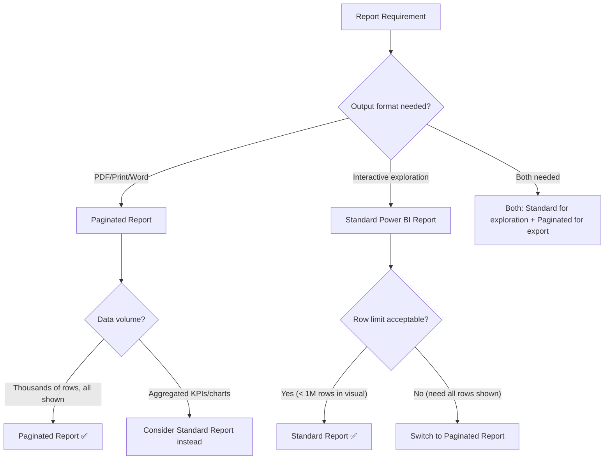

# Paginated Reports — Senior Deep Dive

## RDL Format Internals

Paginated reports are stored as **RDL (Report Definition Language)** files — XML documents that fully describe the report structure.

```xml
<!-- Simplified RDL structure -->
<?xml version="1.0" encoding="utf-8"?>
<Report xmlns="http://schemas.microsoft.com/sqlserver/reporting/2016/01/reportdefinition">

  <DataSources>
    <DataSource Name="SalesDB">
      <ConnectionProperties>
        <DataProvider>SQL</DataProvider>
        <ConnectString>Data Source=server;Initial Catalog=SalesDB</ConnectString>
      </ConnectionProperties>
    </DataSource>
  </DataSources>

  <DataSets>
    <DataSet Name="SalesData">
      <Query>
        <DataSourceName>SalesDB</DataSourceName>
        <CommandType>Text</CommandType>
        <CommandText>SELECT * FROM dbo.Orders WHERE OrderDate BETWEEN @StartDate AND @EndDate</CommandText>
        <QueryParameters>
          <QueryParameter Name="@StartDate">
            <Value>=Parameters!StartDate.Value</Value>
          </QueryParameter>
        </QueryParameters>
      </Query>
      <Fields>
        <Field Name="OrderID"><DataField>OrderID</DataField></Field>
        <Field Name="Revenue"><DataField>Revenue</DataField></Field>
      </Fields>
    </DataSet>
  </DataSets>

  <ReportParameters>
    <ReportParameter Name="StartDate">
      <DataType>DateTime</DataType>
      <DefaultValue><Values><Value>=Today().AddMonths(-1)</Value></Values></DefaultValue>
      <Prompt>Start Date</Prompt>
    </ReportParameter>
  </ReportParameters>

  <Body>
    <ReportItems>
      <Tablix Name="SalesTablix">
        <!-- Tablix definition -->
      </Tablix>
    </ReportItems>
  </Body>

</Report>
```

### RDL Programmatic Generation

For organizations with hundreds of reports with similar structure (e.g., one per product line), generate RDL programmatically:

```csharp
// C#: Programmatically create an RDL file
using System.Xml;

var doc = new XmlDocument();
var root = doc.CreateElement("Report");
root.SetAttribute("xmlns", "http://schemas.microsoft.com/sqlserver/reporting/2016/01/reportdefinition");

// Add data source
var dataSource = doc.CreateElement("DataSource");
dataSource.SetAttribute("Name", "MainDB");
// ... (build full XML)

doc.AppendChild(root);
doc.Save($"Report_{reportName}.rdl");
```

---

## Performance Optimization for Large Paginated Reports

### Dataset-Level Optimizations

Paginated reports can render millions of rows. Performance must be addressed at the SQL/DAX level, not the report level.

```sql
-- Use indexed views for frequently-queried paginated report datasets
CREATE SCHEMA rpt;
GO

CREATE VIEW rpt.vOrderDetails WITH SCHEMABINDING AS
SELECT
    o.OrderID,
    o.OrderDate,
    YEAR(o.OrderDate) AS OrderYear,
    MONTH(o.OrderDate) AS OrderMonth,
    c.CustomerID,
    c.CustomerName,
    c.Region,
    p.ProductID,
    p.ProductName,
    p.Category,
    od.Quantity,
    od.UnitPrice,
    od.Quantity * od.UnitPrice AS LineTotal
FROM dbo.Orders o
    JOIN dbo.Customers c ON o.CustomerID = c.CustomerID
    JOIN dbo.OrderDetails od ON o.OrderID = od.OrderID
    JOIN dbo.Products p ON od.ProductID = p.ProductID;
GO

CREATE UNIQUE CLUSTERED INDEX UIX_vOrderDetails ON rpt.vOrderDetails (OrderID, ProductID);
CREATE NONCLUSTERED INDEX IX_OrderDate ON rpt.vOrderDetails (OrderDate, Region)
    INCLUDE (CustomerName, ProductName, LineTotal);
```

### Snapshot Reports

For reports that are expensive to run and accessed by many users:

1. Configure **Report Snapshots** — Power BI renders the report once and caches the result
2. Users open the cached snapshot (fast) instead of re-running the query
3. Snapshot refreshes on a schedule

**Trade-off**: Data is as of the last snapshot, not real-time.

### Pagination at the Database Level

Instead of pulling all rows and letting the report paginate, push pagination to SQL:

```sql
-- Paginated query: return rows for specific page
CREATE PROCEDURE rpt.GetOrdersPage
    @StartDate datetime,
    @EndDate datetime,
    @PageNumber int = 1,
    @PageSize int = 1000
AS
    SELECT *
    FROM rpt.vOrderDetails
    WHERE OrderDate BETWEEN @StartDate AND @EndDate
    ORDER BY OrderDate, OrderID
    OFFSET (@PageNumber - 1) * @PageSize ROWS
    FETCH NEXT @PageSize ROWS ONLY;
GO
```

For very large reports (100M rows), this pattern prevents loading all rows into the report renderer.

---

## Advanced Parameter Architecture

### Parameter Validation Expressions

Validate that End Date is after Start Date:

```vb
' In the report's expression:
=IIF(Parameters!EndDate.Value < Parameters!StartDate.Value,
     "⚠️ End Date must be after Start Date",
     "")
' Display this expression in a warning text box (visible only when invalid)
```

### URL Access Parameters for Deep Linking

Power BI paginated reports support URL parameters for embedding and deep-linking:

```
Report URL Parameters:
https://app.powerbi.com/groups/{workspace}/rdlreports/{reportId}?
    rp:StartDate=2024-01-01
    &rp:EndDate=2024-03-31
    &rp:Region=North
    &rs:Format=PDF          ← Export directly to PDF
    &rs:Command=Render      ← Render directly (skip parameter page)
```

**rs:Format** values: `PDF`, `EXCELOPENXML`, `CSV`, `IMAGE`, `WORD`

### Parameterized Report Bursting (via Power Automate)

Generate one report per customer/region and email it automatically:

```python
# Python: Power BI REST API for report bursting
import requests

def generate_and_email_report(customer_id, customer_email, access_token):
    # Step 1: Get export-in-file URL with parameters
    export_request = {
        "format": "PDF",
        "paginatedReportConfiguration": {
            "parameterValues": [
                {"name": "CustomerID", "value": str(customer_id)},
                {"name": "StartDate", "value": "2024-01-01"},
                {"name": "EndDate", "value": "2024-12-31"}
            ]
        }
    }

    # Trigger export
    response = requests.post(
        f"https://api.powerbi.com/v1.0/myorg/groups/{workspace_id}/reports/{report_id}/ExportTo",
        json=export_request,
        headers={"Authorization": f"Bearer {access_token}"}
    )
    export_id = response.json()["id"]

    # Poll for completion
    while True:
        status_response = requests.get(
            f"https://api.powerbi.com/v1.0/myorg/groups/{workspace_id}/reports/{report_id}/exports/{export_id}",
            headers={"Authorization": f"Bearer {access_token}"}
        )
        status = status_response.json()["status"]
        if status == "Succeeded":
            break
        elif status == "Failed":
            raise Exception(f"Export failed for customer {customer_id}")
        time.sleep(5)

    # Download the PDF
    pdf_response = requests.get(
        f"https://api.powerbi.com/v1.0/myorg/groups/{workspace_id}/reports/{report_id}/exports/{export_id}/file",
        headers={"Authorization": f"Bearer {access_token}"}
    )

    # Email the PDF (using SendGrid, SES, etc.)
    send_email_with_attachment(customer_email, pdf_response.content)
```

---

## Embedding Paginated Reports

### Embedding in Custom Applications

```javascript
// JavaScript: Embed a paginated report with Power BI Embedded
const { models } = window["powerbi-client"];

const embedConfig = {
    type: "report",
    id: reportId,
    embedUrl: embedUrl,
    accessToken: embedToken,
    tokenType: models.TokenType.Embed,
    settings: {
        filterPaneEnabled: false,
        navContentPaneEnabled: false
    },
    // For paginated reports with parameters:
    pageName: null,
    filters: [],
    // Custom parameters:
    paginatedReportSettings: {
        parameters: [
            { name: "CustomerID", values: [customerId.toString()] },
            { name: "ReportDate", values: [reportDate] }
        ]
    }
};

const reportContainer = document.getElementById("reportContainer");
const report = powerbi.embed(reportContainer, embedConfig);
```

---

## Paginated vs Standard Reports: Decision Framework



### Feature Comparison

| Feature | Standard Report | Paginated Report |
|---|---|---|
| All rows (no limits) | ❌ (~1M row visual limit) | ✅ Unlimited |
| Interactive drilling | ✅ | Limited |
| Pixel-perfect layout | ❌ | ✅ |
| PDF export | Basic | ✅ Full fidelity |
| Scheduled email | ❌ | ✅ (via subscriptions) |
| Custom report server | ❌ | ✅ (SSRS) |
| Mobile responsive | ✅ | ❌ |
| DAX measures | ✅ | Via Power BI dataset connection |

---

## Report Subscriptions

Paginated reports support email subscriptions with dynamic parameters:

```
Power BI Service → Report → Subscribe
  → Frequency: Daily at 6:00 AM
  → Format: PDF
  → Recipients: finance-team@company.com
  → Parameters: StartDate = {first day of month}, EndDate = {last day of month}
  → Subject: "Monthly Revenue Report - {MonthName}"
```

**Data-driven subscriptions** (Premium feature): Generate personalized reports for a list of recipients, each with different parameter values:

```
Subscription recipients: from a dataset query
  SELECT Email, CustomerID FROM dbo.CustomerEmailList
  → Each recipient gets their own personalized report
```

---

## Summary

- **RDL** is XML — can be generated programmatically for batch report creation
- Use **indexed views** and **stored procedures** for high-performance paginated datasets
- **Report snapshots** cache expensive reports for faster user access
- **URL parameters** enable deep-linking and direct PDF export via URL
- **Report bursting** via Power BI REST API generates per-customer/per-region PDFs programmatically
- Use the **standard vs paginated decision framework** — paginated for documents, standard for exploration
- **Data-driven subscriptions** (Premium) enable personalized report delivery to many recipients
