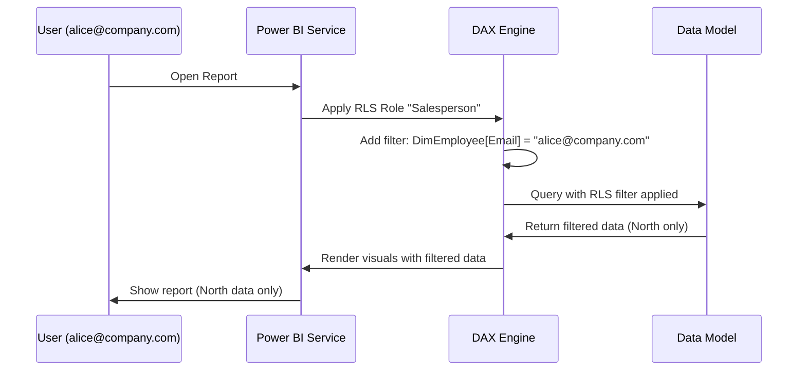

# Row-Level Security — Fundamentals

## What Is Row-Level Security?

**Row-Level Security (RLS)** in Power BI restricts which rows of data a user can see. Instead of creating separate reports for each user or group, you define security roles with DAX filters that automatically limit data visibility based on who is logged in.

**Use cases:**
- Sales reps see only their own territory's data
- Managers see their department's data
- Regional managers see only their region

---

## Static RLS

**Static RLS** uses a hardcoded filter that does not change based on who is logged in. It is the simplest form of RLS.

### Setting Up Static RLS in Power BI Desktop

1. Go to **Modeling** tab → **Manage Roles**
2. Click **Create** → enter a role name (e.g., "North Region")
3. Select the table to filter (e.g., `DimGeography`)
4. Enter a DAX filter expression

```dax
-- Role: "North Region"
-- Table: DimGeography
[Region] = "North"
```

This filter is applied as an additional filter on `DimGeography`. Because `FactSales` relates to `DimGeography`, the sales data is also filtered to North region only.

### Multiple Roles

You can create as many roles as needed:

```
Role: "North Region"  → [Region] = "North"
Role: "South Region"  → [Region] = "South"
Role: "East Region"   → [Region] = "East"
Role: "Finance Team"  → [Department] = "Finance"
Role: "Manager"       → (no filter — sees everything)
```

**Important**: If a user belongs to **multiple roles**, Power BI applies a **union** (OR logic) of all role filters. A user in both "North Region" and "South Region" sees data for both.

---

## Dynamic RLS

**Dynamic RLS** uses the logged-in user's identity to determine what data they can see. This is the most common production pattern.

### USERNAME() and USERPRINCIPALNAME()

| Function | Returns | Use Case |
|---|---|---|
| `USERNAME()` | `"DOMAIN\username"` | On-premises models (Windows Auth) |
| `USERPRINCIPALNAME()` | `"user@company.com"` | Power BI Service (cloud, recommended) |

### Simple Dynamic RLS Pattern

The most common pattern: a dimension table contains an email column that maps users to their data.

**DimSalesPerson table:**

| SalesPersonKey | Name | Email | Region |
|---|---|---|---|
| 1 | Alice Smith | alice@company.com | North |
| 2 | Bob Jones | bob@company.com | South |
| 3 | Carol Lee | carol@company.com | East |

```dax
-- Role: "Salesperson"
-- Table: DimSalesPerson
-- DAX filter:
[Email] = USERPRINCIPALNAME()
```

When Alice (alice@company.com) views the report:
1. The filter `[Email] = "alice@company.com"` is applied to `DimSalesPerson`
2. This keeps only Alice's row, which has Region = "North"
3. The relationship from `DimSalesPerson` to `FactSales` propagates the filter
4. Alice sees only North region sales

---

## Setting Up Dynamic RLS — Step by Step

### Step 1: Design the Security Table

Create a dimension table (or add columns to an existing one) that maps user emails to data:

```sql
-- In your data source or Power Query
SELECT
    EmployeeID,
    Email,
    Region,
    Department,
    ManagerEmail
FROM HRSystem.Employees
```

### Step 2: Create the Role in Power BI Desktop

1. **Modeling** → **Manage Roles** → **Create**
2. Name: "Dynamic Salesperson"
3. Table: `DimEmployee`
4. DAX filter:

```dax
[Email] = USERPRINCIPALNAME()
```

### Step 3: Test in Power BI Desktop

1. **Modeling** → **View as Roles**
2. Select the role
3. Check "Other User" and enter a test email address
4. Verify the report shows the correct data for that user

### Step 4: Publish to Power BI Service

1. Publish the report to Power BI Service
2. In the Service: open the **dataset** → **Security**
3. Add users or groups to each role

---

## Mermaid Diagram: RLS Data Flow



---

## Testing RLS

### In Power BI Desktop

```
Modeling → View as Roles → Select Role
    OR
Modeling → View as Roles → Other User → Enter email
```

### In Power BI Service

```
Dataset → Security → View As → Select a member → Test the report
```

**What to verify:**
- The user sees only their permitted data
- Totals/aggregations reflect the filtered data (not the full dataset)
- Cross-filtering between tables works correctly

---

## Assigning Users to Roles in Power BI Service

1. Open the **dataset** in Power BI Service
2. Click the **three-dot menu** → **Security**
3. For each role, add:
   - Individual users: `alice@company.com`
   - Security groups: `finance-team@company.com`
   - The entire organization: (not recommended for sensitive data)

**Note**: Dataset owner (the person who published) is NOT automatically excluded from RLS. Add them to the appropriate role or they will see all data.

---

## Common RLS Mistakes

| Mistake | Problem | Fix |
|---|---|---|
| No filter on dimension table | RLS filter doesn't propagate to fact table | Filter the dimension; facts inherit via relationship |
| Using USERNAME() in cloud | Returns empty or domain\user format | Use USERPRINCIPALNAME() for cloud |
| Testing with your own admin account | Admins bypass RLS in Service | Use "View as" feature or test user account |
| Filter on fact table instead of dimension | Works but is slower and harder to maintain | Filter dimensions and let relationships do the work |
| Forgetting to publish after model changes | Service still uses old RLS rules | Always republish after RLS changes |

---

## Summary

- **Static RLS** uses hardcoded filter values — simple but requires one role per value
- **Dynamic RLS** uses `USERPRINCIPALNAME()` to filter based on the logged-in user
- Create roles in **Power BI Desktop** → **Manage Roles**
- Test with **View as Roles** before publishing
- Assign users to roles in **Power BI Service** → **Dataset Security**
- RLS filters are applied on **dimension tables** and propagate to facts via relationships
- Multiple roles apply as **OR logic** (union of all role filters)
