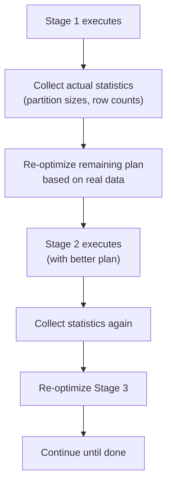

# PySpark Adaptive Query Execution — Fundamentals


## 🎯 Analogy

Think of AQE like a GPS that recalculates the route mid-trip after seeing actual traffic. Instead of committing to a query plan upfront, Spark adjusts partition counts, join strategies, and skew handling based on real runtime statistics.

---
## What Is AQE?

Adaptive Query Execution (AQE) is a Spark 3.0+ feature that **re-optimizes the query plan at runtime** based on actual data statistics collected after each shuffle stage. Instead of relying solely on pre-execution estimates (which are often wrong), AQE adjusts the plan mid-flight.

**The analogy:** Traditional Spark planning is like planning a road trip using only a map. AQE is like having a GPS that adjusts your route in real-time based on actual traffic conditions.

> **Key Insight:** AQE solves the three most common Spark performance problems automatically: too many small partitions, wrong join strategy, and data skew. Enable it and most jobs get 2-5x faster without code changes.

---

## The Three AQE Features

### 1. Coalescing Post-Shuffle Partitions

**Problem:** Default `spark.sql.shuffle.partitions = 200`. After a shuffle, you might have 200 partitions with only 1 MB each (wasteful tiny tasks).

**AQE fix:** Merges tiny partitions into larger ones automatically.

```python
# Without AQE: 200 partitions × 1 MB = 200 tiny tasks (scheduling overhead)
# With AQE: automatically merges into ~8 partitions × 25 MB (efficient)

spark.conf.set("spark.sql.adaptive.enabled", "true")
spark.conf.set("spark.sql.adaptive.coalescePartitions.enabled", "true")
spark.conf.set("spark.sql.adaptive.advisoryPartitionSizeInBytes", "128MB")
```

### 2. Converting Sort-Merge Join to Broadcast

**Problem:** Optimizer estimated a table as 500 MB (too large to broadcast). After a filter, the actual data is only 8 MB — small enough to broadcast.

**AQE fix:** After the filter stage runs and produces actual sizes, AQE sees the table is small and switches to broadcast join.

```python
spark.conf.set("spark.sql.adaptive.autoBroadcastJoinThreshold", "50MB")
# If after filtering one side is < 50 MB, AQE converts to broadcast at runtime
```

### 3. Handling Skewed Joins

**Problem:** One partition has 100x more data than others → one executor does all the work.

**AQE fix:** Detects the oversized partition and automatically splits it into smaller sub-partitions.

```python
spark.conf.set("spark.sql.adaptive.skewJoin.enabled", "true")
spark.conf.set("spark.sql.adaptive.skewJoin.skewedPartitionFactor", "5")
spark.conf.set("spark.sql.adaptive.skewJoin.skewedPartitionThresholdInBytes", "256MB")
# If a partition is 5x larger than median AND > 256 MB → split it
```

---

## Enabling AQE

```python
# Enable all AQE features (recommended for all production jobs)
spark.conf.set("spark.sql.adaptive.enabled", "true")

# Individual feature toggles (all default to true when AQE is enabled):
spark.conf.set("spark.sql.adaptive.coalescePartitions.enabled", "true")
spark.conf.set("spark.sql.adaptive.skewJoin.enabled", "true")
# Broadcast conversion is always active when AQE is enabled
```

> **Note:** In Databricks Runtime 7.3+ and Spark 3.2+, AQE is enabled by default. On open-source Spark 3.0-3.1, you must enable it explicitly.

---

## Before and After AQE

| Problem | Without AQE | With AQE |
|---------|------------|----------|
| 200 tiny post-shuffle partitions | 200 tasks × 1 MB (slow, overhead) | Auto-coalesced to 8 × 25 MB |
| Join where one side is actually small | Sort-merge join (shuffles both sides) | Broadcast join (no shuffle of large side) |
| One partition has 500M rows, others have 1K | Job takes 45 min (one task dominates) | Splits into sub-tasks, job takes 5 min |
| Wrong initial row estimates | Bad plan chosen permanently | Plan re-optimized after each stage |

---

## How AQE Works (Simplified)



**What this shows:**
- After each shuffle stage completes, Spark knows the ACTUAL data sizes
- The optimizer re-evaluates the plan with real numbers (not estimates)
- Subsequent stages use the optimized plan
- This loop repeats at every stage boundary

---

## When AQE Helps vs Doesn't Help

| AQE Helps | AQE Doesn't Help |
|-----------|-------------------|
| Inaccurate table statistics | Single-stage jobs (no shuffle = no re-optimization point) |
| Variable data after filters | Map-only operations (filter, select without shuffle) |
| Skewed join keys | Skew within a single partition (can't split further) |
| Over-provisioned shuffle partitions | UDF-based processing (bottleneck is UDF, not plan) |
| Dynamic workloads (data volume varies daily) | I/O-bound jobs (bottleneck is read/write, not compute) |

---

## Verifying AQE Is Working

```python
# Check in Spark UI:
# SQL tab → query → look for "AdaptiveSparkPlan" at the top of the plan
# If present: AQE is active for this query

# In explain output:
df.explain("formatted")
# Look for:
# == Adaptive Plan ==
# AdaptiveSparkPlan isFinalPlan=true
# +- BroadcastHashJoin  ← AQE converted from SortMergeJoin!

# Check if coalescing happened:
# Stage details in Spark UI: "Coalesced partitions: 200 → 12"
```

---


## ▶️ Try It Yourself

```python
from pyspark.sql import SparkSession
spark = SparkSession.builder.master("local[*]")     .config("spark.sql.adaptive.enabled", "true")     .config("spark.sql.adaptive.coalescePartitions.enabled", "true")     .appName("aqe").getOrCreate()
print(spark.conf.get("spark.sql.adaptive.enabled"))  # true
# AQE automatically coalesces shuffle partitions after seeing data size
data = [(i, i % 3) for i in range(1000)]
df = spark.createDataFrame(data, ["id", "cat"])
df.groupBy("cat").count().show()  # AQE may reduce shuffle partitions automatically
```

> **Run it:** Copy the snippet into a REPL or file and run it — no external services needed for the basic example.

---
## Interview Tips

> **Tip 1:** "What is AQE?" — "Adaptive Query Execution is a Spark 3.0 feature that re-optimizes the query plan at runtime using actual statistics collected after each shuffle stage. It solves three problems automatically: coalesces tiny partitions, converts sort-merge joins to broadcast when one side is actually small, and handles data skew by splitting oversized partitions."

> **Tip 2:** "Should you always enable AQE?" — "Yes, for almost all workloads. It has negligible overhead (statistics collection) and provides significant benefits. The only case to disable: if AQE's decisions conflict with your explicit optimization (e.g., you've bucketed tables and AQE's shuffle changes break the bucketing benefit). In practice, always enable it."

> **Tip 3:** "Does AQE replace manual optimization?" — "It handles common problems automatically but doesn't replace all tuning. You still need: proper data partitioning at storage level, explicit broadcast hints for known-small tables (AQE only acts after a shuffle), and appropriate executor sizing. AQE is a safety net, not a substitute for good pipeline design."
