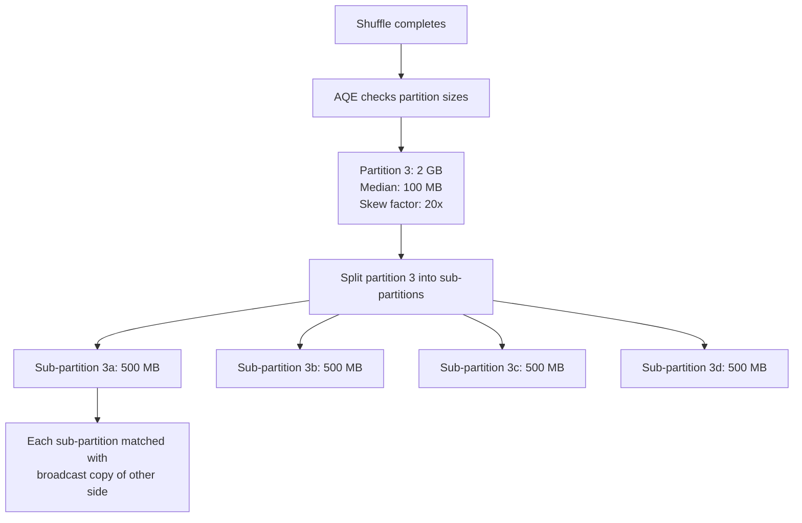

# PySpark AQE — Intermediate Concepts

## Configuration Deep Dive

### Partition Coalescing Parameters

```python
# Target partition size after coalescing
spark.conf.set("spark.sql.adaptive.advisoryPartitionSizeInBytes", "128MB")
# AQE merges post-shuffle partitions until each is ~128 MB

# Minimum number of partitions to keep (don't coalesce below this)
spark.conf.set("spark.sql.adaptive.coalescePartitions.minPartitionSize", "1MB")
# Prevents creating a single giant partition

# Initial partition count (before coalescing)
spark.conf.set("spark.sql.adaptive.coalescePartitions.initialPartitionNum", "400")
# Start with more partitions than needed; AQE will merge the small ones
```

**How coalescing decisions are made:**
1. After shuffle, AQE sees actual partition sizes
2. Adjacent partitions smaller than advisorySize are merged
3. Merging continues until each partition is ~advisorySize
4. Result: fewer, larger tasks (less scheduling overhead)

### Broadcast Conversion Parameters

```python
# Runtime broadcast threshold (separate from compile-time threshold)
spark.conf.set("spark.sql.adaptive.autoBroadcastJoinThreshold", "50MB")
# If a shuffle output is < 50 MB, AQE switches to broadcast at runtime

# Note: this is INDEPENDENT of the compile-time threshold:
spark.conf.set("spark.sql.autoBroadcastJoinThreshold", "10MB")  # Compile-time
# AQE's runtime threshold can be larger (catches more cases)
```

### Skew Join Parameters

```python
spark.conf.set("spark.sql.adaptive.skewJoin.enabled", "true")
spark.conf.set("spark.sql.adaptive.skewJoin.skewedPartitionFactor", "5")
# A partition is "skewed" if it's 5x larger than the median partition

spark.conf.set("spark.sql.adaptive.skewJoin.skewedPartitionThresholdInBytes", "256MB")
# AND it must be > 256 MB (don't split small partitions even if skewed)

# Both conditions must be true: (size > median × factor) AND (size > threshold)
```

---

## How Skew Join Handling Works



**What this shows:**
- A 2 GB skewed partition is detected (20x the median of 100 MB)
- AQE splits it into 4 sub-partitions of ~500 MB each
- The matching data from the other table is replicated to each sub-partition
- 4 tasks process in parallel instead of 1 task doing all 2 GB

**Before AQE skew handling:** 1 task processes 2 GB (bottleneck: 30 minutes)
**After AQE skew handling:** 4 tasks process 500 MB each (parallel: 8 minutes)

---

## Comparing Plans With and Without AQE

```python
# Without AQE:
spark.conf.set("spark.sql.adaptive.enabled", "false")
df_result = large_df.join(medium_df, "key").groupBy("category").count()
df_result.explain()
# == Physical Plan ==
# HashAggregate(keys=[category])
# +- Exchange hashpartitioning(category, 200)     ← Fixed 200 partitions
#    +- SortMergeJoin [key]                        ← Sort-merge (both sides shuffled)
#       +- Exchange hashpartitioning(key, 200)     ← Shuffle large_df
#       +- Exchange hashpartitioning(key, 200)     ← Shuffle medium_df

# With AQE:
spark.conf.set("spark.sql.adaptive.enabled", "true")
df_result.explain()
# == Adaptive Plan == (isFinalPlan=true)
# AdaptiveSparkPlan
# +- HashAggregate(keys=[category])
#    +- CustomShuffleReader coalesced               ← Partitions merged!
#       +- BroadcastHashJoin [key]                  ← Converted to broadcast!
#          +- Exchange hashpartitioning(key, 200)  ← Only large_df shuffled
#          +- BroadcastExchange                     ← medium_df broadcast (small)
```

**Improvements AQE made:**
1. Detected medium_df is small after shuffle → switched to broadcast join
2. Coalesced 200 partitions → fewer partitions (based on actual data size)
3. Eliminated the shuffle of medium_df entirely

---

## When AQE Makes Wrong Decisions

### Problem: AQE Broadcasts a "Small" Table That's Actually Large

```python
# Scenario: filter makes table APPEAR small at compile time,
# but at runtime it's larger than threshold after other transforms

# Fix: disable auto-broadcast conversion if it causes issues
spark.conf.set("spark.sql.adaptive.autoBroadcastJoinThreshold", "-1")
# Or: use explicit hint to prevent broadcast
df_result = large_df.join(medium_df.hint("merge"), "key")
```

### Problem: Coalescing Creates Too-Large Partitions

```python
# If advisory size is too large, partitions may exceed executor memory
# Fix: reduce advisory size
spark.conf.set("spark.sql.adaptive.advisoryPartitionSizeInBytes", "64MB")
```

### Problem: AQE + Bucketing Conflict

```python
# Bucketed tables are pre-shuffled. AQE may add unnecessary coalescing.
# In Spark 3.2+: AQE respects bucketing automatically
# In earlier versions: disable coalescing for bucketed joins
spark.conf.set("spark.sql.adaptive.coalescePartitions.enabled", "false")
```

---

## AQE in Spark UI

**What to look for in the SQL tab:**

| Indicator | Meaning |
|-----------|---------|
| "AdaptiveSparkPlan" at plan root | AQE is active |
| "isFinalPlan=true" | Plan was re-optimized after statistics |
| "CustomShuffleReader coalesced" | Partitions were merged |
| "BroadcastHashJoin" after initial SortMerge | Runtime broadcast conversion happened |
| "Skewed partition" in stage details | Skew was detected and handled |

---

## Production Configuration Template

```python
# Recommended AQE configuration for production Spark 3.2+ jobs
spark_conf = {
    # Enable AQE
    "spark.sql.adaptive.enabled": "true",
    
    # Partition coalescing
    "spark.sql.adaptive.coalescePartitions.enabled": "true",
    "spark.sql.adaptive.advisoryPartitionSizeInBytes": "128MB",
    "spark.sql.adaptive.coalescePartitions.minPartitionSize": "4MB",
    
    # Broadcast conversion
    "spark.sql.adaptive.autoBroadcastJoinThreshold": "50MB",
    
    # Skew handling
    "spark.sql.adaptive.skewJoin.enabled": "true",
    "spark.sql.adaptive.skewJoin.skewedPartitionFactor": "5",
    "spark.sql.adaptive.skewJoin.skewedPartitionThresholdInBytes": "256MB",
    
    # Set initial partitions high (AQE will coalesce down)
    "spark.sql.shuffle.partitions": "auto",  # Spark 3.2+ auto mode
}
```

---

## Interview Tips

> **Tip 1:** "How does AQE coalescing work?" — "After a shuffle, AQE checks actual partition sizes. Adjacent small partitions are merged until each reaches the advisory size (default 128 MB). This eliminates the 'too many tiny tasks' problem without you needing to manually tune spark.sql.shuffle.partitions."

> **Tip 2:** "How does AQE handle skew?" — "After a shuffle, AQE compares each partition size to the median. If a partition is >5x the median AND >256 MB, it's classified as skewed. AQE splits it into sub-partitions and replicates the matching data from the other join side to each sub-partition. The oversized task becomes multiple parallel smaller tasks."

> **Tip 3:** "Can AQE make things worse?" — "Rarely, but yes: (1) Broadcasting a table that's larger than executor memory causes OOM. Fix: lower the autoBroadcastJoinThreshold. (2) Coalescing creates too-large partitions that spill. Fix: reduce advisoryPartitionSizeInBytes. (3) AQE overhead on very short queries (milliseconds of planning time). In practice, the benefits vastly outweigh the risks — always enable it."
