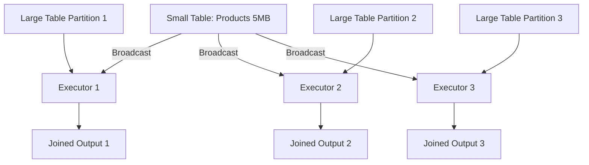

# PySpark Broadcast Variables — Fundamentals


## 🎯 Analogy

Think of broadcast variables like distributing a printed reference sheet to every worker before a meeting — instead of each worker calling HQ for the same info, they have it locally.

---
## What Are Broadcast Variables?

A **broadcast variable** sends a read-only copy of data to every executor node once, instead of shipping it with every task. This is ideal for small lookup tables that are used repeatedly across many tasks.

> **Key Insight:** Without broadcasting, Spark ships closure variables with each task — if you have 1000 tasks and a 10MB lookup table, that's 10GB of network transfer. Broadcasting sends it once per executor (e.g., 50 executors = 500MB total).

---

## Basic broadcast() Usage

```python
from pyspark import SparkContext, broadcast
from pyspark.sql import SparkSession

spark = SparkSession.builder.appName("BroadcastFundamentals").getOrCreate()
sc = spark.sparkContext

# Create a lookup dictionary
country_codes = {
    "US": "United States",
    "GB": "United Kingdom",
    "DE": "Germany",
    "FR": "France",
    "JP": "Japan",
}

# Broadcast the lookup table to all executors
broadcast_countries = sc.broadcast(country_codes)

# Use in RDD operations
events_rdd = sc.parallelize([
    ("user_1", "US", "click"),
    ("user_2", "GB", "purchase"),
    ("user_3", "DE", "click"),
])

enriched = events_rdd.map(lambda x: (
    x[0],
    broadcast_countries.value.get(x[1], "Unknown"),  # Access broadcast value
    x[2]
))

print(enriched.collect())
# [('user_1', 'United States', 'click'), ('user_2', 'United Kingdom', 'purchase'), ...]
```

---

## Broadcast Joins (DataFrame API)

The most common use of broadcast in DataFrames is the **broadcast join**:

```python
from pyspark.sql import functions as F

# Large fact table: 500 million rows
orders = spark.read.parquet("hdfs:///data/orders/")  # 500M rows, 50GB

# Small dimension table: 10,000 rows
products = spark.read.parquet("hdfs:///data/products/")  # 10K rows, 5MB

# Without broadcast: Spark shuffles BOTH tables (expensive)
# With broadcast: small table sent to all executors, NO shuffle of large table

# Explicit broadcast join
enriched = orders.join(
    F.broadcast(products),  # Tell Spark to broadcast this table
    on="product_id",
    how="inner"
)

# Equivalent SQL syntax
orders.createOrReplaceTempView("orders")
products.createOrReplaceTempView("products")

enriched_sql = spark.sql("""
    SELECT /*+ BROADCAST(p) */
        o.*, p.product_name, p.category
    FROM orders o
    JOIN products p ON o.product_id = p.product_id
""")
```

### How Broadcast Join Works



**No shuffle of the large table needed!**

---

## When to Use Broadcast Variables

| Scenario | Broadcast? | Why |
|----------|-----------|-----|
| Join with small lookup table (< 100MB) | Yes | Avoids shuffling the large table |
| Config/mapping shared across tasks | Yes | Avoids repeated serialization per task |
| Blacklist/whitelist for filtering | Yes | Efficient set membership check |
| Large table join (both > 1GB) | No | Would OOM executors |
| Data that changes per record | No | Broadcast is read-only |

---

## Configuration

```python
# Auto-broadcast threshold (default: 10MB)
# Tables smaller than this are automatically broadcast in joins
spark.conf.get("spark.sql.autoBroadcastJoinThreshold")  # "10485760" (10MB)

# Increase threshold for larger dimension tables
spark.conf.set("spark.sql.autoBroadcastJoinThreshold", "104857600")  # 100 MB in bytes

# Disable auto-broadcast (force all joins to shuffle)
spark.conf.set("spark.sql.autoBroadcastJoinThreshold", "-1")

# Broadcast timeout (how long to wait for broadcast to complete)
spark.conf.set("spark.sql.broadcastTimeout", "300")  # 5 minutes (default)
```

---

## Broadcast Variable Lifecycle

```python
# Create broadcast
lookup = sc.broadcast({"key1": "value1", "key2": "value2"})

# Access value (on executors)
value = lookup.value  # Returns the original dictionary

# Explicitly destroy when no longer needed (frees memory)
lookup.destroy()  # Removes from all executors

# After destroy, accessing .value raises an error
# lookup.value  # Error: Broadcast variable already destroyed

# Unpersist (remove from executor memory but keep on driver)
lookup.unpersist()  # Less aggressive than destroy
```

---

## Common Patterns

### Pattern: Lookup Table Enrichment

```python
# State name lookup
state_names = sc.broadcast({
    "CA": "California", "NY": "New York", "TX": "Texas",
    "FL": "Florida", "IL": "Illinois",
})

# Use in DataFrame with UDF
from pyspark.sql.types import StringType

@F.udf(StringType())
def get_state_name(code):
    return state_names.value.get(code, "Unknown")

df = df.withColumn("state_name", get_state_name(F.col("state_code")))
```

### Pattern: Configuration Broadcasting

```python
# Broadcast application config to all executors
app_config = sc.broadcast({
    "min_amount": 10.0,
    "max_retries": 3,
    "valid_statuses": {"active", "pending", "trial"},
    "feature_flags": {"new_scoring": True, "legacy_mode": False},
})

# Access in transformations
def process_record(record):
    config = app_config.value
    if record["amount"] < config["min_amount"]:
        return None
    if record["status"] not in config["valid_statuses"]:
        return None
    return record
```

### Pattern: Blacklist Filtering

```python
# Broadcast a set of blocked IPs
blocked_ips = sc.broadcast(set(
    spark.read.text("hdfs:///data/blocked_ips.txt")
    .rdd.map(lambda r: r[0]).collect()
))

# Filter using broadcast set
@F.udf("boolean")
def is_blocked(ip):
    return ip in blocked_ips.value

filtered = events_df.filter(~is_blocked(F.col("source_ip")))

# Better approach — use broadcast join instead of UDF
blocked_df = spark.read.text("hdfs:///data/blocked_ips.txt").withColumnRenamed("value", "ip")
filtered = events_df.join(
    F.broadcast(blocked_df),
    events_df.source_ip == blocked_df.ip,
    "left_anti"  # Keep only rows that DON'T match
)
```

---

## Auto-Broadcast Behavior

Spark automatically broadcasts tables in joins when it estimates their size is below the threshold:

```python
# Check if Spark auto-broadcasted
result = orders.join(products, "product_id")
result.explain()

# Look for "BroadcastHashJoin" in the plan
# If you see "SortMergeJoin" instead, the table wasn't broadcast
```

```
== Physical Plan ==
*(2) BroadcastHashJoin [product_id], [product_id], Inner
:- *(2) FileScan parquet orders [...]
+- BroadcastExchange HashedRelationBroadcastMode(List(product_id))
   +- *(1) FileScan parquet products [...]
```

---


## ▶️ Try It Yourself

```python
from pyspark.sql import SparkSession
spark = SparkSession.builder.master("local[*]").appName("broadcast").getOrCreate()
sc = spark.sparkContext
# Small lookup table — broadcast once, all workers reuse
region_map = {"US": "North America", "DE": "Europe", "JP": "Asia"}
bc_map = sc.broadcast(region_map)
rdd = sc.parallelize([("US", 100), ("DE", 200), ("JP", 150)])
result = rdd.map(lambda x: (bc_map.value.get(x[0], "Unknown"), x[1])).collect()
print(result)  # [('North America', 100), ('Europe', 200), ('Asia', 150)]
```

> **Run it:** Copy the snippet into a REPL or file and run it — no external services needed for the basic example.

---
## Interview Tips

> **Tip 1:** "What are broadcast variables and when do you use them?" — "Broadcast variables send a read-only copy of data to each executor once, rather than shipping it with every task. I use them primarily for broadcast joins — when joining a large fact table with a small dimension table (under ~100MB). Instead of shuffling the 500-million-row fact table, the small table is broadcast to all executors and the join happens locally. This eliminates the shuffle entirely."

> **Tip 2:** "How does Spark decide to broadcast automatically?" — "Spark uses the autoBroadcastJoinThreshold config (default 10MB). If the optimizer estimates a table's size is below this threshold, it automatically uses BroadcastHashJoin instead of SortMergeJoin. The estimate comes from table statistics (if available) or file size metadata. You can override with F.broadcast() hint or increase the threshold."

> **Tip 3:** "What's the difference between a broadcast variable and a closure variable?" — "A closure variable is serialized with every task — if you have 1000 tasks and a 10MB dict, it's sent 1000 times. A broadcast variable is sent once per executor (not per task) using an efficient peer-to-peer protocol (like BitTorrent). For a 10MB lookup on 50 executors with 1000 tasks: closure = 10GB network, broadcast = 500MB network."
