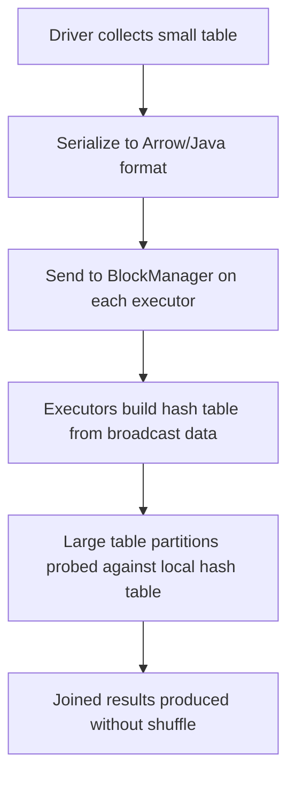

# PySpark Broadcast Variables — Intermediate

## Broadcast Join Mechanics

When Spark performs a broadcast join, the execution follows a specific sequence:



```python
from pyspark.sql import functions as F

# Verify broadcast join is happening
orders = spark.read.parquet("hdfs:///data/orders/")  # 500M rows
products = spark.read.parquet("hdfs:///data/products/")  # 50K rows

result = orders.join(F.broadcast(products), "product_id")
result.explain(mode="formatted")
```

Expected plan output:
```
*(2) BroadcastHashJoin [product_id], [product_id], Inner, BuildRight
:- *(2) Project [order_id, customer_id, product_id, amount]
:  +- *(2) FileScan parquet orders
+- BroadcastExchange HashedRelationBroadcastMode(List(product_id))
   +- *(1) Filter isnotnull(product_id)
      +- *(1) FileScan parquet products
```

Key terms:
- **BroadcastExchange** — the broadcast distribution operation
- **HashedRelationBroadcastMode** — builds a hash table for probe
- **BuildRight** — right side (products) is the broadcast/build side

---

## autoBroadcastJoinThreshold Deep Dive

```python
# Default: 10MB — tables estimated under this are auto-broadcast
print(spark.conf.get("spark.sql.autoBroadcastJoinThreshold"))  # 10485760

# How Spark estimates table size:
# 1. Table statistics (ANALYZE TABLE ... COMPUTE STATISTICS)
# 2. File size metadata from catalog
# 3. Data source-reported size hints

# Scenario: products table is 45MB — won't auto-broadcast
products = spark.read.parquet("hdfs:///data/products/")  # 45MB on disk
result = orders.join(products, "product_id")
result.explain()
# Shows SortMergeJoin — not broadcast!

# Fix 1: Increase threshold
spark.conf.set("spark.sql.autoBroadcastJoinThreshold", "50m")
result = orders.join(products, "product_id")
result.explain()
# Now shows BroadcastHashJoin!

# Fix 2: Explicit hint (overrides threshold)
result = orders.join(F.broadcast(products), "product_id")
# Always broadcasts regardless of threshold

# Fix 3: Compute statistics for accurate size estimation
spark.sql("ANALYZE TABLE products COMPUTE STATISTICS")
# Optimizer now knows actual size, may auto-broadcast
```

### Size Estimation Pitfalls

```python
# Problem: Spark estimates size from file metadata, not actual in-memory size
# Compressed Parquet file might be 8MB on disk but 200MB in memory

# Check actual size after collection
products_count = products.count()
products_size_estimate = products._jdf.queryExecution().optimizedPlan().stats().sizeInBytes()
print(f"Optimizer estimate: {products_size_estimate / 1024 / 1024:.1f}MB")

# If estimate is wrong, force with hint
result = orders.join(F.broadcast(products), "product_id")
```

---

## Manual Broadcast Hints

### DataFrame API Hints

```python
# F.broadcast() — explicit broadcast
result = large_df.join(F.broadcast(small_df), "key")

# Works with all join types
inner = large.join(F.broadcast(small), "key", "inner")
left = large.join(F.broadcast(small), "key", "left")
right = large.join(F.broadcast(small), large.key == small.key, "right")
left_anti = large.join(F.broadcast(small), "key", "left_anti")

# Multiple broadcasts in one query
result = (fact_table
    .join(F.broadcast(dim_product), "product_id")
    .join(F.broadcast(dim_store), "store_id")
    .join(F.broadcast(dim_date), "date_id"))
```

### SQL Hints

```python
# BROADCAST hint in SQL (multiple syntaxes)
spark.sql("""
    SELECT /*+ BROADCAST(p) */ o.*, p.name
    FROM orders o JOIN products p ON o.product_id = p.id
""")

# MAPJOIN (Hive compatibility)
spark.sql("""
    SELECT /*+ MAPJOIN(p) */ o.*, p.name
    FROM orders o JOIN products p ON o.product_id = p.id
""")

# BROADCASTJOIN
spark.sql("""
    SELECT /*+ BROADCASTJOIN(p) */ o.*, p.name
    FROM orders o JOIN products p ON o.product_id = p.id
""")

# Multiple tables
spark.sql("""
    SELECT /*+ BROADCAST(p, s) */
        o.*, p.product_name, s.store_name
    FROM orders o
    JOIN products p ON o.product_id = p.id
    JOIN stores s ON o.store_id = s.id
""")
```

---

## Broadcast Variables in UDFs

Broadcast variables can be accessed inside UDFs for efficient lookups:

```python
import json

# Load mapping data
with open("category_mapping.json") as f:
    category_map = json.load(f)

# Broadcast the mapping
bc_categories = spark.sparkContext.broadcast(category_map)

# Use in UDF — avoids serializing map with each task
@F.udf("string")
def map_category(raw_category):
    mapping = bc_categories.value  # Access broadcast data
    return mapping.get(raw_category, "Other")

# Use in Pandas UDF — same broadcast access
import pandas as pd

@F.pandas_udf("string")
def map_category_vectorized(categories: pd.Series) -> pd.Series:
    mapping = bc_categories.value
    return categories.map(lambda c: mapping.get(c, "Other"))

# Apply
df = df.withColumn("mapped_category", map_category(F.col("raw_category")))
```

### Broadcast vs Closure Variable Performance

```python
import time

# Large lookup: 1 million entries
large_lookup = {f"key_{i}": f"value_{i}" for i in range(1_000_000)}

# Approach 1: Closure variable (bad for large data)
def map_with_closure(key):
    return large_lookup.get(key, "default")  # Serialized per task!

# Approach 2: Broadcast variable (efficient)
bc_lookup = sc.broadcast(large_lookup)
def map_with_broadcast(key):
    return bc_lookup.value.get(key, "default")  # Sent once per executor

# With 200 tasks across 20 executors:
# Closure: 1M entries × 200 tasks = serialized 200 times
# Broadcast: 1M entries × 20 executors = serialized 20 times
```

---

## Broadcast Join Types

```python
# BroadcastHashJoin — most common (equi-join)
result = orders.join(F.broadcast(products), "product_id")
# Plan: BroadcastHashJoin

# BroadcastNestedLoopJoin — non-equi conditions
result = events.join(
    F.broadcast(time_ranges),
    (events.event_time >= time_ranges.start_time) &
    (events.event_time < time_ranges.end_time)
)
# Plan: BroadcastNestedLoopJoin (slower but no shuffle)

# Cross join with broadcast
config = spark.createDataFrame([{"multiplier": 1.5}])
result = orders.crossJoin(F.broadcast(config))
```

---

## Monitoring Broadcast in Spark UI

In the Spark UI, broadcast operations appear in:

| Location | What to Check |
|----------|---------------|
| SQL Tab → Query Plan | BroadcastExchange node with size |
| Stages Tab | BroadcastHashJoin tasks (no shuffle read) |
| Storage Tab | Broadcast variables memory usage |
| Executors Tab | Memory consumed by broadcast data |

```python
# Programmatic monitoring
# Check broadcast size after execution
result.explain(mode="cost")
# Shows estimated broadcast size in bytes
```

---

## Interview Tips

> **Tip 1:** "How does autoBroadcastJoinThreshold work?" — "Spark's optimizer estimates table size from statistics or file metadata. If a table is smaller than the threshold (default 10MB), Spark automatically uses BroadcastHashJoin instead of SortMergeJoin. The key issue is size estimation — compressed files may be 10MB on disk but 200MB in memory. If auto-broadcast doesn't trigger, I either compute statistics with ANALYZE TABLE or use an explicit F.broadcast() hint."

> **Tip 2:** "Can you broadcast on both sides of a join?" — "Technically yes, but it defeats the purpose. Broadcasting is for avoiding the shuffle of the large table. If both are small enough to broadcast, Spark will broadcast the smaller one. If both are large, neither should be broadcast — use SortMergeJoin which scales to any size. Broadcasting a large table causes driver OOM (it must fit in driver memory) or executor OOM (must fit in each executor's memory)."

> **Tip 3:** "How do you use broadcast variables inside UDFs?" — "Create the broadcast on the driver with sc.broadcast(data), then access .value inside the UDF. This is much more efficient than capturing a large dictionary in the UDF closure, because broadcast data is sent once per executor via an efficient protocol, while closure variables are serialized with every task. For a 1-million-entry lookup with 200 tasks on 20 executors: broadcast sends 20 copies, closure sends 200 copies."
