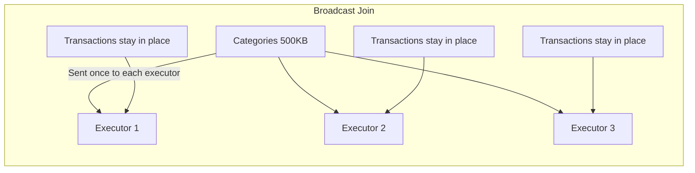

# PySpark Broadcast Variables — Interview Scenarios

## Junior Scenario: When to Broadcast

**Question:** "You have a 1-billion-row transaction table and a 5,000-row category lookup table. How would you join them efficiently? Explain why your approach is better than a regular join."

### Solution

```python
from pyspark.sql import SparkSession, functions as F

spark = SparkSession.builder.appName("BroadcastScenario").getOrCreate()

# Large fact table: 1 billion rows
transactions = spark.read.parquet("s3://data/transactions/")  # ~100GB

# Small lookup table: 5,000 rows
categories = spark.read.parquet("s3://data/categories/")  # ~500KB

# GOOD: Broadcast the small table
result = transactions.join(
    F.broadcast(categories),
    on="category_id",
    how="inner"
)

# BAD: Regular join (shuffles 100GB of transaction data!)
result_bad = transactions.join(categories, "category_id")
```

### Why Broadcast Wins



| Metric | Regular Join | Broadcast Join |
|--------|-------------|----------------|
| Shuffle data volume | 100GB (transactions) + 500KB | 500KB only |
| Network I/O | ~100GB | ~25MB (500KB × 50 executors) |
| Disk I/O (shuffle write) | 100GB | 0 |
| Time | ~30 minutes | ~3 minutes |
| Risk of OOM | Low-moderate | None (500KB per executor) |

**Expected Answer Points:**
- The categories table is tiny (500KB) — perfect for broadcast
- Broadcasting eliminates the need to shuffle the 100GB transaction table
- Each executor gets a local copy of categories and joins locally
- Spark may auto-broadcast (5000 rows < 10MB threshold), but explicit is safer
- Verify with `result.explain()` — should show BroadcastHashJoin

---

## Mid-Level Scenario: Fix OOM from Broadcasting Large Table

**Question:** "A developer added `F.broadcast()` to a 2GB user profile table because 'broadcasts are faster'. Now the job fails with OOM errors on both the driver and executors. Diagnose and fix the issue."

### The Problem

```python
# Developer's code — causes OOM
user_profiles = spark.read.parquet("s3://data/user_profiles/")  # 2GB, 50M rows
events = spark.read.parquet("s3://data/events/")  # 500M rows, 50GB

# This causes OOM!
enriched = events.join(
    F.broadcast(user_profiles),  # 2GB broadcast = BAD
    on="user_id",
    how="left"
)
enriched.count()  # FAILS: driver OOM or executor OOM
```

### Diagnosis

```python
# Why it fails:
# 1. Driver must collect 2GB table into memory (driver might only have 4GB)
# 2. Each executor receives 2GB deserialized copy
#    - 50 executors × 2GB = 100GB total cluster memory for broadcasts
#    - Leaves less memory for actual processing
# 3. Spark's internal overhead: serialization buffers, hash table construction

# Error messages you'd see:
# "java.lang.OutOfMemoryError: Java heap space" (driver)
# "Not enough memory to build and broadcast the table" (Spark SQL)
# "Container killed by YARN for exceeding memory limits" (executor)
```

### The Fix

```python
# Solution 1: Remove broadcast — use SortMergeJoin
enriched = events.join(user_profiles, "user_id", "left")
# Both tables get shuffle-sorted by user_id, then merge-joined
# Handles any size, just slower due to shuffle

# Solution 2: If user_profiles is frequently joined, use bucketing
# One-time setup:
user_profiles.write.bucketBy(200, "user_id").sortBy("user_id").saveAsTable("user_profiles_bucketed")
events.write.bucketBy(200, "user_id").sortBy("user_id").saveAsTable("events_bucketed")

# Bucketed join — no shuffle, no broadcast, works at any scale!
spark.conf.set("spark.sql.autoBucketedScan.enabled", "true")
up = spark.table("user_profiles_bucketed")
ev = spark.table("events_bucketed")
enriched = ev.join(up, "user_id", "left")

# Solution 3: If only some user_profile columns needed, reduce broadcast size
small_profiles = user_profiles.select("user_id", "tier", "region")  # Only needed columns
# Check size: maybe now it's 200MB — still too big? Then don't broadcast

# Solution 4: Filter profiles to only users in events (reduce size dynamically)
active_users = events.select("user_id").distinct()
filtered_profiles = user_profiles.join(active_users, "user_id")
# If filtered_profiles is now < 500MB, broadcast might work
print(f"Filtered profiles count: {filtered_profiles.count()}")
```

### Decision Framework

```python
def recommend_join_strategy(small_size_mb, large_size_gb, executor_count, executor_memory_gb):
    """Recommend join strategy based on data sizes."""
    
    executor_available_mb = executor_memory_gb * 1024 * 0.3  # 30% for broadcast
    
    if small_size_mb < 10:
        return "BroadcastHashJoin (auto — under threshold)"
    elif small_size_mb < min(500, executor_available_mb):
        return "BroadcastHashJoin (explicit F.broadcast())"
    elif small_size_mb < 2000:
        return "SortMergeJoin (or bucket for repeated joins)"
    else:
        return "SortMergeJoin with bucketing for zero-cost future joins"

print(recommend_join_strategy(2000, 50, 50, 8))
# "SortMergeJoin with bucketing for zero-cost future joins"
```

**Expected Answer Points:**
- 2GB exceeds safe broadcast size — driver must hold it, each executor stores a copy
- Total memory impact: 2GB × executor_count for broadcast alone
- Fix: remove broadcast, use SortMergeJoin (default for large tables)
- Better fix for repeated joins: bucket by join key to eliminate shuffle entirely
- Could try column pruning to reduce broadcast size (select only needed columns)
- Check if filtering (e.g., only active users) reduces table enough to broadcast

---

## Senior Scenario: Broadcast vs Repartition Strategy

**Question:** "You have a pipeline that joins a 500GB event table with a 800MB customer dimension every hour. The dimension updates daily. Auto-broadcast threshold won't cover 800MB. What's your join strategy? Consider: performance, memory, maintainability, and the daily dimension update."

### Analysis

```python
# Constraints:
# - Event table: 500GB, hourly runs
# - Customer dimension: 800MB, updates daily
# - Auto-broadcast max: 10MB (default)
# - Runs hourly — needs to be efficient

# Option A: Force broadcast (800MB)
# Pro: Eliminates 500GB shuffle
# Con: 800MB × N executors memory, driver collects 800MB, broadcast timeout risk
# Risk: As dimension grows past 1GB, will eventually break

# Option B: SortMergeJoin (default)
# Pro: Always works, scales to any size
# Con: Shuffles 500GB events + 800MB dim = 501GB per hour
# At 24 hours/day: 12TB shuffled daily just for this join

# Option C: Bucketing
# Pro: Zero-shuffle join after setup, scales perfectly
# Con: Initial bucket creation, requires Hive metastore, both tables must be bucketed

# Option D: Broadcast with increased threshold + monitoring
# Pro: Good performance, simple code
# Con: Must monitor dimension growth, will break eventually
```

### Recommended Solution: Hybrid Approach

```python
from pyspark.sql import SparkSession, functions as F

spark = SparkSession.builder.getOrCreate()

# Strategy: Broadcast the dimension IF it fits, fall back to optimized shuffle

BROADCAST_THRESHOLD_MB = 1000  # 1GB max for broadcast

def get_table_size_mb(df):
    """Estimate DataFrame size in MB."""
    return df._jdf.queryExecution().optimizedPlan().stats().sizeInBytes() / 1024 / 1024

def join_events_with_customers(events_df, customer_df):
    """Adaptive join strategy based on dimension size."""
    dim_size_mb = get_table_size_mb(customer_df)
    
    if dim_size_mb < BROADCAST_THRESHOLD_MB:
        # Broadcast join — fast, no shuffle of events
        print(f"Using broadcast join (dimension: {dim_size_mb:.0f}MB)")
        spark.conf.set("spark.sql.autoBroadcastJoinThreshold", f"{int(dim_size_mb * 1.5)}m")
        return events_df.join(F.broadcast(customer_df), "customer_id", "left")
    else:
        # Fallback: SortMergeJoin with optimized partitioning
        print(f"Using SortMergeJoin (dimension too large: {dim_size_mb:.0f}MB)")
        # Repartition dimension to match event partition count
        customer_repartitioned = customer_df.repartition(200, "customer_id")
        events_repartitioned = events_df.repartition(200, "customer_id")
        return events_repartitioned.join(customer_repartitioned, "customer_id", "left")

# Long-term solution: Bucketing (setup once, benefit forever)
def setup_bucketed_tables():
    """One-time setup for zero-shuffle joins."""
    # Events: write bucketed (do this in the pipeline that creates events)
    events_df.write \
        .bucketBy(256, "customer_id") \
        .sortBy("customer_id") \
        .mode("overwrite") \
        .saveAsTable("events_bucketed")
    
    # Customer dim: rebucket daily after update
    customer_df.write \
        .bucketBy(256, "customer_id") \
        .sortBy("customer_id") \
        .mode("overwrite") \
        .saveAsTable("customers_bucketed")

# With bucketing: zero-shuffle join regardless of dimension size!
events_b = spark.table("events_bucketed")
customers_b = spark.table("customers_bucketed")
result = events_b.join(customers_b, "customer_id", "left")
# Plan shows: SortMergeJoin without Exchange (no shuffle!)
```

### Strategy Comparison for This Scenario

| Strategy | Shuffle/Run | Memory Impact | Daily Cost | Maintenance |
|----------|------------|---------------|-----------|-------------|
| Broadcast (800MB) | 0 | 800MB × 50 exec = 40GB | 0 shuffle | Monitor growth |
| SortMergeJoin | 501GB | Normal | 12TB/day | None |
| Bucketing | 0 (after setup) | Normal | 0 shuffle | Rebucket dim daily |
| Adaptive (recommended) | 0 now, degrades gracefully | Adaptive | 0 until threshold | Self-managing |

**Expected Answer Points:**
- 800MB is borderline for broadcast — works today but risky as dimension grows
- Bucketing is the ideal long-term solution for repeated joins (eliminates shuffle permanently)
- Consider an adaptive approach that broadcasts when possible, falls back when dimension grows
- Daily dimension update means: rebucket daily for bucket strategy, or just read fresh for broadcast
- Calculate total shuffle cost: 500GB × 24 hours = 12TB/day without broadcast — significant cluster cost
- Mention monitoring: alert when dimension approaches broadcast threshold

---

## Interview Tips

> **Tip 1:** "For basic broadcast questions, quantify the network savings." — "A broadcast join of a 500KB table with a 100GB fact table on 50 executors transfers 25MB total (500KB × 50). A shuffle join transfers ~100GB. That's a 4000x reduction in network I/O. Always quantify — interviewers want to see you understand the magnitude of the improvement."

> **Tip 2:** "For OOM questions, trace the memory path." — "Broadcast data flows: driver collects → driver serializes → transfer to executors → executors deserialize → executors build hash table. At each step, memory is consumed. A 2GB table might need 4-6GB on the driver (original + serialized) and 2-3GB per executor (deserialized + hash table overhead). Multiply by executor count for total cluster impact."

> **Tip 3:** "For strategy questions, present a progression." — "Start with the simplest solution (broadcast if it fits), acknowledge its limitations (memory, growth), then present the scalable solution (bucketing). Show you think about today AND tomorrow. The best answer includes: immediate fix (adjust threshold or broadcast hint), medium-term (adaptive strategy with fallback), and long-term (bucketing for zero-cost joins)."
