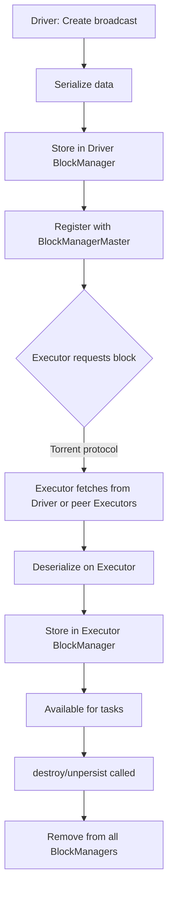

# PySpark Broadcast Variables — Senior Deep Dive

## Broadcast Variable Lifecycle: Driver to Executor

Understanding the full lifecycle helps diagnose broadcast failures:



### Detailed Steps

```python
# Step 1: Driver creates broadcast
bc_data = sc.broadcast(large_dict)  # Data serialized and stored in driver memory

# Step 2: First task on executor requests the broadcast block
# Spark uses TorrentBroadcast by default:
# - Data split into 4MB chunks
# - Chunks fetched from driver OR other executors that already have them
# - Similar to BitTorrent — scales better than driver-only distribution

# Step 3: Executor caches the deserialized object
# Subsequent tasks on same executor reuse cached copy (no re-fetch)

# Configuration for broadcast mechanism
spark.conf.set("spark.broadcast.blockSize", "4m")  # Chunk size for torrent
spark.conf.set("spark.broadcast.compress", "true")  # Compress during transfer
spark.conf.set("spark.broadcast.factory", 
               "org.apache.spark.broadcast.TorrentBroadcastFactory")
```

---

## Memory Implications

Broadcast data consumes memory at multiple levels:

```python
# Memory layout with broadcast
# Driver: stores the serialized broadcast data
# Each Executor: stores DESERIALIZED copy in storage memory

# Example: 100MB lookup table, 50 executors
# Driver memory used: ~100MB (serialized)
# Total cluster memory: 100MB × 50 = 5GB (deserialized per executor)
# Network transfer: ~100MB (torrent protocol distributes load)
```

### Memory Regions Affected

| Component | Memory Used | Region |
|-----------|------------|--------|
| Driver | Serialized size | Driver heap |
| Executor (serialized) | Compressed size | Storage memory |
| Executor (deserialized) | Full object size | Storage memory |
| Network transfer | Compressed chunks | Off-heap buffers |

```python
# Monitor broadcast memory usage
# Spark UI → Storage tab shows broadcast blocks

# Programmatic check
from pyspark import StorageLevel

# Check how much memory broadcasts consume
status = sc.getExecutorStorageStatus()
for s in status:
    print(f"Executor: {s.blockManagerId()}")
    print(f"  Memory used: {s.memUsed()} bytes")
    print(f"  Memory remaining: {s.memRemaining()} bytes")
```

### When Broadcast Causes OOM

```python
# Scenario: Broadcasting too-large data
try:
    # 2GB table — will likely OOM driver or executors
    huge_table = spark.read.parquet("hdfs:///data/huge_dimension/")
    bc_huge = F.broadcast(huge_table)
    result = facts.join(bc_huge, "key")
    result.count()  # Triggers broadcast
except Exception as e:
    print(f"Broadcast failed: {e}")
    # Common errors:
    # - "Not enough memory to build and broadcast the table"
    # - java.lang.OutOfMemoryError on driver
    # - "Cannot broadcast the table that is larger than 8GB"

# Spark has a hard limit
spark.conf.get("spark.sql.autoBroadcastJoinThreshold")
# Max broadcast size is also limited by:
# spark.driver.maxResultSize (default 1GB)
# spark.driver.memory
```

---

## Broadcast vs Shuffle Cost Model

### When Broadcast Wins

```python
# Cost model:
# Broadcast cost = serialize + transfer_to_N_executors + deserialize_per_executor
# Shuffle cost = serialize_both_sides + network_transfer + sort + merge

# Variables:
# S = small table size
# L = large table size  
# N = number of executors
# P = number of partitions

# Broadcast total network = S × N (send to each executor)
# Shuffle total network = L + S (both tables reshuffled)

# Broadcast wins when: S × N < L + S
# Simplified: S × N < L (approximately, for large L)
# Or: S < L / N

# Example: 50 executors, 500GB large table
# Broadcast threshold: 500GB / 50 = 10GB theoretical max
# But memory constraints usually limit to ~100MB-1GB in practice
```

### Decision Matrix

```python
def should_broadcast(small_size_mb, large_size_gb, num_executors, executor_memory_gb):
    """Heuristic for broadcast vs shuffle decision."""
    
    # Hard limits
    if small_size_mb > 8000:  # 8GB Spark hard limit
        return False, "Exceeds Spark 8GB broadcast limit"
    
    if small_size_mb > executor_memory_gb * 1024 * 0.3:  # 30% of executor memory
        return False, "Would consume too much executor memory"
    
    # Cost comparison
    broadcast_network_mb = small_size_mb * num_executors
    shuffle_network_mb = (large_size_gb * 1024) + small_size_mb
    
    if broadcast_network_mb < shuffle_network_mb * 0.5:
        return True, f"Broadcast saves {shuffle_network_mb - broadcast_network_mb:.0f}MB network"
    
    return False, f"Shuffle is more efficient (broadcast: {broadcast_network_mb:.0f}MB vs shuffle: {shuffle_network_mb:.0f}MB)"

# Example decisions:
print(should_broadcast(50, 500, 50, 8))
# (True, "Broadcast saves 509950MB network")

print(should_broadcast(2000, 5, 50, 8))
# (False, "Would consume too much executor memory")
```

---

## Failure Modes and Troubleshooting

### Common Broadcast Failures

```python
# Failure 1: Broadcast timeout
# Symptom: "Could not execute broadcast in 300 sec"
spark.conf.set("spark.sql.broadcastTimeout", "600")  # Increase to 10 min
# Root cause: slow network, large broadcast, or driver under pressure

# Failure 2: Driver OOM during broadcast collection
# Symptom: java.lang.OutOfMemoryError on driver
# Root cause: Spark collects broadcast table to driver before distributing
# Fix: Increase driver memory or reduce broadcast table size
spark.conf.set("spark.driver.memory", "8g")
spark.conf.set("spark.driver.maxResultSize", "4g")

# Failure 3: Executor OOM from multiple broadcasts
# Symptom: Executors die during broadcast join execution
# Root cause: Multiple broadcast tables competing for storage memory
# Fix: Reduce number of concurrent broadcasts, increase executor memory
spark.conf.set("spark.executor.memory", "16g")

# Failure 4: Stale broadcast data
# Symptom: Wrong results because broadcast wasn't refreshed
# Root cause: Broadcast is immutable — if source data changes, broadcast is stale
# Fix: Destroy and recreate broadcast with fresh data
bc_old.destroy()
bc_new = sc.broadcast(load_fresh_data())
```

### Diagnosing Broadcast Issues

```python
# Check if broadcast is being used
df.explain(mode="formatted")
# Look for: BroadcastHashJoin vs SortMergeJoin

# Check broadcast size estimation
from pyspark.sql import functions as F

small_df = spark.read.parquet("hdfs:///data/dimension/")
print(f"Row count: {small_df.count()}")
print(f"Estimated size: {small_df._jdf.queryExecution().optimizedPlan().stats().sizeInBytes()} bytes")

# Force statistics computation for accurate estimation
spark.sql("ANALYZE TABLE dimension_table COMPUTE STATISTICS")

# Check if broadcast succeeded in Spark UI
# SQL Tab → click on query → look for BroadcastExchange
# Shows: data size, time to collect, time to broadcast
```

---

## Advanced Patterns

### Broadcast with Dynamic Updates (Workaround)

```python
# Broadcast variables are immutable — but you can simulate updates
class DynamicBroadcast:
    """Wrapper to refresh broadcast data periodically."""
    
    def __init__(self, sc, load_func):
        self.sc = sc
        self.load_func = load_func
        self._broadcast = None
        self.refresh()
    
    def refresh(self):
        """Reload data and create new broadcast."""
        if self._broadcast:
            self._broadcast.unpersist(blocking=True)
        data = self.load_func()
        self._broadcast = self.sc.broadcast(data)
    
    @property
    def value(self):
        return self._broadcast.value

# Usage
def load_blocklist():
    return set(spark.read.text("hdfs:///data/blocklist.txt")
               .rdd.map(lambda r: r[0]).collect())

dynamic_blocklist = DynamicBroadcast(sc, load_blocklist)

# Refresh before each batch (in streaming)
def process_batch(batch_df, batch_id):
    if batch_id % 100 == 0:  # Refresh every 100 batches
        dynamic_blocklist.refresh()
    # Use dynamic_blocklist.value in processing
```

### Nested Broadcast Join Optimization

```python
# Multiple dimension joins — order matters!
# Best practice: broadcast all dimensions, join largest last

result = (fact_table
    .join(F.broadcast(dim_date), "date_key")       # 365 rows
    .join(F.broadcast(dim_product), "product_key")  # 50K rows
    .join(F.broadcast(dim_store), "store_key")      # 5K rows
    .join(F.broadcast(dim_customer), "cust_key")    # 1M rows — largest dim
)

# Optimizer may reorder joins for efficiency
# Use explain() to verify the chosen order
result.explain(mode="formatted")
```

---

## Interview Tips

> **Tip 1:** "Walk me through the broadcast lifecycle." — "The driver serializes the data and stores it in the driver's BlockManager. When executors need it, they fetch it using a torrent-like protocol — the data is split into 4MB chunks that can be fetched from the driver or from other executors that already have pieces. This distributes the network load. Each executor deserializes and caches it in storage memory. Subsequent tasks on the same executor reuse the cached copy without re-fetching."

> **Tip 2:** "What are the memory implications of broadcasting?" — "Three concerns: (1) Driver must hold the entire serialized table in memory — this is often the bottleneck. (2) Each executor stores a deserialized copy in storage memory — multiply by executor count for total cluster memory used. (3) Memory pressure from broadcasts reduces available storage for caching. A 100MB table broadcast to 50 executors uses 5GB of cluster memory. If that doesn't fit, you get executor OOM or cache eviction."

> **Tip 3:** "When would broadcast be the wrong choice?" — "Four cases: (1) The table is too large — anything over ~500MB risks driver OOM or memory pressure. (2) Both sides are large — broadcast one and you still shuffle the other. (3) The data needs frequent updates — broadcast is immutable within a job. (4) You have many concurrent joins with different dimensions — the cumulative memory of multiple broadcasts can exhaust executor memory. In these cases, use SortMergeJoin with appropriate partitioning or bucketing."

## ⚡ Cheat Sheet

**Broadcast Thresholds**
- `spark.sql.autoBroadcastJoinThreshold` = 10MB default; set -1 to disable auto-broadcast
- Rule of thumb: broadcast tables ≤ 200MB; risk OOM on executors above that
- DataFrame join hint: `df.join(broadcast(small_df), "key")` — forces broadcast regardless of size

**Lifecycle & Memory**
- Broadcast data lives in executor BlockManager (memory tier, then disk)
- Driver serializes → sends to each executor once → executors cache in-memory
- `bc.unpersist()` — removes from executor memory; `bc.destroy()` — removes + frees driver memory
- Not calling `unpersist`/`destroy` = memory leak across multiple broadcast variables in loops

**Failure Modes & Fixes**
| Symptom | Cause | Fix |
|---------|-------|-----|
| `SparkException: Broadcast variable already destroyed` | Used after destroy() | Re-create broadcast before next job |
| Driver OOM on broadcast | Table too large for driver heap | Increase driver memory or use SortMergeJoin |
| Executor OOM | Sum of broadcasts exceeds executor storage | Unpersist unused broadcasts, reduce threshold |
| Timeout on broadcast | Slow serialization or network | Increase `spark.sql.broadcastTimeout` (default 300s) |

**Broadcast Variables vs Broadcast Joins**
- `sc.broadcast(value)` — manual RDD-era API; good for lookup dicts in UDFs/RDD maps
- `broadcast(df)` hint — SQL/DataFrame API; triggers BroadcastHashJoin physical plan
- Both use same underlying BlockManager mechanism

**Key Numbers**
- Default timeout: 300s (`spark.sql.broadcastTimeout`)
- Max safe size per broadcast: ~200–500MB depending on executor heap
- Serialized size ≠ in-memory size; Python dicts can expand 3–5× after deserialization

**Interview Traps**
- Broadcast joins still require the small table to fit in **driver** memory first (to serialize)
- AQE can dynamically convert SortMergeJoin → BroadcastHashJoin at runtime if build side is small
- `sc.broadcast()` variables are NOT automatically cleaned up at end of action — always call `unpersist`
