# PySpark Catalyst Optimizer — Fundamentals


## 🎯 Analogy

Think of the Catalyst optimizer like a GPS that finds the fastest route after you describe your destination. You say 'I want the revenue by region' and Catalyst figures out whether to filter first, which join order is cheapest, and whether to push predicates down to the source.

---
## What Is the Catalyst Optimizer?

Catalyst is Spark SQL's query optimizer. It transforms your DataFrame/SQL operations into an efficient execution plan, similar to how a database query planner works.

> **Key Insight:** You write WHAT you want (declarative), Catalyst figures out HOW to do it efficiently. This is why DataFrames are faster than hand-written RDD code — the optimizer can rewrite your query in ways you might not think of.

---

## Optimization Pipeline

```mermaid
graph LR
    A[SQL/DataFrame Code] --> B[Unresolved Logical Plan]
    B --> C[Analysis: Resolve names and types]
    C --> D[Logical Plan]
    D --> E[Optimization Rules]
    E --> F[Optimized Logical Plan]
    F --> G[Physical Planning]
    G --> H[Cost-Based Selection]
    H --> I[Selected Physical Plan]
    I --> J[Code Generation]
    J --> K[Execution]
```



| Phase | What Happens | Example |
|-------|-------------|---------|
| **Analysis** | Resolve column names, tables, types | `col("name")` → column in table `users` |
| **Logical Optimization** | Rule-based rewrites | Push filters before joins |
| **Physical Planning** | Choose algorithms | BroadcastHashJoin vs SortMergeJoin |
| **Code Generation** | Compile to Java bytecode | Whole-stage codegen for CPU efficiency |

---

## Rule-Based Optimization (RBO)

The optimizer applies a fixed set of rules to improve the plan:

```python
from pyspark.sql import SparkSession, functions as F

spark = SparkSession.builder.appName("CatalystFundamentals").getOrCreate()

# Example: Catalyst pushes filter BEFORE join automatically
orders = spark.read.parquet("s3://data/orders/")
customers = spark.read.parquet("s3://data/customers/")

# Your code (filter AFTER join):
result = (orders
    .join(customers, "customer_id")
    .filter(F.col("order_date") > "2024-01-01")
    .filter(F.col("region") == "US")
)

# What Catalyst actually executes (filter BEFORE join):
# 1. Filter orders by order_date > 2024-01-01
# 2. Filter customers by region = US
# 3. THEN join (on much less data!)

result.explain()
```

Common optimization rules:
- **Predicate Pushdown** — Move filters as early as possible
- **Column Pruning** — Only read columns that are needed
- **Constant Folding** — Pre-compute constant expressions
- **Boolean Simplification** — Simplify redundant conditions

---

## Cost-Based Optimization (CBO)

CBO uses table statistics to make better decisions:

```python
# Compute statistics for CBO
spark.sql("ANALYZE TABLE orders COMPUTE STATISTICS")
spark.sql("ANALYZE TABLE orders COMPUTE STATISTICS FOR COLUMNS customer_id, amount")

# CBO uses stats to:
# 1. Estimate output sizes for better join strategy selection
# 2. Reorder multi-way joins for optimal performance
# 3. Choose between broadcast and shuffle join

# Enable CBO
spark.conf.set("spark.sql.cbo.enabled", "true")
spark.conf.set("spark.sql.cbo.joinReorder.enabled", "true")
```

---

## Using explain() to See the Plan

```python
# Basic explain — shows physical plan
result.explain()

# Extended explain — all plan stages
result.explain(mode="extended")

# Formatted explain — readable output
result.explain(mode="formatted")

# Cost explain — includes estimated sizes
result.explain(mode="cost")
```

### Reading Basic explain() Output

```python
df = (orders
    .filter(F.col("amount") > 100)
    .groupBy("product_id")
    .agg(F.sum("amount").alias("total"))
    .orderBy(F.desc("total")))

df.explain()
```

Output:
```
== Physical Plan ==
*(3) Sort [total DESC], true, 0
+- Exchange rangepartitioning(total DESC, 200)
   +- *(2) HashAggregate(keys=[product_id], functions=[sum(amount)])
      +- Exchange hashpartitioning(product_id, 200)
         +- *(1) HashAggregate(keys=[product_id], functions=[partial_sum(amount)])
            +- *(1) Filter (amount > 100)
               +- *(1) FileScan parquet [product_id, amount]
                     Pushed Filters: [GreaterThan(amount,100)]
                     ReadSchema: struct<product_id:string,amount:double>
```

### Plan Reading Guide

| Symbol | Meaning |
|--------|---------|
| `*(N)` | Whole-stage code generation (stage N) |
| `Exchange` | Shuffle operation (data moves between executors) |
| `FileScan` | Reading from storage |
| `Pushed Filters` | Filters pushed to the data source |
| `ReadSchema` | Only these columns are read (column pruning) |
| `HashAggregate` | Hash-based aggregation |
| `partial_sum` | Local pre-aggregation before shuffle |
| `BroadcastExchange` | Broadcasting a small table |

---

## What Catalyst Optimizes Automatically

```python
# 1. Predicate pushdown — filter pushed to storage
df.join(other, "key").filter(F.col("date") > "2024-01-01")
# Catalyst moves date filter to scan level

# 2. Column pruning — unused columns skipped
df.select("name", "email")  # Only reads these 2 columns from Parquet
# Even if the file has 100 columns

# 3. Constant folding — precompute constants
df.withColumn("x", F.lit(2) + F.lit(3))  # Becomes lit(5)

# 4. Join reordering — smaller tables first
# If you join A(1GB) → B(100GB) → C(10MB)
# Catalyst might reorder to: A → C → B (join small first)

# 5. Boolean simplification
df.filter((F.col("x") > 5) & (F.col("x") > 5))  # Removes duplicate
df.filter(F.lit(True) & F.col("active"))  # Simplifies to just col("active")
```

---

## Simple Examples of Optimization

```python
# BEFORE optimization (what you write):
result = (spark.read.parquet("s3://data/users/")
    .join(spark.read.parquet("s3://data/orders/"), "user_id")
    .select("user_id", "name", "amount")
    .filter(F.col("amount") > 1000))

# AFTER optimization (what actually executes):
# 1. Read users: only user_id, name columns (column pruning)
# 2. Read orders: only user_id, amount columns (column pruning)
# 3. Filter orders: amount > 1000 (predicate pushdown — before join!)
# 4. Join on user_id (less data to join now)
# 5. Select columns
```

---

## Verify Optimizations with explain

```python
# Check that predicate pushdown is working
(spark.read.parquet("s3://data/orders/")
    .filter(F.col("amount") > 100)
    .explain(mode="formatted"))

# Look for:
# FileScan parquet
#   Pushed Filters: [GreaterThan(amount, 100)]  ← SUCCESS!
#   ReadSchema: struct<...only needed columns...>  ← Column pruning!
```

---


## ▶️ Try It Yourself

```python
from pyspark.sql import SparkSession
spark = SparkSession.builder.master("local[*]").appName("catalyst").getOrCreate()
data = [(i, i%5, i*10) for i in range(100)]
df = spark.createDataFrame(data, ["id","cat","val"])
# Catalyst optimizes this automatically — filter is pushed before join
query = df.filter("cat = 2").groupBy("cat").sum("val")
query.explain(True)  # Shows logical, optimized logical, physical plans
```

> **Run it:** Copy the snippet into a REPL or file and run it — no external services needed for the basic example.

---
## Interview Tips

> **Tip 1:** "What does the Catalyst optimizer do?" — "Catalyst transforms your DataFrame/SQL operations into an efficient execution plan through four phases: analysis (resolve names), logical optimization (rule-based rewrites like predicate pushdown and column pruning), physical planning (choose algorithms like broadcast vs shuffle join), and code generation (compile to optimized Java bytecode). This is why DataFrames outperform hand-written RDD code — Catalyst applies optimizations automatically."

> **Tip 2:** "What are the most important optimizations Catalyst performs?" — "Predicate pushdown (move filters before joins and into storage scans), column pruning (read only needed columns from Parquet/ORC), join reordering (join smaller tables first in multi-way joins), and selecting the right join algorithm (broadcast for small tables, sort-merge for large ones). These can improve performance by 10-100x compared to naive execution."

> **Tip 3:** "How do you check if optimizations are being applied?" — "Use df.explain(mode='formatted') and read the plan bottom-up. Look for Pushed Filters in FileScan nodes (predicate pushdown working), ReadSchema showing only needed columns (column pruning), and appropriate join types (BroadcastHashJoin for small tables). If optimizations are missing, common causes are UDFs blocking pushdown, functions on partition columns, or missing table statistics."
