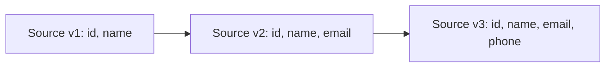

# PySpark Data Sources — Intermediate

## JDBC Source: Parallel Reads

The critical skill is reading databases in parallel to avoid single-connection bottlenecks.

```python
# Single partition (slow — only for small tables)
df = spark.read.format("jdbc").option("url", url).option("dbtable", "orders").load()

# Parallel JDBC read (production pattern)
df = (
    spark.read.format("jdbc")
    .option("url", "jdbc:postgresql://host:5432/mydb")
    .option("dbtable", "public.orders")
    .option("user", "spark_reader")
    .option("password", "secret")
    .option("partitionColumn", "order_id")    # Must be numeric/date/timestamp
    .option("lowerBound", "1")
    .option("upperBound", "10000000")
    .option("numPartitions", "20")
    .option("fetchSize", "10000")
    .load()
)
```

Spark divides `[lowerBound, upperBound)` into equal slices and issues one query per partition.

| Parameter | Guidelines |
|-----------|-----------|
| `partitionColumn` | Numeric, evenly distributed, indexed |
| `lowerBound/upperBound` | Get from `SELECT MIN/MAX` |
| `numPartitions` | 2-4x cores, respect DB connection limits |
| `fetchSize` | 10K-100K rows per network round trip |

### Custom Query (Filter at Source)

```python
query = "(SELECT * FROM orders WHERE status = 'completed' AND order_date > '2024-01-01') AS filtered"
df = spark.read.format("jdbc").option("dbtable", query).option("partitionColumn", "order_id")...
```

---

## Kafka Source (Batch)

```python
df = (
    spark.read.format("kafka")
    .option("kafka.bootstrap.servers", "broker1:9092,broker2:9092")
    .option("subscribe", "user_events")
    .option("startingOffsets", "earliest")
    .option("endingOffsets", "latest")
    .load()
)

# Kafka returns binary key/value — deserialize with from_json
from pyspark.sql.functions import from_json, col
from pyspark.sql.types import StructType, StructField, StringType, LongType

event_schema = StructType([
    StructField("user_id", StringType()),
    StructField("action", StringType()),
    StructField("timestamp", LongType()),
])

parsed = (
    df.selectExpr("CAST(value AS STRING) as json_str")
    .select(from_json(col("json_str"), event_schema).alias("data"))
    .select("data.*")
)
```

| Offset Option | Behavior |
|---------------|----------|
| `"earliest"` | Read from beginning |
| `"latest"` | Only new messages |
| JSON per-partition | Specific offsets |

---

## Reading from Hive Metastore

```python
spark = SparkSession.builder.enableHiveSupport().getOrCreate()
df = spark.table("analytics.fact_orders")
df = spark.sql("SELECT * FROM analytics.fact_orders WHERE order_date = '2024-01-15'")
```

---

## Delta Lake and Iceberg

```python
# Delta: current version
df = spark.read.format("delta").load("s3://lakehouse/orders/")

# Delta: time travel
df = spark.read.format("delta").option("versionAsOf", 10).load("s3://lakehouse/orders/")

# Delta: change data feed
changes = spark.read.format("delta").option("readChangeFeed", "true").option("startingVersion", 5).load("s3://lakehouse/orders/")

# Iceberg
df = spark.read.format("iceberg").load("catalog.db.orders")
```

---

## Advanced File Source Options

```python
# mergeSchema: union schemas across files with different columns
df = spark.read.option("mergeSchema", "true").parquet("s3://data/evolving-table/")

# pathGlobFilter + recursiveFileLookup
df = (
    spark.read
    .option("pathGlobFilter", "*.parquet")
    .option("recursiveFileLookup", "true")
    .parquet("s3://data/nested/")
)

# Filter by modification time
df = spark.read.option("modifiedAfter", "2024-01-15T00:00:00").parquet("s3://data/events/")
```

| Option | Purpose |
|--------|---------|
| `mergeSchema` | Union schemas, NULLs for missing columns |
| `pathGlobFilter` | Filter files by name pattern |
| `recursiveFileLookup` | Traverse subdirectories |
| `modifiedAfter/Before` | Filter files by timestamp |

---

## Schema Evolution Handling



### Strategy 1: mergeSchema

```python
df = spark.read.option("mergeSchema", "true").parquet("s3://data/evolving/")
# New columns get NULLs for old files
```

### Strategy 2: Schema Enforcement (Fail Fast)

```python
df = spark.read.schema(expected_schema).parquet("s3://data/evolving/")
# Fails if actual schema doesn't match
```

### Strategy 3: Delta Schema Evolution on Write

```python
new_data.write.format("delta").mode("append").option("mergeSchema", "true").save("s3://lakehouse/orders/")
```

---

## Interview Tips

> **Tip 1:** "How do you read a large DB table efficiently?" — "Parallel JDBC with partitionColumn, lowerBound, upperBound, numPartitions. Choose an indexed, evenly-distributed numeric column. Set numPartitions to match cluster parallelism without overwhelming the DB connection pool."

> **Tip 2:** "How do you handle schema changes in a data lake?" — "Three approaches: mergeSchema to union with NULLs, explicit schema enforcement to fail fast, or Delta's schema evolution to allow additive changes on write while blocking breaking changes."

> **Tip 3:** "What does Spark return from Kafka?" — "Columns: key (binary), value (binary), topic, partition, offset, timestamp. Cast value to string and use from_json() with a StructType schema to parse into structured columns."
