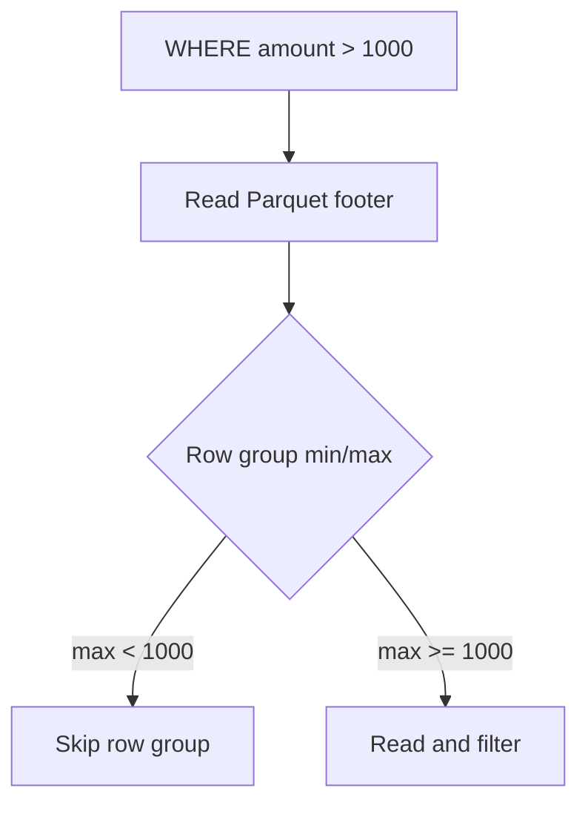

# PySpark Data Sources — Senior Deep Dive

## Predicate Pushdown: Per-Source Behavior

Predicate pushdown moves filters into the data source, reducing data transferred.

| Source | Filter Pushdown | Column Pruning | Partition Pruning | Aggregate Pushdown |
|--------|----------------|----------------|-------------------|--------------------|
| Parquet | Yes (row group stats) | Yes | Yes | Limited (3.3+) |
| Delta | Yes + data skipping | Yes | Yes | Yes (Z-ORDER) |
| JDBC | Yes (WHERE clause) | Yes (SELECT) | N/A | Yes (3.3+) |
| CSV/JSON | No | No | Dir-based only | No |
| Iceberg | Yes (manifest filtering) | Yes | Yes | Yes |

### How Parquet Pushdown Works



```python
# Verify pushdown is active
df = spark.read.parquet("s3://data/orders/").filter("amount > 1000")
df.explain(True)  # Look for "PushedFilters" in scan node
```

### JDBC Pushdown (Spark 3.3+)

```python
df = (
    spark.read.format("jdbc")
    .option("pushDownAggregate", "true")
    .option("pushDownLimit", "true")
    .load()
)
# df.filter("status = 'shipped'").count()
# → Translates to: SELECT COUNT(*) FROM orders WHERE status = 'shipped'
```

---

## Column Pruning

```python
# Only reads 3 columns from a 200-column table
df = spark.read.parquet("s3://data/wide_table/").select("user_id", "amount", "ts")
# explain shows: ReadSchema: struct<user_id:string,amount:double,ts:timestamp>
```

**Where pruning fails:** `SELECT *`, UDFs taking entire `Row`, joins shuffling full rows before projection.

---

## S3 Read Performance

| File Size | Problem | Solution |
|-----------|---------|----------|
| < 1 MB | Too many LIST/GET calls | Compact files |
| 128 MB–1 GB | Optimal | Target this range |
| > 1 GB | Limits parallelism | Use splittable format |

### S3A Tuning

```python
spark = (
    SparkSession.builder
    .config("spark.hadoop.fs.s3a.connection.maximum", "200")
    .config("spark.hadoop.fs.s3a.threads.max", "64")
    .config("spark.hadoop.fs.s3a.fast.upload", "true")
    .config("spark.hadoop.fs.s3a.multipart.size", "104857600")
    .config("spark.hadoop.fs.s3a.readahead.range", "256K")
    .getOrCreate()
)
```

### Compacting Small Files

```python
df = spark.read.parquet("s3://data/events/year=2024/month=01/day=15/")
target_files = max(1, estimated_compressed_bytes // (256 * 1024 * 1024))
df.repartition(target_files).write.mode("overwrite").option("compression", "zstd").parquet(path)
```

---

## JDBC Performance Tuning

### fetchSize Impact

| fetchSize | Memory | Round Trips | Best For |
|-----------|--------|-------------|----------|
| 1,000 | Low | Many | Small executors |
| 10,000 | Moderate | Moderate | General |
| 50,000+ | High | Few | Wide tables, fast networks |

### Custom Predicates (Non-Numeric Partitioning)

```python
predicates = [
    "order_date >= '2024-01-01' AND order_date < '2024-02-01'",
    "order_date >= '2024-02-01' AND order_date < '2024-03-01'",
    "order_date >= '2024-03-01' AND order_date < '2024-04-01'",
]
df = spark.read.jdbc(url=url, table="orders", predicates=predicates, properties=props)
```

---

## Read Consistency Models

| Source | Consistency | Implication |
|--------|-------------|-------------|
| S3 (post Dec 2020) | Strong read-after-write | Safe to read after write |
| Delta Lake | Serializable (ACID) | Never see partial writes |
| Iceberg | Snapshot isolation | Consistent snapshot reads |
| JDBC | DB-dependent | May need snapshot isolation |

---

## DataSource V2 API

The V2 API (mature in Spark 3.x) provides columnar batch reads, aggregate pushdown, and streaming/batch unification.

| Interface | Purpose |
|-----------|---------|
| `TableProvider` | Entry point — returns Table instances |
| `ScanBuilder` | Configures read (filters, columns) |
| `InputPartition` | One chunk of data to read |
| `PartitionReader` | Reads rows from one partition |

### Python DataSource API (Spark 3.5+)

```python
from pyspark.sql.datasource import DataSource, DataSourceReader

class MySource(DataSource):
    @classmethod
    def name(cls): return "my_source"
    def schema(self): return "id STRING, value DOUBLE"
    def reader(self, schema): return MyReader(self.options)

class MyReader(DataSourceReader):
    def __init__(self, options):
        self.endpoint = options.get("endpoint")
    def partitions(self):
        from pyspark.sql.datasource import InputPartition
        return [InputPartition(i) for i in range(10)]
    def read(self, partition):
        for row in fetch_data(partition.value):
            yield (row["id"], row["value"])
```

---

## Interview Tips

> **Tip 1:** "How does Parquet pushdown work?" — "Parquet stores min/max stats per row group in the footer. Spark reads the footer first and skips row groups where the filter can't be satisfied. A row group with max(amount)=500 is skipped entirely for 'amount > 1000'."

> **Tip 2:** "How do you optimize S3 reads?" — "Three levers: right-size files to 128MB-1GB, tune fs.s3a.connection.maximum and threads, use partition/column pruning to minimize bytes read. The small-file problem is the #1 performance killer."

> **Tip 3:** "What is DataSource V2?" — "A modern API replacing Hadoop InputFormat with columnar reads, aggregate pushdown, dynamic partition overwrite, and streaming/batch unification. Sources like Delta and Iceberg use it to report partitioning, avoiding unnecessary shuffles."
