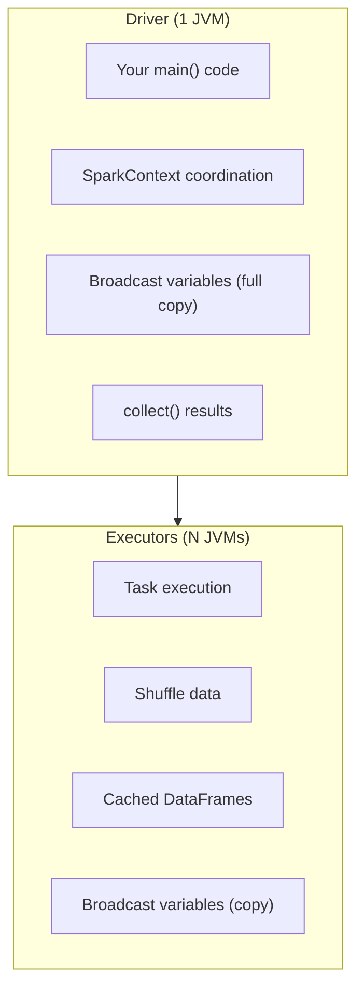

# PySpark Memory Management — Fundamentals

## Why Memory Matters in Spark

Spark processes data in memory for speed. When memory runs out, jobs either crash (OOM) or spill to disk (10-100x slower). Understanding memory layout helps you size clusters correctly and avoid failures.

> **Key Insight:** Most Spark OOM errors come from three causes: (1) collecting too much data to the driver, (2) broadcasting tables that don't fit in executor memory, (3) groupBy/join creating partitions too large for available execution memory.

---

## Driver vs Executor Memory



| Component | What It Does | OOM Risk |
|-----------|-------------|----------|
| **Driver** | Coordinates the job, holds `collect()` results | `collect()` on large data, large broadcast |
| **Executor** | Runs tasks (joins, aggregations, transforms) | Large partitions, big joins, caching |

```python
# Driver memory (default 1g — increase for large broadcasts/collects)
spark.conf.set("spark.driver.memory", "4g")

# Executor memory (default 1g — increase for heavy computation)
spark.conf.set("spark.executor.memory", "8g")

# Executor overhead (off-heap: Python processes, internal buffers)
spark.conf.set("spark.executor.memoryOverhead", "2g")
```

---

## Executor Memory Layout

Each executor's JVM heap is divided into regions:

```
Total Executor Memory: 8 GB (spark.executor.memory)
├── Reserved: 300 MB (Spark internal)
├── User Memory (40%): 3.08 GB
│   └── Your data structures, UDF variables, RDD storage
└── Spark Memory (60%): 4.62 GB (spark.memory.fraction = 0.6)
    ├── Execution Memory (50% of Spark): 2.31 GB
    │   └── Shuffles, joins, sorts, aggregations
    └── Storage Memory (50% of Spark): 2.31 GB
        └── Cached DataFrames, broadcast variables

Plus Off-Heap: 2 GB (spark.executor.memoryOverhead)
└── Python workers (PySpark UDFs), network buffers, OS overhead
```

**The dynamic boundary:** Execution and Storage memory can borrow from each other. If Storage is mostly empty and Execution needs more → Execution borrows. If Execution is idle and Storage needs caching → Storage borrows.

---

## Common OOM Scenarios and Fixes

### 1. Driver OOM: `collect()` on Large Data

```python
# BAD: Pulls entire DataFrame to driver memory
all_data = df.collect()  # 50 GB → driver has 4 GB → OOM!

# FIX: Never collect large DataFrames
# Option A: Use show/take for sampling
df.show(20)
sample = df.take(100)

# Option B: Write to storage instead of collecting
df.write.parquet("s3://output/")

# Option C: Use toPandas only on pre-aggregated small results
summary = df.groupBy("region").count()  # Small result (few regions)
pdf = summary.toPandas()  # Safe — only a few rows
```

### 2. Executor OOM: Large Partitions

```python
# BAD: One partition has 10 GB, executor has 8 GB
df.groupBy("skewed_key").agg(collect_list("events"))  # OOM if one group is huge

# FIX: Increase partitions (smaller per-partition data)
spark.conf.set("spark.sql.shuffle.partitions", "1000")  # Was 200

# FIX: Increase executor memory
spark.conf.set("spark.executor.memory", "16g")

# FIX: Cap unbounded collections
from pyspark.sql.window import Window
from pyspark.sql.functions import row_number
w = Window.partitionBy("skewed_key").orderBy("timestamp")
df_limited = df.withColumn("rn", row_number().over(w)).filter("rn <= 1000")
```

### 3. Executor OOM: Broadcast Too Large

```python
# BAD: Broadcasting a 5 GB table to executors with 8 GB memory
result = large_df.join(broadcast(huge_dim), "key")  # OOM!

# FIX: Don't broadcast large tables
# Remove broadcast() hint — let Spark use sort-merge join instead
result = large_df.join(huge_dim, "key")

# FIX: Or increase executor memory to fit the broadcast
spark.conf.set("spark.executor.memory", "16g")
```

---

## Key Configuration Parameters

| Parameter | Default | Purpose | When to Change |
|-----------|---------|---------|---------------|
| `spark.executor.memory` | 1g | JVM heap per executor | Always set for production (4-16g typical) |
| `spark.executor.memoryOverhead` | 384m or 10% | Off-heap memory | Increase for PySpark UDFs (2-4g) |
| `spark.driver.memory` | 1g | Driver JVM heap | Increase if using collect/broadcast |
| `spark.memory.fraction` | 0.6 | % of heap for Spark (exec+storage) | Increase to 0.8 for memory-intensive joins |
| `spark.memory.storageFraction` | 0.5 | Initial split between exec/storage | Usually keep default (dynamic boundary) |
| `spark.sql.shuffle.partitions` | 200 | Partitions after shuffle | Set based on data size (target 128 MB each) |

---

## Quick Sizing Guide

```
Rule of thumb:
- Memory per executor: 4-6 GB per core
- Cores per executor: 4-5 (avoid GC issues with too many cores)
- Partition target: 128 MB per partition

Example: Process 500 GB of data
- Partitions needed: 500 GB / 128 MB = ~4000
- With 5 cores/executor and 3 waves of tasks: 4000 / (5 × 3) = ~267 executors
- Memory: 5 cores × 5 GB/core = 25 GB per executor
- Config: --num-executors 270 --executor-cores 5 --executor-memory 25g
```

---

## Diagnosing Memory Issues in Spark UI

| Location | What to Check | Red Flag |
|----------|--------------|----------|
| Executors tab | Peak memory per executor | Near or at executor.memory limit |
| Stages tab | Shuffle spill (memory + disk) | Any spill > 0 |
| Stages tab | Task duration distribution | One task 10x+ longer (skew → memory pressure) |
| Executors tab | GC time | > 10% of total task time |
| Driver logs | "OutOfMemoryError" | Immediate: increase memory or fix code |

---

## Interview Tips

> **Tip 1:** "What causes OOM in Spark?" — "Three main causes: (1) Driver OOM from collect() or large broadcast. Fix: don't collect, write to storage. (2) Executor OOM from oversized partitions during join/groupBy. Fix: increase partitions or executor memory. (3) Executor OOM from broadcast that exceeds memory. Fix: remove broadcast hint, use sort-merge instead."

> **Tip 2:** "How do you size executor memory?" — "Rule of thumb: 4-6 GB per core. With 5 cores per executor: 25-30 GB. Then add 10-20% overhead for off-heap (memoryOverhead). For memory-intensive workloads (large joins, collect_list): increase to 8 GB per core. Always check Spark UI for spill — any spill means you need more memory or smaller partitions."

> **Tip 3:** "What's the difference between execution and storage memory?" — "Execution memory handles active computation (shuffles, joins, sorts). Storage memory holds cached DataFrames and broadcast variables. They share a pool with a dynamic boundary — execution can borrow from storage (and evict cached data) when it needs more, making the system flexible without manual tuning."
