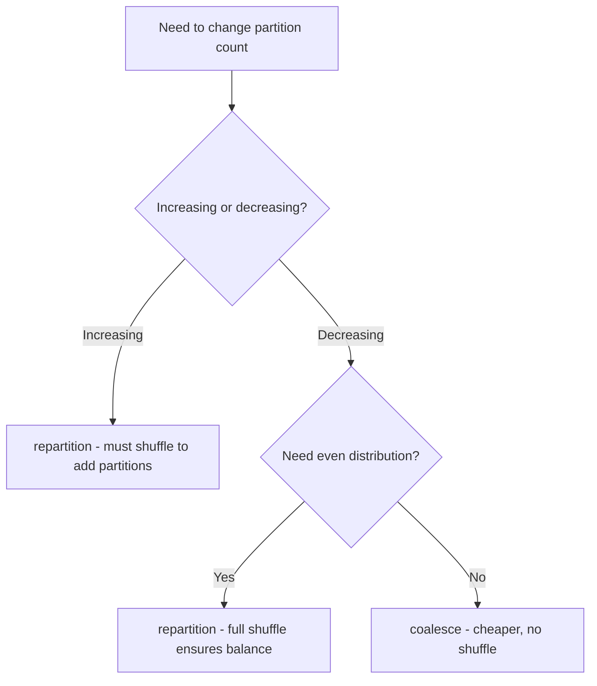

# PySpark Partitioning and Bucketing — Fundamentals


## 🎯 Analogy

Think of partitioning like filing documents into folders by year — when you need 2023 docs, you open only that folder. Bucketing is pre-sorting files within each folder by last name so merges are instant.

---
## Two Types of Partitioning

"Partitioning" in Spark refers to two different concepts that often confuse beginners:

| Concept | What It Means | When It Applies |
|---------|--------------|-----------------|
| **Spark partitions** | How data is split in memory across tasks | During processing (in-memory) |
| **Hive/storage partitions** | How data is organized in folders on disk | When writing/reading from storage |

---

## Spark Partitions (In-Memory)

Spark partitions determine parallelism — each partition is processed by exactly one task:

```python
from pyspark.sql import SparkSession, functions as F

spark = SparkSession.builder.appName("Partitioning").getOrCreate()

# Check current partition count
df = spark.read.parquet("s3://data/events/")
print(f"Partitions: {df.rdd.getNumPartitions()}")  # e.g., 200

# Default number of shuffle partitions
print(spark.conf.get("spark.sql.shuffle.partitions"))  # Default: 200
```

### repartition — Full Shuffle Redistribution

```python
# Increase partitions (needs shuffle)
df_repartitioned = df.repartition(500)

# Repartition by column (hash partitioning)
# All rows with same user_id go to same partition
df_by_user = df.repartition(100, "user_id")

# Repartition by multiple columns
df_by_region_date = df.repartition(200, "region", "event_date")
```

### coalesce — Reduce Partitions Without Shuffle

```python
# Decrease partitions (NO shuffle — cheaper)
df_coalesced = df.coalesce(10)

# Common pattern: reduce before writing to avoid small files
(df
    .filter(F.col("status") == "active")  # Might leave empty partitions
    .coalesce(50)                          # Consolidate to 50 files
    .write.parquet("s3://output/active/"))
```

### When to Use Which



---

## Storage Partitions (partitionBy on Write)

Storage partitioning organizes data into folders, enabling **partition pruning** on reads:

```python
# Write with storage partitioning
(df.write
    .partitionBy("year", "month")
    .mode("overwrite")
    .parquet("s3://data/events_partitioned/"))

# Resulting directory structure:
# s3://data/events_partitioned/
#   year=2024/
#     month=1/
#       part-00000.parquet
#       part-00001.parquet
#     month=2/
#       part-00000.parquet
#   year=2023/
#     month=12/
#       part-00000.parquet
```

### Partition Pruning on Read

```python
# When you filter on a partition column, Spark only reads matching directories
df = spark.read.parquet("s3://data/events_partitioned/")

# This only reads the year=2024/month=1/ directory!
jan_2024 = df.filter((F.col("year") == 2024) & (F.col("month") == 1))

# Verify with explain
jan_2024.explain()
# FileScan parquet [...] Partition Filters: [year = 2024, month = 1]
```

---

## Default Partition Count

```python
# shuffle.partitions — affects ALL shuffle operations
spark.conf.set("spark.sql.shuffle.partitions", "200")  # Default

# When reading files, Spark creates partitions based on:
# 1. Number of files
# 2. File sizes (splits large files)
# 3. spark.sql.files.maxPartitionBytes (default 128MB)

spark.conf.get("spark.sql.files.maxPartitionBytes")  # 134217728 (128MB)

# So a 10GB dataset creates roughly: 10GB / 128MB ≈ 80 partitions on read
```

---

## Choosing Partition Columns for Storage

```python
# GOOD partition columns:
# - Low cardinality (date, region, status)
# - Frequently filtered in queries
# - Evenly distributed

# BAD partition columns:
# - High cardinality (user_id, order_id) — creates millions of tiny folders!
# - Skewed (90% of data in one value)
# - Never used in query filters

# Example: Partition by date (good) vs user_id (bad)
# Date: 365 partitions/year, each with millions of records — good!
(df.write.partitionBy("event_date").parquet("s3://data/events/"))

# User ID: millions of partitions, each with 1-2 records — terrible!
# (df.write.partitionBy("user_id").parquet("s3://data/events/"))  # DON'T DO THIS
```

---

## Practical Examples

### Optimize a Write Pipeline

```python
# Scenario: Process events and write optimized output
raw_events = spark.read.json("s3://raw/events/2024-01-15/")

processed = (raw_events
    .filter(F.col("event_type").isNotNull())
    .withColumn("event_date", F.to_date("timestamp"))
    .withColumn("event_hour", F.hour("timestamp"))
)

# Good write strategy:
# 1. Partition by date (for query performance)
# 2. Coalesce within partitions (avoid small files)
(processed
    .repartition("event_date")  # Group by partition column
    .coalesce(10)               # 10 files per partition
    .write
    .partitionBy("event_date")
    .mode("append")
    .parquet("s3://processed/events/"))
```

### Read with Partition Pruning

```python
# Only reads data for specified dates
recent = (spark.read
    .parquet("s3://processed/events/")
    .filter(F.col("event_date") >= "2024-01-01"))

# Spark UI shows: only 15 partitions read (Jan 1-15) vs 365 total
```

---

## Common Mistakes

```python
# Mistake 1: Too many partitions → small files
df.repartition(10000).write.parquet(path)  # 10,000 tiny files!

# Mistake 2: Too few partitions → large files, low parallelism
df.coalesce(1).write.parquet(path)  # 1 huge file, slow reads

# Mistake 3: Coalesce after filter without checking
big_df.filter(F.col("country") == "LI")  # Liechtenstein: 100 rows
      .write.parquet(path)  # Still 200 partitions = 200 nearly-empty files!
# Fix: .coalesce(1) before write for tiny results

# Mistake 4: Repartition by high-cardinality column for write
df.repartition("user_id").write.partitionBy("user_id").parquet(path)
# Creates millions of directories with 1 file each!
```

---

## Quick Reference

| Operation | Shuffle? | Use Case |
|-----------|----------|----------|
| `repartition(n)` | Yes | Even distribution, increase partitions |
| `repartition(n, col)` | Yes | Co-locate data by column |
| `coalesce(n)` | No | Reduce partition count before write |
| `write.partitionBy(col)` | N/A | Organize output by column for fast reads |

---


## ▶️ Try It Yourself

```python
from pyspark.sql import SparkSession
spark = SparkSession.builder.master("local[*]").appName("partition").getOrCreate()
data = [("2023","US",100),("2023","EU",200),("2024","US",150)]
df = spark.createDataFrame(data, ["year","region","revenue"])
# Write partitioned by year — each year gets its own directory
df.write.partitionBy("year").mode("overwrite").parquet("/tmp/revenue_partitioned")
# Read only 2023 — Spark skips 2024 folder entirely (partition pruning)
spark.read.parquet("/tmp/revenue_partitioned/year=2023").show()
```

> **Run it:** Copy the snippet into a REPL or file and run it — no external services needed for the basic example.

---
## Interview Tips

> **Tip 1:** "What's the difference between Spark partitions and Hive partitions?" — "Spark partitions are the in-memory parallelism units — each partition is processed by one task. Hive/storage partitions are the directory structure on disk, organized by column values (like year=2024/month=1/). They're orthogonal: you can have 200 Spark partitions reading from 12 Hive partitions, or 50 Spark partitions writing to 365 Hive partitions."

> **Tip 2:** "When do you use repartition vs coalesce?" — "coalesce only decreases partition count without a shuffle — it's cheaper but can create uneven partitions. repartition does a full shuffle and can increase or decrease with even distribution. Use coalesce before writing to reduce small files. Use repartition when you need even distribution or when increasing partition count for more parallelism."

> **Tip 3:** "How do you choose partition columns for storage?" — "Pick columns that are: (1) frequently in WHERE clauses, (2) low cardinality (tens to hundreds of values, not millions), and (3) evenly distributed. Date is the classic choice for time-series data. Never partition by high-cardinality columns like user_id — you'd get millions of directories with one tiny file each."
