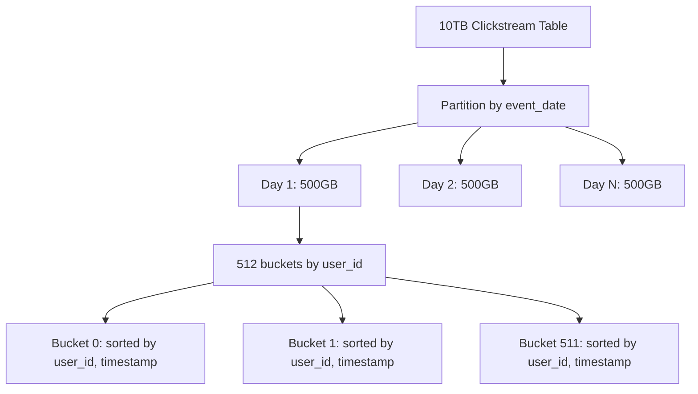

# PySpark Partitioning and Bucketing — Interview Scenarios

## Junior Scenario: Why Coalesce Before Write

**Question:** "Your pipeline filters a 100GB dataset down to 500MB of results, then writes to Parquet. The output directory has 200 files averaging 2.5MB each. What's wrong and how do you fix it?"

### The Problem

```python
from pyspark.sql import SparkSession, functions as F

spark = SparkSession.builder.getOrCreate()

# 100GB input → 200 partitions (Spark default)
raw_df = spark.read.parquet("s3://data/full_dataset/")  # 200 partitions, 100GB
print(f"Input partitions: {raw_df.rdd.getNumPartitions()}")  # 200

# Filter reduces data dramatically
filtered = raw_df.filter(F.col("country") == "LI")  # Liechtenstein: tiny country
print(f"Output rows: {filtered.count()}")  # ~50,000 rows, ~500MB

# Writing WITHOUT coalesce
filtered.write.parquet("s3://output/li_data/")
# Result: 200 Parquet files, most nearly empty (~2.5MB average)
# Many files are < 1MB — terrible for read performance!
```

### The Fix

```python
# Solution: Coalesce before writing
# Target: 500MB / 128MB target = ~4 files
filtered.coalesce(4).write.parquet("s3://output/li_data/")
# Result: 4 files of ~125MB each — optimal!

# Alternative: Use repartition if you also want data sorted
(filtered
    .repartition(4)
    .sortWithinPartitions("timestamp")
    .write.parquet("s3://output/li_data/"))
```

### Why Small Files Are Bad

| Problem | Impact |
|---------|--------|
| Excessive S3 LIST calls | Slow metadata operations |
| High driver overhead | Driver tracks each file's metadata |
| Poor compression | Less data per file = worse compression ratios |
| Slow downstream reads | Each file open = network round-trip |
| Wasteful parallelism | 200 tasks to read 500MB = overhead dominates |

**Expected Answer Points:**
- Filter reduces data but preserves partition count
- After filter, most partitions are empty or nearly empty
- Use `coalesce(N)` where N = total_output_size / target_file_size
- coalesce is preferred over repartition here (no shuffle needed, just reducing)
- Target file sizes: 128MB-512MB for Parquet
- Mention maxRecordsPerFile as an alternative guardrail

---

## Mid-Level Scenario: Choose Partition Count

**Question:** "Your Spark job processes 50GB of data on a cluster with 20 executors, each with 4 cores and 16GB memory. You see that some tasks take 30 seconds and others take 10 minutes. Current partition count is 200. What partition count would you recommend and why?"

### Diagnosis

```python
# Current state:
# - 50GB data, 200 partitions → 250MB per partition average
# - 20 executors × 4 cores = 80 cores
# - Task times: 30sec to 10min → 20x skew!

# Problem analysis:
# 1. 200 partitions with 80 cores = 2.5 waves (200/80)
#    - Each wave must wait for the slowest task
#    - A 10-min straggler holds up the entire wave

# 2. The skew suggests uneven data distribution
#    - Some partitions have much more data than others
#    - Likely caused by hash collision or skewed join key
```

### Solution

```python
# Step 1: Diagnose the skew
partition_sizes = (df.rdd
    .mapPartitions(lambda it: [sum(1 for _ in it)])
    .collect())

import statistics
print(f"Min: {min(partition_sizes)}, Max: {max(partition_sizes)}")
print(f"Mean: {statistics.mean(partition_sizes):.0f}")
print(f"Median: {statistics.median(partition_sizes):.0f}")
print(f"Stdev: {statistics.stdev(partition_sizes):.0f}")
# Example output: Min: 10K, Max: 5M, Mean: 250K, Median: 100K
# Confirms skew: max is 20x the mean

# Step 2: Choose better partition count
# Target: 128MB per partition, more partitions to reduce skew impact
optimal_partitions = max(
    80 * 3,      # At least 3x cores for load balancing (240)
    50 * 1024 // 128  # 50GB / 128MB target (400)
)
print(f"Recommended: {optimal_partitions} partitions")  # 400

# Step 3: Fix the skew source
# If skew is from a join key:
df_fixed = df.repartition(400, "join_key")  # Redistribute

# If skew is from a few hot keys (data skew):
# Option A: Salt the hot keys
df_salted = df.withColumn("salted_key",
    F.concat(F.col("key"), F.lit("_"), (F.rand() * 10).cast("int").cast("string")))
df_repartitioned = df_salted.repartition(400, "salted_key")

# Option B: Use AQE (Spark 3.0+)
spark.conf.set("spark.sql.adaptive.enabled", "true")
spark.conf.set("spark.sql.adaptive.skewJoin.enabled", "true")
spark.conf.set("spark.sql.adaptive.skewJoin.skewedPartitionThresholdInBytes", "256m")

# Step 4: Verify improvement
spark.conf.set("spark.sql.shuffle.partitions", "400")
```

### Recommendation Summary

| Factor | Current | Recommended | Why |
|--------|---------|-------------|-----|
| Partition count | 200 | 400 | More granular = less skew impact |
| Per-partition size | 250MB (skewed to 1GB+) | 128MB (even) | Faster tasks, less memory pressure |
| Parallelism waves | 2.5 | 5 | More even work distribution |
| Max task time | 10 min | ~2 min | Reduced by spreading hot keys |

**Expected Answer Points:**
- Identify the 20x skew as the core issue
- Increasing partitions helps but doesn't fix root cause (skewed keys)
- AQE skew join handling is the best automatic fix (Spark 3.0+)
- Salting is the manual fix for persistent skew
- Formula: partitions = max(3× cores, data_size / target_partition_size)
- Enable AQE with skew detection for ongoing protection

---

## Senior Scenario: Design Partitioning Strategy for 10TB Table

**Question:** "You're designing the storage layout for a 10TB clickstream analytics table. It receives 500GB daily, is queried by date range (90% of queries), by user_id (50% of queries include this), and joined with a 200GB user profile table. Design the partitioning, bucketing, and file organization strategy."

### Solution

```python
# Requirements:
# - 10TB table growing 500GB/day
# - 90% queries filter by date range
# - 50% queries also filter/group by user_id
# - Frequent join with 200GB user_profiles on user_id
# - Must support both ad-hoc analytics AND scheduled ETL joins

# Design Decision 1: Storage Partition by date
# Rationale: 90% queries filter by date, low cardinality (~365 values/year)
# Each day: ~500GB / 365 files = 1.4GB per file (too big, need more)

# Design Decision 2: Bucket by user_id
# Rationale: 50% queries group by user_id, frequent join on user_id
# Bucketing eliminates shuffle for user_id joins

# Design Decision 3: Target file size 256MB
# Rationale: Good balance for Parquet on S3
# 500GB per day / 256MB per file = ~2000 files per daily partition

BUCKET_COUNT = 512  # Power of 2, gives ~1GB per bucket per day

# Implementation
def write_daily_clickstream(daily_df, event_date):
    """Write one day's clickstream data with optimal layout."""
    
    (daily_df
        .write
        .format("parquet")
        .partitionBy("event_date")          # Storage partition by date
        .bucketBy(BUCKET_COUNT, "user_id")  # Bucket by join key
        .sortBy("user_id", "event_timestamp") # Sort for scan efficiency
        .mode("append")
        .option("maxRecordsPerFile", 5000000)  # Cap at 5M rows per file
        .saveAsTable("clickstream_optimized"))

# Matching layout for user profiles (same bucket count!)
(user_profiles_df
    .write
    .format("parquet")
    .bucketBy(BUCKET_COUNT, "user_id")
    .sortBy("user_id")
    .mode("overwrite")
    .saveAsTable("user_profiles_bucketed"))

# Query patterns and their benefits:

# Query 1: Date range filter (90% of queries)
# → Partition pruning: reads only relevant date directories
spark.sql("""
    SELECT event_type, COUNT(*)
    FROM clickstream_optimized
    WHERE event_date BETWEEN '2024-01-01' AND '2024-01-07'
    GROUP BY event_type
""")
# Reads 7 days × 500GB = 3.5TB instead of full 10TB (65% savings)

# Query 2: Date + user_id filter
# → Partition pruning + bucket pruning
spark.sql("""
    SELECT * FROM clickstream_optimized
    WHERE event_date = '2024-01-15' AND user_id = 'u123'
""")
# Reads 1 bucket out of 512 in 1 day = ~1GB instead of 500GB

# Query 3: Join with user profiles
# → Zero-shuffle bucket join
clicks = spark.table("clickstream_optimized")
profiles = spark.table("user_profiles_bucketed")
result = clicks.join(profiles, "user_id")
# No Exchange nodes — both bucketed on user_id with 512 buckets!
```

### Architecture Diagram



### Design Decisions Explained

| Decision | Choice | Alternative | Why This |
|----------|--------|-------------|----------|
| Storage partition | event_date | event_hour | Day granularity matches query patterns |
| Bucket column | user_id | session_id | 50% of queries use user_id, join column |
| Bucket count | 512 | 256 or 1024 | 500GB/512 = ~1GB per bucket (good for 256MB files) |
| Sort within bucket | user_id, timestamp | timestamp only | Optimizes both scans and joins |
| File format | Parquet | ORC or Delta | Team standard, good compression, predicate pushdown |

**Expected Answer Points:**
- Partition by date (low cardinality, matches 90% of queries)
- Bucket by user_id (eliminates shuffle for joins, supports 50% of queries)
- Same bucket count between fact and dimension for zero-shuffle joins
- Sort within buckets for scan efficiency and better compression
- File size control with maxRecordsPerFile
- Consider Delta Lake for ACID transactions and automatic compaction
- Mention ongoing maintenance: daily compaction, partition lifecycle (drop old partitions)

---

## Interview Tips

> **Tip 1:** "For coalesce questions, always calculate the target." — "Count the output size, divide by target file size (128-256MB for Parquet). If your filter reduces 100GB to 500MB, that's 500/128 ≈ 4 files. Use coalesce(4) not repartition — coalesce avoids a shuffle when reducing. Mention that coalesce can create uneven partitions if the reduction is extreme."

> **Tip 2:** "For partition count questions, show the calculation." — "Formula: max(cores × 3, data_size_gb × 1024 / target_mb). Then diagnose why tasks are uneven — check partition sizes with glom().map(len). If skew is the issue, increasing partitions alone won't fix it. Address the root cause: AQE skew handling, key salting, or repartitioning by a less-skewed column."

> **Tip 3:** "For design questions, start with query patterns." — "The #1 input to partitioning strategy is how the data will be queried. Partition by the most common filter column (usually date). Bucket by the most common join/group key. Size everything based on daily volume and target file sizes. Show you think about the full lifecycle: initial write, incremental loads, compaction, and eventual data retirement."
