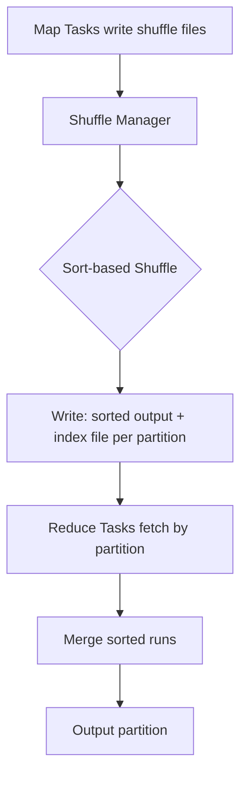

# PySpark Partitioning and Bucketing — Senior Deep Dive

## Optimal Partition Count Formula

The right partition count balances parallelism, overhead, and resource utilization:

```python
# Rule of thumb formulas:
# Partitions for processing = 2-4× total cores available
# Partitions for writing = total_data_size / target_file_size

# Example: 100 executors × 4 cores = 400 cores
# Processing partitions: 800 - 1600 (2-4× cores)
# Write partitions for 500GB data, targeting 256MB files: 500GB / 256MB ≈ 2000

def calculate_optimal_partitions(data_size_gb, num_cores, target_file_mb=256):
    """Calculate optimal partition count for different phases."""
    
    # Processing phase: balance parallelism vs overhead
    min_partitions = num_cores * 2
    max_partitions = num_cores * 4
    
    # Size-based: aim for 128-256MB per partition
    size_based = int(data_size_gb * 1024 / target_file_mb)
    
    # Final: bounded by core count range
    processing_partitions = max(min_partitions, min(max_partitions, size_based))
    
    # Write phase: target output file size
    write_partitions = int(data_size_gb * 1024 / target_file_mb)
    
    return {
        "processing": processing_partitions,
        "write": write_partitions,
        "per_partition_mb": data_size_gb * 1024 / processing_partitions,
    }

# 500GB data on 400-core cluster
result = calculate_optimal_partitions(500, 400)
print(result)
# {'processing': 1600, 'write': 2000, 'per_partition_mb': 320.0}
```

### Anti-Patterns in Partition Count

| Symptom | Cause | Fix |
|---------|-------|-----|
| Tasks take too long (>30 min) | Too few partitions | Increase partition count |
| Job has high task launch overhead | Too many partitions (>10K) | Reduce to 2-4× cores |
| OOM on executor | Partition too large | Increase count or memory |
| Uneven task times (some 10×) | Skewed partitions | Repartition by different key or salt |
| Many small output files | Partition count too high for write | Coalesce before write |

---

## Shuffle Partition Tuning

```python
# Default shuffle partitions: 200 (often wrong)
spark.conf.get("spark.sql.shuffle.partitions")  # "200"

# For a 10GB dataset with 100 cores:
# 200 partitions = 50MB per partition (too many for 10GB, not enough for 1TB)
# Better: size-based calculation

# AQE auto-coalesces (Spark 3.0+) — best approach
spark.conf.set("spark.sql.adaptive.enabled", "true")
spark.conf.set("spark.sql.adaptive.coalescePartitions.enabled", "true")
spark.conf.set("spark.sql.adaptive.coalescePartitions.initialPartitionNum", "2000")
spark.conf.set("spark.sql.adaptive.advisoryPartitionSizeInBytes", "256m")

# With AQE: start with many partitions (2000), let Spark coalesce small ones
# This handles varying data sizes without manual tuning

# Without AQE: manual tuning
def tune_shuffle_partitions(data_size_gb, target_partition_mb=256):
    """Set shuffle partitions based on data size."""
    optimal = max(1, int(data_size_gb * 1024 / target_partition_mb))
    spark.conf.set("spark.sql.shuffle.partitions", str(optimal))
    return optimal
```

---

## File Size Control

### The Small Files Problem

```python
# Problem: Writing with too many partitions creates tiny files
# 1GB data / 200 partitions / 30 date partitions = 167KB per file!
# S3 performance degrades with millions of small files

# Solution 1: Explicit coalesce before write
def write_with_target_size(df, path, partition_cols, target_file_mb=256):
    """Write with controlled file sizes."""
    # Estimate data size
    row_count = df.count()
    sample_size = df.limit(1000).toPandas().memory_usage(deep=True).sum()
    estimated_size_mb = (sample_size / 1000) * row_count / 1024 / 1024
    
    # Calculate files needed
    target_files = max(1, int(estimated_size_mb / target_file_mb))
    
    if partition_cols:
        # Files per partition
        num_partitions = df.select(partition_cols).distinct().count()
        files_per_partition = max(1, target_files // num_partitions)
        
        (df
            .repartition(target_files, *partition_cols)
            .write
            .partitionBy(*partition_cols)
            .mode("overwrite")
            .parquet(path))
    else:
        (df
            .coalesce(target_files)
            .write
            .mode("overwrite")
            .parquet(path))
    
    print(f"Wrote ~{target_files} files (target: {target_file_mb}MB each)")

# Solution 2: maxRecordsPerFile (Spark 2.2+)
(df.write
    .option("maxRecordsPerFile", 1000000)  # Max 1M records per file
    .partitionBy("event_date")
    .parquet(path))

# Solution 3: Delta Lake auto-optimize
(df.write
    .format("delta")
    .option("optimizeWrite", "true")       # Auto-coalesce small files
    .option("autoCompact", "true")         # Compact after write
    .partitionBy("event_date")
    .save(path))
```

### Target File Sizes by Format

| Format | Target File Size | Why |
|--------|-----------------|-----|
| Parquet | 128MB - 1GB | Balances read parallelism with metadata overhead |
| ORC | 128MB - 512MB | Similar to Parquet |
| Delta Lake | 128MB - 1GB | Optimized by OPTIMIZE command |
| CSV/JSON | Avoid at scale | No columnar pushdown |

---

## Data Locality and Partition Placement

```python
# Data locality levels (best to worst):
# PROCESS_LOCAL: data in same JVM (cached)
# NODE_LOCAL: data on same machine (local disk)
# RACK_LOCAL: data on same network rack
# ANY: data anywhere in cluster

# Check locality in Spark UI → Stages → Task metrics
# "Locality Level" column shows where each task's data came from

# Improve locality for HDFS reads:
spark.conf.set("spark.locality.wait", "3s")       # Wait for local data
spark.conf.set("spark.locality.wait.node", "3s")  # Wait for same-node data
spark.conf.set("spark.locality.wait.rack", "3s")  # Wait for same-rack data

# For cloud storage (S3/GCS/ADLS): locality doesn't apply
# All reads are network — partitioning for parallelism, not locality
```

---

## Advanced Partition Strategies

### Salting for Skew Mitigation

```python
import random

# Problem: Join skew — popular keys cause hot partitions
# "user_0" has 10M rows, other users have 100 rows each

SALT_BUCKETS = 10

# Salt the skewed side
salted_events = (events_df
    .withColumn("salt", (F.rand() * SALT_BUCKETS).cast("int"))
    .withColumn("salted_key", F.concat(F.col("user_id"), F.lit("_"), F.col("salt")))
)

# Explode the small side to match all salt values
from pyspark.sql.types import ArrayType, IntegerType

salt_array = F.array([F.lit(i) for i in range(SALT_BUCKETS)])
exploded_dim = (dim_df
    .withColumn("salt", F.explode(salt_array))
    .withColumn("salted_key", F.concat(F.col("user_id"), F.lit("_"), F.col("salt")))
)

# Join on salted key — skew distributed across 10 partitions per hot key
result = salted_events.join(F.broadcast(exploded_dim) if dim_df.count() < 100000 
                           else exploded_dim, "salted_key")
```

### Adaptive Partition Management

```python
# Pattern: Adjust partitions based on data characteristics
def adaptive_partitioning(df, target_partition_mb=256):
    """Dynamically choose partition count based on actual data size."""
    
    # Sample to estimate size
    sample_rows = df.limit(10000)
    sample_bytes = sample_rows.toPandas().memory_usage(deep=True).sum()
    bytes_per_row = sample_bytes / 10000
    
    total_rows = df.count()
    estimated_size_mb = (bytes_per_row * total_rows) / 1024 / 1024
    
    optimal_partitions = max(1, int(estimated_size_mb / target_partition_mb))
    
    print(f"Data estimate: {estimated_size_mb:.0f}MB, using {optimal_partitions} partitions")
    
    if optimal_partitions < df.rdd.getNumPartitions():
        return df.coalesce(optimal_partitions)
    else:
        return df.repartition(optimal_partitions)
```

---

## Shuffle Architecture Deep Dive



```python
# Shuffle tuning parameters
spark.conf.set("spark.shuffle.file.buffer", "64k")         # Shuffle write buffer
spark.conf.set("spark.reducer.maxSizeInFlight", "96m")     # Shuffle read buffer
spark.conf.set("spark.shuffle.sort.bypassMergeThreshold", "200")  # Bypass sort for small reduces
spark.conf.set("spark.shuffle.compress", "true")           # Compress shuffle data
spark.conf.set("spark.shuffle.spill.compress", "true")     # Compress spill files

# External shuffle service (for dynamic allocation)
spark.conf.set("spark.shuffle.service.enabled", "true")
# Allows executors to be released while their shuffle data is still needed
```

---

## Interview Tips

> **Tip 1:** "How do you determine optimal partition count?" — "Three considerations: For processing, target 128-256MB per partition and 2-4× your total core count. For writing, target output file sizes of 128MB-1GB (depends on format and read patterns). With AQE (Spark 3+), start high (e.g., 2000) and let Spark auto-coalesce — it's the best approach because it adapts to actual data sizes at runtime."

> **Tip 2:** "Explain the small files problem and how to fix it." — "Small files (< 10MB) cause poor performance because: (1) excessive metadata operations on the storage layer (S3 listing, HDFS NameNode), (2) high parallelism overhead (too many tasks for too little data), and (3) suboptimal compression. Fix with coalesce before write, maxRecordsPerFile option, Delta Lake auto-optimize, or a compaction job that rewrites small files into larger ones."

> **Tip 3:** "How does data locality work in Spark?" — "On HDFS, Spark prefers to schedule tasks where the data already lives — PROCESS_LOCAL (same JVM) is best, followed by NODE_LOCAL (same machine), RACK_LOCAL, then ANY. Spark waits up to spark.locality.wait seconds for local slots before accepting worse locality. On cloud storage (S3/GCS), there's no locality benefit since all reads go over the network regardless — there, partition count is purely about parallelism and file size."

## ⚡ Cheat Sheet

**Partition Count Rules**
- Target partition size: 128–256MB (Parquet compressed)
- Processing partitions: 2–4× total cores (for CPU utilization)
- `spark.sql.shuffle.partitions` default = 200; tune to data size (too high = too many small tasks)
- Post-shuffle: `advisoryPartitionSizeInBytes=64MB` with AQE to auto-coalesce

**Partitioning APIs**
```python
df.repartition(n)               # hash partition, causes shuffle, even distribution
df.repartition(n, "col")        # hash by column, used before joins
df.repartitionByRange(n, "col") # range partition, good for sorted writes/bucketed joins
df.coalesce(n)                  # reduce only, no shuffle (may create uneven partitions)
```

**Write-Time Partitioning**
```python
df.write.partitionBy("date", "region").parquet(path)
# Creates directory structure: date=2024-01-01/region=US/part-0000.parquet
# Rule: partition column cardinality × files per partition × file size = total files
# Too many partitions = small files problem; target 1-5 files per partition directory
```

**Bucketing**
- `bucketBy(N, "col")` — must use `saveAsTable()` (not `write.parquet()`)
- Bucket count N: choose power of 2, consistent across joining tables
- Benefits: eliminates shuffle on joins AND sorts on aggregations by the bucket key
- `spark.sql.sources.bucketing.enabled=true` (default) — disable only if debugging

**Small Files Problem**
| Cause | Symptom | Fix |
|-------|---------|-----|
| Over-partitioned writes | Millions of tiny files | Coalesce before write, use AQE coalesce |
| Streaming micro-batches | File accumulation | Delta OPTIMIZE on schedule |
| Too many `partitionBy` columns | Explosion of directories | Reduce to 1–2 partition columns |

**Interview Traps**
- `partitionBy("date")` at write time is for storage layout, NOT in-memory partitioning
- Changing `spark.sql.shuffle.partitions` mid-job has no effect on already-planned stages
- Bucket join requires exact same N buckets on BOTH sides — different bucket counts = shuffle happens anyway
