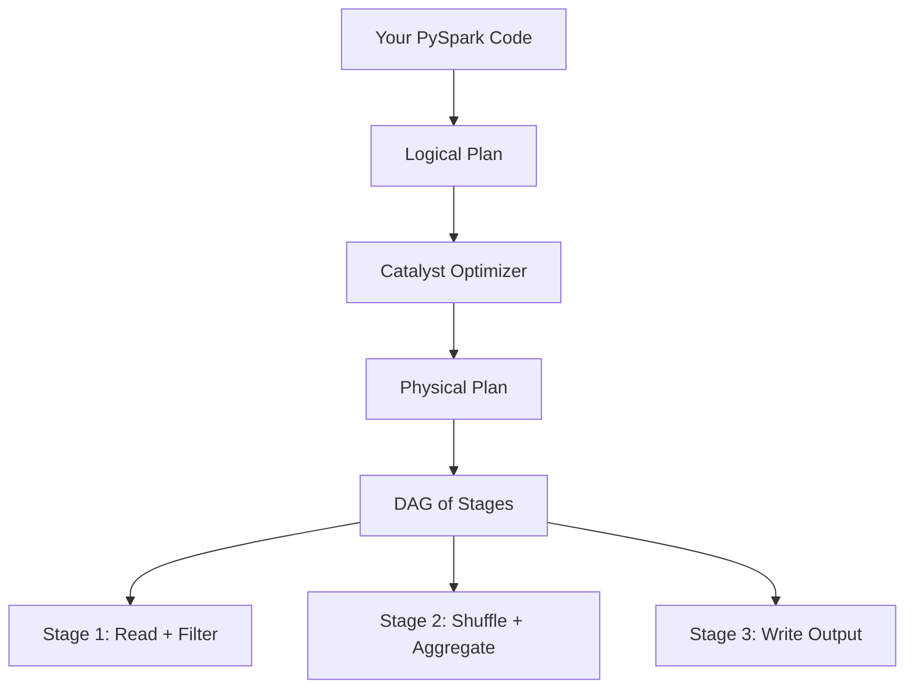

# PySpark Performance Tuning — Fundamentals


## 🎯 Analogy

Think of Spark performance tuning like optimizing a road trip. Partitioning is choosing the right number of lanes, caching is stopping at a rest stop to avoid backtracking, and avoiding shuffles is taking the highway instead of surface streets.

---
## Why Spark Jobs Are Slow

Spark jobs are slow for three main reasons:

1. **Too much data movement (shuffles)** — data transferred across the network between executors
2. **Data skew** — one executor gets 100x more data than others and becomes the bottleneck
3. **Inefficient resource usage** — too few/many partitions, wrong memory settings, unused cores

> **Key Insight:** 80% of Spark performance tuning is about reducing shuffles and balancing data across executors. The actual computation is usually fast — it's the data movement that kills you.

---

## How Spark Executes Your Code



**What this shows:**
- Your code becomes a Logical Plan (what you asked for)
- Catalyst optimizes it into a Physical Plan (how to do it efficiently)
- The physical plan is split into **Stages** at shuffle boundaries
- Each stage contains multiple **Tasks** that run in parallel across executors

**Key concept:** A **shuffle** is a stage boundary. Everything before a shuffle can run independently. The shuffle is where Spark redistributes data across the cluster.

---

## The Three Performance Killers

### 1. Shuffles (Data Movement)

Operations that cause shuffles:

| Operation | Why It Shuffles | Impact |
|-----------|----------------|--------|
| `groupBy().agg()` | Must put same keys on same executor | Network + disk I/O |
| `join()` | Must collocate matching keys | Network + disk I/O |
| `distinct()` | Must compare all rows | Network + disk I/O |
| `orderBy()` / `sort()` | Global sort needs data redistribution | Network + disk I/O |
| `repartition()` | Explicitly redistributes data | Network + disk I/O |

**How to see shuffles in your plan:**

```python
df.groupBy("department").agg(count("*")).explain()
# Look for "Exchange hashpartitioning(department, 200)" ← SHUFFLE
```

### 2. Data Skew (Unbalanced Partitions)

```
Normal distribution:     Skewed distribution:
Partition 1: 1M rows     Partition 1: 100M rows  ← BOTTLENECK
Partition 2: 1M rows     Partition 2: 500 rows
Partition 3: 1M rows     Partition 3: 500 rows
Partition 4: 1M rows     Partition 4: 500 rows
Total time: 10 sec       Total time: 1000 sec (limited by Partition 1)
```

> **Rule:** Spark job time = time of the SLOWEST task. One huge partition makes the entire job slow.

### 3. Too Many/Few Partitions

| Problem | Symptom | Fix |
|---------|---------|-----|
| Too few partitions | Tasks are huge, OOM errors, underutilized cores | `repartition(N)` to increase |
| Too many partitions | Scheduling overhead, tiny tasks, many small files | `coalesce(N)` to reduce |

**Rule of thumb:** Target 128 MB per partition.

```python
# Calculate optimal partition count
data_size_mb = 50000  # 50 GB
target_partition_size_mb = 128
optimal_partitions = data_size_mb // target_partition_size_mb  # ~390

df = df.repartition(400)
```

---

## Broadcast Joins — The #1 Quick Win

When joining a large table with a small table, **broadcast** the small table to avoid shuffling the large one:

```python
from pyspark.sql.functions import broadcast

# WITHOUT broadcast: shuffles BOTH tables (fact: 1B rows shuffled!)
result = fact_table.join(dim_table, "product_id")
# Plan: Exchange hashpartitioning on BOTH sides → expensive

# WITH broadcast: only sends small dim table (10K rows) to all executors
result = fact_table.join(broadcast(dim_table), "product_id")
# Plan: BroadcastHashJoin → no shuffle of fact table!
```

**When to broadcast:**
- Dimension/lookup table is small (< 100 MB, configurable)
- You're joining a large fact table to a small dimension
- The auto-broadcast threshold missed it (table stats not available)

```python
# Configure auto-broadcast threshold (default: 10 MB)
spark.conf.set("spark.sql.autoBroadcastJoinThreshold", "100MB")
```

> **Warning:** Don't broadcast large tables. If the broadcast table exceeds executor memory, you get OOM errors. Keep broadcasts under ~1 GB.

---

## Caching — When and How

Cache DataFrames that are reused multiple times:

```python
# GOOD: df is used twice → cache saves recomputing
df = spark.read.parquet("s3://data/events/").filter("date = '2024-01-15'")
df.cache()
df.count()  # Triggers caching

result_a = df.groupBy("user_id").count()
result_b = df.groupBy("event_type").count()
# Both read from cache (not from S3 again)

# DONE: unpersist to free memory
df.unpersist()
```

```python
# BAD: df is used only once → caching wastes memory
df = spark.read.parquet("s3://data/events/")
df.cache()  # Wastes memory!
result = df.groupBy("user_id").count()
result.write.parquet("s3://output/")
```

**Caching decision:**

| Used how many times? | Cache? |
|---------------------|--------|
| Once | NO — waste of memory |
| Twice or more | YES — saves recomputation |
| After expensive transform (join/agg) that feeds multiple downstream | YES |
| Raw read that's fast anyway | Usually NO |

---

## Partition Tuning

### spark.sql.shuffle.partitions

Controls how many partitions are created AFTER a shuffle (default: 200):

```python
# Default: 200 partitions after every shuffle
# Problem: if you have 500 GB of data, 200 partitions = 2.5 GB each (too large!)
# Problem: if you have 1 GB of data, 200 partitions = 5 MB each (too small!)

# For large data (>100 GB): increase
spark.conf.set("spark.sql.shuffle.partitions", "800")

# For small data (<10 GB): decrease
spark.conf.set("spark.sql.shuffle.partitions", "20")

# Best: use Adaptive Query Execution (auto-adjusts)
spark.conf.set("spark.sql.adaptive.enabled", "true")
spark.conf.set("spark.sql.adaptive.coalescePartitions.enabled", "true")
```

### repartition() vs coalesce()

| Method | What It Does | Shuffle? | When to Use |
|--------|-------------|----------|-------------|
| `repartition(N)` | Redistribute evenly into N partitions | YES | Increase partitions, rebalance skew |
| `repartition(N, "col")` | Redistribute by column hash | YES | Pre-partition for downstream join |
| `coalesce(N)` | Merge partitions (reduce only) | NO | Reduce partitions before writing |

```python
# BEFORE write: reduce partitions to get reasonable file sizes
df.coalesce(10).write.parquet("s3://output/")  # 10 output files (~500 MB each)

# Don't use coalesce to INCREASE partitions (it can't, use repartition)
```

---

## Column Pruning and Predicate Pushdown

### Select Only Needed Columns

```python
# BAD: reads ALL 50 columns from Parquet
df = spark.read.parquet("s3://data/wide_table/")
result = df.groupBy("department").agg(sum("salary"))
# Spark may still read all 50 columns depending on plan

# GOOD: explicitly select early → reads only 2 columns from Parquet
df = spark.read.parquet("s3://data/wide_table/") \
    .select("department", "salary")
result = df.groupBy("department").agg(sum("salary"))
# Columnar format (Parquet): only reads 2 column files, skips 48 others
```

### Filter Early (Predicate Pushdown)

```python
# GOOD: filter BEFORE join → reduces data volume before shuffle
filtered_events = events.filter("event_date = '2024-01-15'")
result = filtered_events.join(users, "user_id")
# Only shuffles today's events (5M rows) instead of all events (1B rows)

# Spark usually pushes filters down automatically, but UDFs block this:
# BAD: UDF prevents predicate pushdown
from pyspark.sql.functions import udf
my_filter = udf(lambda x: x == "2024-01-15")
events.filter(my_filter(col("event_date")))  # Full scan! UDF blocks pushdown
```

---

## Quick Wins Summary

| Issue | Quick Fix | Impact |
|-------|-----------|--------|
| Large table joined with small table | `broadcast(small_table)` | Eliminates shuffle of large table |
| Too many small output files | `coalesce(N)` before write | Fewer, larger files |
| Same DataFrame used multiple times | `.cache()` + `.count()` | Avoids recomputation |
| Default 200 shuffle partitions wrong | Set based on data size or use AQE | Better parallelism |
| Reading all columns from wide table | `.select()` early | Less I/O from storage |
| Filtering after expensive operations | Move `.filter()` earlier | Less data to process |

---

## Spark UI — Your Debugging Tool

Key things to check in the Spark UI:

| Tab | What to Check | Red Flags |
|-----|--------------|-----------|
| Jobs | Stage duration | One stage much longer than others |
| Stages | Task duration distribution | One task 10x longer (skew) |
| Stages | Shuffle Read/Write | Large shuffle bytes (>10 GB) |
| Stages | Spill (Memory/Disk) | Any spill > 0 (needs more memory) |
| SQL | Physical plan | Unexpected SortMergeJoin (should be Broadcast?) |
| Executors | GC time | >10% of task time in GC (memory pressure) |

---


## ▶️ Try It Yourself

```python
from pyspark.sql import SparkSession
spark = SparkSession.builder.master("local[*]").appName("perf").getOrCreate()
spark.conf.set("spark.sql.shuffle.partitions", "4")  # Default 200 is too many locally
data = [(i, i % 10) for i in range(10000)]
df = spark.createDataFrame(data, ["id", "category"])
df.cache()  # Cache reused DataFrame
print(df.count())   # Triggers cache
print(df.filter("category = 3").count())  # Served from cache
```

> **Run it:** Copy the snippet into a REPL or file and run it — no external services needed for the basic example.

---
## Interview Tips

> **Tip 1:** "How do you optimize a slow Spark job?" — "First, I check the Spark UI for: (1) Shuffle volume — can I broadcast small tables? (2) Task skew — is one partition much larger? (3) Spill to disk — do I need more memory? (4) Stage bottlenecks — which operation is slow? Then I apply the appropriate fix: broadcast, repartition, filter earlier, or increase resources."

> **Tip 2:** "What causes shuffles and how do you reduce them?" — "GroupBy, join, distinct, and sort all shuffle. Reduce by: broadcasting small joins, combining multiple aggregations into one groupBy, filtering before joins, and pre-partitioning data on the join key."

> **Tip 3:** "How do you choose the number of partitions?" — "Target 128 MB per partition. For a 100 GB dataset: 100,000 MB / 128 MB ≈ 800 partitions. Too few = OOM and underutilized cores. Too many = scheduling overhead and small files. In Spark 3.0+, enable AQE to auto-adjust."
