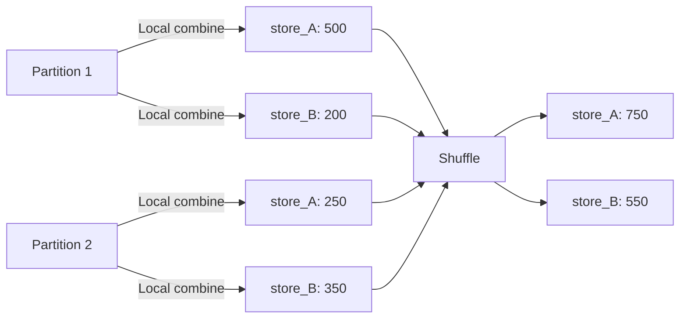

# PySpark RDD Operations — Intermediate

## Pair RDD Operations in Depth

Pair RDDs (key-value RDDs) unlock the most powerful distributed operations in Spark. Understanding their internals is critical for writing performant pipelines.

---

## reduceByKey vs groupByKey — The Performance Gap

```python
from pyspark import SparkContext
sc = SparkContext("local[*]", "PairRDD")

sales = sc.parallelize([
    ("store_A", 100), ("store_B", 200), ("store_A", 150),
    ("store_B", 300), ("store_A", 250), ("store_B", 50),
] * 1000000)  # 6 million records

# GOOD — reduceByKey: combines locally BEFORE shuffle
totals = sales.reduceByKey(lambda a, b: a + b)

# BAD — groupByKey: shuffles ALL values, then reduces
totals_bad = sales.groupByKey().mapValues(sum)
```

### Why reduceByKey Wins



| Metric | reduceByKey | groupByKey |
|--------|------------|------------|
| Data shuffled | Partial aggregates only | ALL raw values |
| Memory on reducer | Single accumulated value | Entire list in memory |
| OOM risk | Low | High (large groups) |
| Network I/O | Minimal | Massive |

---

## combineByKey — The Swiss Army Knife

`combineByKey` is the most general aggregation for pair RDDs. Both `reduceByKey` and `aggregateByKey` are special cases.

```python
# Calculate average sale per store using combineByKey
sales = sc.parallelize([
    ("store_A", 100), ("store_A", 200), ("store_A", 150),
    ("store_B", 300), ("store_B", 400),
])

avg_sales = sales.combineByKey(
    createCombiner=lambda value: (value, 1),          # First value for a key
    mergeValue=lambda acc, value: (acc[0] + value, acc[1] + 1),  # Add value to accumulator
    mergeCombiners=lambda a, b: (a[0] + b[0], a[1] + b[1]),     # Merge across partitions
).mapValues(lambda x: x[0] / x[1])

# Result: [("store_A", 150.0), ("store_B", 350.0)]
```

### When to Use Each

| Operation | Use When |
|-----------|----------|
| `reduceByKey` | Simple associative reduce (sum, max, min) |
| `aggregateByKey` | Accumulator type differs from value type |
| `combineByKey` | Full control over create, merge value, merge combiners |
| `foldByKey` | Like reduceByKey but with a zero value |

---

## cogroup — Multi-RDD Join Without Join

`cogroup` groups values from multiple RDDs by key without performing a full join:

```python
orders = sc.parallelize([
    ("customer_1", "order_A"), ("customer_1", "order_B"),
    ("customer_2", "order_C"),
])

returns = sc.parallelize([
    ("customer_1", "return_X"), ("customer_3", "return_Y"),
])

# cogroup gives you all values from both RDDs, grouped by key
cogrouped = orders.cogroup(returns)

for key, (order_vals, return_vals) in cogrouped.collect():
    print(f"{key}: orders={list(order_vals)}, returns={list(return_vals)}")

# customer_1: orders=['order_A', 'order_B'], returns=['return_X']
# customer_2: orders=['order_C'], returns=[]
# customer_3: orders=[], returns=['return_Y']
```

**Use cogroup when:**
- You need a full outer join behavior
- You need to process both sides of a join together
- You want to avoid multiple separate joins

---

## Repartition and Coalesce

```python
# Check current partition count
rdd = sc.textFile("hdfs:///data/logs/", minPartitions=200)
print(rdd.getNumPartitions())  # 200

# repartition — full shuffle, can increase or decrease
rdd_repartitioned = rdd.repartition(50)

# coalesce — no shuffle (only decreases), moves data locally
rdd_coalesced = rdd.coalesce(50)
```

### When to Use Which

| Operation | Shuffle | Direction | Use When |
|-----------|---------|-----------|----------|
| `repartition(n)` | Yes | Increase or decrease | Even distribution needed, going up in count |
| `coalesce(n)` | No | Decrease only | Reducing partitions before write (cheaper) |

```python
# Common pattern: reduce partitions before writing to avoid small files
(rdd
 .filter(lambda x: x["status"] == "active")  # May create empty partitions
 .coalesce(10)                                 # Consolidate before write
 .saveAsTextFile("hdfs:///output/active_users"))
```

> **Warning:** `coalesce` can create uneven partitions if reduction is large (e.g., 1000 → 5). In such cases, `repartition` gives better balance.

---

## Custom Partitioners

By default, Spark uses `HashPartitioner`. For skewed data, custom partitioners can be critical:

```python
from pyspark import Partitioner

class RangePartitioner(Partitioner):
    """Partition by date range for time-series data."""
    
    def __init__(self, num_partitions):
        self.num_partitions = num_partitions
    
    def numPartitions(self):
        return self.num_partitions
    
    def partitionFunc(self, key):
        # key is a date string like "2024-01-15"
        month = int(key[5:7])  # Extract month
        return month % self.num_partitions

# Apply custom partitioner
events = sc.parallelize([
    ("2024-01-15", "event_A"), ("2024-01-20", "event_B"),
    ("2024-02-10", "event_C"), ("2024-03-05", "event_D"),
])

partitioned = events.partitionBy(12, lambda key: int(key[5:7]) - 1)
print(partitioned.glom().collect())  # Shows data per partition
```

---

## Advanced Pair RDD Operations

```python
# mapValues — transform values without changing keys (no shuffle)
sales_doubled = sales.mapValues(lambda v: v * 2)

# flatMapValues — one value to many values per key
tagged = sc.parallelize([("user_1", "python,spark"), ("user_2", "java,scala")])
expanded = tagged.flatMapValues(lambda v: v.split(","))
# [("user_1", "python"), ("user_1", "spark"), ("user_2", "java"), ("user_2", "scala")]

# subtractByKey — remove keys present in another RDD
all_users = sc.parallelize([("u1", "Alice"), ("u2", "Bob"), ("u3", "Charlie")])
banned = sc.parallelize([("u2", "reason")])
active = all_users.subtractByKey(banned)
# [("u1", "Alice"), ("u3", "Charlie")]

# lookup — get all values for a key (action)
values = sales.lookup("store_A")  # [100, 150, 250]
```

---

## Performance Comparison — Spark UI Analysis

When comparing `reduceByKey` vs `groupByKey` in the Spark UI:

| Spark UI Metric | reduceByKey | groupByKey |
|----------------|-------------|------------|
| Shuffle Write | ~KB-MB | ~GB (raw data) |
| Shuffle Read | ~KB-MB | ~GB |
| Task Duration | Seconds | Minutes |
| GC Time | Low | High (large objects) |
| Spill to Disk | Rare | Frequent |

**What to look for in the Spark UI:**
1. **Stages tab** — Compare shuffle read/write sizes
2. **Tasks tab** — Look for skewed task durations
3. **Storage tab** — Check memory usage per executor
4. **SQL tab** — Inspect the physical plan

---

## Interview Tips

> **Tip 1:** "Explain combineByKey." — "combineByKey is the most general per-key aggregation in Spark. It takes three functions: createCombiner to initialize an accumulator when a key is seen for the first time, mergeValue to fold a new value into an existing accumulator within a partition, and mergeCombiners to merge accumulators from different partitions. reduceByKey and aggregateByKey are both implemented on top of combineByKey."

> **Tip 2:** "When would you use a custom partitioner?" — "When data is heavily skewed and the default HashPartitioner causes hot partitions. For example, if 80% of events belong to a few popular keys, a custom partitioner can spread them across multiple partitions. It's also useful for co-locating related data to avoid shuffles in subsequent joins."

> **Tip 3:** "repartition vs coalesce — what's the difference?" — "coalesce reduces partitions without a full shuffle by merging partitions locally — it's cheaper but can create uneven partitions. repartition does a full shuffle to redistribute data evenly and can increase or decrease partition count. Use coalesce before writing to consolidate small files; use repartition when you need even distribution for parallel processing."
