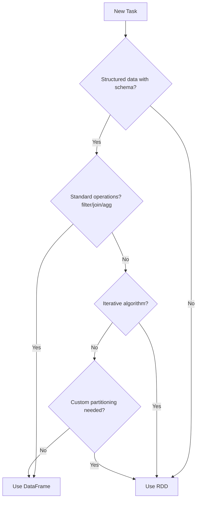

# PySpark RDD Operations — Interview Scenarios


<article data-difficulty="junior">

## 🟢 Junior: Scenario: Map vs FlatMap

**Scenario:** **Question:** "You have an RDD of sentences. Explain the difference between using `map` and `flatMap` to get individual words. What would each return?"

### Setup

```python
from pyspark import SparkC

<details>
<summary>💡 Hint</summary>

Think carefully about the key concepts and consider the trade-offs.

</details>

<details>
<summary>✅ Solution</summary>

**Question:** "You have an RDD of sentences. Explain the difference between using `map` and `flatMap` to get individual words. What would each return?"

### Setup

```python
from pyspark import SparkContext
sc = SparkContext("local[*]", "MapVsFlatMap")

sentences = sc.parallelize([
    "hello world",
    "spark is fast",
    "rdd operations"
])
```

### Using map (WRONG for this task)

```python
# map applies function to each element, returns ONE output per input
words_map = sentences.map(lambda s: s.split(" "))
print(words_map.collect())
# [['hello', 'world'], ['spark', 'is', 'fast'], ['rdd', 'operations']]
# Result: RDD of LISTS — nested structure!
```

### Using flatMap (CORRECT for this task)

```python
# flatMap applies function and FLATTENS the results
words_flat = sentences.flatMap(lambda s: s.split(" "))
print(words_flat.collect())
# ['hello', 'world', 'spark', 'is', 'fast', 'rdd', 'operations']
# Result: RDD of individual WORDS — flat structure!
```

### Key Differences

| Aspect | map | flatMap |
|--------|-----|---------|
| Output per input | Exactly 1 element | 0 or more elements |
| Structure | Preserves nesting | Flattens one level |
| Use case | 1:1 transformation | 1:many transformation |
| Analogy | Python `map()` | Python `itertools.chain.from_iterable(map())` |

**Expected Answer Points:**
- `map` returns one output element per input element (preserves structure)
- `flatMap` returns zero or more elements per input and flattens them
- `flatMap` is used when each input produces a collection you want to unnest
- Word count uses `flatMap` because one sentence produces many words

</details>

</article>

<article data-difficulty="mid-level">

## 🟡 Mid-Level: Scenario: reduceByKey vs groupByKey Performance

**Scenario:** **Question:** "Your Spark job aggregating 500 million clickstream events by user_id is taking 3 hours and spilling heavily to disk. You're using `groupByKey().mapValues(list)` followed by a custom agg

<details>
<summary>💡 Hint</summary>

Think carefully about the key concepts and consider the trade-offs.

</details>

<details>
<summary>✅ Solution</summary>

**Question:** "Your Spark job aggregating 500 million clickstream events by user_id is taking 3 hours and spilling heavily to disk. You're using `groupByKey().mapValues(list)` followed by a custom aggregation. How would you fix this?"

### The Problematic Code

```python
# SLOW: groupByKey shuffles ALL values across the network
clicks = sc.textFile("hdfs:///data/clicks/2024-01-15/")  # 500M records

user_clicks = clicks.map(lambda line: (
    parse_user_id(line),
    parse_click_data(line)
))

# This shuffles ALL click data to group by user
aggregated = (user_clicks
    .groupByKey()                    # Shuffles 500M records!
    .mapValues(lambda clicks: {
        "count": len(list(clicks)),
        "last_click": max(clicks, key=lambda c: c["timestamp"]),
        "unique_pages": len(set(c["page"] for c in clicks)),
    })
)
```

### The Fix — Use reduceByKey or combineByKey

```python
# FAST: combineByKey aggregates locally before shuffle
from collections import Counter

def create_combiner(click):
    return {
        "count": 1,
        "last_timestamp": click["timestamp"],
        "pages": {click["page"]},
    }

def merge_value(acc, click):
    acc["count"] += 1
    acc["last_timestamp"] = max(acc["last_timestamp"], click["timestamp"])
    acc["pages"].add(click["page"])
    return acc

def merge_combiners(acc1, acc2):
    return {
        "count": acc1["count"] + acc2["count"],
        "last_timestamp": max(acc1["last_timestamp"], acc2["last_timestamp"]),
        "pages": acc1["pages"] | acc2["pages"],
    }

aggregated = user_clicks.combineByKey(
    create_combiner,
    merge_value,
    merge_combiners,
)

# Final format
result = aggregated.mapValues(lambda acc: {
    "count": acc["count"],
    "last_timestamp": acc["last_timestamp"],
    "unique_pages": len(acc["pages"]),
})
```

### Performance Comparison (Spark UI Metrics)

| Metric | groupByKey | combineByKey |
|--------|-----------|-------------|
| Shuffle write | 180 GB | 12 GB |
| Shuffle read | 180 GB | 12 GB |
| Spill to disk | 95 GB | 0 GB |
| Max task time | 42 min | 4 min |
| Total job time | 3 hours | 18 min |
| Executor OOM failures | 3 | 0 |

**Expected Answer Points:**
- `groupByKey` shuffles ALL raw data — with 500M records, this is massive
- `combineByKey`/`reduceByKey` applies the aggregation locally BEFORE shuffling
- Only partial aggregates cross the network (one per user per partition)
- Eliminates OOM risk because reducer never holds all values in memory
- Also mention: check partition count, consider repartitioning input if skewed

</details>

</article>

<article data-difficulty="senior">

## 🔴 Senior: Scenario: When to Use RDD Over DataFrame

**Scenario:** **Question:** "You're building a pipeline that needs to: (1) process raw binary files from IoT sensors, (2) apply a custom graph algorithm to find device clusters, and (3) enrich with dimension data.

<details>
<summary>💡 Hint</summary>

Think carefully about the key concepts and consider the trade-offs.

</details>

<details>
<summary>✅ Solution</summary>

**Question:** "You're building a pipeline that needs to: (1) process raw binary files from IoT sensors, (2) apply a custom graph algorithm to find device clusters, and (3) enrich with dimension data. Your team wants everything in DataFrames. When would you push back and use RDDs?"

### Analysis and Solution

```python
from pyspark.sql import SparkSession
from pyspark import SparkContext

spark = SparkSession.builder.getOrCreate()
sc = spark.sparkContext

# ====================================
# PART 1: Binary file processing → RDD is correct
# ====================================
# DataFrames cannot process arbitrary binary formats
sensor_files = sc.binaryFiles("hdfs:///data/iot/raw/2024-01-15/")

def parse_sensor_binary(file_content):
    """Custom binary protocol parser — no DataFrame equivalent."""
    path, raw_bytes = file_content
    # Custom protocol: 4-byte header + variable-length readings
    header = struct.unpack(">I", raw_bytes[:4])[0]
    readings = []
    offset = 4
    while offset < len(raw_bytes):
        reading = struct.unpack(">fI", raw_bytes[offset:offset+8])
        readings.append({"device_id": header, "value": reading[0], "ts": reading[1]})
        offset += 8
    return readings

parsed_rdd = sensor_files.flatMap(parse_sensor_binary)

# ====================================
# PART 2: Graph algorithm → RDD is correct
# ====================================
# Iterative algorithms need explicit loop control
edges = parsed_rdd.flatMap(lambda r: find_correlated_devices(r))

def find_clusters(edges_rdd, iterations=10):
    """Label propagation — requires iterative RDD operations."""
    labels = edges_rdd.flatMap(lambda e: [e[0], e[1]]).distinct().map(lambda n: (n, n))
    
    for i in range(iterations):
        neighbors = edges_rdd.join(labels).map(lambda x: (x[1][0], x[1][1]))
        labels = labels.union(neighbors).reduceByKey(min)
        
        if i % 3 == 0:
            labels.checkpoint()
            labels.count()
    
    return labels

clusters = find_clusters(edges)

# ====================================
# PART 3: Dimension enrichment → Convert to DataFrame here
# ====================================
# DataFrames are better for structured joins with optimization
from pyspark.sql import Row

readings_df = parsed_rdd.map(
    lambda r: Row(device_id=r["device_id"], value=r["value"], timestamp=r["ts"])
).toDF()

clusters_df = clusters.map(
    lambda x: Row(device_id=x[0], cluster_id=x[1])
).toDF()

# Now use DataFrame API for optimized joins
device_dim = spark.read.parquet("hdfs:///data/dimensions/devices/")

enriched = (readings_df
    .join(clusters_df, "device_id")
    .join(device_dim, "device_id")  # Catalyst will optimize this join
)

enriched.write.parquet("hdfs:///data/processed/iot_clusters/")
```

### Decision Framework



**Expected Answer Points:**
- Binary parsing: DataFrames need schema — raw binary protocols need RDDs
- Graph algorithms: Iterative computation with checkpointing requires explicit RDD loop control
- Dimension enrichment: Switch to DataFrame for optimized joins (Catalyst, broadcast)
- The correct approach is hybrid: RDD where needed, convert to DataFrame for structured ops
- Mention performance: DataFrame joins are 2-10x faster due to Catalyst and Tungsten
- Conversion cost (RDD→DataFrame) is acceptable if subsequent operations benefit from optimization

---

## Interview Tips

> **Tip 1:** "For map vs flatMap, always give a concrete example." — "map transforms each element to exactly one output: if I map over sentences with split(), I get a list of lists. flatMap flattens those lists into a single collection of words. Think of it as map + flatten. It's the RDD equivalent of SQL's LATERAL VIEW EXPLODE."

> **Tip 2:** "For reduceByKey vs groupByKey, quantify the difference." — "With 500M records and 1M unique keys, groupByKey shuffles all 500M records. reduceByKey with 200 partitions shuffles only 200M partial aggregates (1M keys × 200 partitions maximum). That's potentially 250x less network I/O. Always mention the local combiner analogy from MapReduce."

> **Tip 3:** "For RDD vs DataFrame decisions, show you know both APIs." — "Don't be dogmatic. The right answer is hybrid: RDD for unstructured data and iterative algorithms, DataFrame for structured operations and joins. Show you understand the performance implications — DataFrames benefit from Catalyst optimization, Tungsten memory management, and whole-stage code generation that RDDs can't access. Convert at the boundary where data becomes structured."

</details>

</article>


---

## Interview Tips