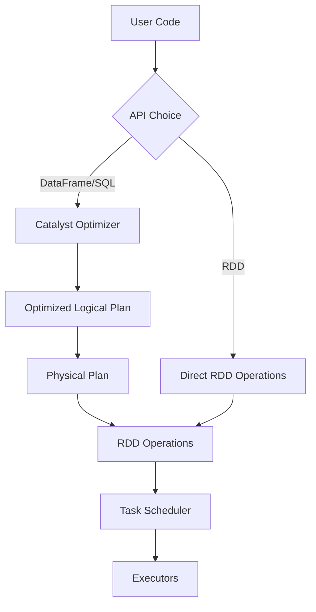
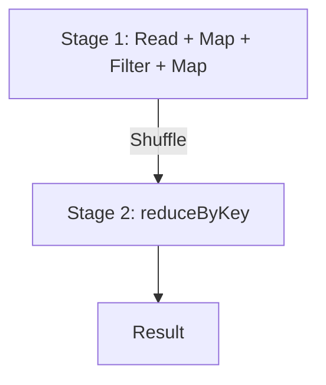
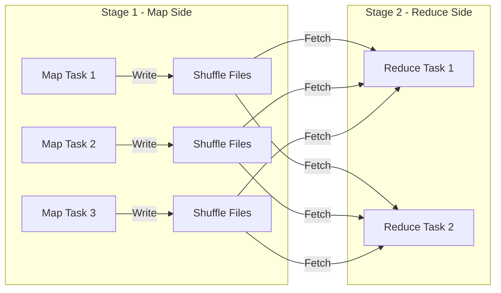

# PySpark RDD Operations — Senior Deep Dive

## RDD vs DataFrame Internals

At the engine level, DataFrames compile down to RDD operations. Understanding this relationship helps diagnose performance issues.

```python
from pyspark.sql import SparkSession

spark = SparkSession.builder.getOrCreate()

# DataFrame approach
df = spark.read.parquet("hdfs:///data/events/")
result_df = df.filter(df.status == "active").groupBy("region").count()

# Inspect the underlying RDD
print(result_df.rdd.toDebugString())
# Shows the RDD lineage behind the DataFrame execution
```

### Architecture Comparison



| Aspect | RDD | DataFrame |
|--------|-----|-----------|
| Optimization | None — you write the plan | Catalyst optimizer rewrites |
| Serialization | Java serialization (slow) | Tungsten binary format (fast) |
| Memory layout | JVM objects on heap | Off-heap columnar storage |
| GC pressure | High (many objects) | Low (binary format) |
| Code generation | None | Whole-stage codegen |
| Schema | No schema enforcement | Schema-aware |
| Type safety | Compile-time (Scala), none (Python) | Runtime schema validation |

---

## When RDDs Are Still Needed

Despite DataFrame superiority for structured data, RDDs remain essential for:

```python
# 1. Unstructured data processing
binary_rdd = sc.binaryFiles("hdfs:///data/images/")
processed = binary_rdd.map(lambda x: (x[0], process_image(x[1])))

# 2. Custom partitioning (DataFrames don't support custom partitioners)
partitioned_rdd = pair_rdd.partitionBy(100, custom_partition_func)

# 3. Fine-grained control over physical execution
# mapPartitions with external resource management
def process_with_connection(partition):
    conn = create_expensive_connection()
    try:
        for record in partition:
            yield transform_with_conn(record, conn)
    finally:
        conn.close()

result = rdd.mapPartitions(process_with_connection)

# 4. Graph algorithms (iterative computation)
# PageRank-style iteration
links = sc.parallelize([("A", ["B", "C"]), ("B", ["A"]), ("C", ["A", "B"])])
ranks = sc.parallelize([("A", 1.0), ("B", 1.0), ("C", 1.0)])

for _ in range(10):
    contribs = links.join(ranks).flatMap(
        lambda x: [(dest, x[1][1] / len(x[1][0])) for dest in x[1][0]]
    )
    ranks = contribs.reduceByKey(lambda a, b: a + b).mapValues(lambda v: 0.15 + 0.85 * v)
```

---

## Lineage and DAG Deep Dive

Every RDD maintains a lineage graph — the complete record of transformations from source data:

```python
raw = sc.textFile("hdfs:///data/logs/")
parsed = raw.map(parse_log_line)
filtered = parsed.filter(lambda x: x["level"] == "ERROR")
keyed = filtered.map(lambda x: (x["service"], 1))
counts = keyed.reduceByKey(lambda a, b: a + b)

# Inspect lineage
print(counts.toDebugString())
```

Output:
```
(4) ShuffledRDD[5] at reduceByKey at <script>:6 []
 +-(4) MapPartitionsRDD[4] at map at <script>:5 []
    |  MapPartitionsRDD[3] at filter at <script>:4 []
    |  MapPartitionsRDD[2] at map at <script>:3 []
    |  hdfs:///data/logs/ MapPartitionsRDD[1] at textFile at <script>:2 []
```

### DAG Scheduler Behavior

The DAG scheduler converts the lineage into stages and tasks:

1. **Stage boundaries** form at shuffle dependencies (wide transformations)
2. **Tasks** within a stage run narrow transformations as a pipeline
3. **Pipelining** — consecutive narrow transforms execute in a single pass over data



---

## Narrow vs Wide Transformations — Deep Analysis

```python
# NARROW: Each input partition contributes to exactly one output partition
narrow_ops = (
    rdd
    .map(lambda x: x * 2)          # 1:1 partition mapping
    .filter(lambda x: x > 10)      # 1:1 partition mapping
    .flatMap(lambda x: [x, x+1])   # 1:1 partition mapping
)
# All execute in ONE stage as a pipeline — no shuffle!

# WIDE: Input partitions contribute to multiple output partitions
wide_ops = (
    pair_rdd
    .reduceByKey(lambda a, b: a + b)  # Shuffle required
    .join(other_rdd)                   # Shuffle required
    .sortByKey()                        # Shuffle required
)
# Each wide transformation creates a new stage boundary
```

### Shuffle Internals



**Shuffle performance impact:**
- Disk I/O: Map tasks write shuffle files to local disk
- Network I/O: Reduce tasks fetch data from all map tasks
- Serialization: Data serialized/deserialized at shuffle boundary
- Memory: Sort-based shuffle requires buffer memory

---

## Checkpointing — Breaking the Lineage

For long lineage chains (iterative algorithms), recomputation cost becomes prohibitive:

```python
# Set checkpoint directory (must be reliable storage like HDFS/S3)
sc.setCheckpointDir("hdfs:///spark/checkpoints/")

# Iterative algorithm with checkpointing
graph_rdd = sc.parallelize(initial_graph)

for iteration in range(100):
    graph_rdd = graph_rdd.map(compute_step).reduceByKey(merge_func)
    
    # Checkpoint every 10 iterations to truncate lineage
    if iteration % 10 == 0:
        graph_rdd.checkpoint()
        graph_rdd.count()  # Force materialization before checkpoint

# Without checkpointing: lineage grows to 100+ stages
# With checkpointing: lineage resets every 10 iterations
```

### Checkpoint vs Cache vs Persist

| Feature | checkpoint() | cache()/persist() | localCheckpoint() |
|---------|-------------|-------------------|-------------------|
| Storage | HDFS/S3 (reliable) | Executor memory/disk | Executor local disk |
| Lineage | Truncated | Preserved | Truncated |
| Replication | HDFS replication | Optional | None |
| Fault tolerance | Full (survives executor loss) | Recomputes from lineage | Lost on executor failure |
| Use case | Long iterative jobs | Reuse within one job | Short jobs, performance |

```python
# localCheckpoint — faster but less reliable
rdd.localCheckpoint()  # Stores on executor local disk, truncates lineage
# Use when job is short-lived and executor failure is unlikely

# Reliable checkpoint — for production iterative jobs
rdd.checkpoint()  # Stores on HDFS, truncates lineage
# Use for multi-hour iterative algorithms
```

---

## Dependency Types in the DAG

```python
# Check dependency type programmatically
from pyspark import NarrowDependency, ShuffleDependency

for dep in counts.dependencies():
    print(type(dep).__name__, dep.rdd)
# ShuffleDependency MapPartitionsRDD[4]
```

Understanding dependencies helps predict:
- **Stage boundaries** — where shuffles will occur
- **Task parallelism** — how many tasks run concurrently
- **Failure recovery cost** — how much recomputation is needed

---

## Performance Diagnostics with RDD Debug Tools

```python
# toDebugString — view full lineage
print(result_rdd.toDebugString())

# getNumPartitions — check partition count
print(f"Partitions: {result_rdd.getNumPartitions()}")

# glom — see data distribution across partitions
distribution = result_rdd.glom().map(len).collect()
print(f"Records per partition: {distribution}")
# Detect skew: [1000000, 50, 30, 20] — partition 0 is skewed!

# Custom partition inspection
def inspect_partitions(rdd):
    """Diagnose partition skew."""
    sizes = rdd.glom().map(len).collect()
    avg = sum(sizes) / len(sizes)
    max_size = max(sizes)
    skew_ratio = max_size / avg if avg > 0 else 0
    print(f"Partitions: {len(sizes)}, Avg: {avg:.0f}, Max: {max_size}, Skew: {skew_ratio:.2f}x")
    return skew_ratio

skew = inspect_partitions(my_rdd)
if skew > 3.0:
    print("WARNING: Significant partition skew detected!")
```

---

## Interview Tips

> **Tip 1:** "When would you still use RDDs over DataFrames?" — "Four cases: unstructured data that doesn't fit in rows (binary files, complex nested objects), custom partitioning requirements, fine-grained control over physical execution like mapPartitions with resource management, and iterative graph algorithms where you need explicit control over the computation loop. For everything else, DataFrames with Catalyst and Tungsten are 2-10x faster."

> **Tip 2:** "Explain narrow vs wide transformations and their impact." — "Narrow transformations like map and filter process each input partition independently into exactly one output partition — they pipeline together in a single stage with no network I/O. Wide transformations like reduceByKey and join require data from multiple input partitions to produce output, causing a shuffle — data is written to disk, transferred over the network, and deserialized. Each wide transformation creates a stage boundary in the DAG."

> **Tip 3:** "When and why would you checkpoint an RDD?" — "Checkpoint when running iterative algorithms where lineage grows with each iteration. Without checkpointing, a failure at iteration 90 means recomputing from iteration 0. Checkpointing materializes the RDD to reliable storage (HDFS/S3) and truncates the lineage. I typically checkpoint every N iterations. The tradeoff is additional write cost versus reduced recomputation on failure. For short-lived jobs, localCheckpoint is faster but doesn't survive executor failures."
