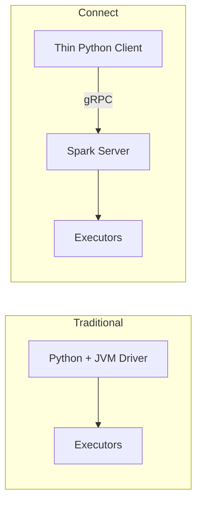

# Spark Connect — Fundamentals


## 🎯 Analogy

Think of Spark Connect like a remote control for Spark: your Python code runs locally (no JVM needed on your laptop), sends a logical plan over gRPC to the Spark server, and the server executes it.

---
## What Is Spark Connect?

Spark Connect is a **client-server architecture** introduced in Spark 3.4 that decouples the Python client from the Spark server via gRPC.

> **Key Insight:** Before Spark Connect, your Python driver ran inside the same JVM as the Spark driver. Spark Connect lets your code run anywhere — laptop, microservice, notebook — while computation happens on a remote cluster.

---

## Traditional vs Spark Connect



| Aspect | Traditional (Embedded) | Spark Connect |
|--------|----------------------|---------------|
| Client location | Same machine as driver | Anywhere (remote) |
| Resource usage | Heavy (JVM) | Light (gRPC stub) |
| Multi-tenancy | Single session per app | Multiple clients per server |
| Failure isolation | Client crash kills Spark | Client crash safe |
| API support | Full (RDD + DataFrame) | DataFrame only |

---

## Benefits

1. **Decoupled lifecycle** — server persists between sessions
2. **Language-agnostic** — gRPC + Protobuf protocol
3. **Multi-tenancy** — multiple users share one server
4. **Thin client** — no JVM needed locally
5. **Stability** — client crash doesn't kill running jobs

---

## Basic Usage

```python
from pyspark.sql import SparkSession

# Traditional: starts a local Spark instance (heavy)
spark = SparkSession.builder.master("local[*]").getOrCreate()

# Spark Connect: connects to remote server (lightweight)
spark = SparkSession.builder.remote("sc://spark-server:15002").getOrCreate()

# From here, DataFrame API is identical
df = spark.read.parquet("s3://datalake/events/")
result = df.filter("amount > 100").groupBy("region").count()
result.show()
```

### Connection URL Format

```
sc://hostname:port[;param1=value1;param2=value2]
```

```python
# With authentication
spark = SparkSession.builder.remote("sc://server:15002;token=my-auth-token").getOrCreate()
```

---

## Starting a Server

```bash
./sbin/start-connect-server.sh \
    --packages org.apache.spark:spark-connect_2.12:3.5.0 \
    --master yarn \
    --conf spark.connect.grpc.binding.port=15002
```

---

## What Works vs What Doesn't

| Feature | Status (Spark 3.5) |
|---------|-------------------|
| DataFrame API | Fully supported |
| Spark SQL | Fully supported |
| Built-in functions | Fully supported |
| Pandas UDFs | Supported |
| Scalar Python UDFs | Supported |
| Structured Streaming | Supported |
| Delta Lake reads/writes | Supported |
| RDD API | Not supported |
| SparkContext access | Not supported |
| Custom Accumulators | Not supported |
| Broadcast variables (manual) | Limited |

```python
# Works — standard DataFrame operations
df = spark.read.parquet("s3://data/events/")
df.filter("amount > 100").groupBy("region").agg({"amount": "sum"}).show()

# Does NOT work — RDD API
spark.sparkContext  # Error: not accessible via Connect
```

---

## When to Use Spark Connect

| Use Case | Recommended? | Why |
|----------|-------------|-----|
| Notebooks (shared cluster) | Yes | No local JVM, cost reduction |
| IDE development | Yes | Fast iteration, lightweight |
| Microservice queries | Yes | Decouple from Spark lifecycle |
| CI/CD test suites | Yes | No cluster management in CI |
| Heavy ETL (needs RDD) | No | Use embedded |
| Streaming apps | Yes (3.5+) | Structured Streaming works |

---

## Installation

```bash
pip install pyspark[connect]  # Thin client only, no full Spark runtime
```

---

## How It Works Under the Hood

When you call DataFrame operations through Spark Connect:

1. **Plan construction** — Each `.filter()`, `.groupBy()`, `.select()` builds a logical plan tree on the client
2. **Serialization** — The plan tree is serialized as Protocol Buffer messages (very small, < 1KB)
3. **Transport** — Serialized plan sent to server via gRPC
4. **Execution** — Server runs it through Catalyst optimizer and executes on the cluster
5. **Results** — Output streamed back as Apache Arrow batches (columnar, efficient)

The key takeaway: only the *plan* crosses the network, not raw data (until you call `.collect()` or `.toPandas()`).

---


## ▶️ Try It Yourself

```python
# Spark Connect (Spark 3.4+): connect to remote Spark
# pip install pyspark[connect]
# from pyspark.sql import SparkSession
# spark = SparkSession.builder.remote("sc://localhost:15002").getOrCreate()
# Everything else is identical to local Spark:
# df = spark.range(10).show()

# For local demo without a server:
from pyspark.sql import SparkSession
spark = SparkSession.builder.master("local[*]").appName("connect-demo").getOrCreate()
spark.range(5).show()  # Same API as Spark Connect
```

> **Run it:** Copy the snippet into a REPL or file and run it — no external services needed for the basic example.

---
## Interview Tips

> **Tip 1:** "What is Spark Connect?" — "A client-server architecture (Spark 3.4+) that decouples the Python client from the Spark driver via gRPC. The client sends logical plans to a remote server for execution. This enables lightweight clients, multi-tenancy, and failure isolation."

> **Tip 2:** "Main limitation?" — "No RDD API — RDDs require SparkContext which lives on the server. Only DataFrame/Dataset API and Spark SQL are supported. For modern data engineering, this is usually fine since DataFrames are the recommended API."

> **Tip 3:** "When to choose Connect over traditional?" — "When multiple users share a cluster, when you want lightweight local dev without a JVM, or when building microservices that query Spark. Use embedded for heavy ETL needing RDD-level control."
