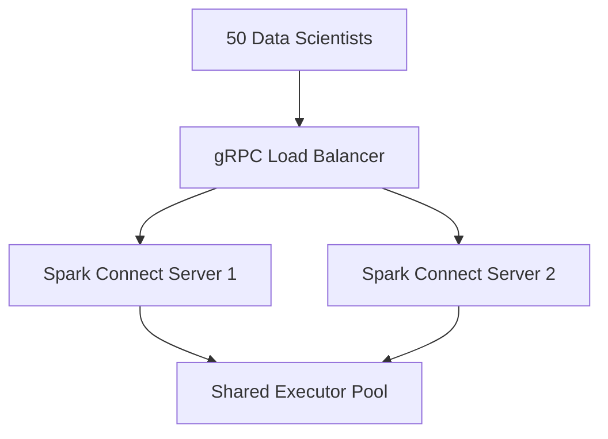

# Scenario Questions — Spark Connect

<article data-difficulty="junior">

## 🟢 Junior: What Is Spark Connect and How Does It Differ from Traditional Spark?

**Scenario:** Explain Spark Connect to a colleague who only knows traditional PySpark. Cover architecture, benefits, and coding differences.

<details>
<summary>✅ Solution</summary>

Traditional PySpark embeds a JVM-based Spark driver in the same process as your Python code. Spark Connect (Spark 3.4+) separates this into a thin gRPC client and a remote server.

```python
# Traditional: your process IS the driver (heavy JVM, single-user)
spark = SparkSession.builder.master("yarn").getOrCreate()

# Spark Connect: lightweight client sends plans to a remote server
spark = SparkSession.builder.remote("sc://server:15002").getOrCreate()

# After this line, DataFrame API usage is IDENTICAL
df = spark.read.parquet("s3://data/events/")
result = df.filter("amount > 100").groupBy("region").count()
```

**Key differences:**
- No JVM needed locally (just a gRPC connection)
- Multiple users share one server (cost reduction)
- Client crash doesn't kill the Spark session
- **Limitation:** No RDD API, no `spark.sparkContext` access

</details>

</article>

<article data-difficulty="mid-level">

## 🟡 Mid-Level: Redesign Notebooks with Spark Connect

**Scenario:** 15 data scientists each run their own Spark cluster (8 executors, 16GB each). Clusters are idle 70% of the day. Monthly bill: $180K. Redesign using Spark Connect for shared infrastructure.

<details>
<summary>✅ Solution</summary>

```python
# BEFORE: Each notebook starts a dedicated cluster ($180K/month)
spark = SparkSession.builder.master("yarn").config("spark.executor.instances", "8").getOrCreate()

# AFTER: All connect to shared server (instant, ~$45K/month)
spark = SparkSession.builder.remote("sc://spark-shared:15002;token=my_token").getOrCreate()
```

**Architecture:** One Spark Connect server with dynamic allocation (2-40 executors) and FAIR scheduler.

**Session isolation:** Each user gets a separate SparkSession — temp views, configs, and UDFs are session-scoped. Alice's settings don't affect Bob's.

**Resource contention:** FAIR scheduler gives each user minimum guaranteed resources (minShare). Dynamic allocation scales executors based on total demand.

**Runaway query protection:** Query timeouts, per-user task limits via server-side interceptors.

| Metric | Before | After |
|--------|--------|-------|
| Clusters | 15 (idle 70%) | 1 shared, auto-scaling |
| Monthly cost | $180K | ~$45K |
| Utilization | 30% | 80% |
| Startup time | 3-5 min | Instant |

</details>

</article>

<article data-difficulty="senior">

## 🔴 Senior: Multi-Tenant Spark Platform for 50 Data Scientists via Connect

**Scenario:** Design a production platform where 50 data scientists from 5 teams share a cluster via Spark Connect. Requirements: <$100K/month, PII isolation between teams, no single user blocks others >5min, 99.5% uptime, token-based auth with TLS.

<details>
<summary>✅ Solution</summary>



**High Availability:** 2 Spark Connect server replicas behind a gRPC load balancer with PodDisruptionBudget (minAvailable: 1). Reattachable execution for in-flight query survival.

**Security:** TLS on gRPC channel. Token-based auth via gRPC interceptor validating JWT against IdP. Audit logging of all queries.

**Data Isolation:** Catalog-level permissions (Unity Catalog pattern). Each team's service account maps to allowed schemas. Queries to unauthorized tables fail at plan analysis.

**Resource Fairness:** FAIR scheduler with per-team pools (weight + minShare). Dynamic allocation (5-80 executors). Query guardrails: max 5-min runtime for adhoc, max 500GB scan.

**Cost:** 2 driver nodes (always on) + 5-80 executors (dynamic, Spot) + monitoring = ~$60K/month.

**Key design decisions:**
- Multiple server replicas for HA (not single point of failure)
- Server-side interceptors for auth/quota (clients can't bypass)
- Catalog permissions (not just namespace isolation)
- Reattachable execution survives brief network blips

</details>

</article>

<article data-difficulty="mid-level">

## 🟡 Bonus: Debug a Spark Connect Error

**Scenario:** A data scientist reports this error when running a query: `grpc.RpcError: UNAVAILABLE — Connection refused`. What's your troubleshooting checklist?

<details>
<summary>✅ Solution</summary>

**Troubleshooting steps:**

1. **Is the server running?** — `kubectl get pods -l app=spark-connect` — check if pod is Running
2. **Is the port correct?** — Default is 15002. Verify with `kubectl get svc spark-connect-service`
3. **Network reachability** — Can the client reach the server? Check DNS, firewalls, VPN
4. **Server logs** — `kubectl logs spark-connect-pod` — look for startup errors, OOM
5. **Token expired?** — If using auth, verify the token is still valid
6. **Server overloaded?** — Check CPU/memory. Too many concurrent sessions can exhaust resources

```python
# Quick diagnostic from client
import grpc

try:
    spark = SparkSession.builder.remote("sc://server:15002").getOrCreate()
    spark.sql("SELECT 1").collect()
    print("Connection OK")
except Exception as e:
    print(f"Connection failed: {type(e).__name__}: {e}")
```

</details>

</article>

---

## Interview Tips

> **Tip 1:** "How do you explain Spark Connect simply?" — "Like a database client. You don't run PostgreSQL inside your Python script — you connect to a server. Spark Connect is the same: your code sends queries to a remote Spark server and gets results back."

> **Tip 2:** "How do you prevent one user from blocking others?" — "FAIR scheduler ensures minimum resources per user, dynamic allocation scales shared executors, and query guardrails reject or timeout expensive queries exceeding scan/duration limits."

> **Tip 3:** "How do you handle Connect server failures?" — "Deploy 2+ replicas behind a load balancer. PodDisruptionBudgets prevent simultaneous eviction. Reattachable execution lets in-flight queries survive brief disconnections. Clients reconnect automatically via the LB."
