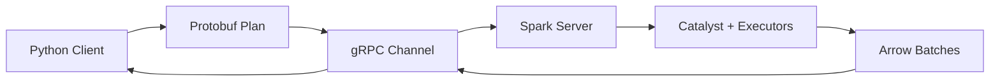

# Spark Connect — Senior Deep Dive

## Architecture Internals



### Request Flow

1. Client builds a logical plan tree from DataFrame operations
2. Plan serialized as Protocol Buffer binary (`Relation` messages)
3. Sent via gRPC as `ExecutePlanRequest`
4. Server deserializes, resolves schemas through Catalyst, optimizes
5. Physical plan executes on cluster
6. Results streamed back as Apache Arrow batches

When you write `df.filter("amount > 100").select("user_id")`, the client constructs:
```
Project(columns=[user_id],
  Filter(condition=amount > 100,
    Read(format=parquet, path=s3://...)))
```

This tree is serialized (< 1KB typically) and sent over the network.

---

## Security Model

### TLS + Token Auth

```python
# Client: TLS encryption + token authentication
spark = (
    SparkSession.builder
    .remote("sc://spark-server:15002;use_ssl=true;token=eyJhbGciOi...")
    .getOrCreate()
)
```

| Layer | Mechanism | Purpose |
|-------|-----------|---------|
| Transport | TLS / mTLS | Encryption in transit |
| Authentication | JWT / OAuth / PAT | Identity verification |
| Session isolation | Per-client SparkSession | Config and state isolation |
| Data access | Catalog permissions | Table/column-level control |

---

## Multi-Tenancy

Each client gets an isolated `SparkSession`. Sessions share executors but not state:

```python
# Alice and Bob connect — separate sessions, same cluster
spark_a = SparkSession.builder.remote("sc://server:15002;user_id=alice").getOrCreate()
spark_b = SparkSession.builder.remote("sc://server:15002;user_id=bob").getOrCreate()

# Alice's configs don't affect Bob's
spark_a.conf.set("spark.sql.shuffle.partitions", "50")
spark_b.conf.get("spark.sql.shuffle.partitions")  # Still default (200)
```

### Resource Isolation Strategies

| Strategy | Isolation | Overhead |
|----------|-----------|----------|
| FAIR scheduler pools per team | Time-sharing | Minimal |
| Dynamic allocation limits per session | Memory-bounded | Low |
| Separate clusters per team | Full | High (cost) |

---

## Performance Overhead

### Serialization Cost

- **Plan serialization:** Negligible (<1KB for most queries)
- **Result serialization:** Arrow format is efficient, 5-15% overhead for large results
- **Aggregated results** (typical): Overhead is negligible (few rows over network)

### Latency Impact

| Operation | Traditional | Spark Connect |
|-----------|-------------|---------------|
| Submit plan | 0ms | 1-5ms |
| Return 100 rows | 0ms (in-process) | 2-10ms |
| Return 1M rows | 0ms | 200-500ms |

**Best practice:** Do aggregations on the cluster, pull only final results to the client.

```python
# Good: aggregate on cluster, pull small result
result = df.groupBy("region").agg({"amount": "sum"}).collect()

# Bad: pull millions of rows to client
raw = df.collect()  # Millions of rows over network → slow
```

---

## Migration: Embedded to Connect

### Step 1: Find Incompatible Patterns

```python
INCOMPATIBLE = ["sparkContext", "sc.parallelize", "sc.broadcast", ".rdd", "accumulator"]
# Grep your codebase for these patterns
```

### Step 2: Refactor

| Before (Embedded) | After (Connect-Compatible) |
|-------------------|-----------------------------|
| `sc.parallelize(data)` | `spark.createDataFrame(data, schema)` |
| `sc.broadcast(dict)` | `broadcast(lookup_df)` join hint |
| `rdd.map(fn)` | `df.withColumn(...)` or UDF |
| `sc.accumulator(0)` | `df.agg(count(...))` |
| `sc.setCheckpointDir(...)` | Delta Lake for reliability |

### Step 3: Session Factory

```python
import os
from pyspark.sql import SparkSession

def get_spark():
    """Toggle between embedded and Connect based on environment."""
    url = os.environ.get("SPARK_CONNECT_URL")
    if url:
        return SparkSession.builder.remote(url).getOrCreate()
    return SparkSession.builder.master("local[*]").getOrCreate()
```

---

## Server Deployment Options

| Deployment | Best For | Pros | Cons |
|------------|----------|------|------|
| K8s pod | Cloud-native | HA, autoscaling | K8s expertise needed |
| YARN app | On-prem Hadoop | Integrates with existing | Complex |
| Databricks cluster | Databricks users | Fully managed | Vendor lock-in |
| Standalone | Dev/test | Simple | No HA |

```yaml
# K8s deployment (simplified)
apiVersion: apps/v1
kind: Deployment
metadata:
  name: spark-connect-server
spec:
  replicas: 2  # HA
  template:
    spec:
      containers:
      - name: spark-connect
        image: apache/spark:3.5.0
        command: ["/opt/spark/sbin/start-connect-server.sh"]
        args: ["--master", "k8s://https://kubernetes.default.svc"]
        ports:
        - containerPort: 15002
        resources:
          requests: { memory: "8Gi", cpu: "4" }
```

---

## Interview Tips

> **Tip 1:** "Explain the Spark Connect wire protocol." — "The client constructs a logical plan tree using Protocol Buffers. This protobuf plan (typically <1KB) is sent via gRPC to the server, which deserializes it, runs through Catalyst for optimization, executes on the cluster, and streams results back as Apache Arrow batches. The protocol is language-agnostic."

> **Tip 2:** "How do you handle multi-tenancy?" — "Each client gets an isolated SparkSession with its own configs and temp views. Resource isolation uses FAIR scheduler pools with per-team weights and minShare guarantees. Data isolation integrates with a catalog layer for table-level access control."

> **Tip 3:** "What's the migration path from embedded to Connect?" — "Three phases: audit for RDD/SparkContext usage, refactor to DataFrame-only patterns, then run tests in both modes. A session factory lets you toggle between embedded and Connect without code changes. Most modern PySpark code already uses DataFrames and needs minimal refactoring."

## ⚡ Cheat Sheet

**Spark Connect Architecture**
- Client (Python/Scala/R) → Protobuf plan → gRPC → Spark Connect Server → Catalyst → Executors
- Server is a thin gRPC service sitting in front of a standard Spark cluster
- Default port: 15002

**Key Differences from Classic Spark**
| Classic Spark | Spark Connect |
|---------------|---------------|
| SparkContext in driver process | No SparkContext on client |
| Client = driver (same JVM) | Client is remote (any process) |
| SparkSession tied to JVM | SparkSession over network |
| Direct RDD access | No RDD API (DataFrame only) |
| Driver OOM affects executors | Client crash ≠ job crash |

**Connection Setup**
```python
from pyspark.sql import SparkSession
spark = SparkSession.builder \
    .remote("sc://localhost:15002") \
    .getOrCreate()
# sc:// scheme = Spark Connect; spark:// = classic cluster manager
```

**Multi-Tenancy Benefits**
- Multiple clients → single shared Spark server; no per-user driver overhead
- Client isolation: one client's failure doesn't kill other sessions
- Enables Spark usage from Jupyter, notebooks, CI/CD without embedded driver

**Limitations (know for interviews)**
- No RDD API on client side
- `sc.broadcast()` RDD-style not available; use DataFrame broadcast hints
- SparkContext-level configs must be set server-side
- Streaming support added in Spark 3.5 (limited); full support in 4.x roadmap

**Interview Traps**
- Spark Connect does NOT remove the driver — it moves it server-side, away from client
- Plans are serialized as Protobuf, not Python bytecode — language-agnostic by design
- Lazy evaluation still applies; actions still trigger execution over gRPC
