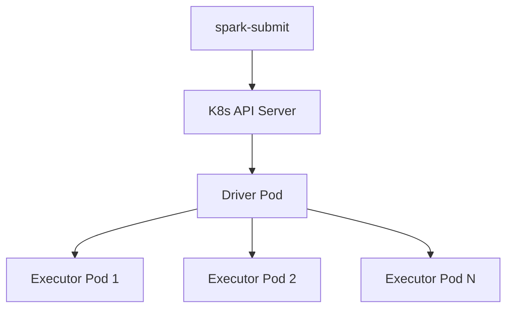

# Spark on Kubernetes — Fundamentals

## Why Spark on Kubernetes?

Kubernetes provides container-level isolation, autoscaling, and multi-tenancy for Spark without a separate Hadoop cluster.



### K8s vs YARN

| Aspect | YARN | Kubernetes |
|--------|------|------------|
| Infrastructure | Hadoop-specific | General-purpose |
| Scaling | Fixed cluster | Cluster Autoscaler |
| Isolation | Container + cgroups | Full pod isolation |
| Multi-tenancy | Queue-based | Namespace + RBAC |
| Cost model | Reserved nodes | On-demand / Spot |
| Cloud-native | No | Yes (EKS, GKE, AKS) |

---

## How It Works

1. `spark-submit` sends request to K8s API
2. K8s creates a **driver pod**
3. Driver requests **executor pods** from K8s
4. Executors run tasks, communicate with driver
5. Job finishes → executor pods deleted, driver shows `Completed`

---

## Basic spark-submit Command

```bash
spark-submit \
    --master k8s://https://k8s-api-server:6443 \
    --deploy-mode cluster \
    --name my-spark-job \
    --conf spark.kubernetes.container.image=my-registry/spark:3.5.0 \
    --conf spark.kubernetes.namespace=spark-jobs \
    --conf spark.kubernetes.authenticate.driver.serviceAccountName=spark-sa \
    --conf spark.executor.instances=5 \
    --conf spark.executor.memory=4g \
    --conf spark.executor.cores=2 \
    --conf spark.driver.memory=4g \
    s3a://my-bucket/jars/my-etl-job.py
```

| Parameter | Purpose |
|-----------|---------|
| `--master k8s://...` | K8s API server URL |
| `--deploy-mode cluster` | Driver runs as K8s pod (required) |
| `spark.kubernetes.container.image` | Docker image for all pods |
| `spark.kubernetes.namespace` | K8s namespace for pods |
| `serviceAccountName` | RBAC identity for driver |

---

## Container Image

```dockerfile
FROM apache/spark:3.5.0-python3
COPY requirements.txt /opt/spark/work-dir/
RUN pip install --no-cache-dir -r /opt/spark/work-dir/requirements.txt
COPY etl_job.py /opt/spark/work-dir/
USER spark
```

---

## Dynamic Allocation on K8s

```bash
spark-submit \
    --conf spark.dynamicAllocation.enabled=true \
    --conf spark.dynamicAllocation.minExecutors=2 \
    --conf spark.dynamicAllocation.maxExecutors=20 \
    --conf spark.dynamicAllocation.executorIdleTimeout=60s \
    --conf spark.dynamicAllocation.shuffleTracking.enabled=true \
    ...
```

> **Important:** On K8s, enable `shuffleTracking` — there's no external shuffle service by default. This prevents Spark from removing executors holding shuffle data.

---

## Namespace Isolation

```yaml
apiVersion: v1
kind: Namespace
metadata:
  name: spark-production
---
apiVersion: v1
kind: ResourceQuota
metadata:
  name: spark-quota
  namespace: spark-production
spec:
  hard:
    requests.cpu: "100"
    requests.memory: "400Gi"
    pods: "100"
```

---

## Managed Services Comparison

| Feature | EMR | Dataproc | Databricks | Spark on K8s |
|---------|-----|----------|-----------|-------------|
| Setup | Low | Low | Low | High |
| Customization | Medium | Medium | Low | Full |
| Cost control | Moderate | Moderate | Limited | Full |
| Vendor lock-in | AWS | GCP | Databricks | None |
| Maintenance | Managed | Managed | Managed | You own it |

---

## Minimal PySpark Job

```python
from pyspark.sql import SparkSession
from pyspark.sql.functions import col, count, sum

spark = SparkSession.builder.appName("DailySalesETL").getOrCreate()

sales_df = spark.read.parquet("s3a://datalake/raw/sales/dt=2024-01-15/")
summary = (
    sales_df.groupBy("region", "product_category")
    .agg(count("order_id").alias("orders"), sum("amount").alias("revenue"))
)
summary.write.mode("overwrite").parquet("s3a://datalake/curated/daily_summary/dt=2024-01-15/")
spark.stop()
```

---

## Monitoring

```bash
kubectl get pods -n spark-production -w              # Watch pods
kubectl logs daily-etl-driver -n spark-production    # Driver logs
kubectl describe pod daily-etl-driver -n spark-production  # Events
```

---

## Interview Tips

> **Tip 1:** "Why Spark on K8s instead of YARN?" — "K8s provides container isolation, cluster autoscaling, namespace-based multi-tenancy, and runs on any cloud. You share one K8s cluster between Spark, APIs, and ML instead of maintaining a separate Hadoop cluster."

> **Tip 2:** "How does spark-submit work with K8s?" — "Point spark-submit at the K8s API (--master k8s://...) with --deploy-mode cluster. Spark creates a driver pod, which requests executor pods. Provide a container image with Spark and your code. Executors are deleted on job completion."

> **Tip 3:** "What's the minimum for Spark on K8s?" — "Four things: a K8s cluster, a Docker image with Spark, a ServiceAccount with pod create/delete permissions, and the spark-submit command pointing at the K8s API. For production, add namespace isolation, resource quotas, and IRSA for cloud storage access."
