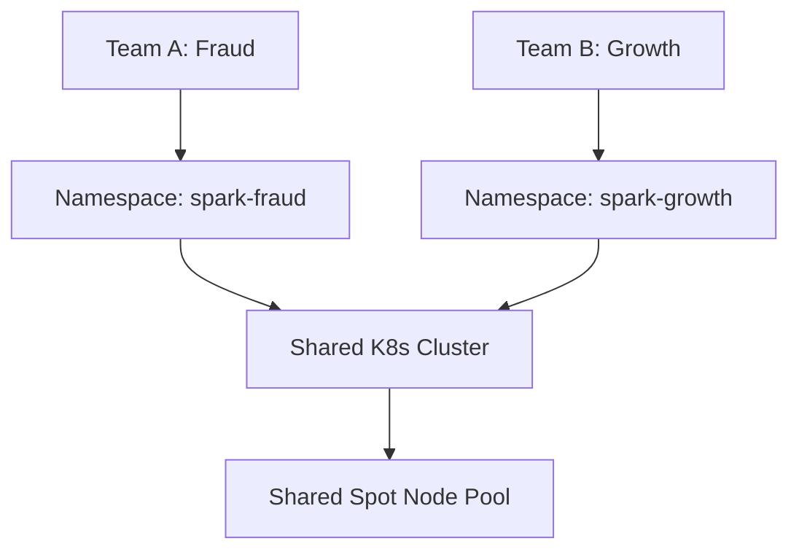

# Spark on Kubernetes — Real-World Production Examples

## Pattern 1: Airflow Triggering SparkApplication on K8s

```python
from airflow import DAG
from airflow.providers.cncf.kubernetes.operators.spark_kubernetes import SparkKubernetesOperator
from airflow.providers.cncf.kubernetes.sensors.spark_kubernetes import SparkKubernetesSensor
from datetime import datetime, timedelta

with DAG('daily_sales_pipeline', schedule_interval='0 6 * * *',
         start_date=datetime(2024, 1, 1), catchup=False) as dag:

    submit_etl = SparkKubernetesOperator(
        task_id='submit_sales_etl',
        namespace='spark-production',
        application_file='k8s/spark-apps/daily-sales-etl.yaml',
        kubernetes_conn_id='k8s_cluster',
        do_xcom_push=True,
    )

    monitor_etl = SparkKubernetesSensor(
        task_id='monitor_sales_etl',
        namespace='spark-production',
        application_name="{{ task_instance.xcom_pull(task_ids='submit_sales_etl')['metadata']['name'] }}",
        poke_interval=30,
        timeout=3600,
    )

    submit_etl >> monitor_etl
```

### SparkApplication YAML

```yaml
apiVersion: sparkoperator.k8s.io/v1beta2
kind: SparkApplication
metadata:
  name: daily-sales-etl-{{ ds_nodash }}
  namespace: spark-production
spec:
  type: Python
  mode: cluster
  image: 123456789.dkr.ecr.us-east-1.amazonaws.com/spark-etl:v2.3
  mainApplicationFile: s3a://code/jobs/daily_sales_etl.py
  arguments: ["--date={{ ds }}"]
  sparkConf:
    spark.sql.adaptive.enabled: "true"
    spark.eventLog.enabled: "true"
    spark.eventLog.dir: "s3a://spark-logs/history/"
  driver:
    cores: 2
    memory: "4g"
    serviceAccount: spark-driver-sa
    nodeSelector: { node-lifecycle: on-demand }
  executor:
    cores: 4
    memory: "8g"
    instances: 10
    nodeSelector: { node-lifecycle: spot }
    tolerations:
      - key: "spot-instance"
        operator: "Exists"
  restartPolicy:
    type: OnFailure
    onFailureRetries: 2
```

---

## Pattern 2: Multi-Tenant Spark on Shared K8s



**Per-team isolation:**

```yaml
apiVersion: v1
kind: ResourceQuota
metadata:
  name: team-quota
  namespace: spark-fraud
spec:
  hard:
    requests.cpu: "80"
    requests.memory: "320Gi"
    pods: "60"
```

Each team gets: dedicated namespace, ResourceQuota (hard cap), ServiceAccount with IRSA (team-specific S3 permissions), and pod labels for cost attribution via Kubecost.

---

## Pattern 3: EMR on EKS Migration

```python
import boto3

emr = boto3.client('emr-containers')

# Submit Spark job via EMR on EKS (managed runtime on your K8s nodes)
job_run = emr.start_job_run(
    virtualClusterId='vc-abc123',
    name='daily-sales-etl',
    executionRoleArn='arn:aws:iam::123456789:role/emr-spark-role',
    releaseLabel='emr-6.15.0-latest',
    jobDriver={
        'sparkSubmitJobDriver': {
            'entryPoint': 's3://code/jobs/etl.py',
            'sparkSubmitParameters': '--conf spark.executor.instances=10 --conf spark.executor.memory=8g'
        }
    },
)
```

| Feature | EMR Classic | EMR on EKS | DIY Spark on K8s |
|---------|-------------|------------|-----------------|
| Startup time | 5-10 min | 30-60s | 30-60s |
| Spark versions | Managed | Managed | Manual |
| Cost markup | 25% | ~15% | 0% |
| Customization | Limited | Medium | Full |

---

## Pattern 4: Production Observability

```yaml
# Prometheus ServiceMonitor for Spark metrics
apiVersion: monitoring.coreos.com/v1
kind: ServiceMonitor
metadata:
  name: spark-metrics
spec:
  selector:
    matchLabels: { spark-role: driver }
  endpoints:
  - port: spark-ui
    path: /metrics/prometheus
    interval: 15s
```

**Key metrics to alert on:**

| Metric | Alert When | Meaning |
|--------|-----------|---------|
| `executor_count` | == 0 while job running | Scheduling problem |
| `jvm_gc_pause` | > 10% of runtime | Memory pressure |
| `stage_failedTasks` | > 5% of total | Data/node issues |
| `job_duration` | > 2x historical | Performance regression |

---

## Cost Comparison: EMR vs EKS vs Databricks

Based on: 50 executors (r5.2xlarge), 8 hours/day, 30 days/month.

| Platform | Compute | Platform Fee | Total Monthly |
|----------|---------|-------------|---------------|
| EMR (On-Demand) | $6,000 | $1,500 | $8,000 |
| EMR (Spot) | $1,800 | $450 | $2,750 |
| DIY Spark on EKS (Spot) | $1,800 | $0 | $2,300 |
| Databricks Standard | $6,000 | $4,800 | $11,300 |

---

## Interview Tips

> **Tip 1:** "How do you trigger Spark jobs on K8s from Airflow?" — "SparkKubernetesOperator creates a SparkApplication CRD, then SparkKubernetesSensor polls until completion. This gives you declarative retry policies, native K8s status, and GitOps-friendly YAML. Alternative: KubernetesPodOperator running spark-submit directly."

> **Tip 2:** "How do you handle multi-tenancy on shared K8s?" — "Namespace-per-team with ResourceQuotas, LimitRanges for defaults, RBAC-scoped ServiceAccounts, and pod labels for cost attribution. PriorityClasses ensure production jobs preempt adhoc when resources are scarce."

> **Tip 3:** "When would you choose EMR on EKS over DIY?" — "When you want managed Spark version upgrades, EMR's optimized runtime (Spark Rapids, EMRFS), or simplified job submission via AWS APIs. DIY when you need full control, want to avoid vendor lock-in, or have a mature K8s platform team."
