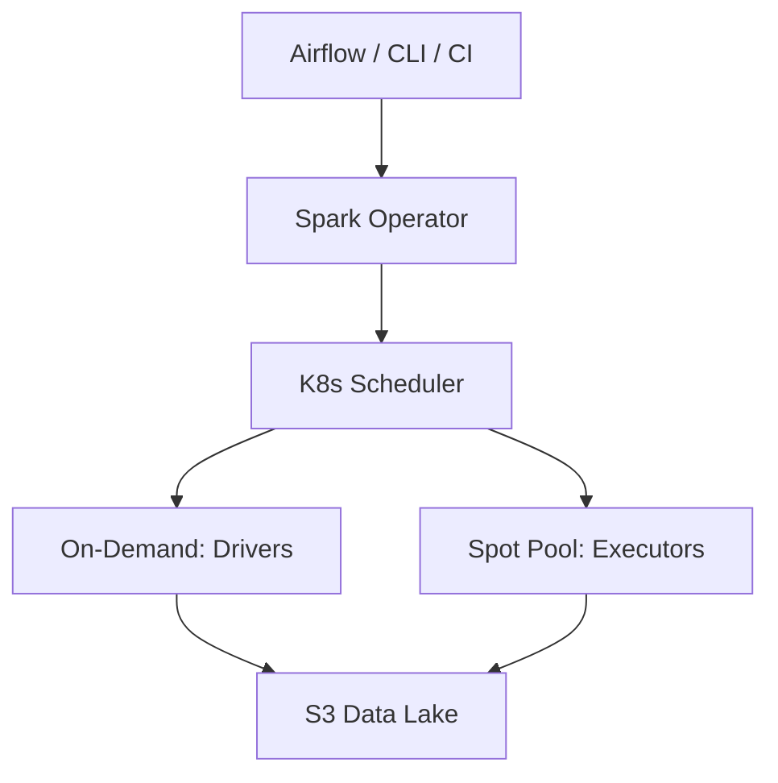

# Scenario Questions — Spark on Kubernetes

<article data-difficulty="junior">

## 🟢 Junior: Submit a Basic Spark Job to Kubernetes

**Scenario:** Your team has a PySpark ETL script (`daily_etl.py`) stored in S3. Submit it to an EKS cluster with 5 executors (4GB memory, 2 cores each). Image: `123456789.dkr.ecr.us-east-1.amazonaws.com/spark:3.5.0`.

<details>
<summary>✅ Solution</summary>

```bash
spark-submit \
    --master k8s://https://EKS-API-SERVER:443 \
    --deploy-mode cluster \
    --name daily-etl-job \
    --conf spark.kubernetes.container.image=123456789.dkr.ecr.us-east-1.amazonaws.com/spark:3.5.0 \
    --conf spark.kubernetes.namespace=spark-production \
    --conf spark.kubernetes.authenticate.driver.serviceAccountName=spark-driver-sa \
    --conf spark.executor.instances=5 \
    --conf spark.executor.memory=4g \
    --conf spark.executor.cores=2 \
    --conf spark.driver.memory=2g \
    --conf spark.hadoop.fs.s3a.aws.credentials.provider=com.amazonaws.auth.WebIdentityTokenCredentialsProvider \
    s3a://my-bucket/jobs/daily_etl.py
```

**Key points:**
- `--deploy-mode cluster` required for K8s (driver runs as a pod)
- ServiceAccount needs RBAC to create/delete pods
- IRSA provides S3 access without static credentials
- Monitor with: `kubectl get pods -n spark-production -w`

</details>

</article>

<article data-difficulty="mid-level">

## 🟡 Mid-Level: Configure Executors with Local SSD and Spot Toleration

**Scenario:** A shuffle-heavy job (50GB shuffle) on EKS. Executors need: 8GB memory (12GB limit), local NVMe SSDs on `i3.2xlarge` Spot nodes, Spot taint toleration, and pod anti-affinity across hosts. Driver on On-Demand.

<details>
<summary>✅ Solution</summary>

```yaml
# executor-pod-template.yaml
apiVersion: v1
kind: Pod
spec:
  nodeSelector:
    node-lifecycle: spot
    node.kubernetes.io/instance-type: i3.2xlarge
  tolerations:
    - key: "spot-instance"
      operator: "Exists"
      effect: "NoSchedule"
  affinity:
    podAntiAffinity:
      preferredDuringSchedulingIgnoredDuringExecution:
        - weight: 100
          podAffinityTerm:
            labelSelector:
              matchLabels:
                spark-role: executor
            topologyKey: kubernetes.io/hostname
  containers:
    - name: spark-executor
      resources:
        requests: { memory: "8Gi", cpu: "4" }
        limits: { memory: "12Gi", cpu: "4" }
      volumeMounts:
        - name: nvme-ssd
          mountPath: /mnt/nvme
  volumes:
    - name: nvme-ssd
      hostPath: { path: /mnt/local-ssd, type: Directory }
```

```bash
spark-submit \
    --master k8s://https://eks-api:443 \
    --deploy-mode cluster \
    --conf spark.kubernetes.driver.podTemplateFile=s3a://configs/driver-template.yaml \
    --conf spark.kubernetes.executor.podTemplateFile=s3a://configs/executor-template.yaml \
    --conf spark.local.dir=/mnt/nvme \
    --conf spark.executor.memory=8g \
    --conf spark.executor.cores=4 \
    --conf spark.dynamicAllocation.enabled=true \
    --conf spark.dynamicAllocation.shuffleTracking.enabled=true \
    --conf spark.task.maxFailures=8 \
    --conf spark.speculation=true \
    s3a://bucket/jobs/shuffle_heavy_etl.py
```

**Why these choices:** NVMe gives 500K+ IOPS for shuffle. Spot saves 70% but executors can die—`maxFailures=8` and speculation handle this. Anti-affinity spreads risk. Driver stays On-Demand because driver loss kills the job.

</details>

</article>

<article data-difficulty="senior">

## 🔴 Senior: Design a Production Spark-on-K8s Platform

**Scenario:** Design a platform for 50 data engineers (6 teams): <$80K/month, multi-tenancy, observability, 99% job success SLA, submittable from Airflow/CLI/CI.

<details>
<summary>✅ Solution</summary>



**Infrastructure — Node pools:**
- **Drivers:** 2-10x m5.xlarge On-Demand (always available)
- **Executors:** 0-80x r5.2xlarge Spot (diversified instance types)
- **NVMe:** 0-20x i3.2xlarge Spot (shuffle-heavy jobs, scale from zero)

**Multi-tenancy — Per-team isolation:**

```yaml
# Per-team: Namespace + ResourceQuota + ServiceAccount (IRSA)
apiVersion: v1
kind: ResourceQuota
metadata:
  name: team-quota
  namespace: spark-fraud
spec:
  hard:
    requests.cpu: "80"
    requests.memory: "320Gi"
    pods: "60"
```

**Scheduling:** FAIR scheduler with per-team pools (minShare guarantees). PriorityClasses: production=100, adhoc=50 (production preempts adhoc).

**Reliability:** SparkApplication CRD with `restartPolicy: OnFailure` (3 retries), `spark.task.maxFailures=8`, speculation enabled, shuffleTracking for dynamic allocation.

**Observability:** Prometheus metrics from Spark UI endpoint → Grafana dashboards. Alerts on: zero executors, OOM kills, jobs > 2hrs. Kubecost for per-team cost attribution via pod labels.

**Cost model:**

| Component | Monthly |
|-----------|---------|
| Driver nodes (4x On-Demand) | $2,200 |
| Executor nodes (avg 30 Spot, 10hr/day) | $9,000 |
| Platform services | $500 |
| S3 + networking | $2,000 |
| **Total** | **~$14K** (scales to ~$45K at peak) |

</details>

</article>

---

## Interview Tips

> **Tip 1:** "How do you approach a platform design question?" — "Layer it: infrastructure (node pools, autoscaling), platform (operator, monitoring), tenancy (namespaces, quotas, RBAC), developer experience (submission API, templates). Address cost, isolation, reliability, and observability explicitly."

> **Tip 2:** "How do you achieve cost savings vs EMR?" — "Three levers: Spot instances (70% savings), autoscaling from zero (no idle compute), shared cluster (higher utilization). Combined with eliminating EMR's 25% markup, this typically yields 60-80% savings."

> **Tip 3:** "How do you handle multi-tenancy failures?" — "ResourceQuotas prevent one team from consuming all resources. PriorityClasses ensure production preempts adhoc. Separate ServiceAccounts with RBAC prevent cross-team interference. Pod anti-affinity spreads fault domains."
