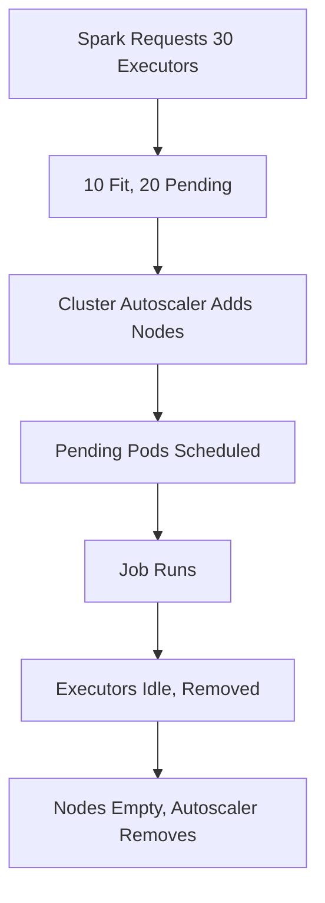

# Spark on Kubernetes — Senior Deep Dive

## Shuffle Performance

Shuffle is the most expensive Spark operation. On K8s, storage choices dramatically impact performance.

| Storage | IOPS | Latency | Survives Pod Death | Best For |
|---------|------|---------|--------------------|----------|
| Local NVMe (hostPath) | 500K+ | <0.1ms | No | Large shuffles |
| emptyDir (node disk) | 50-100K | <1ms | No | General workloads |
| PVC (gp3 EBS) | 16K | 1-5ms | Yes | Shared shuffle |
| Remote Shuffle Service | Varies | 5-20ms | Yes | Spot + dynamic alloc |

### NVMe Configuration

```bash
spark-submit \
    --conf spark.kubernetes.executor.volumes.hostPath.nvme.mount.path=/mnt/nvme \
    --conf spark.kubernetes.executor.volumes.hostPath.nvme.options.path=/mnt/local-ssd \
    --conf spark.local.dir=/mnt/nvme \
    ...
```

### Remote Shuffle Service (Celeborn)

For Spot instances, a remote shuffle service decouples shuffle data from executor lifecycle:

```yaml
sparkConf:
  spark.shuffle.manager: "org.apache.spark.shuffle.celeborn.SparkShuffleManager"
  spark.celeborn.master.endpoints: "celeborn-master:9097"
  spark.celeborn.client.push.replicate.enabled: "true"
```

---

## Cost Optimization with Spot Instances

```yaml
# Executors on Spot (70% savings), driver on On-Demand (reliability)
executor:
  nodeSelector: { node-lifecycle: spot }
  tolerations:
    - key: "spot-instance"
      operator: "Exists"
driver:
  nodeSelector: { node-lifecycle: on-demand }
```

| Instance (AWS) | On-Demand/hr | Spot/hr | Savings |
|----------------|-------------|---------|---------|
| r5.2xlarge | $0.504 | $0.15 | 70% |
| i3.2xlarge (NVMe) | $0.624 | $0.19 | 70% |

### Handling Spot Interruptions

```python
spark = SparkSession.builder \
    .config("spark.task.maxFailures", "8") \
    .config("spark.speculation", "true") \
    .config("spark.speculation.multiplier", "1.5") \
    .config("spark.dynamicAllocation.shuffleTracking.enabled", "true") \
    .getOrCreate()
```

**Key insight:** Executor loss is recoverable (Spark retries tasks). Driver loss kills the job — always run driver On-Demand.

---

## Auto-Scaling: Cluster Autoscaler + Dynamic Allocation



### Configuration

```bash
spark-submit \
    --conf spark.dynamicAllocation.enabled=true \
    --conf spark.dynamicAllocation.minExecutors=2 \
    --conf spark.dynamicAllocation.maxExecutors=50 \
    --conf spark.dynamicAllocation.schedulerBacklogTimeout=10s \
    --conf spark.dynamicAllocation.executorIdleTimeout=120s \
    --conf spark.kubernetes.allocation.batch.size=10 \
    ...
```

| Timing | Purpose | Value |
|--------|---------|-------|
| `schedulerBacklogTimeout` | Request more executors when tasks queue | 5-10s |
| `executorIdleTimeout` | Remove idle executors | 60-120s |
| Autoscaler scale-up | Time to provision new node | 60-180s |

---

## Monitoring: Prometheus + Grafana

```bash
# Enable Prometheus metrics sink
--conf spark.ui.prometheus.enabled=true
--conf spark.metrics.appStatusSource.enabled=true
```

```yaml
apiVersion: monitoring.coreos.com/v1
kind: ServiceMonitor
metadata:
  name: spark-metrics
spec:
  selector:
    matchLabels: { spark-role: driver }
  endpoints:
  - port: spark-ui
    path: /metrics/prometheus
    interval: 15s
```

| Metric | Alert When |
|--------|-----------|
| `executor_count` | 0 while job running |
| `jvm_gc_pause` | >10% of runtime |
| `stage_failedTasks` | >5% of total |
| `executor_memoryUsed` | >80% allocated |

---

## Security

### Pod Security

```yaml
spec:
  securityContext:
    runAsNonRoot: true
    runAsUser: 185
  containers:
  - securityContext:
      allowPrivilegeEscalation: false
      readOnlyRootFilesystem: true
      capabilities: { drop: ["ALL"] }
```

### Network Policies

```yaml
apiVersion: networking.k8s.io/v1
kind: NetworkPolicy
metadata:
  name: spark-policy
spec:
  podSelector:
    matchLabels: { app: spark }
  ingress:
  - from:
    - podSelector: { matchLabels: { app: spark } }
  egress:
  - to:
    - ipBlock: { cidr: "0.0.0.0/0" }
    ports: [{ port: 443, protocol: TCP }]  # S3 access only
```

---

## Spark History Server on K8s

```yaml
apiVersion: apps/v1
kind: Deployment
metadata:
  name: spark-history-server
spec:
  template:
    spec:
      containers:
      - name: history
        image: apache/spark:3.5.0
        command: ["/opt/spark/sbin/start-history-server.sh"]
        env:
        - name: SPARK_HISTORY_OPTS
          value: "-Dspark.history.fs.logDirectory=s3a://logs/history/ -Dspark.history.ui.port=18080"
```

Enable in jobs: `--conf spark.eventLog.enabled=true --conf spark.eventLog.dir=s3a://logs/history/`

---

## Interview Tips

> **Tip 1:** "How do you optimize shuffle on K8s?" — "Storage type is the biggest lever: local NVMe at 500K+ IOPS vs EBS at 16K. Set spark.local.dir to NVMe hostPath. For Spot instances, deploy Celeborn (remote shuffle service) to decouple shuffle data from executor lifecycle."

> **Tip 2:** "How do Spot instances work with Spark on K8s?" — "Executors on Spot (70% savings), driver on On-Demand. Handle interruptions with maxFailures=8, speculation=true, and shuffleTracking. Executor loss is recoverable; driver loss is fatal."

> **Tip 3:** "Explain Cluster Autoscaler and dynamic allocation interaction." — "Spark requests executor pods → pending pods trigger Autoscaler to add nodes (60-180s) → pods schedule. On scale-down: Spark removes idle executors → pods terminate → empty nodes removed. Tune batch.size and schedulerBacklogTimeout to avoid thrashing."

## ⚡ Cheat Sheet

**K8s Spark Submit Essentials**
```bash
spark-submit \
  --master k8s://https://<k8s-api>:6443 \
  --deploy-mode cluster \
  --conf spark.kubernetes.container.image=my-spark:3.5 \
  --conf spark.executor.instances=10 \
  --conf spark.kubernetes.namespace=spark-jobs \
  app.py
```

**Shuffle Storage Decision**
| Option | IOPS | Survives Pod Death | Use When |
|--------|------|--------------------|----------|
| Local NVMe (hostPath) | 500K+ | No | Large shuffles, cost-sensitive |
| emptyDir | 50–100K | No | General workloads |
| PVC (EBS/EFS) | 16K–100K | Yes | Speculative or long jobs |
| Remote shuffle (Magnet/Uniffle) | Network-bound | Yes | Multi-tenant, shuffle reuse |

**Resource Configuration**
```yaml
# executor pod template
resources:
  requests: { cpu: "2", memory: "4Gi" }
  limits:   { cpu: "4", memory: "6Gi" }  # memory limit > request for overhead
# spark.executor.memoryOverheadFactor=0.1 (min 384Mi)
```

**Autoscaling**
- `spark.dynamicAllocation.enabled=true` with shuffle service or external shuffle (required on K8s)
- K8s KEDA scaler: scale on Spark queue depth metric
- Node autoscaling: Cluster Autoscaler or Karpenter (faster, bin-packing aware)

**Cost Optimization**
- Spot/Preemptible instances for executors (not driver); enable speculative execution
- `spark.kubernetes.allocation.batch.size=25` — limits pod burst rate
- Use Volcano scheduler for gang scheduling (all executors start together or not at all)

**Interview Traps**
- Spark on K8s does NOT use YARN — no ResourceManager; K8s API server IS the cluster manager
- Driver must be reachable from executors — use headless service or pod IP with `spark.driver.bindAddress`
- Default K8s scheduler can cause partial allocation (some executors pending) — use Volcano for gang scheduling
