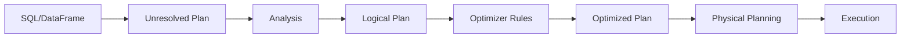

# PySpark Spark SQL — Senior Deep Dive

## Query Plan Optimization Pipeline

Spark SQL queries go through multiple optimization phases before execution:



```python
# Inspect all plan phases
df = spark.sql("""
    SELECT c.name, SUM(o.amount) AS total
    FROM orders o JOIN customers c ON o.customer_id = c.id
    WHERE o.year = 2024 AND c.region = 'US'
    GROUP BY c.name
""")

# Show all optimization stages
df.explain(mode="extended")
```

Output reveals four plans:
1. **Parsed Logical Plan** — Raw representation of the query
2. **Analyzed Logical Plan** — Resolved column names, types, table references
3. **Optimized Logical Plan** — After optimizer rules (pushdown, pruning)
4. **Physical Plan** — Concrete execution strategy with algorithms chosen

---

## Predicate Pushdown Verification

Predicate pushdown moves filters as close to the data source as possible:

```python
# Create a partitioned Parquet table
spark.sql("""
    CREATE TABLE events 
    USING parquet
    PARTITIONED BY (year, month)
    AS SELECT * FROM raw_events
""")

# Query with filters
filtered = spark.sql("""
    SELECT event_type, COUNT(*)
    FROM events
    WHERE year = 2024 
      AND month = 1
      AND event_type = 'purchase'
      AND amount > 100
    GROUP BY event_type
""")

# Verify pushdown
filtered.explain(mode="formatted")
```

Expected output shows pushdown:
```
FileScan parquet [event_type, amount]
  Partition Filters: [year = 2024, month = 1]     ← PARTITION PRUNING
  Pushed Filters: [IsNotNull(event_type),          ← PUSHED TO PARQUET
                    EqualTo(event_type, purchase),
                    GreaterThan(amount, 100)]
```

### When Pushdown Fails

```python
# UDF breaks pushdown — optimizer can't analyze Python function
from pyspark.sql.functions import udf
from pyspark.sql.types import BooleanType

@udf(BooleanType())
def is_valid_event(event_type):
    return event_type in ["purchase", "refund"]

# This filter CANNOT be pushed down
broken = spark.sql("SELECT * FROM events").filter(is_valid_event("event_type"))
broken.explain()
# Filter UDF(event_type) ← stays in Spark, not pushed to storage

# Fix: use native SQL expression
fixed = spark.sql("""
    SELECT * FROM events 
    WHERE event_type IN ('purchase', 'refund')
""")
fixed.explain()
# Pushed Filters: [In(event_type, [purchase, refund])] ← pushed!
```

---

## Partition Pruning

Spark eliminates entire partitions that don't match filter predicates:

```python
# Static partition pruning — filter on partition column directly
spark.sql("""
    SELECT * FROM events 
    WHERE year = 2024 AND month BETWEEN 1 AND 3
""").explain()
# PartitionFilters: [year=2024, month IN (1,2,3)]
# Only reads 3 partitions instead of all

# Dynamic partition pruning (DPP) — Spark 3.0+
# Filter on non-partition column that gets resolved at runtime
spark.sql("""
    SELECT e.*
    FROM events e
    JOIN dim_regions r ON e.region_id = r.id
    WHERE r.country = 'US'
""").explain()
# DPP: Spark builds a broadcast filter from dim_regions
# and prunes event partitions at runtime

# Verify DPP is enabled
spark.conf.get("spark.sql.optimizer.dynamicPartitionPruning.enabled")  # true
```

---

## Join Hints

When the optimizer makes suboptimal join decisions, hints override the strategy:

```python
# Broadcast hint — force broadcast for small table
spark.sql("""
    SELECT /*+ BROADCAST(small_table) */ 
        l.*, s.category_name
    FROM large_table l
    JOIN small_table s ON l.category_id = s.id
""")

# Shuffle merge join hint — force sort-merge for large-large joins
spark.sql("""
    SELECT /*+ MERGE(t1, t2) */
        t1.*, t2.score
    FROM transactions t1
    JOIN scores t2 ON t1.user_id = t2.user_id
""")

# Shuffle hash join — good when one side is moderately smaller
spark.sql("""
    SELECT /*+ SHUFFLE_HASH(medium_table) */
        l.*, m.label
    FROM large_table l
    JOIN medium_table m ON l.key = m.key
""")

# Shuffle replicate NL — for intentional cartesian (rare)
spark.sql("""
    SELECT /*+ SHUFFLE_REPLICATE_NL(small_config) */
        d.*, c.multiplier
    FROM data d
    CROSS JOIN small_config c
""")
```

### Join Strategy Decision Matrix

| Left Table | Right Table | Best Strategy | Why |
|------------|-------------|---------------|-----|
| Large | Small (< 10MB) | BroadcastHashJoin | Avoids shuffle entirely |
| Large | Medium (10MB-1GB) | ShuffleHashJoin | One-side build, less memory |
| Large | Large | SortMergeJoin | Scales to any size |
| Any | Any (no equi-join) | BroadcastNestedLoop | Expensive — avoid if possible |

---

## Spark SQL vs Native DataFrame Performance

```python
import time
from pyspark.sql import functions as F

# Benchmark: SQL approach
start = time.time()
sql_result = spark.sql("""
    SELECT
        region,
        product_category,
        SUM(revenue) AS total_revenue,
        COUNT(DISTINCT customer_id) AS unique_customers,
        AVG(order_value) AS avg_order
    FROM sales_fact
    WHERE sale_date BETWEEN '2024-01-01' AND '2024-03-31'
    GROUP BY region, product_category
    ORDER BY total_revenue DESC
""")
sql_result.write.mode("overwrite").parquet("/tmp/sql_bench")
sql_time = time.time() - start

# Benchmark: DataFrame approach
start = time.time()
df_result = (sales_df
    .filter(
        (F.col("sale_date") >= "2024-01-01") &
        (F.col("sale_date") <= "2024-03-31")
    )
    .groupBy("region", "product_category")
    .agg(
        F.sum("revenue").alias("total_revenue"),
        F.countDistinct("customer_id").alias("unique_customers"),
        F.avg("order_value").alias("avg_order"),
    )
    .orderBy(F.desc("total_revenue"))
)
df_result.write.mode("overwrite").parquet("/tmp/df_bench")
df_time = time.time() - start

print(f"SQL: {sql_time:.2f}s, DataFrame: {df_time:.2f}s")
# Typically within 1-2% of each other — same underlying plan
```

### Verify Plans Are Identical

```python
# Compare physical plans
sql_plan = sql_result._jdf.queryExecution().executedPlan().toString()
df_plan = df_result._jdf.queryExecution().executedPlan().toString()

# They should be structurally identical
assert sql_plan == df_plan, "Plans differ!"
```

> **Key Insight:** SQL and DataFrame API differences are purely syntactic. The Catalyst optimizer produces identical plans. Choose based on team preference and readability.

---

## Advanced Plan Analysis

```python
# Access the query execution object programmatically
query_execution = df._jdf.queryExecution()

# Logical plan (before optimization)
print("=== Analyzed Plan ===")
print(query_execution.analyzed().toString())

# Optimized logical plan
print("=== Optimized Plan ===")
print(query_execution.optimizedPlan().toString())

# Physical plan with metrics
print("=== Physical Plan ===")
print(query_execution.executedPlan().toString())

# After execution — plan with actual metrics
df.collect()
print("=== Metrics ===")
print(query_execution.executedPlan().treeString())
```

---

## Cost-Based Optimization (CBO)

```python
# Enable CBO
spark.conf.set("spark.sql.cbo.enabled", "true")
spark.conf.set("spark.sql.cbo.joinReorder.enabled", "true")

# Generate table statistics for CBO
spark.sql("ANALYZE TABLE orders COMPUTE STATISTICS")
spark.sql("ANALYZE TABLE orders COMPUTE STATISTICS FOR COLUMNS customer_id, amount, order_date")

# Verify statistics
spark.sql("DESCRIBE EXTENDED orders").show(truncate=False)

# CBO uses statistics to:
# 1. Estimate result sizes accurately
# 2. Choose optimal join order for multi-table joins
# 3. Select join strategy (broadcast vs shuffle)
# 4. Determine optimal aggregation strategy
```

---

## Interview Tips

> **Tip 1:** "How do you verify predicate pushdown is working?" — "Call explain('formatted') and look at the FileScan node. Pushed Filters shows predicates sent to the storage layer, and Partition Filters shows partition pruning. If a filter appears above the scan as a separate Filter node, it wasn't pushed down. Common reasons for failure: UDFs in the filter, non-deterministic expressions, filters on derived columns, or the data source doesn't support the predicate type."

> **Tip 2:** "When would you use join hints?" — "When the optimizer's statistics are stale or unavailable and it picks the wrong join strategy. Common case: the optimizer doesn't know a table is small enough to broadcast because statistics haven't been computed. I'd add a BROADCAST hint for tables under ~100MB. For very large joins where both sides are big, MERGE hint ensures a scalable sort-merge join. I always verify with EXPLAIN and only hint when necessary — hints override the optimizer's intelligence."

> **Tip 3:** "Is there a performance difference between SQL and DataFrame API?" — "No measurable difference. Both compile to the same Catalyst logical plan, go through the same optimizer rules, and produce identical physical plans. I've verified this by comparing executedPlan().toString() output. The choice is purely about readability, team skills, and composability. SQL reads better for analytics queries; DataFrame API is better for programmatic pipelines with dynamic logic."
