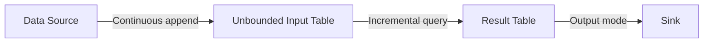

# PySpark Structured Streaming — Fundamentals

## What Is Structured Streaming?

Structured Streaming treats a live data stream as an unbounded table that grows continuously. You write batch-like DataFrame queries, and Spark executes them incrementally as new data arrives.

> **Key Insight:** The programming model is identical to batch DataFrames. The engine handles the complexity of incremental processing, fault tolerance, and exactly-once guarantees.

---

## Core Concepts



| Concept | Meaning |
|---------|---------|
| **Input Table** | All data ever received, treated as a growing table |
| **Query** | DataFrame/SQL operations on the input table |
| **Result Table** | Output of the query, updated incrementally |
| **Output Mode** | How results are written to the sink |
| **Trigger** | When to process new data |
| **Checkpoint** | Where to store progress for fault recovery |

---

## readStream — Reading Streaming Data

```python
from pyspark.sql import SparkSession
from pyspark.sql.types import StructType, StructField, StringType, DoubleType, TimestampType

spark = SparkSession.builder.appName("StreamingFundamentals").getOrCreate()

# Read from Kafka
kafka_stream = (spark.readStream
    .format("kafka")
    .option("kafka.bootstrap.servers", "broker1:9092,broker2:9092")
    .option("subscribe", "user_events")
    .option("startingOffsets", "latest")
    .load())

# Read from file source (new files = new data)
schema = StructType([
    StructField("user_id", StringType()),
    StructField("event_type", StringType()),
    StructField("amount", DoubleType()),
    StructField("timestamp", TimestampType()),
])

file_stream = (spark.readStream
    .format("json")
    .schema(schema)  # Schema required for streaming
    .option("maxFilesPerTrigger", 10)  # Rate limiting
    .load("hdfs:///data/events/incoming/"))

# Read from socket (testing only)
socket_stream = (spark.readStream
    .format("socket")
    .option("host", "localhost")
    .option("port", 9999)
    .load())

# Read from Delta Lake
delta_stream = (spark.readStream
    .format("delta")
    .option("maxFilesPerTrigger", 100)
    .load("/data/delta/events/"))
```

---

## Processing Stream Data

Stream DataFrames support the same operations as batch DataFrames:

```python
from pyspark.sql import functions as F

# Parse Kafka messages
parsed_events = (kafka_stream
    .selectExpr("CAST(value AS STRING) AS json_str")
    .select(F.from_json("json_str", schema).alias("data"))
    .select("data.*")
)

# Apply transformations (same as batch!)
enriched = (parsed_events
    .filter(F.col("event_type") == "purchase")
    .withColumn("event_hour", F.hour("timestamp"))
    .withColumn("amount_tier", 
        F.when(F.col("amount") > 100, "high")
         .when(F.col("amount") > 10, "medium")
         .otherwise("low"))
)

# Aggregation
hourly_revenue = (parsed_events
    .filter(F.col("event_type") == "purchase")
    .groupBy(F.window("timestamp", "1 hour"), "event_type")
    .agg(
        F.sum("amount").alias("total_revenue"),
        F.count("*").alias("event_count"),
    )
)
```

---

## writeStream — Writing Results

```python
# Write to console (development/debugging)
console_query = (enriched.writeStream
    .format("console")
    .outputMode("append")
    .option("truncate", False)
    .start())

# Write to Kafka
kafka_output = (enriched
    .selectExpr("user_id AS key", "to_json(struct(*)) AS value")
    .writeStream
    .format("kafka")
    .option("kafka.bootstrap.servers", "broker1:9092")
    .option("topic", "processed_events")
    .option("checkpointLocation", "hdfs:///checkpoints/processed_events/")
    .start())

# Write to Parquet files
file_output = (enriched.writeStream
    .format("parquet")
    .outputMode("append")
    .option("path", "hdfs:///data/processed/events/")
    .option("checkpointLocation", "hdfs:///checkpoints/events_parquet/")
    .partitionBy("event_hour")
    .trigger(processingTime="5 minutes")
    .start())

# Write to Delta Lake
delta_output = (enriched.writeStream
    .format("delta")
    .outputMode("append")
    .option("checkpointLocation", "hdfs:///checkpoints/events_delta/")
    .start("/data/delta/processed_events/"))
```

---

## Triggers — When to Process

```python
# Default: process as soon as previous batch finishes
query = enriched.writeStream.trigger(processingTime="0 seconds").start()

# Fixed interval: process every 5 minutes
query = enriched.writeStream.trigger(processingTime="5 minutes").start()

# Once: process all available data then stop (great for catch-up)
query = enriched.writeStream.trigger(once=True).start()

# Available-now (Spark 3.3+): like once but processes in micro-batches
query = enriched.writeStream.trigger(availableNow=True).start()
```

| Trigger | Behavior | Use Case |
|---------|----------|----------|
| `processingTime="0s"` | Continuous micro-batches | Low latency |
| `processingTime="5m"` | Process every 5 minutes | Cost efficiency |
| `once=True` | Process all pending, then stop | Scheduled backfill |
| `availableNow=True` | Process all pending in batches | Large catch-up |

---

## Output Modes

```python
# APPEND: Only new rows added to result table (default)
# Use for: filters, maps, non-aggregation queries
enriched.writeStream.outputMode("append").start()

# COMPLETE: Entire result table output each trigger
# Use for: aggregations where you need full result
hourly_revenue.writeStream.outputMode("complete").start()

# UPDATE: Only changed rows output each trigger
# Use for: aggregations where you only need deltas
hourly_revenue.writeStream.outputMode("update").start()
```

| Output Mode | What's Written | Supports | Use When |
|-------------|---------------|----------|----------|
| **Append** | Only new rows | Map, filter, join (no agg) | Streaming to files/Kafka |
| **Complete** | Full result table | Aggregations | Dashboard refresh |
| **Update** | Changed rows only | Aggregations | Incremental updates |

---

## Checkpointing — Fault Tolerance

Checkpointing stores the streaming query's progress so it can recover from failures:

```python
query = (enriched.writeStream
    .format("delta")
    .outputMode("append")
    .option("checkpointLocation", "hdfs:///checkpoints/my_query/")
    .start("/data/output/"))
```

**What's stored in the checkpoint:**
- Current read offsets (e.g., Kafka offsets)
- State data for aggregations
- Metadata about committed output batches

> **Critical:** Every streaming query MUST have a unique checkpoint location. Sharing checkpoints between queries causes data corruption.

---

## Monitoring Streaming Queries

```python
# Get active queries
spark.streams.active

# Query progress
query = enriched.writeStream.format("console").start()

# Check status
print(query.status)
# {'message': 'Processing new data', 'isDataAvailable': True, ...}

# Last progress report
print(query.lastProgress)
# {'id': '...', 'runId': '...', 'batchId': 5, 'numInputRows': 1000, ...}

# Recent progress reports
for p in query.recentProgress:
    print(f"Batch {p['batchId']}: {p['numInputRows']} rows in {p['batchDuration']}ms")

# Stop query gracefully
query.stop()

# Wait for termination
query.awaitTermination(timeout=3600)  # Wait up to 1 hour
```

---

## Complete Example: Streaming ETL Pipeline

```python
from pyspark.sql import SparkSession, functions as F
from pyspark.sql.types import *

spark = SparkSession.builder.appName("StreamETL").getOrCreate()

# Define schema for incoming events
event_schema = StructType([
    StructField("user_id", StringType()),
    StructField("action", StringType()),
    StructField("page", StringType()),
    StructField("timestamp", LongType()),
])

# Read from Kafka
raw_stream = (spark.readStream
    .format("kafka")
    .option("kafka.bootstrap.servers", "kafka:9092")
    .option("subscribe", "web_events")
    .option("startingOffsets", "earliest")
    .load())

# Parse and transform
events = (raw_stream
    .selectExpr("CAST(value AS STRING)")
    .select(F.from_json("value", event_schema).alias("event"))
    .select("event.*")
    .withColumn("event_time", F.from_unixtime("timestamp").cast("timestamp"))
    .withColumn("event_date", F.to_date("event_time"))
    .filter(F.col("user_id").isNotNull())
)

# Write to Delta Lake partitioned by date
query = (events.writeStream
    .format("delta")
    .outputMode("append")
    .option("checkpointLocation", "hdfs:///checkpoints/web_events/")
    .partitionBy("event_date")
    .trigger(processingTime="1 minute")
    .start("/data/delta/web_events/"))

query.awaitTermination()
```

---

## Interview Tips

> **Tip 1:** "Explain Structured Streaming in simple terms." — "Structured Streaming treats a data stream as an ever-growing table. You write standard DataFrame queries, and Spark executes them incrementally — only processing new data each trigger. It handles fault tolerance through checkpointing (storing offsets and state) and guarantees exactly-once processing when paired with idempotent sinks like Delta Lake."

> **Tip 2:** "What are the three output modes?" — "Append writes only new rows — use for non-aggregation queries writing to files or Kafka. Complete writes the entire result table each trigger — use for aggregations feeding dashboards. Update writes only rows that changed — use for aggregations where downstream can handle upserts. The choice depends on your query type and sink capabilities."

> **Tip 3:** "Why is checkpointing important?" — "Checkpointing stores the query's read progress (offsets), state data (for aggregations), and committed batch metadata. On failure, the query resumes exactly where it left off without reprocessing or missing data. Without checkpointing, a restart would either reprocess everything or lose data. Each query needs its own unique checkpoint directory."
