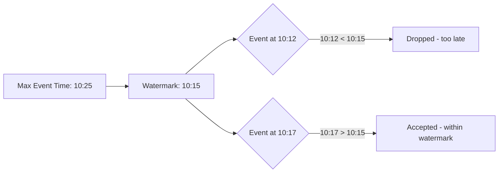

# PySpark Structured Streaming — Intermediate

## Watermarks — Handling Late Data

In real systems, data arrives late. Watermarks tell Spark how long to wait for late data before finalizing results:

```python
from pyspark.sql import functions as F

# Define watermark: accept data up to 10 minutes late
events_with_watermark = (events
    .withWatermark("event_time", "10 minutes")
)

# Windowed aggregation WITH watermark
windowed_counts = (events_with_watermark
    .groupBy(
        F.window("event_time", "5 minutes"),  # 5-minute tumbling windows
        "event_type"
    )
    .agg(
        F.count("*").alias("event_count"),
        F.sum("amount").alias("total_amount"),
    )
)

# Spark will:
# 1. Keep state for windows that might still receive late data
# 2. Drop events older than watermark (event_time < max_event_time - 10min)
# 3. Emit final results once a window + watermark has passed
```

### Watermark Behavior



| Watermark Duration | Late Data Tolerance | State Size | Use Case |
|-------------------|--------------------|-----------:|----------|
| 0 seconds | None | Minimal | When lateness is impossible |
| 10 minutes | 10 min late data OK | Moderate | Normal streaming |
| 1 hour | 1 hour late data OK | Large | Mobile/IoT with connectivity gaps |
| 24 hours | 1 day late data OK | Very large | Cross-timezone batch uploads |

---

## Window Operations

### Tumbling Windows (Non-overlapping)

```python
# Every event belongs to exactly one 5-minute window
tumbling = (events_with_watermark
    .groupBy(F.window("event_time", "5 minutes"))
    .agg(F.count("*").alias("events"))
)
# Windows: [10:00-10:05], [10:05-10:10], [10:10-10:15], ...
```

### Sliding Windows (Overlapping)

```python
# 10-minute windows, sliding every 5 minutes
# Each event can appear in multiple windows
sliding = (events_with_watermark
    .groupBy(F.window("event_time", "10 minutes", "5 minutes"))
    .agg(F.count("*").alias("events"))
)
# Windows: [10:00-10:10], [10:05-10:15], [10:10-10:20], ...
```

### Session Windows (Spark 3.2+)

```python
# Dynamic windows based on activity gaps
# New session starts after 15 minutes of inactivity per user
sessions = (events_with_watermark
    .groupBy(
        F.session_window("event_time", "15 minutes"),
        "user_id"
    )
    .agg(
        F.count("*").alias("actions_in_session"),
        F.sum("amount").alias("session_revenue"),
        F.min("event_time").alias("session_start"),
        F.max("event_time").alias("session_end"),
    )
)
```

---

## Stream-Stream Joins

Join two live streams together (e.g., match ad impressions with clicks):

```python
# Stream 1: Ad impressions
impressions = (spark.readStream
    .format("kafka")
    .option("subscribe", "impressions")
    .load()
    .select(
        F.col("value").cast("string").alias("impression_id"),
        F.col("timestamp").alias("impression_time"),
        F.get_json_object("value", "$.ad_id").alias("ad_id"),
        F.get_json_object("value", "$.user_id").alias("user_id"),
    )
    .withWatermark("impression_time", "2 hours")
)

# Stream 2: Ad clicks
clicks = (spark.readStream
    .format("kafka")
    .option("subscribe", "clicks")
    .load()
    .select(
        F.col("value").cast("string").alias("click_id"),
        F.col("timestamp").alias("click_time"),
        F.get_json_object("value", "$.ad_id").alias("ad_id"),
        F.get_json_object("value", "$.user_id").alias("user_id"),
    )
    .withWatermark("click_time", "3 hours")
)

# Join: match clicks to impressions within 1 hour
matched = impressions.join(
    clicks,
    on=[
        impressions.ad_id == clicks.ad_id,
        impressions.user_id == clicks.user_id,
        # Time-bound condition: click within 1 hour of impression
        clicks.click_time.between(
            impressions.impression_time,
            impressions.impression_time + F.expr("INTERVAL 1 HOUR")
        ),
    ],
    how="leftOuter"  # Keep impressions without clicks
)
```

> **Important:** Stream-stream joins REQUIRE watermarks on both streams and a time-range condition. Without these, state grows unbounded.

---

## Stream-Static Joins

Join a stream against a static (batch) DataFrame — useful for enrichment:

```python
# Static dimension table (loaded once, used for all batches)
product_dim = spark.read.parquet("hdfs:///data/dimensions/products/")

# Stream of sales events
sales_stream = (spark.readStream
    .format("kafka")
    .option("subscribe", "sales")
    .load()
    .select(F.from_json("value", sales_schema).alias("sale"))
    .select("sale.*")
)

# Join stream with static table — no watermark needed
enriched_sales = sales_stream.join(
    product_dim,
    on="product_id",
    how="left"  # Keep sales even if product not found
)

# Write enriched results
(enriched_sales.writeStream
    .format("delta")
    .outputMode("append")
    .option("checkpointLocation", "hdfs:///checkpoints/enriched_sales/")
    .start("/data/delta/enriched_sales/"))
```

> **Note:** Static DataFrames are NOT refreshed automatically. If the dimension table changes, restart the query or use `foreachBatch` to reload periodically.

---

## foreach and foreachBatch Sinks

### foreachBatch — Custom Batch Processing

```python
def write_to_multiple_sinks(batch_df, batch_id):
    """Process each micro-batch with custom logic."""
    # Write to Delta Lake
    batch_df.write.mode("append").format("delta").save("/data/delta/events/")
    
    # Write aggregates to PostgreSQL
    aggregated = batch_df.groupBy("event_type").count()
    (aggregated.write
        .mode("append")
        .format("jdbc")
        .option("url", "jdbc:postgresql://db:5432/analytics")
        .option("dbtable", "event_counts")
        .option("user", "spark")
        .option("password", "secret")
        .save())
    
    # Publish metrics
    total = batch_df.count()
    publish_metric("events_processed", total, batch_id=batch_id)

query = (events.writeStream
    .foreachBatch(write_to_multiple_sinks)
    .option("checkpointLocation", "hdfs:///checkpoints/multi_sink/")
    .trigger(processingTime="1 minute")
    .start())
```

### foreach — Row-Level Custom Processing

```python
from pyspark.sql import Row

class RedisWriter:
    """Write each row to Redis."""
    
    def open(self, partition_id, epoch_id):
        import redis
        self.redis_client = redis.Redis(host="redis", port=6379)
        return True
    
    def process(self, row):
        key = f"user:{row.user_id}:last_event"
        value = f"{row.event_type}:{row.event_time}"
        self.redis_client.set(key, value, ex=3600)
    
    def close(self, error):
        if self.redis_client:
            self.redis_client.close()

query = (events.writeStream
    .foreach(RedisWriter())
    .option("checkpointLocation", "hdfs:///checkpoints/redis_writer/")
    .start())
```

---

## Practical Patterns

### Rate Limiting Input

```python
# Kafka: limit records per trigger
stream = (spark.readStream
    .format("kafka")
    .option("maxOffsetsPerTrigger", 100000)  # Max 100K msgs per batch
    .load())

# File source: limit files per trigger
stream = (spark.readStream
    .format("json")
    .option("maxFilesPerTrigger", 5)
    .load(path))
```

### Deduplication

```python
# Remove duplicates within the watermark window
deduped = (events_with_watermark
    .dropDuplicates(["event_id", "event_time"])
)
```

### Dynamic Schema Handling

```python
# Read as string, parse in foreachBatch for schema flexibility
raw_stream = (spark.readStream
    .format("kafka")
    .load()
    .selectExpr("CAST(value AS STRING) as raw_json"))

def handle_schema_evolution(batch_df, batch_id):
    parsed = batch_df.select(
        F.from_json("raw_json", get_latest_schema()).alias("data")
    ).select("data.*")
    parsed.write.mode("append").format("delta").save(output_path)
```

---

## Interview Tips

> **Tip 1:** "Explain watermarks and why they're needed." — "Watermarks define how long Spark waits for late data. Without watermarks, Spark would need to keep ALL state forever, which is impossible. With a 10-minute watermark, Spark discards state for windows older than max_event_time minus 10 minutes. This bounds memory usage while allowing reasonable late data. The tradeoff: longer watermarks mean more state memory but less data loss."

> **Tip 2:** "How do stream-stream joins work?" — "Both streams must have watermarks, and the join condition must include a time-range constraint. Spark buffers both sides in state, matching new records from one side against buffered records from the other. The time constraint plus watermarks determine when buffered records can be evicted. Without time bounds, state grows forever. It's like a sliding window hash join."

> **Tip 3:** "When would you use foreachBatch vs foreach?" — "foreachBatch gives you the entire micro-batch as a DataFrame — use it for multi-sink writes, complex transformations, or calling existing batch APIs (like JDBC writes). foreach processes one row at a time — use it for key-value stores or APIs that don't support batch operations. foreachBatch is almost always preferred because it's more efficient and gives you full DataFrame operations."
