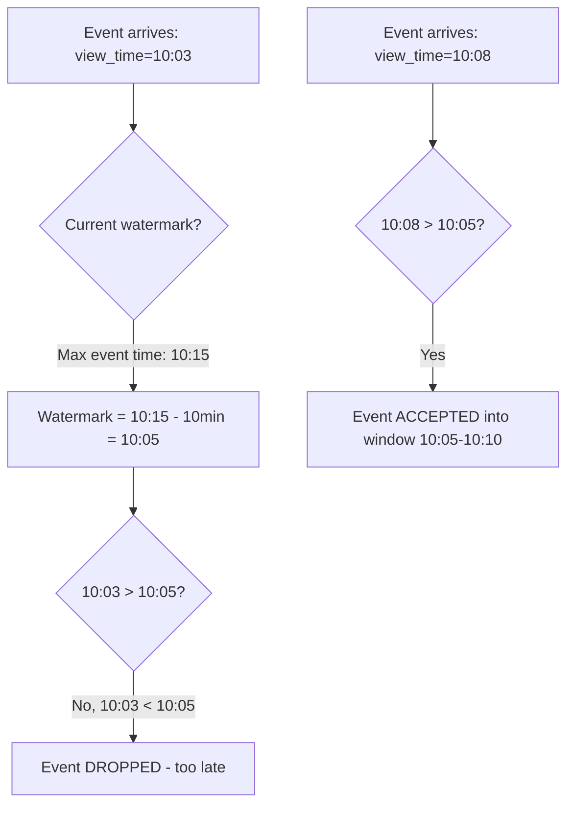
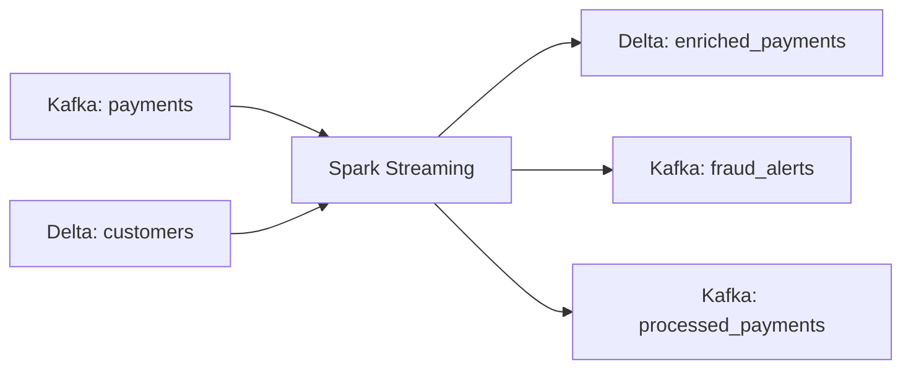

# PySpark Structured Streaming — Interview Scenarios


<article data-difficulty="junior">

## 🟢 Junior: Scenario: Basic Streaming from Kafka to Console

**Scenario:** **Question:** "Write a Spark Structured Streaming job that reads JSON messages from a Kafka topic called 'user_clicks', parses them, filters for click events, and prints results to the console."

###

<details>
<summary>💡 Hint</summary>

Think carefully about the key concepts and consider the trade-offs.

</details>

<details>
<summary>✅ Solution</summary>

**Question:** "Write a Spark Structured Streaming job that reads JSON messages from a Kafka topic called 'user_clicks', parses them, filters for click events, and prints results to the console."

### Setup

```python
from pyspark.sql import SparkSession, functions as F
from pyspark.sql.types import StructType, StructField, StringType, TimestampType, IntegerType

spark = SparkSession.builder.appName("BasicStreaming").getOrCreate()

# Schema for incoming messages
click_schema = StructType([
    StructField("user_id", StringType()),
    StructField("event_type", StringType()),
    StructField("page", StringType()),
    StructField("timestamp", TimestampType()),
])
```

### Solution

```python
# Step 1: Read from Kafka
raw_stream = (spark.readStream
    .format("kafka")
    .option("kafka.bootstrap.servers", "localhost:9092")
    .option("subscribe", "user_clicks")
    .option("startingOffsets", "latest")
    .load())

# Step 2: Parse JSON from Kafka value
parsed = (raw_stream
    .selectExpr("CAST(value AS STRING) AS json_string")
    .select(F.from_json("json_string", click_schema).alias("data"))
    .select("data.*")
)

# Step 3: Filter for click events only
clicks = parsed.filter(F.col("event_type") == "click")

# Step 4: Write to console
query = (clicks.writeStream
    .format("console")
    .outputMode("append")
    .option("truncate", False)
    .trigger(processingTime="10 seconds")
    .start())

query.awaitTermination()
```

**Expected Answer Points:**
- Kafka messages arrive as binary key/value — must CAST value to STRING
- `from_json` requires a schema (streaming can't infer)
- Use `append` mode for non-aggregation queries
- `startingOffsets` controls where to begin reading
- `awaitTermination()` keeps the driver alive
- For production: add checkpointLocation and error handling

</details>

</article>

<article data-difficulty="mid-level">

## 🟡 Mid-Level: Scenario: Windowed Aggregation with Watermarks

**Scenario:** **Question:** "You're tracking website page views. Compute the number of unique visitors per page per 5-minute window. Data can arrive up to 10 minutes late. The results should be written to Delta Lak

<details>
<summary>💡 Hint</summary>

Think carefully about the key concepts and consider the trade-offs.

</details>

<details>
<summary>✅ Solution</summary>

**Question:** "You're tracking website page views. Compute the number of unique visitors per page per 5-minute window. Data can arrive up to 10 minutes late. The results should be written to Delta Lake. How do you handle late data and prevent unbounded state growth?"

### Solution

```python
from pyspark.sql import SparkSession, functions as F

spark = SparkSession.builder.appName("WindowedAgg").getOrCreate()

# Read pageview events
pageviews = (spark.readStream
    .format("kafka")
    .option("kafka.bootstrap.servers", "broker:9092")
    .option("subscribe", "pageviews")
    .load()
    .select(F.from_json(
        F.col("value").cast("string"),
        "user_id STRING, page STRING, view_time TIMESTAMP"
    ).alias("pv"))
    .select("pv.*")
)

# Apply watermark — defines max allowed lateness
# Events more than 10 minutes late will be dropped
watermarked = pageviews.withWatermark("view_time", "10 minutes")

# Windowed aggregation with approx_count_distinct for memory efficiency
page_metrics = (watermarked
    .groupBy(
        F.window("view_time", "5 minutes"),  # 5-minute tumbling windows
        "page"
    )
    .agg(
        F.approx_count_distinct("user_id").alias("unique_visitors"),
        F.count("*").alias("total_views"),
    )
    .select(
        F.col("window.start").alias("window_start"),
        F.col("window.end").alias("window_end"),
        "page",
        "unique_visitors",
        "total_views",
    )
)

# Write to Delta Lake
query = (page_metrics.writeStream
    .format("delta")
    .outputMode("append")  # Emit final result when watermark passes window
    .option("checkpointLocation", "s3://checkpoints/page-metrics/")
    .trigger(processingTime="1 minute")
    .start("s3://analytics/page_metrics/"))

query.awaitTermination()
```

### Why This Works



**Expected Answer Points:**
- Watermark bounds state: Spark drops events older than `max_event_time - 10 minutes`
- Without watermark, state grows forever (one entry per window per page)
- `append` mode with watermark: results emit only after window + watermark passes (finalized)
- `approx_count_distinct` is more memory-efficient than `countDistinct` for streaming
- Partition checkpoint separately from data
- State cleanup happens automatically when watermark advances past a window

</details>

</article>

<article data-difficulty="senior">

## 🔴 Senior: Scenario: Design Exactly-Once Streaming Pipeline

**Scenario:** **Question:** "Design a streaming pipeline that processes payment transactions from Kafka, enriches with customer data, applies fraud detection rules, and writes to both a Delta Lake table and a downs

<details>
<summary>💡 Hint</summary>

Think carefully about the key concepts and consider the trade-offs.

</details>

<details>
<summary>✅ Solution</summary>

**Question:** "Design a streaming pipeline that processes payment transactions from Kafka, enriches with customer data, applies fraud detection rules, and writes to both a Delta Lake table and a downstream Kafka topic. Requirements: exactly-once, handle 1M events/sec, recover from failures without data loss or duplication."

### Architecture



### Solution

```python
from pyspark.sql import SparkSession, functions as F
from delta.tables import DeltaTable

spark = (SparkSession.builder
    .appName("ExactlyOncePayments")
    .config("spark.sql.shuffle.partitions", "200")
    .config("spark.sql.streaming.kafka.maxOffsetsPerTrigger", "1000000")
    .config("spark.streaming.backpressure.enabled", "true")
    .getOrCreate())

# Read payment transactions
payments = (spark.readStream
    .format("kafka")
    .option("kafka.bootstrap.servers", "kafka-cluster:9092")
    .option("subscribe", "payments")
    .option("startingOffsets", "latest")
    .option("maxOffsetsPerTrigger", 1000000)
    .option("kafka.max.partition.fetch.bytes", "10485760")
    .load()
    .select(
        F.col("key").cast("string").alias("payment_id"),
        F.from_json(F.col("value").cast("string"), payment_schema).alias("p"),
        F.col("timestamp").alias("kafka_ts"),
    )
    .select("payment_id", "p.*", "kafka_ts")
    .withColumn("event_time", F.col("timestamp").cast("timestamp"))
    .withWatermark("event_time", "5 minutes")
)

# Static enrichment (refreshed each batch via foreachBatch)
def process_batch(batch_df, batch_id):
    """Process each micro-batch with exactly-once guarantees."""
    if batch_df.isEmpty():
        return
    
    # Refresh customer dimension (pick up recent changes)
    customers = spark.read.format("delta").load("s3://data/delta/customers/")
    
    # Enrich payments with customer data
    enriched = (batch_df
        .join(F.broadcast(customers), "customer_id", "left")
        .withColumn("processing_time", F.current_timestamp())
    )
    
    # Apply fraud detection rules
    enriched_with_fraud = enriched.withColumn(
        "fraud_score",
        F.when(F.col("amount") > F.col("avg_transaction") * 5, 0.9)
         .when(F.col("country") != F.col("home_country"), 0.6)
         .otherwise(0.1)
    ).withColumn(
        "is_fraud_suspect", F.col("fraud_score") > 0.5
    )
    
    # WRITE 1: Delta Lake (idempotent via MERGE)
    target_path = "s3://data/delta/enriched_payments/"
    try:
        target = DeltaTable.forPath(spark, target_path)
        (target.alias("t")
            .merge(enriched_with_fraud.alias("s"), "t.payment_id = s.payment_id")
            .whenNotMatchedInsertAll()
            .execute())
    except Exception:
        enriched_with_fraud.write.format("delta").partitionBy("event_date").save(target_path)
    
    # WRITE 2: Kafka - fraud alerts (at-least-once to Kafka)
    fraud_alerts = enriched_with_fraud.filter(F.col("is_fraud_suspect"))
    if fraud_alerts.count() > 0:
        (fraud_alerts
            .selectExpr("payment_id AS key", "to_json(struct(*)) AS value")
            .write
            .format("kafka")
            .option("kafka.bootstrap.servers", "kafka-cluster:9092")
            .option("topic", "fraud_alerts")
            .save())
    
    # WRITE 3: Kafka - processed payments (at-least-once)
    (enriched_with_fraud
        .selectExpr("payment_id AS key", "to_json(struct(*)) AS value")
        .write
        .format("kafka")
        .option("kafka.bootstrap.servers", "kafka-cluster:9092")
        .option("topic", "processed_payments")
        .save())

# Execute with foreachBatch for multi-sink exactly-once
query = (payments.writeStream
    .foreachBatch(process_batch)
    .option("checkpointLocation", "s3://checkpoints/exactly-once-payments/")
    .trigger(processingTime="30 seconds")
    .start())

query.awaitTermination()
```

### Exactly-Once Guarantees Analysis

| Component | Guarantee | Mechanism |
|-----------|-----------|-----------|
| Kafka source | Replayable | Offsets stored in checkpoint |
| Checkpoint | Progress tracking | Atomic commit after each batch |
| Delta sink | Idempotent | MERGE with payment_id dedup |
| Kafka sink | At-least-once | Downstream must handle dedup |
| End-to-end | Exactly-once to Delta | Replay + idempotent write |

**Expected Answer Points:**
- Exactly-once requires: replayable source + checkpointing + idempotent sink
- Delta MERGE ensures no duplicates even on replay (payment_id as dedup key)
- Kafka sinks are at-least-once only — downstream consumers must deduplicate
- `foreachBatch` allows multi-sink within one checkpoint (atomic progress)
- Handle back-pressure with `maxOffsetsPerTrigger`
- Recovery: on failure, Spark replays from last checkpoint → MERGE is idempotent
- Scale: 200 shuffle partitions, 1M maxOffsets, broadcast join for customer dimension

---

## Interview Tips

> **Tip 1:** "For basic streaming questions, mention the Kafka binary format." — "Kafka stores messages as binary key-value pairs. You must explicitly CAST(value AS STRING) and then parse with from_json. The schema cannot be inferred in streaming — you must provide it. This is the most common mistake juniors make: forgetting the cast or the schema."

> **Tip 2:** "For watermark questions, explain the state cleanup mechanism." — "Without watermarks, Spark keeps state for ALL windows forever. With a 10-minute watermark, once max_event_time advances to 10:20, all state for windows ending before 10:10 is cleaned up. Late events for those windows are dropped. The tradeoff is clear: longer watermarks keep more state (memory) but accept more late data."

> **Tip 3:** "For exactly-once questions, distinguish the three guarantees." — "At-most-once: fire and forget, data loss possible. At-least-once: replay on failure, duplicates possible. Exactly-once: replay on failure + idempotent writes = no loss, no duplication. In Spark: checkpoint enables replay (at-least-once), idempotent sinks like Delta Lake upgrade it to exactly-once. Kafka sinks are only at-least-once unless downstream deduplicates."

</details>

</article>


---

## Interview Tips