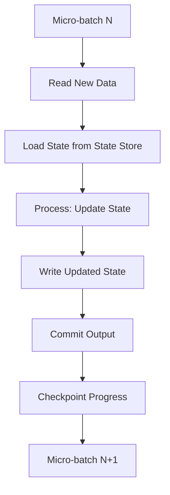
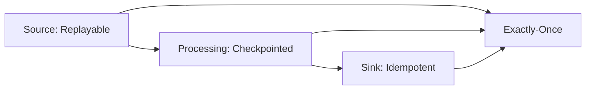

# PySpark Structured Streaming — Senior Deep Dive

## State Management Internals

Every aggregation and join in Structured Streaming maintains state. Understanding state management is critical for production streaming systems.



### State Store Architecture

```python
# State store configuration
spark.conf.set("spark.sql.streaming.stateStore.providerClass",
               "org.apache.spark.sql.execution.streaming.state.HDFSBackedStateStoreProvider")

# State store maintenance interval
spark.conf.set("spark.sql.streaming.stateStore.maintenanceInterval", "60s")

# Min deltas for snapshot (compact state files)
spark.conf.set("spark.sql.streaming.stateStore.minDeltasForSnapshot", "10")
```

**Default HDFS-backed state store:**
- Stores state as versioned key-value pairs
- Delta files for each micro-batch, periodic snapshots
- State loaded into executor memory for processing
- State size directly impacts batch processing time

---

## Arbitrary Stateful Processing

`mapGroupsWithState` and `flatMapGroupsWithState` allow custom state logic:

```python
from pyspark.sql.streaming import GroupState, GroupStateTimeout
from pyspark.sql.types import *
from dataclasses import dataclass

# Use case: Track user sessions with custom timeout logic

# Define state schema
session_state_schema = StructType([
    StructField("user_id", StringType()),
    StructField("session_start", TimestampType()),
    StructField("last_activity", TimestampType()),
    StructField("event_count", IntegerType()),
    StructField("total_revenue", DoubleType()),
])

# Define output schema
session_output_schema = StructType([
    StructField("user_id", StringType()),
    StructField("session_start", TimestampType()),
    StructField("session_end", TimestampType()),
    StructField("duration_seconds", LongType()),
    StructField("event_count", IntegerType()),
    StructField("total_revenue", DoubleType()),
])

def update_session_state(user_id, events, state):
    """
    Custom stateful processing for session tracking.
    Called once per group (user_id) per micro-batch.
    """
    # Handle timeout — session expired
    if state.hasTimedOut:
        session = state.get
        state.remove()
        # Emit completed session
        yield {
            "user_id": user_id,
            "session_start": session["session_start"],
            "session_end": session["last_activity"],
            "duration_seconds": (session["last_activity"] - session["session_start"]).total_seconds(),
            "event_count": session["event_count"],
            "total_revenue": session["total_revenue"],
        }
        return
    
    # Process new events
    events_list = list(events)
    
    if state.exists:
        # Update existing session
        session = state.get
        session["event_count"] += len(events_list)
        session["total_revenue"] += sum(e.amount for e in events_list)
        session["last_activity"] = max(e.event_time for e in events_list)
    else:
        # Create new session
        session = {
            "user_id": user_id,
            "session_start": min(e.event_time for e in events_list),
            "last_activity": max(e.event_time for e in events_list),
            "event_count": len(events_list),
            "total_revenue": sum(e.amount for e in events_list),
        }
    
    state.update(session)
    # Set timeout: session expires after 30 minutes of inactivity
    state.setTimeoutTimestamp(session["last_activity"].timestamp() * 1000 + 30 * 60 * 1000)

# Apply stateful processing
sessions = (events_with_watermark
    .groupBy("user_id")
    .applyInPandasWithState(
        update_session_state,
        outputStructType=session_output_schema,
        stateStructType=session_state_schema,
        outputMode="append",
        timeoutConf=GroupStateTimeout.EventTimeTimeout,
    )
)
```

---

## State Store Backends

| Backend | Latency | Throughput | State Size Limit | Use Case |
|---------|---------|-----------|-----------------|----------|
| HDFS (default) | High | Moderate | Limited by executor memory | Simple aggregations |
| RocksDB | Low | High | Disk-bounded (much larger) | Large state, many keys |
| Custom | Varies | Varies | Custom | Specialized requirements |

### RocksDB State Store (Spark 3.2+)

```python
# Enable RocksDB backend for large state
spark.conf.set(
    "spark.sql.streaming.stateStore.providerClass",
    "org.apache.spark.sql.execution.streaming.state.RocksDBStateStoreProvider"
)

# RocksDB configuration
spark.conf.set("spark.sql.streaming.stateStore.rocksdb.compactOnCommit", "false")
spark.conf.set("spark.sql.streaming.stateStore.rocksdb.blockCacheSizeMB", "64")

# Benefits:
# - State spills to local SSD instead of keeping all in JVM heap
# - Handles millions of keys per partition
# - Reduced GC pressure
# - Incremental checkpointing (only changed keys)
```

---

## Handling Late Data Strategies

```python
# Strategy 1: Watermark + Append mode (drop late data silently)
result = (events
    .withWatermark("event_time", "1 hour")
    .groupBy(F.window("event_time", "10 minutes"))
    .count()
    .writeStream.outputMode("append").start()
)
# Late data beyond 1 hour is silently dropped

# Strategy 2: Watermark + Update mode (update results, but sinks must handle upserts)
result = (events
    .withWatermark("event_time", "1 hour")
    .groupBy(F.window("event_time", "10 minutes"))
    .count()
    .writeStream.outputMode("update").start()
)
# Results are updated as late data arrives (within watermark)

# Strategy 3: No watermark + foreachBatch (handle late data in application logic)
def handle_with_delta_merge(batch_df, batch_id):
    """Use Delta MERGE to handle late-arriving data correctly."""
    from delta.tables import DeltaTable
    
    aggregated = batch_df.groupBy(
        F.window("event_time", "10 minutes").alias("window")
    ).agg(F.count("*").alias("batch_count"))
    
    target = DeltaTable.forPath(spark, "/data/delta/window_counts/")
    
    (target.alias("t")
        .merge(aggregated.alias("s"), "t.window = s.window")
        .whenMatchedUpdate(set={"count": "t.count + s.batch_count"})
        .whenNotMatchedInsertAll()
        .execute())
```

---

## Exactly-Once Guarantees

Exactly-once end-to-end requires three components:



```python
# Exactly-once with Kafka source + Delta Lake sink
query = (spark.readStream
    .format("kafka")
    .option("kafka.bootstrap.servers", "broker:9092")
    .option("subscribe", "events")
    # Kafka is replayable — offsets stored in checkpoint
    .load()
    .selectExpr("CAST(value AS STRING)")
    .select(F.from_json("value", schema).alias("data"))
    .select("data.*")
    .writeStream
    .format("delta")  # Delta is idempotent (transactional writes)
    .outputMode("append")
    .option("checkpointLocation", "hdfs:///checkpoints/exactly_once/")
    .start("/data/delta/output/")
)
```

### Source Requirements

| Source | Replayable? | Mechanism |
|--------|------------|-----------|
| Kafka | Yes | Offset-based replay |
| File (HDFS/S3) | Yes | File listing replay |
| Socket | No | Cannot replay |
| Rate (testing) | Yes | Deterministic generation |
| Delta Lake | Yes | Version-based replay |

### Sink Idempotency

| Sink | Idempotent? | Mechanism |
|------|------------|-----------|
| Delta Lake | Yes | Transaction log |
| Kafka | No (at-least-once) | No dedup by default |
| JDBC (foreachBatch) | Depends | Use MERGE/upsert |
| File (Parquet) | Yes | Atomic rename |
| Console | N/A | Development only |

---

## State Cleanup and TTL

```python
# Configure state TTL for aggregations
spark.conf.set("spark.sql.streaming.statefulOperator.stateStoreTTL", "24h")

# For mapGroupsWithState, TTL is managed via timeouts:
# - ProcessingTimeTimeout: wall clock based
# - EventTimeTimeout: event time + watermark based

# Monitor state size
# In Spark UI → Structured Streaming tab:
# - State rows (number of keys in state)
# - State memory (bytes used by state)
# - State rows updated (keys modified per batch)
# - Custom state metrics per operator
```

---

## Production State Management Patterns

```python
# Pattern: Graceful state migration on schema change
def migrate_state_safely():
    """When state schema changes, you need a new checkpoint."""
    import shutil
    from datetime import datetime
    
    old_checkpoint = "hdfs:///checkpoints/my_query/"
    new_checkpoint = f"hdfs:///checkpoints/my_query_v2/"
    
    # 1. Stop the old query
    # 2. Read the final committed offsets from old checkpoint
    # 3. Start new query with new checkpoint + startingOffsets
    
    new_query = (events
        .withWatermark("event_time", "1 hour")
        .groupBy(F.window("event_time", "10 minutes"), "region")  # New grouping
        .count()
        .writeStream
        .format("delta")
        .option("checkpointLocation", new_checkpoint)
        .start("/data/delta/output_v2/"))
    
    return new_query
```

---

## Interview Tips

> **Tip 1:** "How does state management work in Structured Streaming?" — "Each stateful operation (aggregation, join, dedup) maintains state in a state store. The default HDFS-backed store keeps state in executor memory with periodic snapshots to durable storage. For large state, RocksDB backend spills to local disk. State is versioned per micro-batch, and old versions are cleaned up. The key challenge is state size — it grows with distinct keys and watermark duration."

> **Tip 2:** "How do you achieve exactly-once in streaming?" — "Three requirements: a replayable source (Kafka with offset tracking), checkpointed processing (Spark stores offsets and state), and an idempotent sink (Delta Lake with transactional writes). If any component fails, the batch is replayed from the last committed checkpoint. Delta Lake's transaction log ensures that replayed writes don't create duplicates. File sinks use atomic rename for similar guarantees."

> **Tip 3:** "When would you use flatMapGroupsWithState?" — "When built-in aggregations and window functions aren't expressive enough. Examples: custom session detection with complex timeout logic, pattern matching across events (fraud detection), or maintaining per-key state machines. The tradeoff is complexity — you manage state explicitly, handle timeouts, and lose some optimizer benefits. Always try built-in operations first; drop to flatMapGroupsWithState only when necessary."

## ⚡ Cheat Sheet

**Trigger Types**
```python
.trigger(processingTime="30 seconds")   # fixed interval micro-batch
.trigger(once=True)                     # one batch then stop (backfill pattern)
.trigger(availableNow=True)             # process all available, then stop (Spark 3.3+)
.trigger(continuous="1 second")         # experimental low-latency mode
```

**Output Modes**
| Mode | When to Use | Requires |
|------|-------------|---------|
| append | New rows only, no updates | No aggregation, or windowed agg after watermark |
| update | Changed rows only | Aggregation |
| complete | Full result table every batch | Aggregation (careful with large state) |

**Watermarking & Late Data**
```python
df.withWatermark("event_time", "10 minutes") \
  .groupBy(F.window("event_time", "5 minutes")).count()
# Data > 10 min late is dropped; state older than watermark is evicted
```

**State Store**
- Default: HDFS-backed RocksDB state store (Spark 3.2+: `spark.sql.streaming.stateStore.providerClass`)
- RocksDB: much lower memory footprint than in-memory default for large state
- State size = largest operational concern; always set watermark to bound state growth

**Checkpointing (Required for Production)**
```python
query = df.writeStream \
    .option("checkpointLocation", "s3://bucket/checkpoints/query_name") \
    .start()
# Checkpoint stores: offsets, commit log, state store snapshots
# Never reuse checkpoint location for different queries
```

**Exactly-Once Guarantee**
- Source: must be replayable (Kafka, Auto Loader) with tracked offsets
- Sink: must be idempotent (Delta MERGE) or transactional (Delta append with txn log)
- Checkpoint = source of truth for offset tracking

**Interview Traps**
- `foreachBatch` runs in driver — keep it lightweight; heavy logic belongs in the batch transform
- Changing query schema requires new checkpoint location (schema evolution breaks checkpoint)
- `availableNow` vs `once`: `once` deprecated in favor of `availableNow` in Spark 3.3+
- Watermark only applies to event time; processing time windows have no late data concept
