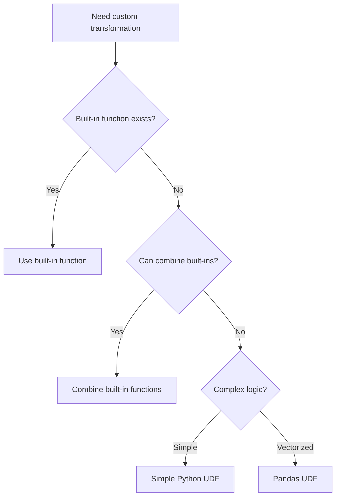

# PySpark UDFs — Fundamentals

## What Are UDFs?

A **User-Defined Function (UDF)** extends Spark's built-in function library with custom Python logic. When built-in functions can't express your transformation, UDFs let you apply arbitrary Python code to DataFrame columns.

> **Key Insight:** UDFs come with a significant performance cost. Data must be serialized from JVM to Python and back for each row. Always check if a native Spark function exists before writing a UDF.

---

## Creating and Using Python UDFs

```python
from pyspark.sql import SparkSession, functions as F
from pyspark.sql.types import StringType, IntegerType, DoubleType, ArrayType

spark = SparkSession.builder.appName("UDF_Fundamentals").getOrCreate()

# Method 1: Register with spark.udf.register (for SQL use)
def categorize_amount(amount):
    if amount is None:
        return "unknown"
    elif amount > 1000:
        return "premium"
    elif amount > 100:
        return "standard"
    return "basic"

spark.udf.register("categorize_amount", categorize_amount, StringType())

# Use in SQL
result = spark.sql("SELECT order_id, categorize_amount(amount) AS tier FROM orders")

# Method 2: Using @udf decorator (for DataFrame API use)
@F.udf(returnType=StringType())
def clean_phone(phone):
    if phone is None:
        return None
    # Remove non-digits
    digits = ''.join(c for c in phone if c.isdigit())
    if len(digits) == 10:
        return f"({digits[:3]}) {digits[3:6]}-{digits[6:]}"
    return digits

# Use in DataFrame API
df = df.withColumn("formatted_phone", clean_phone(F.col("phone")))

# Method 3: Using F.udf() function
extract_domain = F.udf(lambda email: email.split("@")[1] if email and "@" in email else None, StringType())

df = df.withColumn("email_domain", extract_domain(F.col("email")))
```

---

## Return Types

Every UDF must declare its return type:

```python
from pyspark.sql.types import (
    StringType, IntegerType, LongType, DoubleType, BooleanType,
    ArrayType, MapType, StructType, StructField
)

# Simple types
@F.udf(StringType())
def to_upper(s):
    return s.upper() if s else None

@F.udf(IntegerType())
def word_count(text):
    return len(text.split()) if text else 0

@F.udf(BooleanType())
def is_valid_email(email):
    return email is not None and "@" in email and "." in email

# Complex types
@F.udf(ArrayType(StringType()))
def extract_hashtags(text):
    if text is None:
        return []
    return [word for word in text.split() if word.startswith("#")]

@F.udf(MapType(StringType(), IntegerType()))
def count_chars(text):
    if text is None:
        return {}
    result = {}
    for char in text.lower():
        if char.isalpha():
            result[char] = result.get(char, 0) + 1
    return result

# Struct return type
address_schema = StructType([
    StructField("street", StringType()),
    StructField("city", StringType()),
    StructField("state", StringType()),
    StructField("zip", StringType()),
])

@F.udf(address_schema)
def parse_address(raw_address):
    if raw_address is None:
        return None
    parts = raw_address.split(",")
    return {
        "street": parts[0].strip() if len(parts) > 0 else None,
        "city": parts[1].strip() if len(parts) > 1 else None,
        "state": parts[2].strip() if len(parts) > 2 else None,
        "zip": parts[3].strip() if len(parts) > 3 else None,
    }
```

---

## When UDFs Are Needed vs Native Functions



### Common Cases Where UDFs Are NOT Needed

```python
# BAD: UDF for something built-in functions handle
@F.udf(StringType())
def bad_upper(s):
    return s.upper() if s else None

# GOOD: Use built-in (optimized, no serialization)
df = df.withColumn("name_upper", F.upper(F.col("name")))

# BAD: UDF for date parsing
@F.udf(StringType())
def bad_extract_year(date_str):
    return date_str[:4] if date_str else None

# GOOD: Use built-in
df = df.withColumn("year", F.year(F.col("date_col")))

# BAD: UDF for conditional logic
@F.udf(StringType())
def bad_categorize(value):
    if value > 100: return "high"
    elif value > 50: return "medium"
    else: return "low"

# GOOD: Use when/otherwise
df = df.withColumn("category",
    F.when(F.col("value") > 100, "high")
     .when(F.col("value") > 50, "medium")
     .otherwise("low"))

# BAD: UDF for string manipulation
@F.udf(StringType())
def bad_clean(text):
    return text.strip().lower().replace(" ", "_") if text else None

# GOOD: Chain built-in functions
df = df.withColumn("clean",
    F.regexp_replace(F.lower(F.trim(F.col("text"))), " ", "_"))
```

---

## UDF Performance Impact

```python
import time

# Generate test data
test_df = spark.range(10_000_000).withColumn("value", (F.rand() * 1000).cast("double"))

# Native function
start = time.time()
native_result = test_df.withColumn("doubled", F.col("value") * 2)
native_result.count()
native_time = time.time() - start

# UDF doing the same thing
@F.udf(DoubleType())
def double_udf(value):
    return value * 2 if value else None

start = time.time()
udf_result = test_df.withColumn("doubled", double_udf(F.col("value")))
udf_result.count()
udf_time = time.time() - start

print(f"Native: {native_time:.2f}s, UDF: {udf_time:.2f}s")
print(f"UDF is {udf_time/native_time:.1f}x slower")
# Typical result: UDF is 5-20x slower for simple operations
```

### Why UDFs Are Slow

| Step | What Happens | Cost |
|------|-------------|------|
| 1 | JVM serializes data to Arrow/Pickle format | CPU + memory |
| 2 | Data sent from JVM to Python process | IPC overhead |
| 3 | Python interprets and executes function | Python GIL, slow |
| 4 | Result serialized back to JVM | CPU + memory |
| 5 | JVM deserializes result | CPU |

Additionally, UDFs prevent Catalyst optimizer optimizations:
- No predicate pushdown through UDFs
- No constant folding
- No column pruning for UDF inputs
- Breaks whole-stage code generation

---

## Null Handling in UDFs

```python
# UDFs must handle None explicitly
@F.udf(StringType())
def safe_udf(value):
    if value is None:  # Always check for None!
        return None
    return value.upper()

# Alternative: use F.when to guard against nulls
df = df.withColumn("result",
    F.when(F.col("input").isNotNull(), my_udf(F.col("input")))
     .otherwise(None))
```

---

## Registering UDFs for SQL and DataFrame

```python
# For both SQL and DataFrame use
def my_logic(value):
    return transform(value)

# Register for SQL
spark.udf.register("my_logic_sql", my_logic, StringType())

# Create for DataFrame API
my_logic_df = F.udf(my_logic, StringType())

# Use in SQL
spark.sql("SELECT my_logic_sql(col) FROM table")

# Use in DataFrame
df.withColumn("result", my_logic_df(F.col("col")))
```

---

## Interview Tips

> **Tip 1:** "What is a UDF and when would you use one?" — "A UDF is a User-Defined Function that extends Spark's built-in functions with custom Python logic. I use them only when no combination of built-in functions can express the transformation — things like custom parsing logic, regex patterns too complex for regexp_extract, or calling external libraries. They're a last resort because they're 5-20x slower than native functions due to serialization overhead between JVM and Python."

> **Tip 2:** "Why are UDFs slow?" — "Data must be serialized from the JVM (where Spark runs) to a Python process, processed row by row in Python (which is inherently slow), then serialized back to the JVM. This serialization overhead happens for every row. Additionally, UDFs are opaque to the Catalyst optimizer — it can't push predicates through them, prune columns, or include them in whole-stage code generation."

> **Tip 3:** "How do you handle nulls in UDFs?" — "Always check for None as the first line of any UDF. Spark passes null column values as Python None. If you don't handle it, you'll get NoneType errors that are hard to debug in production. For robustness, I either check `if value is None: return None` at the top, or guard the UDF call with `F.when(col.isNotNull(), my_udf(col))` in the DataFrame logic."
