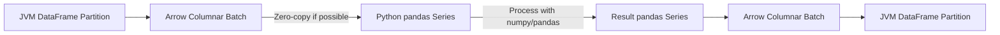

# PySpark UDFs — Senior Deep Dive

## Arrow Optimization for Pandas UDFs

Apache Arrow is the columnar in-memory format that enables efficient data transfer between JVM and Python:

```python
# Enable Arrow optimization (default in Spark 3.0+)
spark.conf.set("spark.sql.execution.arrow.pyspark.enabled", "true")
spark.conf.set("spark.sql.execution.arrow.pyspark.fallback.enabled", "true")

# Arrow batch size — controls memory vs throughput tradeoff
spark.conf.set("spark.sql.execution.arrow.maxRecordsPerBatch", "10000")
```

### How Arrow Transfer Works



| Without Arrow | With Arrow |
|--------------|-----------|
| Row-by-row pickle serialization | Columnar batch transfer |
| Python object creation per row | Memory-mapped arrays |
| GC pressure from many objects | Compact binary format |
| ~1MB/s throughput | ~1GB/s throughput |

### Arrow Batch Size Tuning

```python
# Smaller batches: lower memory, higher overhead
spark.conf.set("spark.sql.execution.arrow.maxRecordsPerBatch", "1000")
# Use when: UDF allocates large intermediate structures per batch

# Larger batches: higher memory, better throughput
spark.conf.set("spark.sql.execution.arrow.maxRecordsPerBatch", "100000")
# Use when: UDF is lightweight, want maximum vectorization benefit

# Default (10000) is usually optimal
```

---

## UDF Serialization Overhead Analysis

```python
import time
import sys

# Measure serialization cost directly
def measure_serialization_overhead(df, num_cols=1):
    """Compare UDF with equivalent native operation to isolate serialization cost."""
    
    @F.udf("double")
    def identity_udf(x):
        return x  # Does NOTHING — pure serialization cost
    
    # Native identity (no-op)
    start = time.time()
    df.withColumn("result", F.col("value")).write.mode("overwrite").parquet("/tmp/native")
    native_time = time.time() - start
    
    # UDF identity (serialization only)
    start = time.time()
    df.withColumn("result", identity_udf(F.col("value"))).write.mode("overwrite").parquet("/tmp/udf")
    udf_time = time.time() - start
    
    serialization_cost = udf_time - native_time
    print(f"Pure serialization overhead: {serialization_cost:.2f}s")
    print(f"Overhead per million rows: {serialization_cost / (df.count() / 1_000_000):.2f}s")
    
# Typical result: 2-5 seconds per million rows for Python UDFs
# Arrow-based Pandas UDFs: 0.1-0.3 seconds per million rows
```

### Serialization Breakdown

| UDF Type | Serialization Method | Per-Row Cost | Batch Cost |
|----------|---------------------|-------------|-----------|
| Python UDF | CloudPickle + socket | ~10 microseconds | N/A |
| Pandas UDF (Arrow) | Arrow IPC | N/A | ~1ms per 10K rows |
| Scala UDF | None (JVM native) | ~0 | ~0 |

---

## Calling Scala UDFs from Python

For performance-critical UDFs, write in Scala and call from PySpark:

```python
# Step 1: Write Scala UDF (compile to JAR)
# File: src/main/scala/com/company/udfs/TextUDFs.scala
"""
package com.company.udfs

import org.apache.spark.sql.expressions.UserDefinedFunction
import org.apache.spark.sql.functions.udf

object TextUDFs {
  val parseUserAgent: UserDefinedFunction = udf((ua: String) => {
    if (ua == null) null
    else {
      // Complex parsing logic runs in JVM — no serialization!
      val browser = extractBrowser(ua)
      val os = extractOS(ua)
      s"$browser|$os"
    }
  })
}
"""

# Step 2: Register Scala UDF from Python
spark.sparkContext.addPyFile("hdfs:///libs/custom-udfs_2.12-1.0.jar")

# Register via SQL (works for Scala UDFs in JAR)
spark.sql("""
    CREATE TEMPORARY FUNCTION parse_user_agent 
    AS 'com.company.udfs.TextUDFs.parseUserAgent'
""")

# Or register via JVM interop
from py4j.java_gateway import java_import
java_import(spark._jvm, "com.company.udfs.TextUDFs")
parse_ua_jvm = spark._jvm.com.company.udfs.TextUDFs.parseUserAgent()

# Wrap for Python DataFrame API
from pyspark.sql.column import Column, _to_java_column

def parse_user_agent(col):
    """Python wrapper for Scala UDF."""
    _parse_ua = spark._jvm.com.company.udfs.TextUDFs.parseUserAgent()
    return Column(_parse_ua.apply(_to_java_column(col)))

# Use like a native function — runs in JVM, no Python serialization!
df = df.withColumn("parsed_ua", parse_user_agent(F.col("user_agent")))
```

### Performance: Scala UDF vs Python UDF

| Metric (10M rows) | Python UDF | Pandas UDF | Scala UDF |
|-------------------|-----------|-----------|----------|
| Duration | 120s | 25s | 8s |
| Serialization | 80s | 5s | 0s |
| Computation | 40s | 20s | 8s |
| Memory overhead | High | Medium | Low |

---

## Avoiding UDFs — Native Alternatives

### Complex String Parsing Without UDF

```python
# INSTEAD OF UDF for parsing structured strings
# Input: "John Smith|45|Engineer|San Francisco"

# BAD: Python UDF
@F.udf("struct<name:string,age:int,job:string,city:string>")
def parse_record(line):
    parts = line.split("|")
    return {"name": parts[0], "age": int(parts[1]), "job": parts[2], "city": parts[3]}

# GOOD: Native split + array indexing
parsed = (df
    .withColumn("parts", F.split(F.col("raw_line"), "\\|"))
    .withColumn("name", F.col("parts")[0])
    .withColumn("age", F.col("parts")[1].cast("int"))
    .withColumn("job", F.col("parts")[2])
    .withColumn("city", F.col("parts")[3])
    .drop("parts"))
```

### Complex Conditional Logic Without UDF

```python
# INSTEAD OF UDF for business rules
# BAD: Python UDF
@F.udf(StringType())
def classify_customer(spend, frequency, recency):
    if spend > 10000 and frequency > 20:
        return "VIP"
    elif spend > 5000 or frequency > 10:
        return "regular"
    elif recency > 365:
        return "churned"
    return "new"

# GOOD: Nested when/otherwise (runs in JVM, optimizable)
df = df.withColumn("segment",
    F.when((F.col("spend") > 10000) & (F.col("frequency") > 20), "VIP")
     .when((F.col("spend") > 5000) | (F.col("frequency") > 10), "regular")
     .when(F.col("recency") > 365, "churned")
     .otherwise("new"))
```

### Regex Without UDF

```python
# BAD: Python UDF for regex
@F.udf(StringType())
def extract_ip(log_line):
    import re
    match = re.search(r'(\d+\.\d+\.\d+\.\d+)', log_line)
    return match.group(1) if match else None

# GOOD: Native regexp_extract
df = df.withColumn("ip", F.regexp_extract("log_line", r"(\d+\.\d+\.\d+\.\d+)", 1))
```

### Array Operations Without UDF

```python
# BAD: UDF for array operations
@F.udf(ArrayType(StringType()))
def filter_tags(tags, prefix):
    return [t for t in tags if t.startswith(prefix)] if tags else []

# GOOD: Native array functions (Spark 2.4+)
df = df.withColumn("filtered_tags",
    F.filter(F.col("tags"), lambda x: x.startswith("category:")))

# Or with expr for complex filtering
df = df.withColumn("filtered_tags",
    F.expr("filter(tags, x -> x LIKE 'category:%')"))

# Transform array elements
df = df.withColumn("upper_tags",
    F.transform(F.col("tags"), lambda x: F.upper(x)))

# Aggregate arrays
df = df.withColumn("tag_concat",
    F.aggregate(F.col("tags"), F.lit(""), lambda acc, x: F.concat(acc, F.lit(","), x)))
```

---

## UDF Optimization Barriers

```python
# UDFs prevent these optimizer rules:

# 1. Predicate pushdown blocked
df.filter(my_udf(F.col("x")) > 10)  # Filter stays in Spark, not pushed to Parquet

# 2. Column pruning blocked (UDF might use any column internally)
df.select(my_udf(F.col("a")))  # Spark may read extra columns "just in case"

# 3. Constant folding blocked
df.withColumn("y", my_udf(F.lit(5)))  # Can't precompute even for constants

# 4. Whole-stage codegen broken
# Native: generates optimized Java bytecode for the entire stage
# With UDF: falls back to interpreted execution at UDF boundary

# Verify codegen impact
df.withColumn("native", F.col("x") * 2).explain(mode="codegen")
# Shows generated Java code — fast

df.withColumn("udf_result", my_udf(F.col("x"))).explain(mode="codegen")
# Shows codegen boundary — slower
```

---

## Interview Tips

> **Tip 1:** "How does Arrow optimize Pandas UDFs?" — "Arrow provides a columnar in-memory format that both JVM and Python can read without serialization. Instead of pickling one row at a time, Spark sends batches of 10K+ rows as Arrow columnar arrays. Python receives them as zero-copy numpy arrays backing pandas Series. This eliminates the per-row overhead and enables vectorized numpy operations. The speedup is typically 10-50x over regular Python UDFs."

> **Tip 2:** "When would you write a Scala UDF instead of Python?" — "When the UDF is called billions of times and serialization dominates the cost. Scala UDFs run natively in the JVM with zero serialization overhead. I'd write in Scala for: string parsing UDFs on very large datasets, UDFs in hot paths called per-row on terabyte-scale data, or UDFs that need to interact with Java libraries. The tradeoff is deployment complexity — you need to compile, package a JAR, and distribute it."

> **Tip 3:** "How would you eliminate a UDF?" — "First, check if the logic can be expressed with built-in functions: regexp_extract for regex, split + array indexing for parsing, when/otherwise for conditionals, transform/filter/aggregate for array operations. Second, check higher-order functions (Spark 2.4+). Third, try SQL expressions with F.expr(). If none work, use a Pandas UDF for vectorization. The row-at-a-time Python UDF should be the absolute last resort."

## ⚡ Cheat Sheet

**UDF types and performance**
| Type | Performance | Serialization | When to use |
|---|---|---|---|
| Python UDF | Slowest (row-by-row, Python GIL) | Pickle | Last resort |
| Pandas UDF (scalar) | 10–100× faster | Apache Arrow | Vectorized transforms |
| Pandas UDF (grouped) | Good | Arrow | Grouped aggregations |
| Pandas UDF (iterator) | Best for large datasets | Arrow (batched) | Stateful transforms |
| Scala UDF | Fastest | JVM native | Performance-critical |

**Registration and usage**
```python
from pyspark.sql.functions import udf, pandas_udf
from pyspark.sql.types import StringType, DoubleType
import pandas as pd

# Python UDF (avoid in production)
@udf(returnType=StringType())
def clean_name(name: str) -> str:
    return name.strip().upper() if name else None

# Pandas scalar UDF (preferred)
@pandas_udf(DoubleType())
def parse_amount(s: pd.Series) -> pd.Series:
    return pd.to_numeric(s.str.replace("[,$]", "", regex=True), errors='coerce')

df.withColumn("clean", clean_name("name"))
df.withColumn("amount", parse_amount("raw_amount"))
```

**Iterator UDF (for large batches)**
```python
from typing import Iterator
@pandas_udf(DoubleType())
def score_batch(iterator: Iterator[pd.Series]) -> Iterator[pd.Series]:
    model = load_model()  # loaded ONCE per task, not per row
    for batch in iterator:
        yield model.predict(batch)
```

**Avoiding UDFs**
```python
# Replace Python UDF logic with native Spark functions
from pyspark.sql.functions import regexp_replace, when, col, translate
# Bad: UDF for null coalesce
# Good: coalesce(col("a"), col("b"), lit("default"))
# Bad: UDF for string cleaning
# Good: regexp_replace + upper + trim
```

**Type mapping**
| Python | PySpark SQL type |
|---|---|
| `str` | `StringType()` |
| `int` | `LongType()` |
| `float` | `DoubleType()` |
| `bool` | `BooleanType()` |
| `datetime` | `TimestampType()` |
| `list[int]` | `ArrayType(LongType())` |
| `dict[str, float]` | `MapType(StringType(), DoubleType())` |
