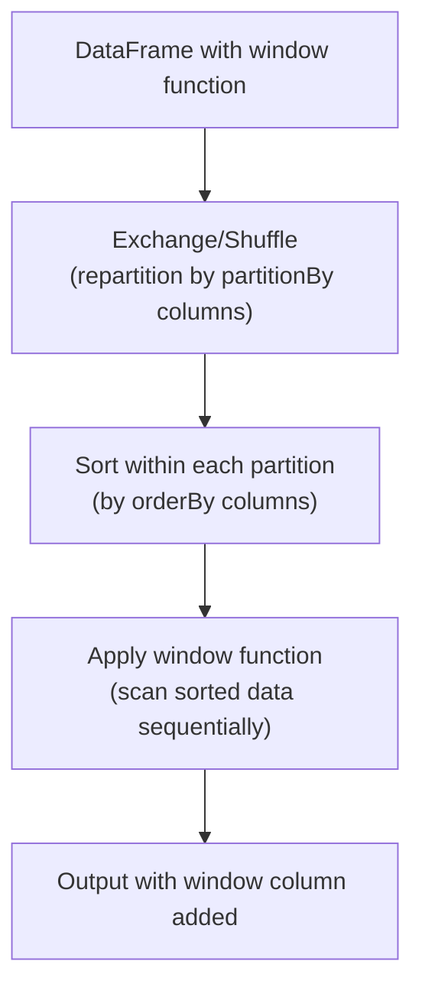

# PySpark Window Functions — Senior-Level Deep Dive

## How Window Functions Execute in Spark

### Physical Execution



**What this shows:**
1. **Shuffle:** Data is repartitioned so all rows with the same partition key land on the same executor
2. **Sort:** Within each partition, data is sorted by the orderBy columns
3. **Compute:** The window function scans sorted data sequentially (efficient once sorted)

**The expensive part is step 1 (shuffle).** Steps 2 and 3 are relatively cheap once data is local.

### Reading the Execution Plan

```python
from pyspark.sql.window import Window
from pyspark.sql.functions import row_number, col

w = Window.partitionBy("department").orderBy(col("salary").desc())
result = df.withColumn("rank", row_number().over(w))

result.explain()
# == Physical Plan ==
# Window [row_number() OVER (PARTITION BY department ORDER BY salary DESC)]
# +- Sort [department ASC, salary DESC]      ← Sort within partitions
#    +- Exchange hashpartitioning(department)  ← SHUFFLE (expensive!)
#       +- FileScan parquet [name, department, salary]
```

> **Key insight:** The `Exchange hashpartitioning(department)` is the shuffle. If you apply multiple window functions with the SAME partitionBy, Spark reuses this shuffle. Different partitionBy = additional shuffle.

---

## Performance Optimization Strategies

### Strategy 1: Reuse the Same Window (Avoid Multiple Shuffles)

```python
# BAD: Different partitionBy → two separate shuffles
w1 = Window.partitionBy("user_id").orderBy("event_time")
w2 = Window.partitionBy("product_id").orderBy("event_time")

df.withColumn("user_rank", row_number().over(w1)) \
  .withColumn("product_rank", row_number().over(w2))
# Two shuffles! Expensive.

# GOOD: Same partitionBy → one shuffle reused
w1 = Window.partitionBy("user_id").orderBy("event_time")
w2 = Window.partitionBy("user_id").orderBy(col("amount").desc())

df.withColumn("time_rank", row_number().over(w1)) \
  .withColumn("amount_rank", row_number().over(w2))
# One shuffle (both partition by user_id), two sorts (cheap by comparison)
```

### Strategy 2: Filter Before Windowing

```python
# BAD: Apply window to ALL 1B rows, then filter to today
w = Window.partitionBy("user_id").orderBy(col("event_time").desc())
df.withColumn("rn", row_number().over(w)) \
  .filter("event_date = '2024-01-15'")
# Shuffles and sorts 1B rows, then throws most away!

# GOOD: Filter first, then apply window to smaller dataset
df.filter("event_date = '2024-01-15'") \
  .withColumn("rn", row_number().over(w))
# Shuffles and sorts only today's data (~30M rows instead of 1B)
```

### Strategy 3: Pre-Repartition for Multiple Windows

```python
# If applying many window functions with same partition key:
# Repartition ONCE, cache, then apply all windows

df_partitioned = df.repartition(200, "user_id").cache()
df_partitioned.count()  # Trigger caching

# Now these window operations skip the shuffle (data already partitioned by user_id)
w1 = Window.partitionBy("user_id").orderBy("event_time")
w2 = Window.partitionBy("user_id").orderBy(col("amount").desc())

result = df_partitioned \
    .withColumn("time_order", row_number().over(w1)) \
    .withColumn("amount_rank", row_number().over(w2)) \
    .withColumn("prev_amount", lag("amount", 1).over(w1))
```

### Strategy 4: Handle Partition Skew

If one partition key has disproportionately many rows (e.g., bot users, NULL values):

```python
from pyspark.sql.functions import when, concat, lit, floor, rand

# Problem: user "bot_account" has 100M events, others have ~1K
# The executor handling bot_account becomes a bottleneck

# Solution 1: Remove/filter outliers before windowing
df_clean = df.filter("user_id != 'bot_account'")

# Solution 2: Split the hot key into sub-partitions
df_salted = df.withColumn(
    "partition_key",
    when(col("user_id") == "bot_account",
         concat(col("user_id"), lit("_"), floor(rand() * 10).cast("string")))
    .otherwise(col("user_id"))
)
# Now "bot_account" is split into bot_account_0 through bot_account_9
# Window by "partition_key" instead of "user_id"
# NOTE: This changes semantics! Only valid if ordering within sub-partitions is acceptable
```

---

## Advanced Window Patterns

### Pattern 1: First/Last Value with Proper Frame

```python
from pyspark.sql.functions import first, last

# GOTCHA: last() with default frame gives unexpected results
# Default frame: UNBOUNDED PRECEDING to CURRENT ROW
# So last() actually returns the CURRENT row's value, not the partition's last!

# CORRECT: specify full frame for first/last
full_frame = Window.partitionBy("user_id") \
    .orderBy("event_time") \
    .rowsBetween(Window.unboundedPreceding, Window.unboundedFollowing)

df.withColumn("first_event", first("event_type").over(full_frame)) \
  .withColumn("last_event", last("event_type").over(full_frame))
```

> **Critical gotcha:** Without `rowsBetween(unboundedPreceding, unboundedFollowing)`, `last()` uses the default frame (up to current row) and returns the current row's value. This confuses many developers.

### Pattern 2: Conditional Running Count

```python
from pyspark.sql.functions import sum, when

# Count errors seen so far per user (running count of a condition)
error_window = Window.partitionBy("user_id") \
    .orderBy("event_time") \
    .rowsBetween(Window.unboundedPreceding, Window.currentRow)

df.withColumn(
    "errors_so_far",
    sum(when(col("event_type") == "error", 1).otherwise(0)).over(error_window)
)
```

### Pattern 3: Time-Based Rolling Window

```python
# 7-day rolling average revenue per store
# rangeBetween works with days when column is numeric (days since epoch)
from pyspark.sql.functions import datediff, lit, avg

# Convert date to days-since-epoch for rangeBetween
df = df.withColumn("days", datediff(col("sale_date"), lit("1970-01-01")))

rolling_7d = Window.partitionBy("store_id") \
    .orderBy("days") \
    .rangeBetween(-6, 0)  # Last 7 days (inclusive)

df.withColumn("rolling_7d_avg", avg("revenue").over(rolling_7d))
```

### Pattern 4: Identify State Changes

```python
# Detect when a customer's segment changes (for SCD tracking)
from pyspark.sql.functions import lag, when

change_window = Window.partitionBy("customer_id").orderBy("effective_date")

changes = df.withColumn("prev_segment", lag("segment", 1).over(change_window)) \
    .withColumn(
        "segment_changed",
        when(col("segment") != col("prev_segment"), True)
        .when(col("prev_segment").isNull(), True)  # First record
        .otherwise(False)
    ) \
    .filter("segment_changed = true")
```

---

## Window Functions vs GroupBy + Join

Sometimes you can replace window functions with groupBy + join for better performance:

```python
# WINDOW APPROACH: adds department average to each row
w = Window.partitionBy("department")
result = df.withColumn("dept_avg", avg("salary").over(w))
# Requires shuffle by department + full data preservation

# GROUPBY + JOIN APPROACH: same result, different execution
dept_avgs = df.groupBy("department").agg(avg("salary").alias("dept_avg"))
result = df.join(broadcast(dept_avgs), "department")
# If dept_avgs is tiny (few departments): broadcast join avoids shuffle of main df!
```

**When groupBy + join wins:**
- Few distinct groups (low cardinality partition key)
- The aggregate result is small enough to broadcast
- You only need one aggregate (not multiple different window operations)

**When window functions win:**
- Need ranking (row_number, rank)
- Need lag/lead (access adjacent rows)
- Need running totals (cumulative computations)
- Need multiple window computations on the same partition (single shuffle)

---

## Memory and Spill Behavior

Window functions sort data per partition. If a partition is very large:

```python
# Check if window function causes spill
result.explain()  # Look for "Sort" operator

# Monitor in Spark UI:
# - Task duration skew (one task much longer = partition skew)
# - Shuffle spill (memory) and shuffle spill (disk)
# - GC time per task

# Fix 1: Increase executor memory
spark.conf.set("spark.executor.memory", "8g")
spark.conf.set("spark.executor.memoryOverhead", "2g")

# Fix 2: Increase sort memory fraction
spark.conf.set("spark.memory.fraction", "0.8")  # Default 0.6

# Fix 3: More partitions (smaller per-partition data)
spark.conf.set("spark.sql.shuffle.partitions", "400")  # Default 200
```

---

## Interview Tips

> **Tip 1:** "How do window functions execute in Spark?" — "Three phases: (1) Shuffle/Exchange to repartition data by the partitionBy columns, (2) Sort within each partition by orderBy columns, (3) Sequential scan to compute the window function. The shuffle is the expensive part — reusing the same partitionBy across multiple windows avoids additional shuffles."

> **Tip 2:** "How do you handle skew with window functions?" — "If one partition key has 100x more rows than others, that executor becomes a bottleneck. Options: filter out the skewed key and process it separately, salt the key to split it across multiple partitions (changes semantics), or use AQE to detect and mitigate skew at runtime."

> **Tip 3:** "first() and last() gotcha" — "Without specifying the full frame (unboundedPreceding to unboundedFollowing), last() uses the default frame which only goes up to the current row — effectively returning the current row's value, not the partition's actual last value. Always specify the frame explicitly for first/last."

## ⚡ Cheat Sheet

**Window spec building blocks**
```python
from pyspark.sql.window import Window
from pyspark.sql.functions import row_number, rank, dense_rank, lag, lead,     sum, avg, min, max, first, last, ntile, percent_rank, cume_dist

# Partition + order
w = Window.partitionBy("dept").orderBy("salary")
# Partition only (for aggregation without ordering)
w_agg = Window.partitionBy("dept")
# Rows between
w_roll = Window.partitionBy("dept").orderBy("date")     .rowsBetween(-6, 0)   # last 7 rows (6 preceding + current)
# Range between (value-based, not row-based)
w_range = Window.partitionBy("dept").orderBy("date")     .rangeBetween(-86400*7, 0)  # last 7 days (seconds)
```

**Ranking functions**
```python
df.withColumn("rn", row_number().over(w))    # unique 1,2,3...
df.withColumn("rnk", rank().over(w))          # gaps on ties: 1,1,3
df.withColumn("dr", dense_rank().over(w))     # no gaps: 1,1,2
df.withColumn("pct", percent_rank().over(w))  # 0.0–1.0
df.withColumn("tile", ntile(4).over(w))       # quartiles 1–4
```

**Lag/Lead**
```python
df.withColumn("prev_val", lag("value", 1).over(w))
df.withColumn("next_val", lead("value", 1, 0).over(w))  # default 0 if no next
# MoM growth
df.withColumn("mom_growth",
    (col("revenue") - lag("revenue",1).over(w)) / lag("revenue",1).over(w))
```

**Running aggregates**
```python
# Running total
df.withColumn("running_sum", sum("amount").over(
    w.rowsBetween(Window.unboundedPreceding, Window.currentRow)))
# 7-day rolling average
df.withColumn("rolling_7d", avg("value").over(
    w.rowsBetween(-6, 0)))
```

**Deduplication (top-N per group)**
```python
# Keep most recent row per customer
w_ded = Window.partitionBy("customer_id").orderBy(col("updated_at").desc())
df.withColumn("rn", row_number().over(w_ded)).filter(col("rn") == 1)
```

**Performance**
- `rowsBetween` vs `rangeBetween`: rows = position-based (faster); range = value-based (requires sort)
- Large partitions = OOM; repartition on window key before window ops
- Avoid `Window.unboundedFollowing` with aggregations — requires full partition in memory
