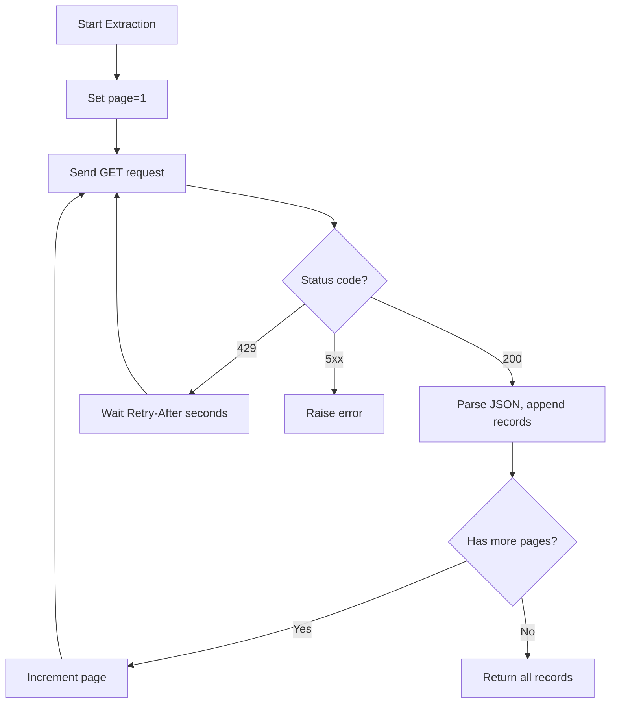

# Python APIs — Fundamentals


## 🎯 Analogy

Think of requests as a polite customer asking an API for data, and FastAPI as the restaurant building its own API menu: requests is the client side, FastAPI is the server side — both use HTTP under the hood.

---
## HTTP Basics for Data Engineers

APIs are the primary way data pipelines extract data from external systems. Understanding HTTP fundamentals is essential for building reliable data connectors.

**The analogy:** An API call is like ordering at a restaurant. You make a request (the order), the server processes it (the kitchen), and sends back a response (your meal). HTTP methods are like different types of orders — GET (read the menu), POST (place an order), PUT (change your order).

---

## The requests Library — Your HTTP Toolkit

```python
import requests

# GET — retrieve data (most common in DE)
response = requests.get("https://api.example.com/users")
print(response.status_code)   # 200
print(response.json())        # Parse JSON response

# POST — send data
payload = {"name": "Alice", "email": "alice@example.com"}
response = requests.post("https://api.example.com/users", json=payload)

# PUT — update data
response = requests.put("https://api.example.com/users/123", json={"name": "Alice Smith"})

# DELETE — remove data
response = requests.delete("https://api.example.com/users/123")
```

### Query Parameters

```python
# Pass parameters cleanly (no manual URL building)
params = {
    "start_date": "2024-01-01",
    "end_date": "2024-01-31",
    "status": "active",
    "limit": 100,
}
response = requests.get("https://api.example.com/events", params=params)
# Actual URL: https://api.example.com/events?start_date=2024-01-01&end_date=...
```

### Response Handling

```python
response = requests.get("https://api.example.com/data")

# Always check status before using response
if response.status_code == 200:
    data = response.json()
elif response.status_code == 404:
    print("Resource not found")
elif response.status_code == 429:
    print("Rate limited — slow down!")
elif response.status_code >= 500:
    print("Server error — retry later")

# Or use raise_for_status() for automatic error raising
try:
    response.raise_for_status()
    data = response.json()
except requests.HTTPError as e:
    print(f"HTTP error: {e}")
```

---

## Authentication Patterns

```python
# API Key in header (most common for data APIs)
headers = {"Authorization": "Bearer YOUR_API_KEY"}
response = requests.get("https://api.example.com/data", headers=headers)

# API Key as query parameter
response = requests.get(
    "https://api.example.com/data",
    params={"api_key": "YOUR_KEY"}
)

# Basic authentication
response = requests.get(
    "https://api.example.com/data",
    auth=("username", "password")
)

# OAuth2 token (common for Google, Salesforce, etc.)
def get_oauth_token(client_id: str, client_secret: str) -> str:
    """Exchange credentials for access token."""
    response = requests.post(
        "https://auth.example.com/oauth/token",
        data={
            "grant_type": "client_credentials",
            "client_id": client_id,
            "client_secret": client_secret,
        }
    )
    response.raise_for_status()
    return response.json()["access_token"]

token = get_oauth_token("my_client_id", "my_secret")
response = requests.get(
    "https://api.example.com/data",
    headers={"Authorization": f"Bearer {token}"}
)
```

---

## Error Handling for API Calls

```python
import requests
from requests.exceptions import (
    ConnectionError, Timeout, HTTPError, RequestException
)

def fetch_data_safely(url: str, params: dict = None) -> dict:
    """Fetch data with proper error handling."""
    try:
        response = requests.get(url, params=params, timeout=30)
        response.raise_for_status()
        return response.json()
    
    except Timeout:
        print(f"Request to {url} timed out")
        raise
    except ConnectionError:
        print(f"Cannot connect to {url}")
        raise
    except HTTPError as e:
        print(f"HTTP error {e.response.status_code}: {e.response.text[:200]}")
        raise
    except RequestException as e:
        print(f"Request failed: {e}")
        raise

# Always set timeouts! Without timeout, requests can hang forever.
response = requests.get(url, timeout=(5, 30))  # (connect_timeout, read_timeout)
```

---

## Pagination — Getting All the Data

Most APIs return data in pages. You need to handle pagination to extract complete datasets:

### Offset-Based Pagination

```python
def fetch_all_offset_paginated(base_url: str, page_size: int = 100) -> list[dict]:
    """Fetch all records using offset pagination."""
    all_records = []
    offset = 0
    
    while True:
        response = requests.get(
            base_url,
            params={"limit": page_size, "offset": offset},
            timeout=30
        )
        response.raise_for_status()
        data = response.json()
        
        records = data.get("results", [])
        if not records:
            break
        
        all_records.extend(records)
        offset += page_size
        
        # Safety check — avoid infinite loops
        if offset > 1_000_000:
            print("Warning: exceeded 1M records, stopping")
            break
    
    return all_records
```

### Cursor-Based Pagination (Preferred)

```python
def fetch_all_cursor_paginated(base_url: str, page_size: int = 100) -> list[dict]:
    """
    Fetch using cursor pagination — more reliable than offset.
    Cursors are stable even if data changes between requests.
    """
    all_records = []
    cursor = None
    
    while True:
        params = {"limit": page_size}
        if cursor:
            params["cursor"] = cursor
        
        response = requests.get(base_url, params=params, timeout=30)
        response.raise_for_status()
        data = response.json()
        
        records = data.get("results", [])
        all_records.extend(records)
        
        cursor = data.get("next_cursor")
        if not cursor:
            break
    
    return all_records
```

### Link-Based Pagination (GitHub style)

```python
def fetch_all_link_paginated(url: str) -> list[dict]:
    """Follow Link headers for pagination."""
    all_records = []
    
    while url:
        response = requests.get(url, timeout=30)
        response.raise_for_status()
        all_records.extend(response.json())
        
        # Parse Link header: <url>; rel="next"
        link_header = response.headers.get("Link", "")
        url = None
        for part in link_header.split(","):
            if 'rel="next"' in part:
                url = part.split(";")[0].strip(" <>")
    
    return all_records
```

---

## Practical Data Extraction Example

```python
"""Complete example: Extract user data from a REST API."""
import requests
from typing import List, Dict

def extract_users(
    api_url: str = "https://api.company.com/v2/users",
    api_key: str = "your-key",
    since_date: str = "2024-01-01"
) -> List[Dict]:
    """Extract all users modified since a date."""
    
    headers = {"Authorization": f"Bearer {api_key}"}
    params = {
        "modified_since": since_date,
        "limit": 200,
        "fields": "id,name,email,created_at,plan"
    }
    
    all_users = []
    page = 1
    
    while True:
        params["page"] = page
        
        response = requests.get(api_url, headers=headers, params=params, timeout=30)
        
        if response.status_code == 429:
            import time
            retry_after = int(response.headers.get("Retry-After", 60))
            print(f"Rate limited, waiting {retry_after}s...")
            time.sleep(retry_after)
            continue
        
        response.raise_for_status()
        data = response.json()
        
        users = data["users"]
        all_users.extend(users)
        
        print(f"Page {page}: fetched {len(users)} users (total: {len(all_users)})")
        
        if not data.get("has_more", False):
            break
        
        page += 1
    
    return all_users
```

The flowchart below shows the control flow of this extraction loop: each page is requested, the status code decides whether to parse, back off, or fail, and the loop continues until no pages remain.



---


## ▶️ Try It Yourself

```python
import requests

# Client: call an external REST API
resp = requests.get(
    "https://jsonplaceholder.typicode.com/todos/1",
    timeout=10,
)
resp.raise_for_status()  # Raise on 4xx/5xx
print(resp.json())

# Server: expose your own API with FastAPI
# pip install fastapi uvicorn
from fastapi import FastAPI
from pydantic import BaseModel

app = FastAPI()

class Order(BaseModel):
    order_id: int
    amount: float
    region: str

orders_db = []

@app.post("/orders")
def create_order(order: Order):
    orders_db.append(order)
    return {"status": "created", "order_id": order.order_id}

@app.get("/orders")
def list_orders(region: str = None):
    if region:
        return [o for o in orders_db if o.region == region]
    return orders_db

# Run: uvicorn main:app --reload
# Test: curl http://localhost:8000/orders
print("FastAPI server defined — run with uvicorn")
```

> **Run it:** Copy the snippet into a REPL or file — no external services needed for the basic example.

---
## Interview Tips

> **Tip 1:** Always mention timeouts when discussing API calls. "Without a timeout, a request to an unresponsive server will hang forever, blocking your pipeline indefinitely. I set both connect timeout (5s) and read timeout (30s) on every request." This shows production awareness.

> **Tip 2:** Know the difference between offset and cursor pagination. Offset is simpler but can skip or duplicate records if data changes between pages. Cursor pagination is stable — it bookmarks position regardless of inserts/deletes. For data pipelines, cursor-based is preferred when available.

> **Tip 3:** For authentication, mention token management: "I store tokens in environment variables or AWS Secrets Manager, never in code. For OAuth, I handle token refresh automatically when the token expires mid-extraction." This signals security awareness.
