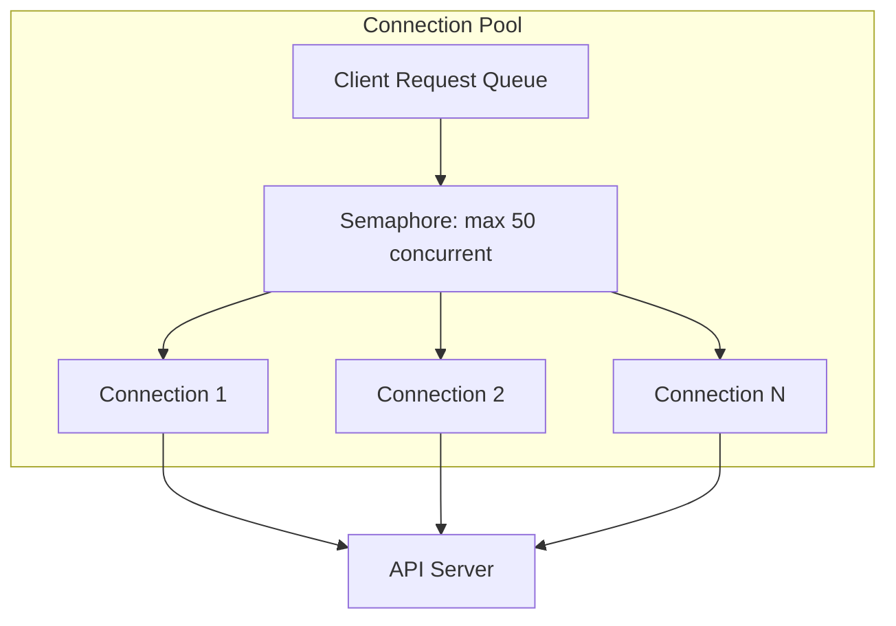

# Python APIs — Senior Deep Dive

## Building Data APIs with FastAPI + Pydantic

Production-grade data API with validation, pagination, and error handling:

```python
from fastapi import FastAPI, HTTPException, Depends, Query, BackgroundTasks
from pydantic import BaseModel, Field, validator
from typing import Optional, List, Generic, TypeVar
from datetime import date, datetime
from enum import Enum

app = FastAPI(title="Data Platform API", version="2.0.0")

# Generic paginated response
T = TypeVar("T")

class PaginatedResponse(BaseModel, Generic[T]):
    results: List[T]
    total_count: int
    page: int
    page_size: int
    has_next: bool

class EventRecord(BaseModel):
    event_id: str
    user_id: str
    event_type: str
    amount: Optional[float] = None
    timestamp: datetime
    metadata: dict = Field(default_factory=dict)
    
    @validator("amount")
    def validate_amount(cls, v):
        if v is not None and (v < -100000 or v > 100000):
            raise ValueError("Amount must be between -100000 and 100000")
        return v

class EventQuery(BaseModel):
    """Query parameters with validation."""
    start_date: date
    end_date: date
    event_types: Optional[List[str]] = None
    min_amount: Optional[float] = None
    user_id: Optional[str] = None
    
    @validator("end_date")
    def end_after_start(cls, v, values):
        if "start_date" in values and v < values["start_date"]:
            raise ValueError("end_date must be >= start_date")
        return v

@app.get("/api/v2/events", response_model=PaginatedResponse[EventRecord])
async def query_events(
    query: EventQuery = Depends(),
    page: int = Query(1, ge=1),
    page_size: int = Query(100, ge=1, le=1000),
):
    """Query events with complex filtering and pagination."""
    offset = (page - 1) * page_size
    
    results, total = await event_repository.query(
        start_date=query.start_date,
        end_date=query.end_date,
        event_types=query.event_types,
        min_amount=query.min_amount,
        user_id=query.user_id,
        limit=page_size,
        offset=offset,
    )
    
    return PaginatedResponse(
        results=results,
        total_count=total,
        page=page,
        page_size=page_size,
        has_next=(offset + page_size) < total,
    )
```

### Health Checks and Dependency Injection

```python
from fastapi import FastAPI, Depends
from typing import AsyncGenerator
import asyncpg

async def get_db_pool() -> AsyncGenerator:
    """Dependency that provides database connection pool."""
    pool = app.state.db_pool
    async with pool.acquire() as conn:
        yield conn

@app.get("/health")
async def health_check():
    """Deep health check — verify all dependencies."""
    checks = {}
    
    try:
        pool = app.state.db_pool
        async with pool.acquire() as conn:
            await conn.fetchval("SELECT 1")
        checks["database"] = "healthy"
    except Exception as e:
        checks["database"] = f"unhealthy: {str(e)}"
    
    try:
        await check_s3_access()
        checks["s3"] = "healthy"
    except Exception as e:
        checks["s3"] = f"unhealthy: {str(e)}"
    
    all_healthy = all(v == "healthy" for v in checks.values())
    status_code = 200 if all_healthy else 503
    
    return {"status": "healthy" if all_healthy else "degraded", "checks": checks}

@app.on_event("startup")
async def startup():
    app.state.db_pool = await asyncpg.create_pool(
        "postgresql://localhost/analytics",
        min_size=5,
        max_size=20
    )

@app.on_event("shutdown")
async def shutdown():
    await app.state.db_pool.close()
```

---

## Webhook Receivers for Pipeline Triggers

```python
from fastapi import FastAPI, Request, HTTPException, Header
from pydantic import BaseModel
import hashlib
import hmac
from typing import Optional
from datetime import datetime

app = FastAPI()

class WebhookPayload(BaseModel):
    event_type: str
    source: str
    timestamp: datetime
    data: dict

def verify_webhook_signature(
    payload: bytes,
    signature: str,
    secret: str
) -> bool:
    """Verify webhook authenticity using HMAC."""
    expected = hmac.new(
        secret.encode(),
        payload,
        hashlib.sha256
    ).hexdigest()
    return hmac.compare_digest(f"sha256={expected}", signature)

@app.post("/webhooks/data-ready")
async def handle_data_ready_webhook(
    request: Request,
    background_tasks: BackgroundTasks,
    x_webhook_signature: Optional[str] = Header(None)
):
    """
    Receive webhook when upstream data is ready.
    Triggers downstream pipeline processing.
    """
    body = await request.body()
    
    # Verify signature
    if x_webhook_signature:
        if not verify_webhook_signature(body, x_webhook_signature, WEBHOOK_SECRET):
            raise HTTPException(status_code=401, detail="Invalid signature")
    
    payload = WebhookPayload.parse_raw(body)
    
    # Route based on event type
    if payload.event_type == "data.file.ready":
        background_tasks.add_task(trigger_ingestion_pipeline, payload.data)
    elif payload.event_type == "data.quality.alert":
        background_tasks.add_task(handle_quality_alert, payload.data)
    
    return {"status": "accepted", "event_type": payload.event_type}

async def trigger_ingestion_pipeline(data: dict):
    """Background task to start pipeline."""
    source_path = data["file_path"]
    await pipeline_orchestrator.trigger("ingest", params={"source": source_path})
```

---

## API Gateway Pattern for Data Services

```python
"""
API gateway that routes data requests to appropriate backend services.
Handles: auth, rate limiting, request routing, response caching.
"""
from fastapi import FastAPI, Request, HTTPException
from fastapi.middleware.cors import CORSMiddleware
import httpx
from typing import Dict
import asyncio
from cachetools import TTLCache

app = FastAPI(title="Data Gateway")

# Service registry
SERVICES = {
    "events": "http://events-service:8001",
    "users": "http://users-service:8002",
    "metrics": "http://metrics-service:8003",
}

# Response cache
cache = TTLCache(maxsize=1000, ttl=300)  # 5-minute TTL

class DataGateway:
    def __init__(self):
        self.client = httpx.AsyncClient(timeout=30.0)
    
    async def route_request(self, service: str, path: str, params: dict = None) -> dict:
        """Route request to appropriate backend service."""
        if service not in SERVICES:
            raise HTTPException(404, f"Unknown service: {service}")
        
        # Check cache
        cache_key = f"{service}:{path}:{str(params)}"
        if cache_key in cache:
            return cache[cache_key]
        
        base_url = SERVICES[service]
        response = await self.client.get(f"{base_url}{path}", params=params)
        
        if response.status_code != 200:
            raise HTTPException(response.status_code, response.text)
        
        result = response.json()
        cache[cache_key] = result
        return result

gateway = DataGateway()

@app.get("/api/{service}/{path:path}")
async def proxy_request(service: str, path: str, request: Request):
    params = dict(request.query_params)
    return await gateway.route_request(service, f"/{path}", params)
```

---

## Connection Pooling for High-Throughput APIs

```python
import httpx
import asyncio
from typing import List, Dict

class HighThroughputClient:
    """
    API client with connection pooling for high-volume data extraction.
    Manages concurrent connections to maximize throughput.
    """
    
    def __init__(
        self,
        base_url: str,
        max_connections: int = 100,
        max_keepalive: int = 20,
        timeout: float = 30.0
    ):
        limits = httpx.Limits(
            max_connections=max_connections,
            max_keepalive_connections=max_keepalive
        )
        self.client = httpx.AsyncClient(
            base_url=base_url,
            limits=limits,
            timeout=timeout,
            http2=True  # HTTP/2 multiplexing
        )
        self._semaphore = asyncio.Semaphore(max_connections)
    
    async def fetch_batch(self, endpoints: List[str]) -> List[Dict]:
        """Fetch many endpoints with controlled concurrency."""
        tasks = [self._fetch_single(ep) for ep in endpoints]
        return await asyncio.gather(*tasks, return_exceptions=True)
    
    async def _fetch_single(self, endpoint: str) -> Dict:
        async with self._semaphore:
            response = await self.client.get(endpoint)
            response.raise_for_status()
            return response.json()
    
    async def close(self):
        await self.client.aclose()

# Usage — extract data from 10K endpoints efficiently
async def extract_all_user_profiles(user_ids: List[str]) -> List[Dict]:
    client = HighThroughputClient(
        base_url="https://api.platform.com",
        max_connections=50
    )
    
    endpoints = [f"/v2/users/{uid}/profile" for uid in user_ids]
    
    # Process in batches to avoid overwhelming memory
    results = []
    batch_size = 500
    for i in range(0, len(endpoints), batch_size):
        batch = endpoints[i:i + batch_size]
        batch_results = await client.fetch_batch(batch)
        results.extend(r for r in batch_results if not isinstance(r, Exception))
    
    await client.close()
    return results
```

The diagram below illustrates how the bounded connection pool works: incoming requests queue behind a semaphore that caps concurrency, and the permitted requests are spread across a fixed set of reusable connections to the API server.



---

## Interview Tips

> **Tip 1:** For FastAPI design questions, emphasize Pydantic's role: "Pydantic models serve triple duty — request validation, response serialization, and documentation. A single model definition generates OpenAPI docs, validates incoming data with clear error messages, and ensures type-safe responses. This eliminates entire categories of bugs."

> **Tip 2:** When discussing webhooks, address security and reliability: "I verify webhook signatures using HMAC to prevent spoofing, process events asynchronously via background tasks for fast 200 responses, and implement idempotency keys so duplicate deliveries don't cause double-processing."

> **Tip 3:** Connection pooling shows you think about performance at scale: "HTTP/2 multiplexing allows multiple requests over a single connection, and a semaphore-bounded pool prevents overwhelming the target API. For extracting 100K records, this achieves 10-50x throughput over sequential requests while staying within rate limits."
