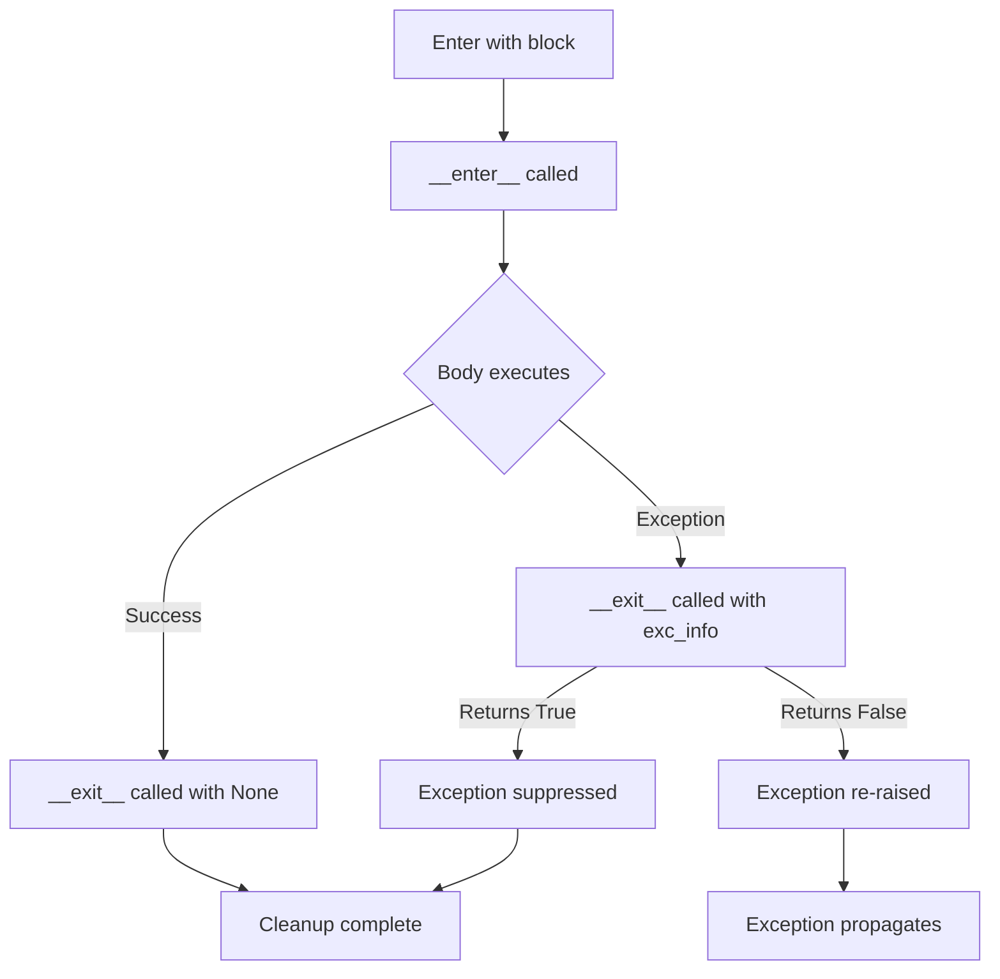

# Python Context Managers — Intermediate Concepts

## Beyond `with open()` — Advanced Patterns

Most engineers know `with open(...)` but context managers go far deeper. They are the backbone of safe resource handling in production data pipelines.

**The analogy:** If a basic context manager is like a light switch (on/off), advanced patterns are like a smart home system — coordinating multiple devices, handling failures gracefully, and adapting to conditions.

---

## ExitStack — Dynamic Resource Management

`ExitStack` lets you manage a variable number of context managers programmatically. Essential when you don't know at coding time how many resources you'll open.

```python
from contextlib import ExitStack

def process_multiple_files(file_paths: list[str]) -> dict:
    """Process N files simultaneously with guaranteed cleanup."""
    results = {}
    
    with ExitStack() as stack:
        # Open all files — ExitStack guarantees ALL get closed
        files = [
            stack.enter_context(open(path, 'r'))
            for path in file_paths
        ]
        
        # Process all files together
        for f in files:
            results[f.name] = len(f.readlines())
    
    # ALL files closed here, even if one raised an exception
    return results
```

### ExitStack with Callbacks

```python
from contextlib import ExitStack
import tempfile
import os

def etl_with_staging():
    """ETL job with cleanup callbacks for temp resources."""
    with ExitStack() as stack:
        # Create temp directory, register cleanup
        tmp_dir = tempfile.mkdtemp()
        stack.callback(lambda: os.rmdir(tmp_dir))
        
        # Register arbitrary cleanup actions
        stack.callback(print, "Pipeline complete — cleaning up")
        
        # Push a close method for any object
        conn = get_database_connection()
        stack.callback(conn.close)
        
        # Do work...
        run_pipeline(tmp_dir, conn)
    # All callbacks execute in LIFO order on exit
```

---

## contextlib Utilities

### @contextmanager — Decorator for Simple Context Managers

```python
from contextlib import contextmanager
import time

@contextmanager
def pipeline_timer(step_name: str):
    """Time a pipeline step with structured logging."""
    start = time.perf_counter()
    print(f"[START] {step_name}")
    try:
        yield  # Control passes to the `with` block
    except Exception as e:
        elapsed = time.perf_counter() - start
        print(f"[FAIL] {step_name} after {elapsed:.2f}s: {e}")
        raise
    else:
        elapsed = time.perf_counter() - start
        print(f"[DONE] {step_name} in {elapsed:.2f}s")

# Usage
with pipeline_timer("extract_users"):
    users = extract_from_source()
```

### suppress — Ignore Specific Exceptions

```python
from contextlib import suppress

# Instead of try/except/pass for expected failures
with suppress(FileNotFoundError):
    os.remove("/tmp/pipeline_lock.pid")

# Useful in cleanup code where failure is acceptable
with suppress(ConnectionError, TimeoutError):
    notify_monitoring_service("pipeline_complete")
```

### redirect_stdout / redirect_stderr

```python
from contextlib import redirect_stdout, redirect_stderr
import io

def capture_spark_output(spark_func):
    """Capture Spark/library output for logging."""
    stdout_buffer = io.StringIO()
    stderr_buffer = io.StringIO()
    
    with redirect_stdout(stdout_buffer), redirect_stderr(stderr_buffer):
        result = spark_func()
    
    return result, stdout_buffer.getvalue(), stderr_buffer.getvalue()
```

---

## Async Context Managers

For async I/O operations (API calls, async DB connections), Python supports `async with`:

```python
import asyncio
from contextlib import asynccontextmanager

@asynccontextmanager
async def async_db_connection(connection_string: str):
    """Async context manager for database connections."""
    import asyncpg
    
    conn = await asyncpg.connect(connection_string)
    try:
        yield conn
    finally:
        await conn.close()

# Usage
async def fetch_records():
    async with async_db_connection("postgresql://...") as conn:
        rows = await conn.fetch("SELECT * FROM events LIMIT 1000")
        return rows
```

### Async ExitStack

```python
from contextlib import AsyncExitStack

async def parallel_source_extraction(sources: list[dict]):
    """Manage multiple async connections dynamically."""
    async with AsyncExitStack() as stack:
        connections = []
        for source in sources:
            conn = await stack.enter_async_context(
                async_db_connection(source["conn_string"])
            )
            connections.append((source["name"], conn))
        
        # All connections open — extract in parallel
        tasks = [
            extract_from(name, conn)
            for name, conn in connections
        ]
        results = await asyncio.gather(*tasks)
    
    # All connections closed
    return results
```

---

## Nested Context Managers — Patterns

### Multiple Managers in One `with` Statement

```python
# Python 3.10+ — parenthesized context managers
with (
    open("input.csv") as infile,
    open("output.parquet", "wb") as outfile,
    pipeline_timer("conversion") as timer,
):
    convert_csv_to_parquet(infile, outfile)
```

### Conditional Context Managers — nullcontext

```python
from contextlib import nullcontext

def process_data(output_path: str = None):
    """Write to file or stdout depending on config."""
    cm = open(output_path, 'w') if output_path else nullcontext(sys.stdout)
    
    with cm as output:
        for record in generate_records():
            output.write(format_record(record))
```

---

## Context Manager Flow Diagram

The diagram below traces how control moves through a `with` block: `__enter__` runs first, the body executes, and `__exit__` always runs afterward, receiving exception details when the body raised so it can choose to suppress or propagate.



---

## Reentrant vs Reusable Context Managers

```python
from contextlib import contextmanager

# REUSABLE — can be used in multiple with statements
@contextmanager
def reusable_timer(name):
    """Each `with` creates fresh state."""
    start = time.time()
    yield
    print(f"{name}: {time.time() - start:.2f}s")

timer = reusable_timer("step")
with timer:  # Works
    do_step_1()

# REENTRANT — can be nested within itself
# threading.Lock is reentrant-safe (RLock)
import threading
lock = threading.RLock()
with lock:
    with lock:  # Same thread can re-acquire
        do_critical_section()
```

---

## Interview Tips

> **Tip 1:** When asked "how would you ensure cleanup in a pipeline?", always mention context managers before try/finally. It shows you write idiomatic Python and understand resource safety guarantees — especially important for DB connections and file handles in long-running ETL jobs.

> **Tip 2:** Know when to use `ExitStack` — the key signal is "variable number of resources." If an interviewer asks about processing N files or N database connections, ExitStack is your answer. It also shows you think about edge cases (what if the 5th file fails to open after 4 are already open?).

> **Tip 3:** Mention `@contextmanager` from contextlib as the Pythonic way to create simple context managers without writing a full class. Interviewers love seeing you reach for the standard library rather than reinventing the wheel.
