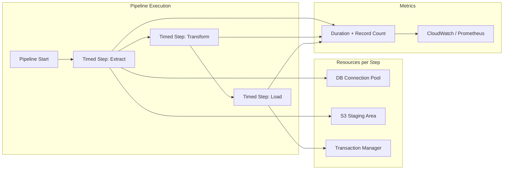

# Python Context Managers — Real-World Production Examples

## Pattern 1: Database Transaction Manager

A production transaction manager that handles retries, savepoints, and audit logging for ETL load operations:

```python
"""
Production transaction manager for data warehouse loads.
Handles: retries on deadlock, savepoints for partial rollback, audit trail.
"""
import time
import logging
from contextlib import contextmanager
from typing import Optional
from datetime import datetime

logger = logging.getLogger(__name__)

class ETLTransactionManager:
    """
    Manages atomic data loads with retry and audit.
    
    Analogy: Like a bank vault procedure — every entry/exit is logged,
    multiple locks must be acquired, and any irregularity triggers
    a full rollback to the last safe state.
    """
    
    RETRYABLE_ERRORS = ("deadlock", "serialization_failure", "lock_timeout")
    
    def __init__(self, connection, max_retries: int = 3, audit_table: str = "etl_audit"):
        self._conn = connection
        self._max_retries = max_retries
        self._audit_table = audit_table
    
    @contextmanager
    def atomic_load(self, job_name: str, target_table: str):
        """
        Context manager for an atomic ETL load operation.
        Retries on transient failures, logs all outcomes.
        """
        attempt = 0
        audit_id = self._start_audit(job_name, target_table)
        
        while attempt <= self._max_retries:
            attempt += 1
            try:
                self._conn.execute("BEGIN")
                yield self._conn
                self._conn.execute("COMMIT")
                self._complete_audit(audit_id, "SUCCESS", attempt)
                return
            except Exception as e:
                self._conn.execute("ROLLBACK")
                error_type = self._classify_error(e)
                
                if error_type in self.RETRYABLE_ERRORS and attempt <= self._max_retries:
                    wait = 2 ** attempt
                    logger.warning(
                        f"Retryable error in {job_name} (attempt {attempt}): {e}. "
                        f"Waiting {wait}s..."
                    )
                    time.sleep(wait)
                else:
                    self._complete_audit(audit_id, "FAILED", attempt, str(e))
                    raise
    
    @contextmanager
    def savepoint(self, name: str):
        """Nested savepoint for partial operations."""
        sp_name = f"sp_{name}_{int(time.time())}"
        self._conn.execute(f"SAVEPOINT {sp_name}")
        try:
            yield
            self._conn.execute(f"RELEASE SAVEPOINT {sp_name}")
        except Exception as e:
            self._conn.execute(f"ROLLBACK TO SAVEPOINT {sp_name}")
            logger.warning(f"Savepoint {name} rolled back: {e}")
            raise
    
    def _start_audit(self, job_name, target_table) -> int:
        cur = self._conn.execute(
            f"INSERT INTO {self._audit_table} (job_name, target_table, started_at) "
            f"VALUES (%s, %s, %s) RETURNING id",
            (job_name, target_table, datetime.utcnow())
        )
        return cur.fetchone()[0]
    
    def _complete_audit(self, audit_id, status, attempts, error=None):
        self._conn.execute(
            f"UPDATE {self._audit_table} SET status=%s, attempts=%s, "
            f"error=%s, completed_at=%s WHERE id=%s",
            (status, attempts, error, datetime.utcnow(), audit_id)
        )
    
    def _classify_error(self, error) -> str:
        msg = str(error).lower()
        if "deadlock" in msg:
            return "deadlock"
        if "serialization" in msg:
            return "serialization_failure"
        if "lock" in msg and "timeout" in msg:
            return "lock_timeout"
        return "unknown"

# Usage
tm = ETLTransactionManager(connection, max_retries=3)

with tm.atomic_load("daily_user_load", "dim_users") as conn:
    conn.execute("DELETE FROM dim_users WHERE is_stale = true")
    conn.execute("INSERT INTO dim_users SELECT * FROM staging_users")
    
    with tm.savepoint("update_aggregates"):
        conn.execute("REFRESH MATERIALIZED VIEW user_summary")
```

---

## Pattern 2: Temporary S3 Staging Area

A context manager that creates temporary S3 prefixes for staging data, with guaranteed cleanup:

```python
"""
Temp S3 staging context manager.
Creates isolated staging areas for ETL jobs with auto-cleanup.
"""
import boto3
import uuid
from contextlib import contextmanager
from typing import Generator
import logging

logger = logging.getLogger(__name__)

@contextmanager
def s3_staging_area(
    bucket: str,
    base_prefix: str = "staging",
    cleanup: bool = True
) -> Generator[dict, None, None]:
    """
    Create a temporary S3 staging area with guaranteed cleanup.
    
    Analogy: Like a construction staging area — a temporary workspace
    that gets completely cleared once the job is done, leaving no
    trace in the permanent structure.
    
    Yields:
        dict with 'bucket', 'prefix', 'uri' keys for the staging area
    """
    # Generate unique prefix to avoid collisions between parallel jobs
    job_id = uuid.uuid4().hex[:12]
    staging_prefix = f"{base_prefix}/{job_id}/"
    staging_uri = f"s3://{bucket}/{staging_prefix}"
    
    s3_client = boto3.client("s3")
    logger.info(f"Created staging area: {staging_uri}")
    
    staging_info = {
        "bucket": bucket,
        "prefix": staging_prefix,
        "uri": staging_uri,
        "job_id": job_id,
    }
    
    try:
        yield staging_info
    finally:
        if cleanup:
            _cleanup_prefix(s3_client, bucket, staging_prefix)
            logger.info(f"Cleaned up staging area: {staging_uri}")
        else:
            logger.warning(f"Staging area retained for debugging: {staging_uri}")

def _cleanup_prefix(s3_client, bucket: str, prefix: str):
    """Delete all objects under a prefix."""
    paginator = s3_client.get_paginator("list_objects_v2")
    
    for page in paginator.paginate(Bucket=bucket, Prefix=prefix):
        objects = page.get("Contents", [])
        if objects:
            delete_keys = [{"Key": obj["Key"]} for obj in objects]
            s3_client.delete_objects(
                Bucket=bucket,
                Delete={"Objects": delete_keys}
            )

# Usage in ETL pipeline
def daily_etl_job():
    with s3_staging_area("my-data-lake", "staging/daily") as staging:
        # Write intermediate results to staging
        write_parquet(data, f"{staging['uri']}users/")
        write_parquet(orders, f"{staging['uri']}orders/")
        
        # Validate staged data
        validate_schema(staging["uri"])
        
        # Promote to production prefix (atomic swap)
        copy_to_production(staging["uri"], "s3://my-data-lake/production/")
    
    # Staging area is completely cleaned up here
```

---

## Pattern 3: Spark Session Lifecycle

Managing Spark session creation, configuration, and teardown:

```python
"""
Spark session lifecycle context manager.
Handles config, monitoring, and graceful shutdown.
"""
from contextlib import contextmanager
from typing import Optional
import logging

logger = logging.getLogger(__name__)

@contextmanager
def managed_spark_session(
    app_name: str,
    master: str = "local[*]",
    config: Optional[dict] = None,
    enable_hive: bool = False,
    log_level: str = "WARN"
):
    """
    Production Spark session with proper lifecycle management.
    
    Analogy: Like starting up a factory — configure the machines,
    verify everything works, run production, then properly shut
    everything down and file the production report.
    """
    from pyspark.sql import SparkSession
    
    builder = SparkSession.builder.appName(app_name).master(master)
    
    # Apply configuration
    default_config = {
        "spark.sql.adaptive.enabled": "true",
        "spark.sql.shuffle.partitions": "200",
        "spark.serializer": "org.apache.spark.serializer.KryoSerializer",
    }
    if config:
        default_config.update(config)
    
    for key, value in default_config.items():
        builder = builder.config(key, value)
    
    if enable_hive:
        builder = builder.enableHiveSupport()
    
    spark = None
    try:
        spark = builder.getOrCreate()
        spark.sparkContext.setLogLevel(log_level)
        
        logger.info(
            f"Spark session created: {app_name} | "
            f"Master: {master} | "
            f"App ID: {spark.sparkContext.applicationId}"
        )
        
        yield spark
        
    except Exception as e:
        logger.error(f"Spark job failed: {app_name} — {e}")
        raise
    finally:
        if spark:
            # Log final metrics before shutdown
            metrics = spark.sparkContext.statusTracker()
            logger.info(
                f"Spark session ending: {app_name} | "
                f"Active jobs: {len(metrics.getActiveJobIds())}"
            )
            spark.stop()
            logger.info(f"Spark session stopped: {app_name}")

# Usage
with managed_spark_session(
    app_name="daily_user_aggregation",
    config={"spark.sql.shuffle.partitions": "50"},
    enable_hive=True
) as spark:
    df = spark.sql("SELECT * FROM raw.user_events WHERE dt = '2024-01-15'")
    result = df.groupBy("user_id").agg({"event_count": "sum"})
    result.write.mode("overwrite").saveAsTable("curated.user_daily_stats")
```

---

## Pattern 4: Pipeline Step Timer with Metrics

A context manager that times pipeline steps and publishes to monitoring:

```python
"""
Pipeline step timer with CloudWatch/Prometheus metrics integration.
Tracks duration, success/failure counts, and custom dimensions.
"""
import time
from contextlib import contextmanager
from dataclasses import dataclass, field
from typing import Optional
import logging

logger = logging.getLogger(__name__)

@dataclass
class StepMetrics:
    """Accumulated metrics for a pipeline step."""
    step_name: str
    duration_seconds: float = 0.0
    records_processed: int = 0
    status: str = "unknown"
    error_message: Optional[str] = None
    custom_dimensions: dict = field(default_factory=dict)

class PipelineMetricsCollector:
    """Collects and publishes pipeline execution metrics."""
    
    def __init__(self, pipeline_name: str, namespace: str = "DataPipeline"):
        self.pipeline_name = pipeline_name
        self.namespace = namespace
        self.steps: list[StepMetrics] = []
        self._pipeline_start: Optional[float] = None
    
    @contextmanager
    def timed_step(self, step_name: str, **dimensions):
        """
        Time a pipeline step and record metrics.
        
        Usage:
            with collector.timed_step("extract", source="postgres"):
                rows = extract_data()
                collector.current_step.records_processed = len(rows)
        """
        metrics = StepMetrics(
            step_name=step_name,
            custom_dimensions=dimensions
        )
        self.current_step = metrics
        start = time.perf_counter()
        
        try:
            yield metrics
            metrics.status = "success"
        except Exception as e:
            metrics.status = "failure"
            metrics.error_message = str(e)[:500]
            raise
        finally:
            metrics.duration_seconds = time.perf_counter() - start
            self.steps.append(metrics)
            self._publish_step_metrics(metrics)
            logger.info(
                f"[{metrics.status.upper()}] {step_name}: "
                f"{metrics.duration_seconds:.2f}s, "
                f"{metrics.records_processed} records"
            )
    
    @contextmanager
    def pipeline_run(self):
        """Wrap the entire pipeline execution."""
        self._pipeline_start = time.perf_counter()
        self.steps = []
        
        try:
            yield self
        finally:
            total_duration = time.perf_counter() - self._pipeline_start
            self._publish_pipeline_summary(total_duration)
    
    def _publish_step_metrics(self, metrics: StepMetrics):
        """Publish to CloudWatch or Prometheus."""
        # In production, replace with actual client
        print(f"METRIC: {self.namespace}/{metrics.step_name} "
              f"duration={metrics.duration_seconds:.2f}s "
              f"status={metrics.status}")
    
    def _publish_pipeline_summary(self, total_duration: float):
        success_steps = sum(1 for s in self.steps if s.status == "success")
        total_records = sum(s.records_processed for s in self.steps)
        logger.info(
            f"Pipeline {self.pipeline_name} complete: "
            f"{total_duration:.2f}s total, "
            f"{success_steps}/{len(self.steps)} steps succeeded, "
            f"{total_records} total records"
        )

# Usage
collector = PipelineMetricsCollector("daily_user_pipeline")

with collector.pipeline_run():
    with collector.timed_step("extract", source="postgres") as step:
        users = extract_users()
        step.records_processed = len(users)
    
    with collector.timed_step("transform") as step:
        transformed = apply_transformations(users)
        step.records_processed = len(transformed)
    
    with collector.timed_step("load", target="redshift") as step:
        load_to_warehouse(transformed)
        step.records_processed = len(transformed)
```

---

## Pattern Integration Diagram

The diagram below shows how the four patterns compose in a single run: each timed step wraps the resources it needs (connection pool, S3 staging, transaction manager) while emitting duration and record-count metrics to a monitoring backend.



---

## Interview Tips

> **Tip 1:** When describing production pipelines, frame context managers as "resource lifecycle contracts." Explain that every resource (DB connection, S3 staging, Spark session) has an acquire-use-release lifecycle, and context managers make this lifecycle explicit and failure-safe. This shows architectural thinking beyond just syntax knowledge.

> **Tip 2:** For the S3 staging pattern, emphasize idempotency — using a unique job ID ensures parallel runs don't collide, and cleanup guarantees no orphaned data accumulates. Interviewers love hearing about the operational aspects (cost, debugging retained staging areas, monitoring cleanup failures).

> **Tip 3:** When discussing the metrics pattern, connect it to observability — explain how you'd use these timers to set up alerts on step duration regression, track throughput trends, and identify pipeline bottlenecks. This demonstrates you think about pipelines as living systems that need ongoing monitoring, not just initial development.
