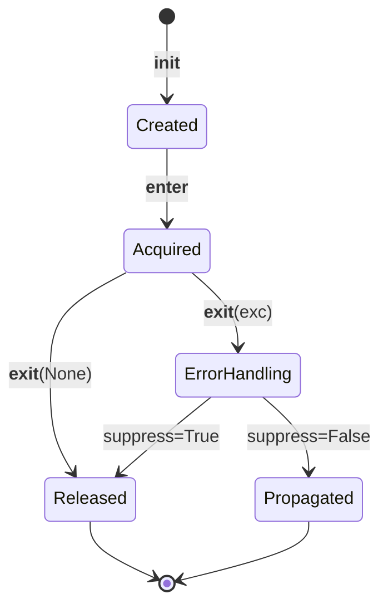

# Python Context Managers — Senior Deep Dive

## Custom Resource Pool Manager

In production DE systems, you rarely open a single connection — you manage pools. Here's how to build a thread-safe connection pool using context managers:

```python
import threading
from queue import Queue, Empty
from contextlib import contextmanager
from typing import Any
import time

class ConnectionPool:
    """
    Thread-safe connection pool with context manager interface.
    Analogy: Like a library lending system — fixed number of books (connections),
    patrons borrow and return them. If all are out, you wait.
    """
    
    def __init__(self, factory, max_size: int = 10, timeout: float = 30.0):
        self._factory = factory
        self._pool: Queue = Queue(maxsize=max_size)
        self._size = 0
        self._max_size = max_size
        self._timeout = timeout
        self._lock = threading.Lock()
        
        # Pre-populate pool
        for _ in range(max_size):
            self._pool.put(self._factory())
            self._size += 1
    
    @contextmanager
    def acquire(self):
        """Borrow a connection from the pool."""
        conn = None
        try:
            conn = self._pool.get(timeout=self._timeout)
            # Validate connection is still alive
            if not self._is_healthy(conn):
                conn = self._factory()  # Replace dead connection
            yield conn
        except Empty:
            raise TimeoutError(
                f"Could not acquire connection within {self._timeout}s. "
                f"Pool exhausted ({self._max_size} connections in use)."
            )
        finally:
            if conn is not None:
                self._pool.put(conn)
    
    def _is_healthy(self, conn) -> bool:
        """Check if connection is still usable."""
        try:
            conn.ping()  # Or execute "SELECT 1"
            return True
        except Exception:
            return False
    
    @property
    def available(self) -> int:
        return self._pool.qsize()

# Usage in a pipeline
pool = ConnectionPool(
    factory=lambda: psycopg2.connect("postgresql://..."),
    max_size=20,
    timeout=10.0
)

def process_batch(batch):
    with pool.acquire() as conn:
        with conn.cursor() as cur:
            cur.executemany("INSERT INTO events ...", batch)
        conn.commit()
```

---

## Transaction Context Manager

Managing database transactions with proper rollback semantics:

```python
from contextlib import contextmanager
import logging

logger = logging.getLogger(__name__)

class TransactionManager:
    """
    Manages database transactions with savepoint support.
    Supports nested transactions via savepoints.
    """
    
    def __init__(self, connection):
        self._conn = connection
        self._savepoint_counter = 0
    
    @contextmanager
    def transaction(self, name: str = None):
        """
        Atomic transaction block. Commits on success, rolls back on failure.
        Nested calls create savepoints instead of new transactions.
        """
        is_nested = self._conn.in_transaction
        savepoint_name = None
        
        if is_nested:
            self._savepoint_counter += 1
            savepoint_name = f"sp_{name or self._savepoint_counter}"
            self._conn.execute(f"SAVEPOINT {savepoint_name}")
            logger.debug(f"Created savepoint: {savepoint_name}")
        else:
            self._conn.execute("BEGIN")
            logger.debug(f"Started transaction: {name}")
        
        try:
            yield self._conn
        except Exception as e:
            if is_nested and savepoint_name:
                self._conn.execute(f"ROLLBACK TO SAVEPOINT {savepoint_name}")
                logger.warning(f"Rolled back to savepoint: {savepoint_name}")
            else:
                self._conn.execute("ROLLBACK")
                logger.error(f"Transaction rolled back: {name} — {e}")
            raise
        else:
            if is_nested and savepoint_name:
                self._conn.execute(f"RELEASE SAVEPOINT {savepoint_name}")
            else:
                self._conn.execute("COMMIT")
                logger.info(f"Transaction committed: {name}")

# Usage — nested transactions
tm = TransactionManager(connection)

with tm.transaction("load_daily_data"):
    insert_dimension_records(connection)
    
    with tm.transaction("load_facts"):
        # If this fails, only facts roll back
        insert_fact_records(connection)
    
    update_metadata(connection)
```

---

## Testing Context Managers with Mocks

```python
import pytest
from unittest.mock import MagicMock, patch, AsyncMock
from contextlib import contextmanager

# Testing that a context manager properly acquires and releases
class TestConnectionPool:
    def test_acquire_returns_connection(self):
        mock_factory = MagicMock(return_value=MagicMock())
        pool = ConnectionPool(factory=mock_factory, max_size=2)
        
        with pool.acquire() as conn:
            assert conn is not None
            assert pool.available == 1  # One checked out
        
        assert pool.available == 2  # Returned to pool
    
    def test_acquire_timeout_when_exhausted(self):
        mock_factory = MagicMock()
        pool = ConnectionPool(factory=mock_factory, max_size=1, timeout=0.1)
        
        with pool.acquire() as conn:
            # Pool is exhausted — second acquire should timeout
            with pytest.raises(TimeoutError):
                with pool.acquire() as conn2:
                    pass
    
    def test_unhealthy_connection_replaced(self):
        dead_conn = MagicMock()
        dead_conn.ping.side_effect = ConnectionError("dead")
        
        fresh_conn = MagicMock()
        factory = MagicMock(side_effect=[dead_conn, fresh_conn])
        
        pool = ConnectionPool(factory=factory, max_size=1)
        
        with pool.acquire() as conn:
            assert conn == fresh_conn  # Got fresh replacement


# Mocking a context manager in tests
def test_pipeline_uses_transaction():
    """Verify pipeline code properly uses transaction context."""
    mock_tm = MagicMock()
    mock_conn = MagicMock()
    mock_tm.transaction.return_value.__enter__ = MagicMock(return_value=mock_conn)
    mock_tm.transaction.return_value.__exit__ = MagicMock(return_value=False)
    
    # Run the pipeline function that should use transactions
    run_etl_pipeline(transaction_manager=mock_tm)
    
    # Verify transaction was used
    mock_tm.transaction.assert_called_once_with("etl_load")
```

---

## Context Manager Protocol — __enter__ and __exit__ Internals

```python
class ManagedResource:
    """Full implementation showing the protocol contract."""
    
    def __init__(self, name: str):
        self.name = name
        self._acquired = False
    
    def __enter__(self):
        """
        Called when entering `with` block.
        Returns: the object to bind to `as` variable.
        """
        self._acquired = True
        print(f"Acquired: {self.name}")
        return self  # Often returns self, but can return anything
    
    def __exit__(self, exc_type, exc_val, exc_tb):
        """
        Called when exiting `with` block (always, even on exception).
        
        Args:
            exc_type: Exception class (or None if no exception)
            exc_val: Exception instance (or None)
            exc_tb: Traceback (or None)
        
        Returns:
            True  → suppress the exception (swallow it)
            False → let the exception propagate (default)
        """
        self._acquired = False
        print(f"Released: {self.name}")
        
        if exc_type is not None:
            print(f"Exception occurred: {exc_type.__name__}: {exc_val}")
            # Return True to suppress, False to propagate
            return isinstance(exc_val, (ValueError, KeyError))
```

---

## Advanced Pattern: Composable Pipeline Context

```python
from contextlib import ExitStack, contextmanager
from dataclasses import dataclass, field
from typing import Callable

@dataclass
class PipelineContext:
    """Composable context that accumulates resources and metadata."""
    resources: dict = field(default_factory=dict)
    metrics: dict = field(default_factory=dict)
    _stack: ExitStack = field(default_factory=ExitStack)
    
    def __enter__(self):
        self._stack.__enter__()
        return self
    
    def __exit__(self, *exc_info):
        return self._stack.__exit__(*exc_info)
    
    def add_resource(self, name: str, cm):
        """Register a context manager as a named resource."""
        resource = self._stack.enter_context(cm)
        self.resources[name] = resource
        return resource
    
    def on_cleanup(self, callback: Callable, *args):
        """Register a cleanup callback."""
        self._stack.callback(callback, *args)

# Usage — composable pipeline resources
with PipelineContext() as ctx:
    db = ctx.add_resource("database", get_db_connection())
    s3 = ctx.add_resource("s3_client", get_s3_session())
    ctx.on_cleanup(publish_metrics, ctx.metrics)
    
    ctx.metrics["rows_processed"] = run_etl(db, s3)
# All resources cleaned up, metrics published
```

---

## Context Manager State Machine

The state machine below shows the lifecycle of a context manager object, from construction through acquisition to release, including the branch where an exception during the body is either suppressed or propagated by `__exit__`.



---

## Interview Tips

> **Tip 1:** When discussing resource management at senior level, always address the failure modes — what happens if `__enter__` succeeds but the body fails? What if cleanup itself fails? Show you think about partial-failure states and how context managers provide deterministic cleanup regardless of the exit path.

> **Tip 2:** For system design questions involving connection pools, describe the context manager interface as the API contract. Explain why `with pool.acquire() as conn` is superior to manual `conn = pool.get()` / `pool.release(conn)` — it eliminates an entire class of resource leak bugs caused by forgotten releases in error paths.

> **Tip 3:** Know the difference between reusable and single-use context managers. A `@contextmanager` generator is single-use (generator exhausts), while a class-based CM can be reused. This matters when designing pipeline components that need to be invoked multiple times across DAG tasks.

## ⚡ Cheat Sheet

**Protocol Contract**
- `__enter__` → acquires resource, returns value bound to `as` variable
- `__exit__(exc_type, exc_val, exc_tb)` → always called; return `True` to suppress exception
- `@contextmanager` generator: `yield` = `__enter__` point; code after `yield` = `__exit__`
- `@contextmanager` is single-use (generator exhausts); class-based CM can be reused

**Connection Pool Pattern**
- `Queue(maxsize=N)` as pool storage — `get(timeout=T)` blocks until connection available
- `_is_healthy(conn)`: call `ping()` / `SELECT 1` before yielding; replace dead connection
- Pool exhausted → `TimeoutError` with clear message (better than silent hang)
- `finally: pool.put(conn)` — always return connection, even on exception

**Transaction / Savepoint**
- Outer `with tm.transaction()` → `BEGIN` / `COMMIT` or full `ROLLBACK`
- Nested `with tm.transaction()` → `SAVEPOINT` / `RELEASE` or `ROLLBACK TO SAVEPOINT`
- Check `conn.in_transaction` to detect nesting level

**ExitStack (Composable Resources)**
- `ExitStack.enter_context(cm)` — register any CM; all cleaned up when stack exits
- `ExitStack.callback(fn, *args)` — register plain functions as cleanup steps
- Use `PipelineContext` wrapping `ExitStack` for named resource access by key

**Testing Context Managers**
- Mock `__enter__` / `__exit__` on `MagicMock()` — `return_value.__enter__ = MagicMock()`
- Access unwrapped function via `func.__wrapped__` (set by `@functools.wraps`)
- Test timeout path: use `timeout=0.1` and hold the pool exhausted in a nested `with`

**Key Rules**
- Always use `with` (never manual acquire/release) — eliminates resource leaks in error paths
- `__exit__` is called even if `__enter__` raises — design accordingly
- Class-based CM needed if: reusable, needs state between enter/exit, or used as decorator
