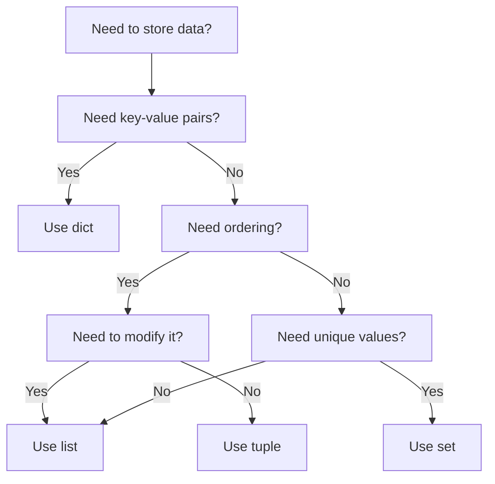

# Python Data Structures — Fundamentals


## 🎯 Analogy

Think of Python data structures like containers in a kitchen: lists are drawers (ordered, allows duplicates), sets are bowls with no duplicates (fast membership checks), dicts are labeled jars (fast key lookups), and deques are conveyor belts (fast add/remove from both ends).

---
## Why This Matters for DE Interviews

Python data structures are the foundation of every data pipeline. Interviewers test whether you know **which structure to use when** — and the performance implications at scale (millions of records).

---

## The Decision Flowchart



**What this shows:**
- **dict** — when you need to look up values by a key (configuration, caches, grouping)
- **list** — ordered collection you'll modify (append, insert, iterate)
- **tuple** — ordered data that shouldn't change (DB records, coordinates, function returns)
- **set** — when you only care about unique values (dedup, membership testing)

---

## Sample Data Used Throughout

```python
# Pipeline context: processing employee records
employees = [
    {"id": 101, "name": "Alice", "dept": "Engineering", "salary": 95000},
    {"id": 102, "name": "Bob", "dept": "Marketing", "salary": 72000},
    {"id": 103, "name": "Charlie", "dept": "Engineering", "salary": 110000},
    {"id": 104, "name": "Diana", "dept": "Marketing", "salary": 85000},
]
```

---

## 1. Lists — Ordered, Mutable Sequences

**What it is:** An ordered collection where items have positions (indexes). You can add, remove, and modify items.

**When to use:** Processing records in order, building result sets, any sequence where position matters.

```python
# Creating lists
pipeline_stages = ["extract", "transform", "validate", "load"]
numbers = list(range(1, 11))  # [1, 2, 3, ..., 10]

# Accessing by position
first = pipeline_stages[0]    # "extract"
last = pipeline_stages[-1]    # "load"

# Modifying
pipeline_stages.append("notify")       # Add to end
pipeline_stages.insert(2, "clean")     # Insert at position 2
pipeline_stages.pop()                  # Remove last item
```

### Performance (Time Complexity)

| Operation | Complexity | Note |
|-----------|-----------|------|
| `list[i]` (access by index) | O(1) | Instant |
| `list.append(x)` | O(1) | Add to end — fast |
| `list.insert(0, x)` | O(n) | Shifts ALL elements — slow |
| `list.pop()` | O(1) | Remove from end — fast |
| `list.pop(0)` | O(n) | Shifts ALL elements — slow |
| `x in list` | O(n) | Scans entire list — slow for large lists! |

> **Critical point for DE:** If you need to check "is this ID already processed?", a list is O(n) per check. With 1M records, that's 1M comparisons per lookup. Use a **set** instead (O(1) per lookup).

### List Comprehensions (The Pythonic Way)

```python
# Filter + transform in one line
salaries = [emp["salary"] for emp in employees]
# Result: [95000, 72000, 110000, 85000]

high_earners = [emp["name"] for emp in employees if emp["salary"] > 90000]
# Result: ["Alice", "Charlie"]

# Flatten nested lists
nested = [[1, 2], [3, 4], [5, 6]]
flat = [item for sublist in nested for item in sublist]
# Result: [1, 2, 3, 4, 5, 6]
```

---

## 2. Dictionaries — Key-Value Lookup

**What it is:** A mapping of unique keys to values. Powered by a hash table internally, giving O(1) lookups.

**When to use:** Configuration, caching, grouping records by key, counting occurrences.

```python
# Creating dicts
config = {
    "source": "s3://data-lake/raw/",
    "destination": "snowflake://warehouse/",
    "batch_size": 10000,
    "retry_count": 3,
}

# Accessing values
source = config["source"]             # Raises KeyError if missing
source = config.get("source", "")     # Returns "" if missing (safe)

# Adding/modifying
config["timeout"] = 300               # Add new key
config["batch_size"] = 50000          # Overwrite existing

# Useful methods
keys = list(config.keys())            # All keys
items = list(config.items())          # All (key, value) pairs
```

### Performance (Hash Table)

| Operation | Average | Worst Case |
|-----------|---------|------------|
| `d[key]` lookup | O(1) | O(n)* |
| `d[key] = val` insert | O(1) | O(n)* |
| `key in d` membership | O(1) | O(n)* |
| `del d[key]` delete | O(1) | O(n)* |
| Iterate all items | O(n) | O(n) |

*Worst case O(n) only with extreme hash collisions — practically never happens.

> **DE pattern — grouping records:**
> ```python
> from collections import defaultdict
> 
> # Group employees by department
> by_dept = defaultdict(list)
> for emp in employees:
>     by_dept[emp["dept"]].append(emp)
> 
> # Result: {"Engineering": [Alice, Charlie], "Marketing": [Bob, Diana]}
> ```

### Dict Comprehensions

```python
# Build a lookup map: id -> name
id_to_name = {emp["id"]: emp["name"] for emp in employees}
# Result: {101: "Alice", 102: "Bob", 103: "Charlie", 104: "Diana"}

# Filter a dict
high_salary_map = {emp["id"]: emp["salary"] 
                   for emp in employees 
                   if emp["salary"] > 90000}
# Result: {101: 95000, 103: 110000}
```

---

## 3. Tuples — Immutable Sequences

**What it is:** Like a list, but CANNOT be modified after creation. Slightly faster and uses less memory than lists.

**When to use:** Fixed records (DB rows), dictionary keys (must be hashable), function return values, data that shouldn't change.

```python
# Use as fixed records
record = ("Alice", "Engineering", 95000)
name, dept, salary = record  # Tuple unpacking

# Named tuples for clarity (like a lightweight class)
from collections import namedtuple
Employee = namedtuple("Employee", ["name", "department", "salary"])
emp = Employee("Alice", "Engineering", 95000)
print(emp.name)       # "Alice"
print(emp.salary)     # 95000

# Tuples as dict keys (lists CANNOT be dict keys!)
location_cache = {
    (40.7128, -74.0060): "New York",
    (51.5074, -0.1278): "London",
}
city = location_cache[(40.7128, -74.0060)]  # "New York"
```

### Tuple vs List — Memory Comparison

```python
import sys
my_list  = [1, 2, 3, 4, 5]
my_tuple = (1, 2, 3, 4, 5)

print(sys.getsizeof(my_list))   # 120 bytes
print(sys.getsizeof(my_tuple))  # 80 bytes — 33% less memory!
```

> **When this matters:** Processing 100M records — tuples save ~33% memory versus lists for the same data.

---

## 4. Sets — Unique, Unordered Collections

**What it is:** A collection where every item is unique (duplicates auto-removed) and O(1) membership testing.

**When to use:** Deduplication, membership testing ("has this ID been processed?"), data reconciliation.

```python
# Creating sets
processed_ids = {101, 102, 103, 104}
# Duplicates removed automatically:
unique_emails = set(["a@b.com", "c@d.com", "a@b.com"])
# Result: {"a@b.com", "c@d.com"}
```

### Set Operations — Critical for Data Engineering

```python
source_ids = {1, 2, 3, 4, 5}      # IDs in source system
target_ids = {3, 4, 5, 6, 7}      # IDs in target system

# What's in source but NOT in target? (needs to be loaded)
missing_in_target = source_ids - target_ids
# Result: {1, 2}

# What's in target but NOT in source? (orphaned records)
orphaned = target_ids - source_ids
# Result: {6, 7}

# What's in BOTH? (already synced)
synced = source_ids & target_ids
# Result: {3, 4, 5}

# Everything combined
all_ids = source_ids | target_ids
# Result: {1, 2, 3, 4, 5, 6, 7}

# In one but not both (symmetric difference — all discrepancies)
discrepancies = source_ids ^ target_ids
# Result: {1, 2, 6, 7}
```

### Performance

| Operation | Complexity | Comparison to list |
|-----------|-----------|-------------------|
| `x in s` membership | O(1) | list is O(n) — 1000x faster at scale |
| `s.add(x)` | O(1) | Same as list.append |
| `s - t` difference | O(len(s)) | No list equivalent without nested loop |
| `s & t` intersection | O(min(len(s), len(t))) | O(n*m) with lists |

> **The #1 performance pattern for DE:**
> ```python
> # BAD: O(n) lookup per check — with 1M items this is painfully slow
> processed = [101, 102, 103, ...]
> if user_id in processed:  # Scans entire list each time!
>
> # GOOD: O(1) lookup — instant regardless of size
> processed = {101, 102, 103, ...}
> if user_id in processed:  # Hash lookup — constant time
> ```

---

## Quick Comparison

| Feature | list | dict | tuple | set |
|---------|------|------|-------|-----|
| Ordered? | Yes | Yes (3.7+) | Yes | No |
| Mutable? | Yes | Yes | No | Yes |
| Duplicates? | Allowed | Keys unique | Allowed | No duplicates |
| Indexed? | By position | By key | By position | No |
| Hashable? | No | No | Yes | No |
| Membership test | O(n) | O(1) | O(n) | O(1) |
| Best for | Sequences | Lookups | Fixed records | Uniqueness |

---

## Choosing the Right Structure — Scenarios

| Scenario | Best Choice | Why |
|----------|-------------|-----|
| Check if user_id already processed | **set** | O(1) membership test |
| Store pipeline config parameters | **dict** | Key-value access by name |
| Build a list of results to return | **list** | Ordered, appendable |
| Store database connection params | **tuple** | Shouldn't change, hashable |
| Count occurrences of each value | **dict** (or Counter) | Key=value, Value=count |
| Group records by a field | **defaultdict(list)** | Auto-initializes empty lists |
| Remove duplicate records | **set** (or dict by key) | Auto-deduplicates |
| Store coordinates for caching | **tuple** (as dict key) | Hashable, immutable |

---


## ▶️ Try It Yourself

```python
# Lists: ordered, mutable, allows duplicates
orders = [100, 200, 100, 300]
orders.append(400)
print(orders[-1])   # 400 (last element)

# Sets: unordered, unique values — O(1) membership test
regions = {"US", "EU", "APAC"}
print("US" in regions)   # True — O(1)
unique_orders = list(set(orders))  # Deduplicate

# Dicts: key-value, ordered (Python 3.7+), O(1) lookup
revenue = {"US": 1000, "EU": 2000}
revenue["APAC"] = 1500
print(revenue.get("JP", 0))  # 0 (default if missing)

# Counter: frequency dict made easy
from collections import Counter, deque
freq = Counter(["US","EU","US","US","EU"])
print(freq.most_common(2))  # [('US', 3), ('EU', 2)]

# Deque: O(1) append/pop from both ends (queue/stack)
queue = deque(maxlen=3)
queue.append(1); queue.append(2); queue.append(3)
queue.append(4)   # Evicts 1 (maxlen=3)
print(list(queue))  # [2, 3, 4]
```

> **Run it:** Copy the snippet into a REPL or file — no external services needed for the basic example.

---
## Interview Tips

> **Tip 1:** The most common DS question for DE: "How would you efficiently find records in source but not in target?" Answer: `source_ids - target_ids` (set difference). O(n) vs O(n²) for nested loops. Always mention the complexity.

> **Tip 2:** If asked about memory at scale, mention: "Tuples use ~33% less memory than lists for the same data, and sets use more memory than lists but give O(1) lookups — the tradeoff is usually worth it at scale."

> **Tip 3:** For "group by" operations in pure Python, immediately reach for `defaultdict(list)` — it shows you know the stdlib and avoids boilerplate key-checking code.
