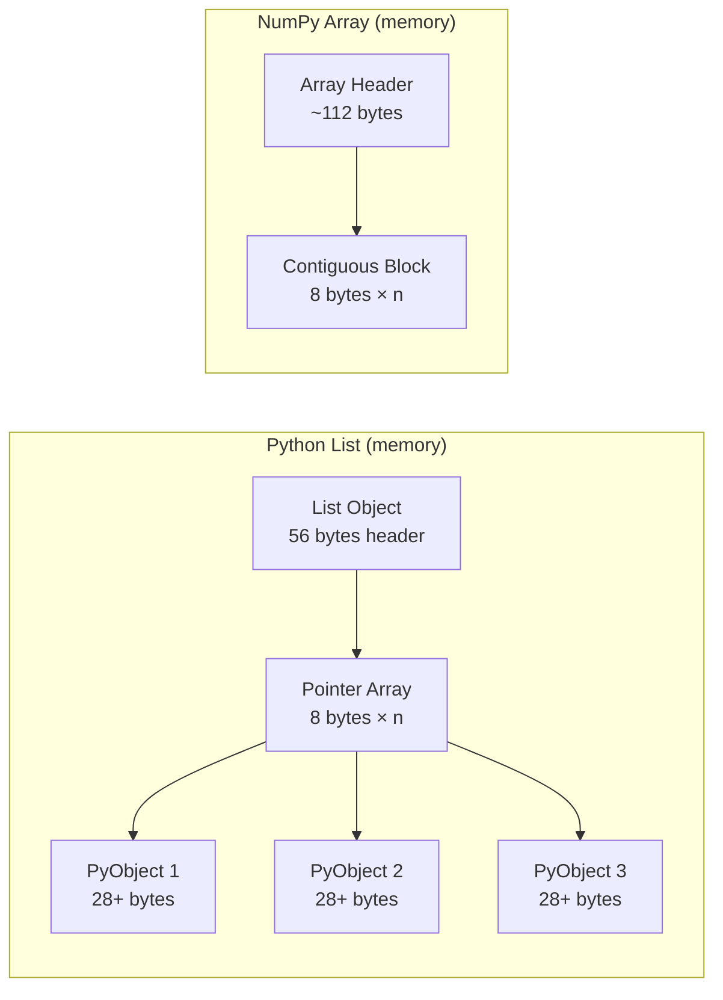

# Python Data Structures — Senior-Level Deep Dive

## Memory Internals — How Python Stores Data

### Object Model and Memory Layout

Every Python object has overhead:

```python
import sys

# Base object overhead (CPython 3.11+)
print(sys.getsizeof(1))        # 28 bytes (int)
print(sys.getsizeof(""))       # 49 bytes (empty string)
print(sys.getsizeof([]))       # 56 bytes (empty list)
print(sys.getsizeof({}))       # 64 bytes (empty dict)
print(sys.getsizeof(set()))    # 216 bytes (empty set!)

# A list of 1M integers:
# Each int: 28 bytes + pointer in list: 8 bytes = 36 bytes per element
# Total: ~36MB for 1M integers in a list

# vs numpy array:
import numpy as np
arr = np.zeros(1_000_000, dtype=np.int64)
# Total: ~8MB (8 bytes per int64, no Python object overhead)
```

The diagram below contrasts the two memory layouts: a Python list holds a header plus an array of pointers to individually boxed integer objects, while a NumPy array stores raw values in one contiguous block, which is why it uses far less memory.



### Dict Internals — Compact Dict (Python 3.6+)

```python
# Python dicts use a compact hash table with separate indices and entries arrays
# This is why dicts maintain insertion order since Python 3.7

# The hash table growth pattern:
# Size: 8 → 16 → 32 → 64 → ... (doubles)
# Load factor threshold: 2/3 (resizes when 66% full)

# Memory-efficient alternative for fixed schemas:
from types import SimpleNamespace
record = SimpleNamespace(name="John", age=30, dept="Eng")
# Uses __dict__ internally but cleaner API

# Even better for memory — __slots__:
class Record:
    __slots__ = ('name', 'age', 'dept')
    
    def __init__(self, name, age, dept):
        self.name = name
        self.age = age
        self.dept = dept

# Memory comparison:
import sys
regular_dict = {"name": "John", "age": 30, "dept": "Eng"}
slotted = Record("John", 30, "Eng")
print(sys.getsizeof(regular_dict))  # ~232 bytes
print(sys.getsizeof(slotted))       # ~56 bytes (4x less!)
```

### String Interning

```python
# Python interns small strings and identifiers
a = "hello"
b = "hello"
print(a is b)  # True — same object in memory

# But not for computed strings:
c = "hel" + "lo"  # May or may not be interned (implementation detail)

# Force interning for frequently used strings (e.g., column names):
import sys
column_name = sys.intern("customer_id")
# Now all references to "customer_id" share the same object
# Saves memory when processing millions of records with repeated string keys
```

## Custom Data Structures for DE Workloads

### Bloom Filter — Probabilistic Membership Testing

```python
import hashlib
from bitarray import bitarray

class BloomFilter:
    """
    Space-efficient probabilistic data structure.
    Answers: "Definitely NOT in set" or "PROBABLY in set"
    
    Use case: Skip processing records that definitely haven't been seen before.
    Example: Check if a customer_id exists in a 100M record table without
    loading all IDs into memory.
    """
    
    def __init__(self, size: int, num_hash_functions: int = 5):
        self.size = size
        self.num_hash_functions = num_hash_functions
        self.bit_array = bitarray(size)
        self.bit_array.setall(0)
    
    def _hashes(self, item: str):
        """Generate multiple hash positions."""
        for i in range(self.num_hash_functions):
            digest = hashlib.sha256(f"{item}_{i}".encode()).hexdigest()
            yield int(digest, 16) % self.size
    
    def add(self, item: str):
        for pos in self._hashes(item):
            self.bit_array[pos] = 1
    
    def might_contain(self, item: str) -> bool:
        """Returns False = definitely not in set. True = maybe in set."""
        return all(self.bit_array[pos] for pos in self._hashes(item))

# Usage in ETL deduplication:
seen_ids = BloomFilter(size=10_000_000)  # ~1.2MB for 10M bits
for record in incoming_stream:
    if seen_ids.might_contain(record["id"]):
        # Might be duplicate — do expensive DB lookup to confirm
        if db.exists(record["id"]):
            continue
    seen_ids.add(record["id"])
    process(record)
```

### Trie — Prefix-Based Lookup

```python
class TrieNode:
    __slots__ = ('children', 'is_end', 'value')
    
    def __init__(self):
        self.children = {}
        self.is_end = False
        self.value = None

class Trie:
    """
    Efficient prefix matching for:
    - S3 path prefix routing
    - Database/schema/table name resolution
    - Log pattern matching
    """
    
    def __init__(self):
        self.root = TrieNode()
    
    def insert(self, key: str, value=None):
        node = self.root
        for char in key:
            if char not in node.children:
                node.children[char] = TrieNode()
            node = node.children[char]
        node.is_end = True
        node.value = value
    
    def find_prefix(self, text: str):
        """Find the longest matching prefix."""
        node = self.root
        last_match = None
        for i, char in enumerate(text):
            if char not in node.children:
                break
            node = node.children[char]
            if node.is_end:
                last_match = (text[:i+1], node.value)
        return last_match

# Usage: Route S3 events to different processors based on path prefix
router = Trie()
router.insert("s3://data-lake/raw/", "raw_processor")
router.insert("s3://data-lake/curated/", "curated_processor")
router.insert("s3://data-lake/raw/clickstream/", "clickstream_processor")

path = "s3://data-lake/raw/clickstream/2024/01/events.parquet"
match = router.find_prefix(path)
# Returns: ("s3://data-lake/raw/clickstream/", "clickstream_processor")
```

### Ring Buffer — Fixed-Size Circular Buffer

```python
from typing import TypeVar, Generic, Optional
T = TypeVar('T')

class RingBuffer(Generic[T]):
    """
    Fixed-memory circular buffer. Overwrites oldest when full.
    Use case: Keep last N events for real-time dashboards without growing memory.
    """
    
    __slots__ = ('_buffer', '_capacity', '_write_pos', '_count')
    
    def __init__(self, capacity: int):
        self._buffer: list = [None] * capacity
        self._capacity = capacity
        self._write_pos = 0
        self._count = 0
    
    def append(self, item: T) -> Optional[T]:
        """Append item, return evicted item if buffer was full."""
        evicted = self._buffer[self._write_pos] if self._count == self._capacity else None
        self._buffer[self._write_pos] = item
        self._write_pos = (self._write_pos + 1) % self._capacity
        self._count = min(self._count + 1, self._capacity)
        return evicted
    
    def __iter__(self):
        """Iterate from oldest to newest."""
        if self._count < self._capacity:
            yield from self._buffer[:self._count]
        else:
            start = self._write_pos
            for i in range(self._capacity):
                yield self._buffer[(start + i) % self._capacity]
    
    def __len__(self):
        return self._count

# Usage: Monitor last 10K events for anomaly detection
event_buffer = RingBuffer(10_000)
for event in infinite_stream:
    event_buffer.append(event)
    if len(event_buffer) == 10_000:
        check_anomaly(list(event_buffer))
```

## Memory Optimization Strategies for Large Datasets

### Strategy 1: Generator Pipelines (Lazy Evaluation)

```python
def read_large_file(path, chunk_size=8192):
    """Read file without loading entire content into memory."""
    with open(path, 'r') as f:
        while True:
            chunk = f.read(chunk_size)
            if not chunk:
                break
            yield chunk

def parse_records(chunks):
    """Parse records from raw chunks."""
    buffer = ""
    for chunk in chunks:
        buffer += chunk
        while "\n" in buffer:
            line, buffer = buffer.split("\n", 1)
            yield json.loads(line)

def filter_records(records, predicate):
    """Filter without materializing."""
    yield from (r for r in records if predicate(r))

# Compose the pipeline — nothing executes until consumed
pipeline = filter_records(
    parse_records(read_large_file("events.jsonl")),
    lambda r: r["event_type"] == "purchase"
)

# Process one record at a time — constant memory
for record in pipeline:
    process(record)
```

### Strategy 2: Memory-Mapped Files

```python
import mmap

def count_lines_mmap(filepath):
    """Count lines in a huge file using memory mapping (OS handles paging)."""
    with open(filepath, 'r') as f:
        with mmap.mmap(f.fileno(), 0, access=mmap.ACCESS_READ) as mm:
            return mm[:].count(b'\n')

# Memory-mapped files let the OS handle paging — you can "read" 
# a 100GB file with minimal Python memory usage
```

### Strategy 3: __slots__ for Record-Heavy Objects

```python
# Processing 10M records as objects:

# Without __slots__: ~2.3 GB memory
class RecordBad:
    def __init__(self, id, name, value):
        self.id = id
        self.name = name
        self.value = value

# With __slots__: ~0.8 GB memory (3x less!)
class RecordGood:
    __slots__ = ('id', 'name', 'value')
    def __init__(self, id, name, value):
        self.id = id
        self.name = name
        self.value = value

# Even better: use struct for fixed-format binary data
import struct
# Pack: 4-byte int + 50-byte string + 8-byte float = 62 bytes per record
fmt = 'i50sd'  
packed = struct.pack(fmt, 1, b"John", 95000.0)
```

## Interview Tip 💡

> Senior DE interviews test your ability to handle **scale constraints**. Key talking points:
> 1. "When processing 100M+ records, I switch from list/dict to generators to maintain constant memory"
> 2. "For membership testing at scale, a Bloom filter gives O(1) lookup with ~1% false positives using 1/10th the memory of a set"
> 3. "I use `__slots__` when creating millions of similar objects — it eliminates the per-instance `__dict__` saving ~64 bytes per object"
> 4. Mention the `sys.getsizeof()` → `tracemalloc` pipeline for profiling memory

## ⚡ Cheat Sheet

**Memory Sizes (CPython 3.11+)**
| Object | Size |
|--------|------|
| `int` | 28 bytes |
| `str` (empty) | 49 bytes |
| `list` (empty) | 56 bytes |
| `dict` (empty) | 64 bytes |
| `set` (empty) | 216 bytes |
| Regular class instance | ~200 bytes (with `__dict__`) |
| `__slots__` instance | ~56–72 bytes |
| NumPy int64 element | 8 bytes (no boxing) |

**Dict Internals**
- Hash table resize threshold: 2/3 capacity (load factor)
- Growth pattern: 8 → 16 → 32 → 64 (doubles)
- Insertion order preserved since Python 3.7 (compact dict layout)
- `sys.intern(string)` — force string reuse; saves memory for repeated column names

**`__slots__` Rules**
- Use when creating millions of similar objects (3–4× memory reduction)
- Cannot add dynamic attributes; complicates multiple inheritance
- Use for: parsed records, value objects — NOT for config or service classes

**Custom Structures for DE**
- **Bloom filter**: `might_contain()` → False = definitely absent, True = maybe present; ~1.2 MB for 10M bits
- **Trie**: O(k) prefix lookup; route S3 paths, resolve table names — O(1) vs O(n) dict scan
- **RingBuffer**: fixed-size circular buffer; last-N events with constant memory; `deque(maxlen=N)` for simple case

**Memory Optimization Decision Tree**
1. 10M+ objects? → `__slots__` (saves ~64 bytes per instance)
2. Membership test at scale? → Bloom filter (vs set: 1/10 memory, ~1% false positive)
3. Large file > RAM? → generator pipeline (O(1) memory) or `mmap`
4. Profiling? → `sys.getsizeof()` for single object; `tracemalloc` for allocation traces

**Generator vs List (10M items)**
- List: ~400 MB peak
- Generator: ~0.1 MB peak (just the frame)
- Frame overhead: ~112 bytes per suspended generator
