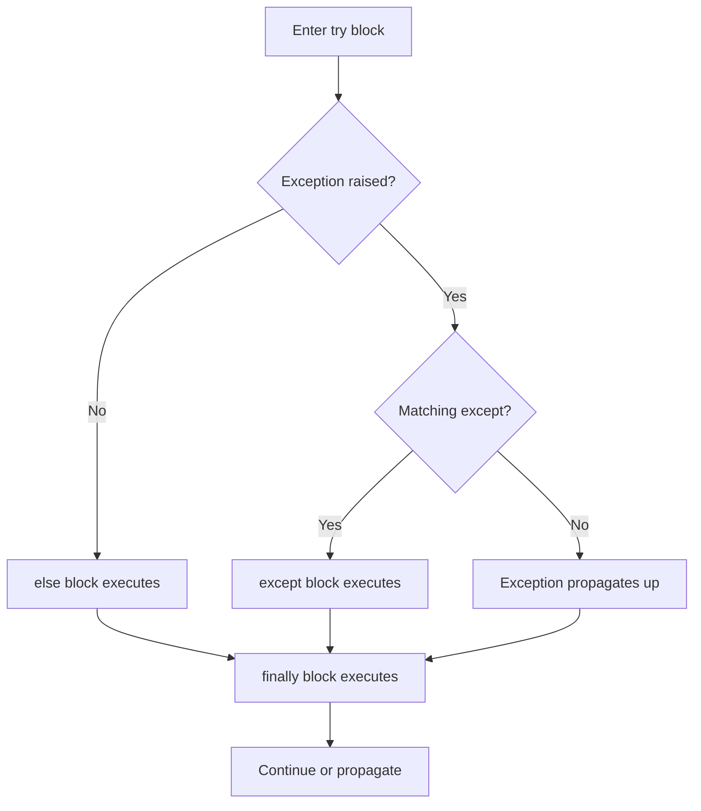

# Python Error Handling — Fundamentals

## Why Error Handling Matters in Data Engineering

Data pipelines process millions of records from unreliable sources — APIs timeout, files have bad encoding, databases hit connection limits. Proper error handling is the difference between a pipeline that recovers gracefully and one that silently corrupts data.

**The analogy:** Error handling is like a safety net at a construction site. You expect workers not to fall, but the net is there to prevent catastrophe when the unexpected happens.

---

## try/except/else/finally — The Complete Picture

```python
import json

def parse_event_record(raw_json: str) -> dict:
    """Parse a raw JSON event with comprehensive error handling."""
    try:
        # Code that might fail
        record = json.loads(raw_json)
        user_id = record["user_id"]
        amount = float(record["amount"])
    except json.JSONDecodeError as e:
        # Handle specific JSON parsing failures
        print(f"Invalid JSON: {e.msg} at position {e.pos}")
        return None
    except KeyError as e:
        # Handle missing required fields
        print(f"Missing required field: {e}")
        return None
    except (ValueError, TypeError) as e:
        # Handle type conversion failures
        print(f"Type conversion error: {e}")
        return None
    else:
        # Runs ONLY if no exception occurred
        # Good place for success-path logic
        record["amount_cents"] = int(amount * 100)
        return record
    finally:
        # ALWAYS runs — whether exception occurred or not
        # Good place for cleanup (closing connections, releasing locks)
        pass  # In real code: close resources here
```

### When Each Block Runs

The flowchart below summarizes the control flow: the `else` block runs only when no exception was raised, a matching `except` handles the error otherwise, and `finally` always runs before control continues or the exception propagates.



---

## The Exception Hierarchy

Python exceptions form a class hierarchy. Catching a parent catches all children:

```python
# BaseException
#   ├── SystemExit
#   ├── KeyboardInterrupt
#   ├── GeneratorExit
#   └── Exception          ← Almost always catch from here down
#       ├── ValueError
#       ├── TypeError
#       ├── KeyError
#       ├── IOError
#       │   └── FileNotFoundError
#       ├── ConnectionError
#       │   ├── ConnectionRefusedError
#       │   └── ConnectionResetError
#       └── RuntimeError

# GOOD — specific exceptions
try:
    data = fetch_from_api(url)
except ConnectionError:
    # Handles ConnectionRefusedError and ConnectionResetError too
    retry_later()

# BAD — bare except catches EVERYTHING including KeyboardInterrupt
try:
    data = fetch_from_api(url)
except:  # Never do this!
    pass

# BAD — Exception is too broad for most cases
try:
    data = fetch_from_api(url)
except Exception:
    pass  # Swallows bugs you'd want to know about
```

---

## Raising Exceptions — When Your Code Detects Problems

```python
def validate_batch_size(batch_size: int) -> None:
    """Validate configuration before pipeline runs."""
    if not isinstance(batch_size, int):
        raise TypeError(f"batch_size must be int, got {type(batch_size).__name__}")
    if batch_size <= 0:
        raise ValueError(f"batch_size must be positive, got {batch_size}")
    if batch_size > 1_000_000:
        raise ValueError(f"batch_size too large: {batch_size} (max 1,000,000)")

def process_record(record: dict) -> dict:
    """Process a record, raising on invalid data."""
    if "user_id" not in record:
        raise KeyError("Record missing required field: user_id")
    
    if not record["user_id"].startswith("usr_"):
        raise ValueError(f"Invalid user_id format: {record['user_id']}")
    
    return transform(record)
```

---

## Custom Exceptions — Domain-Specific Errors

```python
class PipelineError(Exception):
    """Base exception for all pipeline-related errors."""
    pass

class ExtractionError(PipelineError):
    """Failed to extract data from source."""
    
    def __init__(self, source: str, message: str, retryable: bool = False):
        self.source = source
        self.retryable = retryable
        super().__init__(f"Extraction from '{source}' failed: {message}")

class TransformationError(PipelineError):
    """Data transformation failure."""
    
    def __init__(self, step: str, record_id: str, message: str):
        self.step = step
        self.record_id = record_id
        super().__init__(f"Transform '{step}' failed for record {record_id}: {message}")

class DataQualityError(PipelineError):
    """Data quality check failed."""
    
    def __init__(self, check_name: str, expected, actual):
        self.check_name = check_name
        self.expected = expected
        self.actual = actual
        super().__init__(
            f"Quality check '{check_name}' failed: "
            f"expected {expected}, got {actual}"
        )

# Usage in pipeline code
def extract_from_api(url: str) -> list:
    try:
        response = requests.get(url, timeout=30)
        response.raise_for_status()
        return response.json()
    except requests.Timeout:
        raise ExtractionError(url, "Request timed out", retryable=True)
    except requests.HTTPError as e:
        retryable = e.response.status_code >= 500
        raise ExtractionError(url, str(e), retryable=retryable)

# Caller can make decisions based on error type
try:
    data = extract_from_api("https://api.example.com/users")
except ExtractionError as e:
    if e.retryable:
        schedule_retry(e.source)
    else:
        alert_team(e)
```

---

## Best Practices for Data Engineering

### 1. Be Specific — Catch What You Expect

```python
# GOOD — handle each failure mode differently
try:
    conn = psycopg2.connect(conn_string)
    cursor = conn.cursor()
    cursor.execute(query)
except psycopg2.OperationalError:
    # Connection failed — maybe retry
    reconnect_and_retry()
except psycopg2.ProgrammingError:
    # Bad SQL — this is a bug, don't retry
    raise
except psycopg2.IntegrityError:
    # Constraint violation — skip or quarantine this record
    quarantine_record(record)
```

### 2. Don't Swallow Exceptions Silently

```python
# BAD — hides bugs
try:
    result = transform(record)
except Exception:
    pass  # What went wrong? Nobody knows.

# GOOD — log and decide
try:
    result = transform(record)
except ValueError as e:
    logger.warning(f"Skipping invalid record {record['id']}: {e}")
    increment_counter("invalid_records")
    result = None
```

### 3. Use else for Success-Only Code

```python
# The else block only runs if try succeeded — clearer intent
try:
    data = json.loads(raw_input)
except json.JSONDecodeError:
    data = use_default_data()
else:
    # Only process parsed data (not defaults)
    validate_schema(data)
    enrich_with_metadata(data)
```

### 4. finally for Guaranteed Cleanup

```python
def process_file(filepath: str):
    """Always clean up, even on failure."""
    temp_path = filepath + ".processing"
    os.rename(filepath, temp_path)  # Mark as in-progress
    
    try:
        result = transform_file(temp_path)
        archive_file(temp_path)
    except Exception:
        # Restore original file on any failure
        os.rename(temp_path, filepath)
        raise  # Re-raise after cleanup
    finally:
        # Remove temp marker regardless of outcome
        if os.path.exists(temp_path):
            os.remove(temp_path)
```

### 5. Prefer EAFP Over LBYL

```python
# LBYL (Look Before You Leap) — extra checks
if "amount" in record and record["amount"] is not None:
    if isinstance(record["amount"], (int, float)):
        total += record["amount"]

# EAFP (Easier to Ask Forgiveness) — Pythonic
try:
    total += float(record["amount"])
except (KeyError, TypeError, ValueError):
    pass  # Record has no valid amount — skip
```

---

## Common Mistake: Exception in finally

```python
# DANGEROUS — exception in finally suppresses the original exception
def risky():
    try:
        raise ValueError("Original error")
    finally:
        raise RuntimeError("Cleanup error")  # Original ValueError is lost!

# SAFE — suppress cleanup errors
def safe():
    try:
        raise ValueError("Original error")
    finally:
        try:
            cleanup()
        except Exception:
            logger.warning("Cleanup failed, but preserving original error")
```

---

## Interview Tips

> **Tip 1:** Never use bare `except:` — it catches SystemExit and KeyboardInterrupt, making your program impossible to stop. At minimum use `except Exception:`, but prefer specific exception types. This is the most common code review feedback on junior Python code.

> **Tip 2:** Know the `else` clause — most engineers forget it exists. Using `else` signals intent: "this code should only run if the try block succeeded." Interviewers notice when you use it correctly because it's a sign of deliberate, precise error handling.

> **Tip 3:** Custom exceptions with metadata (like `retryable=True`) enable intelligent error handling upstream. In interviews, show that your exceptions carry enough context for callers to make decisions — not just a message string, but structured fields like source, severity, and whether the error is transient.
