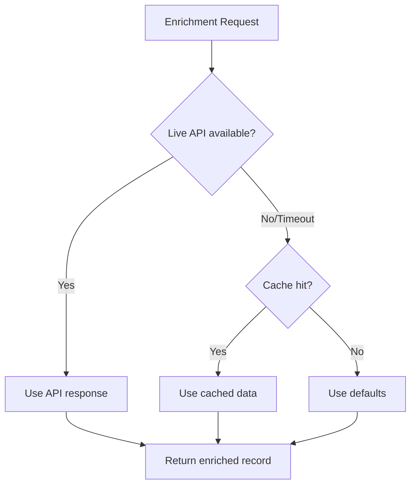

# Python Error Handling — Intermediate Concepts

## Exception Chaining — Preserving Root Cause

When catching one exception and raising another, use `from` to preserve the chain:

```python
import psycopg2

class DataLoadError(Exception):
    pass

def load_to_warehouse(records: list, table: str):
    """Load records with proper exception chaining."""
    try:
        conn = psycopg2.connect("postgresql://warehouse:5432/analytics")
        with conn.cursor() as cur:
            cur.executemany(
                f"INSERT INTO {table} VALUES (%s, %s, %s)",
                records
            )
        conn.commit()
    except psycopg2.OperationalError as e:
        # Chain the original error — it shows up in traceback
        raise DataLoadError(
            f"Failed to load {len(records)} records to {table}"
        ) from e
    except psycopg2.IntegrityError as e:
        raise DataLoadError(
            f"Constraint violation loading to {table}"
        ) from e

# The traceback shows BOTH exceptions:
# psycopg2.OperationalError: connection refused
#
# The above exception was the direct cause of the following exception:
#
# DataLoadError: Failed to load 5000 records to dim_users
```

### Suppressing Chain with `from None`

```python
def parse_config(raw: str) -> dict:
    """Sometimes the original error isn't useful to the caller."""
    try:
        return json.loads(raw)
    except json.JSONDecodeError:
        # Suppress the JSON details — caller just needs to know config is bad
        raise ValueError("Invalid pipeline configuration format") from None
```

---

## contextlib.suppress — Intentional Exception Ignoring

```python
from contextlib import suppress
import os

# Instead of try/except/pass — more explicit intent
def cleanup_temp_files(temp_dir: str):
    """Best-effort cleanup — failure is acceptable."""
    with suppress(FileNotFoundError, PermissionError):
        os.remove(f"{temp_dir}/staging.csv")
    
    with suppress(FileNotFoundError):
        os.remove(f"{temp_dir}/lock.pid")
    
    with suppress(OSError):
        os.rmdir(temp_dir)

# Real DE use case — optional notification
def notify_completion(pipeline_name: str):
    """Try to notify, but don't fail the pipeline if notification fails."""
    with suppress(ConnectionError, TimeoutError):
        slack_client.post_message(f"Pipeline {pipeline_name} completed")
```

---

## Logging Exceptions Properly

```python
import logging
import traceback

logger = logging.getLogger(__name__)

def process_batch(batch: list[dict]) -> tuple[list, list]:
    """Process batch, separating successes from failures."""
    successes = []
    failures = []
    
    for record in batch:
        try:
            result = transform_record(record)
            successes.append(result)
        except Exception as e:
            # Log with exc_info=True to include full traceback
            logger.warning(
                "Failed to process record %s: %s",
                record.get("id", "unknown"),
                str(e),
                exc_info=True  # Includes traceback in log
            )
            failures.append({
                "record": record,
                "error": str(e),
                "traceback": traceback.format_exc()
            })
    
    # Log summary metrics
    total = len(batch)
    logger.info(
        "Batch processed: %d/%d succeeded (%.1f%% failure rate)",
        len(successes), total,
        len(failures) / total * 100 if total > 0 else 0
    )
    
    return successes, failures
```

### Structured Logging with Exception Context

```python
import structlog

logger = structlog.get_logger()

def extract_from_source(source_config: dict):
    try:
        data = fetch_data(source_config["url"])
        return data
    except ConnectionError as e:
        logger.error(
            "extraction_failed",
            source=source_config["name"],
            url=source_config["url"],
            error_type=type(e).__name__,
            error_msg=str(e),
            retryable=True
        )
        raise
```

---

## Retry Patterns

### Simple Retry with Exponential Backoff

```python
import time
import random
from typing import TypeVar, Callable
from functools import wraps

T = TypeVar('T')

def retry(
    max_attempts: int = 3,
    backoff_base: float = 2.0,
    jitter: bool = True,
    retryable_exceptions: tuple = (ConnectionError, TimeoutError)
):
    """
    Decorator for retrying failed operations.
    
    Analogy: Like redialing a phone call — wait longer between each
    attempt, add randomness so everyone isn't redialing at the same time.
    """
    def decorator(func: Callable[..., T]) -> Callable[..., T]:
        @wraps(func)
        def wrapper(*args, **kwargs) -> T:
            last_exception = None
            
            for attempt in range(1, max_attempts + 1):
                try:
                    return func(*args, **kwargs)
                except retryable_exceptions as e:
                    last_exception = e
                    
                    if attempt == max_attempts:
                        logger.error(
                            f"{func.__name__} failed after {max_attempts} attempts: {e}"
                        )
                        raise
                    
                    # Exponential backoff with optional jitter
                    wait = backoff_base ** attempt
                    if jitter:
                        wait *= (0.5 + random.random())
                    
                    logger.warning(
                        f"{func.__name__} attempt {attempt}/{max_attempts} failed: {e}. "
                        f"Retrying in {wait:.1f}s..."
                    )
                    time.sleep(wait)
            
            raise last_exception
        return wrapper
    return decorator

# Usage
@retry(max_attempts=5, retryable_exceptions=(ConnectionError, TimeoutError))
def fetch_api_data(endpoint: str) -> dict:
    response = requests.get(endpoint, timeout=10)
    response.raise_for_status()
    return response.json()
```

### Retry with Context Manager

```python
from contextlib import contextmanager

@contextmanager
def retry_context(operation_name: str, max_attempts: int = 3):
    """Context manager that provides retry info to the block."""
    for attempt in range(1, max_attempts + 1):
        try:
            yield attempt
            return  # Success — exit
        except (ConnectionError, TimeoutError) as e:
            if attempt == max_attempts:
                raise
            wait = 2 ** attempt
            logger.warning(f"{operation_name} attempt {attempt} failed, retrying in {wait}s")
            time.sleep(wait)

# Usage
with retry_context("warehouse_load", max_attempts=3) as attempt:
    logger.info(f"Loading data (attempt {attempt})")
    connection.execute(insert_query)
```

---

## Graceful Degradation

When a component fails, fall back to a lesser service rather than crashing:

```python
from typing import Optional, List, Dict

class DataEnricher:
    """Enriches records with external data, degrading gracefully on failure."""
    
    def __init__(self, geo_api_url: str, cache_path: str):
        self.geo_api_url = geo_api_url
        self.cache_path = cache_path
        self._fallback_cache = self._load_cache()
    
    def enrich_record(self, record: dict) -> dict:
        """Try live API, fall back to cache, fall back to defaults."""
        ip_address = record.get("ip_address")
        
        # Level 1: Try live API
        geo_data = self._try_live_api(ip_address)
        
        # Level 2: Fall back to local cache
        if geo_data is None:
            geo_data = self._try_cache(ip_address)
        
        # Level 3: Fall back to defaults
        if geo_data is None:
            geo_data = {"country": "unknown", "region": "unknown"}
            record["_enrichment_status"] = "defaulted"
        else:
            record["_enrichment_status"] = "enriched"
        
        record.update(geo_data)
        return record
    
    def _try_live_api(self, ip: str) -> Optional[dict]:
        try:
            resp = requests.get(f"{self.geo_api_url}/{ip}", timeout=2)
            resp.raise_for_status()
            return resp.json()
        except (requests.RequestException, ValueError):
            return None
    
    def _try_cache(self, ip: str) -> Optional[dict]:
        return self._fallback_cache.get(ip)
    
    def _load_cache(self) -> dict:
        try:
            with open(self.cache_path) as f:
                return json.load(f)
        except (FileNotFoundError, json.JSONDecodeError):
            return {}
```

The diagram below shows the three-tier fallback this enricher uses: it tries the live API first, falls back to the local cache on failure, and finally uses default values so a single record is always returned.



---

## Error Accumulation Pattern

For batch processing, accumulate errors rather than failing on the first one:

```python
from dataclasses import dataclass, field
from typing import List

@dataclass
class BatchResult:
    """Accumulates successes and failures from batch processing."""
    successes: List[dict] = field(default_factory=list)
    errors: List[dict] = field(default_factory=list)
    
    @property
    def total(self) -> int:
        return len(self.successes) + len(self.errors)
    
    @property
    def error_rate(self) -> float:
        return len(self.errors) / self.total if self.total > 0 else 0
    
    def is_acceptable(self, max_error_rate: float = 0.05) -> bool:
        """Check if error rate is within acceptable bounds."""
        return self.error_rate <= max_error_rate

def process_batch_with_accumulation(
    records: list[dict],
    max_error_rate: float = 0.05
) -> BatchResult:
    """Process all records, accumulating errors instead of failing fast."""
    result = BatchResult()
    
    for record in records:
        try:
            transformed = transform(record)
            result.successes.append(transformed)
        except Exception as e:
            result.errors.append({
                "record_id": record.get("id"),
                "error": str(e),
                "error_type": type(e).__name__
            })
    
    if not result.is_acceptable(max_error_rate):
        raise DataQualityError(
            check_name="batch_error_rate",
            expected=f"<= {max_error_rate:.1%}",
            actual=f"{result.error_rate:.1%} ({len(result.errors)} errors)"
        )
    
    return result
```

---

## Interview Tips

> **Tip 1:** Exception chaining (`raise X from Y`) is an underused feature that signals sophistication. In interviews, explain: "I chain exceptions to preserve the root cause for debugging while presenting a clean domain-specific error to the caller. The original error is still visible in the traceback."

> **Tip 2:** For retry patterns, always mention jitter. Without jitter, all failed requests retry at the same time (thundering herd problem). Adding randomness distributes retries over time. This operational awareness distinguishes mid-level from junior engineers.

> **Tip 3:** Graceful degradation is a key DE concept. Frame it as: "A missing enrichment shouldn't stop the pipeline. I'd rather load records with `country='unknown'` than lose them entirely. The `_enrichment_status` field lets downstream consumers know the data quality of each record."
