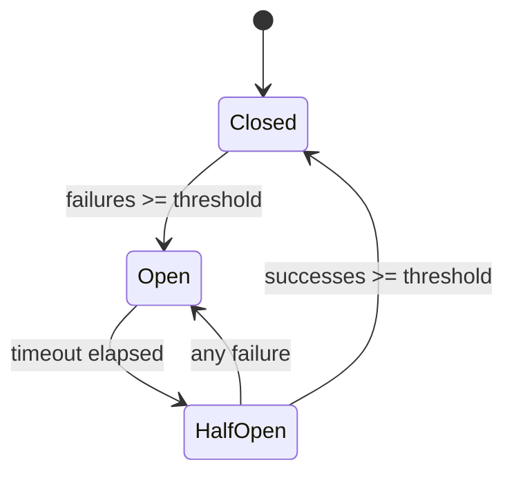

# Python Error Handling — Senior Deep Dive

## Circuit Breaker Pattern

**The analogy:** Like an electrical circuit breaker — when too many failures occur, the breaker "opens" to stop further attempts, preventing cascade failures. After a cooldown period, it "half-opens" to test if the service recovered.

```python
import time
from enum import Enum
from dataclasses import dataclass, field
from typing import Callable, TypeVar, Optional
from threading import Lock

T = TypeVar('T')

class CircuitState(Enum):
    CLOSED = "closed"        # Normal operation — requests flow through
    OPEN = "open"            # Failing — requests rejected immediately
    HALF_OPEN = "half_open"  # Testing — limited requests allowed

@dataclass
class CircuitBreaker:
    """
    Circuit breaker for external service calls.
    Prevents hammering a failing service and enables fast failure.
    """
    name: str
    failure_threshold: int = 5      # Failures before opening
    recovery_timeout: float = 30.0  # Seconds before half-open
    success_threshold: int = 3      # Successes to close from half-open
    
    _state: CircuitState = field(default=CircuitState.CLOSED, init=False)
    _failure_count: int = field(default=0, init=False)
    _success_count: int = field(default=0, init=False)
    _last_failure_time: float = field(default=0.0, init=False)
    _lock: Lock = field(default_factory=Lock, init=False)
    
    @property
    def state(self) -> CircuitState:
        with self._lock:
            if self._state == CircuitState.OPEN:
                if time.time() - self._last_failure_time >= self.recovery_timeout:
                    self._state = CircuitState.HALF_OPEN
                    self._success_count = 0
            return self._state
    
    def call(self, func: Callable[..., T], *args, **kwargs) -> T:
        """Execute function through the circuit breaker."""
        current_state = self.state
        
        if current_state == CircuitState.OPEN:
            raise CircuitOpenError(
                f"Circuit '{self.name}' is OPEN. "
                f"Retry after {self._time_until_retry():.0f}s"
            )
        
        try:
            result = func(*args, **kwargs)
            self._on_success()
            return result
        except Exception as e:
            self._on_failure()
            raise
    
    def _on_success(self):
        with self._lock:
            self._failure_count = 0
            if self._state == CircuitState.HALF_OPEN:
                self._success_count += 1
                if self._success_count >= self.success_threshold:
                    self._state = CircuitState.CLOSED
    
    def _on_failure(self):
        with self._lock:
            self._failure_count += 1
            self._last_failure_time = time.time()
            if self._failure_count >= self.failure_threshold:
                self._state = CircuitState.OPEN
            if self._state == CircuitState.HALF_OPEN:
                self._state = CircuitState.OPEN
    
    def _time_until_retry(self) -> float:
        elapsed = time.time() - self._last_failure_time
        return max(0, self.recovery_timeout - elapsed)

class CircuitOpenError(Exception):
    pass

# Usage in a data pipeline
db_breaker = CircuitBreaker(name="warehouse_db", failure_threshold=3, recovery_timeout=60)
api_breaker = CircuitBreaker(name="enrichment_api", failure_threshold=5, recovery_timeout=30)

def load_with_circuit_breaker(records: list):
    try:
        db_breaker.call(insert_to_warehouse, records)
    except CircuitOpenError:
        # Fast path — don't even try, write to backup
        write_to_fallback_store(records)
```

The state diagram below captures the breaker's transitions: it starts Closed, opens once failures hit the threshold, moves to Half-Open after the timeout to probe recovery, and either closes again on enough successes or reopens on any failure.



---

## Dead-Letter Queue (DLQ) Pattern

Records that can't be processed are sent to a dead-letter queue for later investigation:

```python
import json
from datetime import datetime
from typing import Iterator, Dict, Callable, Optional
from dataclasses import dataclass, field
import logging

logger = logging.getLogger(__name__)

@dataclass
class DeadLetterRecord:
    original_record: Dict
    error_type: str
    error_message: str
    pipeline_step: str
    timestamp: datetime = field(default_factory=datetime.utcnow)
    attempt_count: int = 1
    
    def to_dict(self) -> Dict:
        return {
            "original_record": self.original_record,
            "error_type": self.error_type,
            "error_message": self.error_message,
            "pipeline_step": self.pipeline_step,
            "timestamp": self.timestamp.isoformat(),
            "attempt_count": self.attempt_count,
        }

class DeadLetterQueue:
    """
    DLQ for quarantining failed records.
    Supports: S3, database, or local file backends.
    """
    
    def __init__(self, backend: "DLQBackend", max_retry_attempts: int = 3):
        self._backend = backend
        self._max_retries = max_retry_attempts
        self._count = 0
    
    def send(self, record: Dict, error: Exception, step: str):
        """Send a failed record to the DLQ."""
        dl_record = DeadLetterRecord(
            original_record=record,
            error_type=type(error).__name__,
            error_message=str(error)[:1000],
            pipeline_step=step,
        )
        self._backend.write(dl_record)
        self._count += 1
        
        if self._count % 100 == 0:
            logger.warning(f"DLQ has received {self._count} records")
    
    def replay(self, processor: Callable) -> tuple[int, int]:
        """Retry processing DLQ records."""
        success = 0
        still_failing = 0
        
        for dl_record in self._backend.read_all():
            if dl_record.attempt_count >= self._max_retries:
                still_failing += 1
                continue
            
            try:
                processor(dl_record.original_record)
                success += 1
            except Exception:
                dl_record.attempt_count += 1
                self._backend.write(dl_record)
                still_failing += 1
        
        return success, still_failing

def process_with_dlq(
    records: Iterator[Dict],
    processor: Callable,
    dlq: DeadLetterQueue,
    step_name: str
) -> int:
    """Process records, routing failures to DLQ."""
    processed = 0
    for record in records:
        try:
            processor(record)
            processed += 1
        except Exception as e:
            dlq.send(record, e, step_name)
    return processed
```

---

## Error Budgets for Pipeline Reliability

```python
from dataclasses import dataclass
from typing import Optional
import time

@dataclass
class ErrorBudget:
    """
    Track error rate against an SLO.
    When budget is exhausted, pipeline should halt and alert.
    
    Analogy: Like a spending budget — you're allowed some errors,
    but when you've used up your allocation, you need to stop and investigate.
    """
    slo_target: float = 0.999  # 99.9% success rate
    window_seconds: int = 3600  # 1-hour rolling window
    
    def __post_init__(self):
        self._successes = 0
        self._failures = 0
        self._window_start = time.time()
    
    @property
    def error_rate(self) -> float:
        total = self._successes + self._failures
        if total == 0:
            return 0.0
        return self._failures / total
    
    @property
    def budget_remaining(self) -> float:
        """Fraction of error budget remaining (0.0 = exhausted)."""
        allowed_error_rate = 1.0 - self.slo_target
        current_error_rate = self.error_rate
        if allowed_error_rate == 0:
            return 0.0 if self._failures > 0 else 1.0
        return max(0.0, 1.0 - (current_error_rate / allowed_error_rate))
    
    @property
    def is_exhausted(self) -> bool:
        return self.budget_remaining <= 0
    
    def record_success(self):
        self._maybe_reset_window()
        self._successes += 1
    
    def record_failure(self):
        self._maybe_reset_window()
        self._failures += 1
    
    def _maybe_reset_window(self):
        if time.time() - self._window_start > self.window_seconds:
            self._successes = 0
            self._failures = 0
            self._window_start = time.time()

# Usage in pipeline
budget = ErrorBudget(slo_target=0.995, window_seconds=3600)

for record in source_stream:
    try:
        process(record)
        budget.record_success()
    except Exception as e:
        budget.record_failure()
        dlq.send(record, e, "transform")
        
        if budget.is_exhausted:
            raise PipelineHaltError(
                f"Error budget exhausted: {budget.error_rate:.2%} error rate "
                f"exceeds SLO of {1 - budget.slo_target:.2%}"
            )
```

---

## Structured Error Reporting

```python
from dataclasses import dataclass, field
from typing import Dict, List, Optional
from datetime import datetime
from enum import Enum

class ErrorSeverity(Enum):
    LOW = "low"          # Single record issue
    MEDIUM = "medium"    # Batch partially failed
    HIGH = "high"        # Source unavailable
    CRITICAL = "critical"  # Pipeline halted

@dataclass
class StructuredError:
    """Machine-readable error report for monitoring systems."""
    error_id: str
    severity: ErrorSeverity
    pipeline: str
    step: str
    error_type: str
    message: str
    timestamp: datetime = field(default_factory=datetime.utcnow)
    context: Dict = field(default_factory=dict)
    resolution_hint: Optional[str] = None
    
    def to_cloudwatch_dimensions(self) -> Dict[str, str]:
        return {
            "Pipeline": self.pipeline,
            "Step": self.step,
            "ErrorType": self.error_type,
            "Severity": self.severity.value,
        }

class ErrorReporter:
    """Publishes structured errors to monitoring systems."""
    
    def __init__(self, pipeline_name: str):
        self.pipeline_name = pipeline_name
        self._errors: List[StructuredError] = []
    
    def report(self, error: StructuredError):
        self._errors.append(error)
        self._publish_to_monitoring(error)
        
        if error.severity in (ErrorSeverity.HIGH, ErrorSeverity.CRITICAL):
            self._send_alert(error)
    
    def _publish_to_monitoring(self, error: StructuredError):
        """Push to CloudWatch/Datadog/etc."""
        import boto3
        cw = boto3.client("cloudwatch")
        cw.put_metric_data(
            Namespace="DataPipeline/Errors",
            MetricData=[{
                "MetricName": "ErrorCount",
                "Value": 1,
                "Unit": "Count",
                "Dimensions": [
                    {"Name": k, "Value": v}
                    for k, v in error.to_cloudwatch_dimensions().items()
                ]
            }]
        )
    
    def _send_alert(self, error: StructuredError):
        """Alert on-call for high-severity errors."""
        pass  # PagerDuty/Slack integration

# Usage
reporter = ErrorReporter("daily_user_pipeline")

try:
    extract_data()
except ConnectionError as e:
    reporter.report(StructuredError(
        error_id="ERR-2024-0115-001",
        severity=ErrorSeverity.HIGH,
        pipeline="daily_user_pipeline",
        step="extract",
        error_type="ConnectionError",
        message=str(e),
        context={"host": "db.prod", "port": 5432},
        resolution_hint="Check VPC connectivity and DB instance status"
    ))
```

---

## Monitoring Integration Pattern

```python
from contextlib import contextmanager
from typing import Optional

@contextmanager
def monitored_step(
    pipeline: str,
    step: str,
    reporter: ErrorReporter,
    error_budget: Optional[ErrorBudget] = None
):
    """
    Context manager combining error handling, reporting, and budgets.
    Use this to wrap every pipeline step for consistent observability.
    """
    try:
        yield
        if error_budget:
            error_budget.record_success()
    except Exception as e:
        if error_budget:
            error_budget.record_failure()
        
        severity = _classify_severity(e)
        reporter.report(StructuredError(
            error_id=generate_error_id(),
            severity=severity,
            pipeline=pipeline,
            step=step,
            error_type=type(e).__name__,
            message=str(e)[:500],
        ))
        
        if error_budget and error_budget.is_exhausted:
            raise PipelineHaltError("Error budget exhausted") from e
        
        if severity == ErrorSeverity.CRITICAL:
            raise
        # Non-critical: log and continue

# Usage — clean, consistent error handling everywhere
with monitored_step("daily_etl", "extract", reporter, budget):
    data = extract_from_source()

with monitored_step("daily_etl", "transform", reporter, budget):
    transformed = apply_transforms(data)
```

---

## Interview Tips

> **Tip 1:** Circuit breakers show systems-thinking. Explain the three states (closed/open/half-open) and why they matter: "Without a circuit breaker, a failing database gets hammered with requests that will all fail, consuming threads and connections. The breaker fails fast, preserving system resources and allowing the service time to recover."

> **Tip 2:** Error budgets connect engineering to business SLOs. In interviews, frame it: "Our SLO is 99.9% records processed successfully. That gives us an error budget of 0.1%. If we burn through that budget, we halt and investigate rather than degrading data quality. This keeps stakeholder trust intact while allowing some tolerance for inevitable issues."

> **Tip 3:** Dead-letter queues demonstrate data preservation philosophy. Explain: "I never drop records. If a record can't be processed, it goes to a DLQ with full context (error, timestamp, attempt count). We can fix the bug, then replay the DLQ to recover without data loss. This is how we achieve exactly-once semantics in practice."
