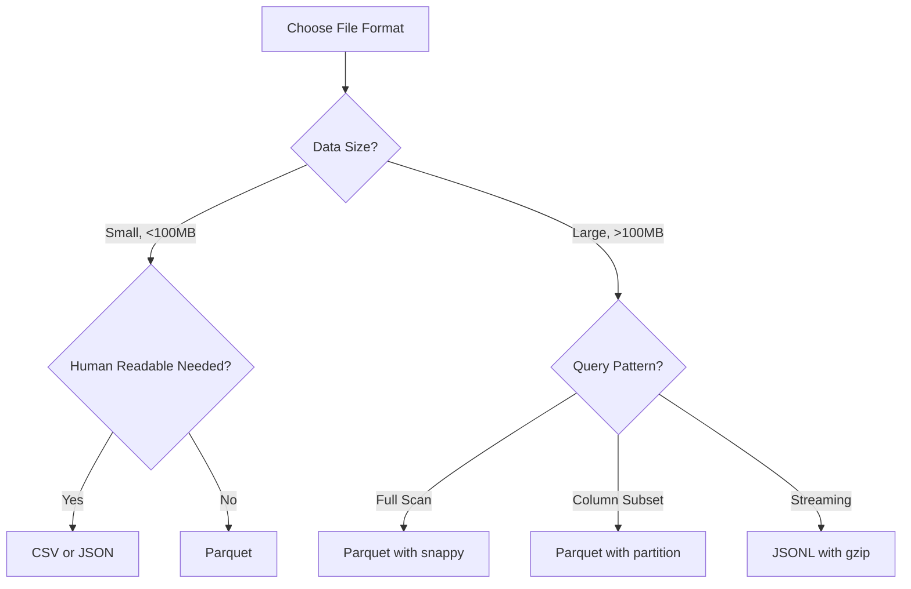

# Python File I/O — Intermediate Concepts

## Parquet Files with PyArrow

Parquet is the standard columnar format in data engineering — efficient storage, fast reads, and schema enforcement:

```python
import pyarrow as pa
import pyarrow.parquet as pq

# Writing Parquet from Python dicts
records = [
    {"user_id": "u1", "event": "login", "amount": 100.5, "date": "2024-01-15"},
    {"user_id": "u2", "event": "purchase", "amount": 200.0, "date": "2024-01-15"},
]

table = pa.Table.from_pylist(records)
pq.write_table(table, "output/events.parquet")

# Reading Parquet
table = pq.read_table("output/events.parquet")
records = table.to_pylist()  # Back to list of dicts

# Reading specific columns (much faster for wide tables)
table = pq.read_table("events.parquet", columns=["user_id", "amount"])

# Reading with row filter (predicate pushdown)
table = pq.read_table(
    "events.parquet",
    filters=[("date", "=", "2024-01-15"), ("amount", ">", 50.0)]
)
```

### Schema Definition and Enforcement

```python
# Define explicit schema
schema = pa.schema([
    pa.field("user_id", pa.string(), nullable=False),
    pa.field("event_type", pa.string()),
    pa.field("amount", pa.float64()),
    pa.field("event_date", pa.date32()),
    pa.field("metadata", pa.map_(pa.string(), pa.string())),
])

# Write with schema enforcement
table = pa.Table.from_pylist(records, schema=schema)
pq.write_table(table, "typed_events.parquet")

# Inspect schema without reading data
schema = pq.read_schema("events.parquet")
print(schema)
# user_id: string not null
# event_type: string
# amount: double
```

### Partitioned Parquet Datasets

```python
# Write partitioned dataset (like Hive-style partitioning)
pq.write_to_dataset(
    table,
    root_path="output/events/",
    partition_cols=["event_date", "region"],
    existing_data_behavior="overwrite_or_ignore"
)
# Creates: output/events/event_date=2024-01-15/region=US/part-0.parquet

# Read partitioned dataset
dataset = pq.ParquetDataset("output/events/")
table = dataset.read()  # Reads all partitions

# Read specific partition
table = pq.read_table(
    "output/events/",
    filters=[("event_date", "=", "2024-01-15")]
)
```

---

## Streaming Large Files — Constant Memory

**The analogy:** Reading a large file entirely into memory is like trying to drink from a fire hose. Streaming reads it like sipping through a straw — steady, controlled, manageable.

```python
import csv
from typing import Iterator

def stream_large_csv(filepath: str, chunk_size: int = 10000) -> Iterator[list[dict]]:
    """
    Stream a large CSV in chunks without loading it all into memory.
    Yields batches of chunk_size records.
    """
    with open(filepath, "r", newline="") as f:
        reader = csv.DictReader(f)
        chunk = []
        
        for row in reader:
            chunk.append(row)
            if len(chunk) >= chunk_size:
                yield chunk
                chunk = []
        
        if chunk:  # Remaining records
            yield chunk

# Usage — process 50GB file with ~50MB memory
for batch in stream_large_csv("huge_file.csv", chunk_size=50000):
    transformed = [transform(r) for r in batch]
    write_to_destination(transformed)
```

### Streaming Parquet Reading

```python
import pyarrow.parquet as pq

def stream_parquet_batches(filepath: str, batch_size: int = 65536):
    """Read Parquet in record batches for memory efficiency."""
    parquet_file = pq.ParquetFile(filepath)
    
    for batch in parquet_file.iter_batches(batch_size=batch_size):
        # batch is a RecordBatch — lightweight, columnar
        records = batch.to_pylist()
        yield records

# Process without loading full file
for batch in stream_parquet_batches("large_dataset.parquet"):
    process_batch(batch)
```

---

## tempfile — Safe Temporary Files

```python
import tempfile
from pathlib import Path

# Temporary file (auto-deleted when closed)
with tempfile.NamedTemporaryFile(mode="w", suffix=".csv", delete=False) as tmp:
    writer = csv.writer(tmp)
    writer.writerows(data)
    tmp_path = tmp.name

# Process the temp file
process_file(tmp_path)

# Temporary directory (with auto-cleanup)
with tempfile.TemporaryDirectory() as tmp_dir:
    # Write intermediate results
    output_path = Path(tmp_dir) / "intermediate.parquet"
    pq.write_table(table, str(output_path))
    
    # Transform and write final output
    result = transform_parquet(str(output_path))
    pq.write_table(result, "final_output.parquet")
# tmp_dir and all contents deleted here

# Secure temp file in specific directory
with tempfile.NamedTemporaryFile(
    dir="/data/staging",
    prefix="pipeline_",
    suffix=".json",
    mode="w"
) as f:
    json.dump(intermediate_data, f)
    f.flush()
    # File available at f.name until context exits
```

---

## Compression — gzip, snappy, zstd

```python
import gzip
import json

# gzip — most common for CSV/JSON files
def write_gzipped_jsonl(records: list[dict], filepath: str):
    """Write compressed JSONL file."""
    with gzip.open(filepath, "wt", compresslevel=6) as f:
        for record in records:
            f.write(json.dumps(record) + "\n")

def read_gzipped_jsonl(filepath: str) -> Iterator[dict]:
    """Stream read compressed JSONL."""
    with gzip.open(filepath, "rt") as f:
        for line in f:
            if line.strip():
                yield json.loads(line)

# Parquet with compression (built-in support)
pq.write_table(
    table,
    "output/events.parquet",
    compression="snappy"    # Options: snappy, gzip, zstd, lz4, brotli
)

# Compression comparison for DE workloads:
# snappy: Fast compression/decompression, moderate ratio. Default for Spark/Parquet.
# gzip:   Good ratio, slower. Common for CSV/JSON archives.
# zstd:   Best ratio + good speed. Modern choice for cold storage.
# lz4:    Fastest, lowest ratio. Good for temporary/intermediate files.
```

### Streaming Compressed Files

```python
import gzip
import csv

def stream_gzipped_csv(filepath: str) -> Iterator[dict]:
    """Stream a gzipped CSV without decompressing to disk."""
    with gzip.open(filepath, "rt") as f:
        reader = csv.DictReader(f)
        yield from reader

# Process compressed file with constant memory
for record in stream_gzipped_csv("data/events.csv.gz"):
    if record["event_type"] == "purchase":
        accumulate(record)
```

---

## Multipart Files — Handling Split Data

```python
from pathlib import Path
import csv
from typing import Iterator

def read_multipart_csv(directory: str, pattern: str = "part-*.csv") -> Iterator[dict]:
    """
    Read multiple part files as a single stream.
    Common pattern: Spark output, sharded exports, split files.
    """
    parts = sorted(Path(directory).glob(pattern))
    
    if not parts:
        raise FileNotFoundError(f"No files matching {pattern} in {directory}")
    
    for part_file in parts:
        with open(part_file, "r", newline="") as f:
            reader = csv.DictReader(f)
            yield from reader

def write_multipart_csv(
    records: Iterator[dict],
    output_dir: str,
    max_records_per_file: int = 1_000_000
):
    """Split output into multiple files for parallel processing."""
    Path(output_dir).mkdir(parents=True, exist_ok=True)
    
    file_num = 0
    current_count = 0
    writer = None
    current_file = None
    
    for record in records:
        if current_count % max_records_per_file == 0:
            if current_file:
                current_file.close()
            file_num += 1
            filepath = Path(output_dir) / f"part-{file_num:05d}.csv"
            current_file = open(filepath, "w", newline="")
            writer = csv.DictWriter(current_file, fieldnames=record.keys())
            writer.writeheader()
        
        writer.writerow(record)
        current_count += 1
    
    if current_file:
        current_file.close()
```

---

## File Format Decision Guide

The decision tree below summarizes how to pick a format: small or human-readable data favors CSV or JSON, while large analytical data favors Parquet, with the query pattern guiding compression and partitioning choices.



---

## Interview Tips

> **Tip 1:** Know why Parquet beats CSV for analytics: columnar storage means reading only needed columns (10x faster for wide tables), built-in compression saves 50-80% storage, and schema is embedded in the file (no guessing types). Always recommend Parquet for analytical workloads in interviews.

> **Tip 2:** For "how would you process a file that doesn't fit in memory?", the answer is streaming with generators. Show the pattern: `for batch in stream_csv(path, chunk_size=10000)`. Explain that memory stays constant at O(chunk_size) regardless of file size. This is the #1 technique for production file processing.

> **Tip 3:** Mention compression trade-offs: "I'd use snappy for Parquet (fast decompression, Spark default), gzip for CSV archives (good ratio, universal support), and zstd for cold storage (best ratio with reasonable speed). The choice depends on whether you optimize for read speed or storage cost."
