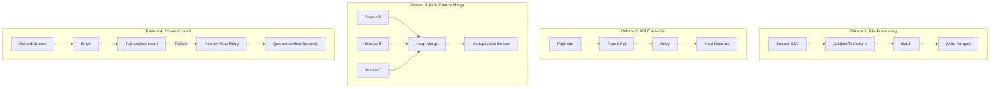

# Python Generators — Real-World Production Examples

## Pattern 1: Streaming CSV/Parquet Processing

Process massive files with constant memory using generator pipelines:

```python
"""
Stream-process a 50GB CSV file into partitioned Parquet.
Memory usage stays under 500MB regardless of input size.
"""
import csv
import pyarrow as pa
import pyarrow.parquet as pq
from typing import Iterator, Dict
from pathlib import Path
from datetime import datetime

def stream_csv(filepath: str, encoding: str = "utf-8") -> Iterator[Dict]:
    """
    Generator that streams CSV records one at a time.
    Analogy: Like a conveyor belt — items come off one at a time,
    never piling up in a warehouse (memory).
    """
    with open(filepath, 'r', encoding=encoding, newline='') as f:
        reader = csv.DictReader(f)
        for row_num, row in enumerate(reader, 1):
            row["_row_number"] = row_num
            yield row

def validate_and_transform(
    records: Iterator[Dict],
    required_fields: list[str]
) -> Iterator[Dict]:
    """Filter bad records, transform good ones."""
    bad_count = 0
    
    for record in records:
        # Validate
        missing = [f for f in required_fields if not record.get(f)]
        if missing:
            bad_count += 1
            if bad_count % 10000 == 0:
                print(f"WARNING: {bad_count} invalid records so far")
            continue
        
        # Transform
        record["event_date"] = record["timestamp"][:10]
        record["amount"] = float(record.get("amount", 0))
        record["processed_at"] = datetime.utcnow().isoformat()
        yield record

def batch_records(records: Iterator[Dict], batch_size: int = 100_000):
    """Collect records into batches for efficient Parquet writing."""
    batch = []
    for record in records:
        batch.append(record)
        if len(batch) >= batch_size:
            yield batch
            batch = []
    if batch:
        yield batch

def write_partitioned_parquet(
    batches: Iterator[list[Dict]],
    output_dir: str,
    partition_col: str = "event_date"
):
    """Write batches as partitioned Parquet files."""
    Path(output_dir).mkdir(parents=True, exist_ok=True)
    total_written = 0
    
    for batch in batches:
        table = pa.Table.from_pylist(batch)
        pq.write_to_dataset(
            table,
            root_path=output_dir,
            partition_cols=[partition_col],
            existing_data_behavior="overwrite_or_ignore"
        )
        total_written += len(batch)
        print(f"Written {total_written:,} records")
    
    return total_written

# Full pipeline — compose generators
def run_csv_to_parquet(input_csv: str, output_dir: str):
    pipeline = batch_records(
        validate_and_transform(
            stream_csv(input_csv),
            required_fields=["user_id", "timestamp", "event_type"]
        ),
        batch_size=100_000
    )
    total = write_partitioned_parquet(pipeline, output_dir)
    print(f"Pipeline complete: {total:,} records written")
```

---

## Pattern 2: Paginated API Fetcher

A robust generator for extracting data from paginated REST APIs:

```python
"""
Production-grade paginated API fetcher with:
- Rate limiting, retries, exponential backoff
- Cursor and offset-based pagination support
- Progress tracking and resumability
"""
import time
import requests
from typing import Iterator, Dict, Optional
from dataclasses import dataclass

@dataclass
class FetchStats:
    pages_fetched: int = 0
    records_yielded: int = 0
    retries_used: int = 0
    total_wait_seconds: float = 0.0

def paginated_api_fetcher(
    base_url: str,
    headers: Dict[str, str],
    page_size: int = 100,
    max_retries: int = 3,
    rate_limit_rps: float = 10.0,
    pagination_type: str = "cursor",  # "cursor" or "offset"
    resume_token: Optional[str] = None
) -> Iterator[Dict]:
    """
    Generator that handles all pagination complexity.
    
    Analogy: Like a librarian fetching books from a warehouse —
    they bring one cart at a time, wait if the elevator is busy,
    and know exactly where they left off if interrupted.
    """
    stats = FetchStats()
    session = requests.Session()
    session.headers.update(headers)
    
    min_interval = 1.0 / rate_limit_rps
    cursor = resume_token
    offset = 0
    
    while True:
        # Build request based on pagination type
        params = {"limit": page_size}
        if pagination_type == "cursor" and cursor:
            params["cursor"] = cursor
        elif pagination_type == "offset":
            params["offset"] = offset
        
        # Fetch with retry logic
        response = _fetch_with_retry(
            session, base_url, params, max_retries, stats
        )
        
        if response is None:
            break
        
        data = response.json()
        records = data.get("results", data.get("data", []))
        
        if not records:
            break
        
        # Yield individual records
        for record in records:
            record["_page"] = stats.pages_fetched
            yield record
            stats.records_yielded += 1
        
        stats.pages_fetched += 1
        
        # Update pagination state
        if pagination_type == "cursor":
            cursor = data.get("next_cursor")
            if not cursor:
                break
        else:
            offset += page_size
            if len(records) < page_size:
                break
        
        # Rate limiting
        time.sleep(min_interval)
    
    print(f"Fetch complete: {stats.pages_fetched} pages, "
          f"{stats.records_yielded} records, "
          f"{stats.retries_used} retries")

def _fetch_with_retry(session, url, params, max_retries, stats):
    """Fetch with exponential backoff."""
    for attempt in range(max_retries + 1):
        try:
            response = session.get(url, params=params, timeout=30)
            
            if response.status_code == 429:  # Rate limited
                wait = float(response.headers.get("Retry-After", 2 ** attempt))
                stats.total_wait_seconds += wait
                time.sleep(wait)
                stats.retries_used += 1
                continue
            
            response.raise_for_status()
            return response
            
        except requests.RequestException as e:
            if attempt == max_retries:
                raise
            wait = 2 ** attempt
            stats.retries_used += 1
            stats.total_wait_seconds += wait
            time.sleep(wait)
    
    return None

# Usage
for event in paginated_api_fetcher(
    base_url="https://api.analytics.io/v2/events",
    headers={"Authorization": "Bearer TOKEN"},
    page_size=500,
    rate_limit_rps=5.0
):
    load_to_staging(event)
```

---

## Pattern 3: Multi-Source Merge Generator

Merge sorted streams from multiple sources into a single ordered output:

```python
"""
K-way merge of sorted streams from multiple data sources.
Used in: CDC merge, multi-region consolidation, incremental loads.
"""
import heapq
from typing import Iterator, Dict, Tuple, Callable
from dataclasses import dataclass, field

@dataclass(order=True)
class MergeEntry:
    """Priority queue entry — sortable by key."""
    sort_key: tuple
    source_idx: int = field(compare=False)
    record: Dict = field(compare=False)

def multi_source_merge(
    sources: Dict[str, Iterator[Dict]],
    sort_key: Callable[[Dict], tuple],
    dedup_key: Callable[[Dict], str] = None
) -> Iterator[Dict]:
    """
    Merge K sorted sources into one sorted stream.
    
    Analogy: Like merging lanes on a highway — each lane is sorted
    by speed, and cars merge into a single lane maintaining order.
    Memory: O(K) where K = number of sources.
    
    Args:
        sources: Named iterators, each yielding sorted records
        sort_key: Function to extract sort key from a record
        dedup_key: Optional function for deduplication across sources
    """
    heap = []
    source_list = list(sources.items())
    seen_keys = set() if dedup_key else None
    
    # Initialize heap with first record from each source
    for idx, (name, source) in enumerate(source_list):
        try:
            record = next(source)
            record["_source"] = name
            entry = MergeEntry(
                sort_key=sort_key(record),
                source_idx=idx,
                record=record
            )
            heapq.heappush(heap, entry)
        except StopIteration:
            pass  # Empty source
    
    # Merge loop
    while heap:
        entry = heapq.heappop(heap)
        record = entry.record
        
        # Deduplication across sources
        if dedup_key:
            key = dedup_key(record)
            if key in seen_keys:
                pass  # Skip duplicate
            else:
                seen_keys.add(key)
                yield record
        else:
            yield record
        
        # Refill from the same source
        source_name, source_iter = source_list[entry.source_idx]
        try:
            next_record = next(source_iter)
            next_record["_source"] = source_name
            heapq.heappush(heap, MergeEntry(
                sort_key=sort_key(next_record),
                source_idx=entry.source_idx,
                record=next_record
            ))
        except StopIteration:
            pass  # Source exhausted

# Usage — merge CDC streams from multiple databases
sources = {
    "us_east": read_cdc_stream("postgres-us-east", after="2024-01-15"),
    "us_west": read_cdc_stream("postgres-us-west", after="2024-01-15"),
    "eu": read_cdc_stream("postgres-eu", after="2024-01-15"),
}

merged = multi_source_merge(
    sources=sources,
    sort_key=lambda r: (r["updated_at"], r["id"]),
    dedup_key=lambda r: r["id"]  # Latest update wins (sources sorted by time)
)

for record in merged:
    upsert_to_warehouse(record)
```

---

## Pattern 4: Chunked Database Insertion

Generator-based chunked insert with transaction management:

```python
"""
Chunked database insertion with:
- Configurable batch size
- Per-batch transaction isolation  
- Failed batch quarantine (DLQ pattern)
- Progress callbacks for monitoring
"""
from typing import Iterator, Dict, Callable, Optional
from dataclasses import dataclass
import logging

logger = logging.getLogger(__name__)

@dataclass
class InsertResult:
    total_records: int = 0
    successful_batches: int = 0
    failed_batches: int = 0
    quarantined_records: int = 0

def chunked_insert(
    records: Iterator[Dict],
    connection,
    table: str,
    batch_size: int = 5000,
    on_batch_complete: Optional[Callable] = None,
    quarantine_table: Optional[str] = None
) -> InsertResult:
    """
    Insert records in transactional batches.
    Failed batches are retried row-by-row, with bad rows quarantined.
    """
    result = InsertResult()
    
    for batch in _make_batches(records, batch_size):
        try:
            _insert_batch(connection, table, batch)
            result.successful_batches += 1
            result.total_records += len(batch)
            
            if on_batch_complete:
                on_batch_complete(result)
                
        except Exception as e:
            logger.warning(f"Batch failed ({len(batch)} records): {e}")
            result.failed_batches += 1
            
            # Retry row-by-row to isolate bad records
            good, bad = _retry_individually(connection, table, batch)
            result.total_records += good
            result.quarantined_records += bad
            
            if quarantine_table and bad > 0:
                _quarantine_records(connection, quarantine_table, batch, str(e))
    
    return result

def _make_batches(records: Iterator[Dict], size: int) -> Iterator[list]:
    """Generator that chunks an iterator into batches."""
    batch = []
    for record in records:
        batch.append(record)
        if len(batch) >= size:
            yield batch
            batch = []
    if batch:
        yield batch

def _insert_batch(connection, table: str, batch: list[Dict]):
    """Insert a batch within a transaction."""
    columns = batch[0].keys()
    placeholders = ", ".join(["%s"] * len(columns))
    col_names = ", ".join(columns)
    
    query = f"INSERT INTO {table} ({col_names}) VALUES ({placeholders})"
    
    with connection.cursor() as cur:
        cur.execute("BEGIN")
        try:
            cur.executemany(query, [tuple(r.values()) for r in batch])
            cur.execute("COMMIT")
        except Exception:
            cur.execute("ROLLBACK")
            raise

def _retry_individually(connection, table, batch) -> tuple[int, int]:
    """Retry records one by one to find the bad ones."""
    good = 0
    bad = 0
    for record in batch:
        try:
            _insert_batch(connection, table, [record])
            good += 1
        except Exception:
            bad += 1
    return good, bad

def _quarantine_records(connection, quarantine_table, batch, error):
    """Move bad records to quarantine for investigation."""
    import json
    with connection.cursor() as cur:
        for record in batch:
            cur.execute(
                f"INSERT INTO {quarantine_table} (record_data, error, quarantined_at) "
                f"VALUES (%s, %s, NOW())",
                (json.dumps(record), error)
            )

# Usage in ETL pipeline
def load_users_to_warehouse(source_iterator):
    result = chunked_insert(
        records=source_iterator,
        connection=get_warehouse_connection(),
        table="dim_users",
        batch_size=10_000,
        quarantine_table="etl_quarantine",
        on_batch_complete=lambda r: logger.info(
            f"Progress: {r.total_records:,} loaded, "
            f"{r.quarantined_records} quarantined"
        )
    )
    
    logger.info(
        f"Load complete: {result.total_records:,} records in "
        f"{result.successful_batches} batches "
        f"({result.quarantined_records} quarantined)"
    )
    return result
```

---

## Pattern Flow Summary

The diagram below groups the four production patterns covered above, showing the stage sequence each one follows, from streaming file processing to fault-tolerant chunked loading.



---

## Interview Tips

> **Tip 1:** When discussing streaming patterns, emphasize the "constant memory" guarantee. Explain: "Each generator holds at most one batch in memory, so whether we're processing 1GB or 1TB, memory usage is bounded by batch_size, not input size." This is the #1 reason generators are essential in data engineering.

> **Tip 2:** For the paginated API pattern, highlight resumability. Explain how cursor-based pagination allows you to resume from the last successful cursor if the job fails, while offset-based pagination can miss or duplicate records if data changes during extraction. This shows you think about failure recovery at scale.

> **Tip 3:** The chunked insert pattern with quarantine is a classic DE interview topic. Frame it as "optimistic batch processing with graceful degradation" — try the fast path (batch insert), fall back to the slow path (row-by-row) only on failure, and never lose data (quarantine). This pattern applies to any bulk operation where individual records may fail.
