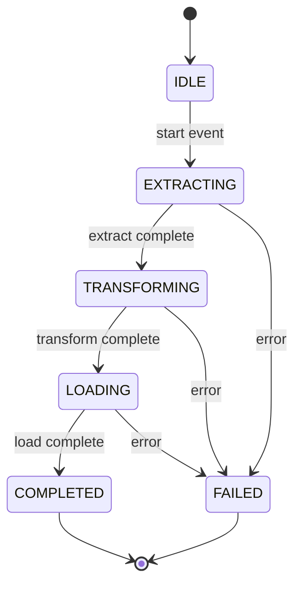

# Python Generators — Senior Deep Dive

## Async Generators — Streaming Async Data

Async generators combine `async/await` with `yield` for non-blocking data streams:

```python
import asyncio
import aiohttp
from typing import AsyncIterator, Dict

async def fetch_paginated_api(
    base_url: str,
    page_size: int = 100
) -> AsyncIterator[Dict]:
    """
    Async generator for paginated API consumption.
    Non-blocking I/O means other tasks can run during network waits.
    """
    async with aiohttp.ClientSession() as session:
        page = 1
        while True:
            url = f"{base_url}?page={page}&size={page_size}"
            async with session.get(url) as response:
                data = await response.json()
                
                if not data["results"]:
                    break
                
                for record in data["results"]:
                    yield record
                
                page += 1
                
                # Respect rate limits
                await asyncio.sleep(0.1)

async def async_pipeline():
    """Consume async generator with backpressure."""
    buffer = []
    
    async for record in fetch_paginated_api("https://api.example.com/events"):
        buffer.append(record)
        
        if len(buffer) >= 1000:
            await bulk_insert_async(buffer)
            buffer = []
    
    # Final flush
    if buffer:
        await bulk_insert_async(buffer)
```

### Async Generator with Cleanup

```python
from contextlib import asynccontextmanager

async def kafka_consumer_stream(
    topic: str,
    group_id: str
) -> AsyncIterator[Dict]:
    """
    Async generator wrapping Kafka consumer.
    Properly handles offset commits and cleanup.
    """
    from aiokafka import AIOKafkaConsumer
    
    consumer = AIOKafkaConsumer(
        topic,
        group_id=group_id,
        bootstrap_servers="kafka:9092",
        auto_offset_reset="earliest"
    )
    await consumer.start()
    
    try:
        async for message in consumer:
            yield {
                "key": message.key,
                "value": message.value,
                "partition": message.partition,
                "offset": message.offset,
                "timestamp": message.timestamp,
            }
    finally:
        await consumer.commit()
        await consumer.stop()

# Usage with async for
async def process_stream():
    async for event in kafka_consumer_stream("user-events", "etl-group"):
        await transform_and_load(event)
```

---

## Memory Profiling Generators vs Lists

```python
import tracemalloc
import sys
from typing import Iterator

def profile_memory(func, *args, **kwargs):
    """Profile peak memory usage of a function."""
    tracemalloc.start()
    result = func(*args, **kwargs)
    # Force full consumption if generator
    if hasattr(result, '__next__'):
        for _ in result:
            pass
    current, peak = tracemalloc.get_traced_memory()
    tracemalloc.stop()
    return peak / 1024 / 1024  # MB

# List approach — loads everything into memory
def list_approach(n: int) -> list:
    return [x ** 2 for x in range(n)]

# Generator approach — constant memory
def generator_approach(n: int) -> Iterator[int]:
    for x in range(n):
        yield x ** 2

# Comparison for 10M items:
# list_approach:      ~400 MB peak
# generator_approach: ~0.1 MB peak (just the generator frame)
```

### Generator Frame Size Analysis

```python
import sys

def simple_gen():
    x = 1
    yield x

def complex_gen():
    """More local variables = larger frame."""
    a, b, c, d, e = 1, 2, 3, 4, 5
    buffer = []
    lookup = {}
    yield a

# Generator objects have overhead from suspended frame
g1 = simple_gen()
g2 = complex_gen()
print(sys.getsizeof(g1))  # ~112 bytes
print(sys.getsizeof(g2))  # ~112 bytes (frame size is fixed)
# But the referenced objects (buffer, lookup) add to total memory
```

---

## Backpressure — Controlling Flow Between Producers and Consumers

**Analogy:** Backpressure is like a water system — if the consumer (drain) can't keep up with the producer (faucet), you need a mechanism to slow down the producer or buffer temporarily.

```python
import asyncio
from typing import AsyncIterator

class BackpressureBuffer:
    """
    Async generator with bounded buffer for backpressure.
    Producer blocks when buffer is full. Consumer blocks when empty.
    """
    
    def __init__(self, max_size: int = 1000):
        self._queue: asyncio.Queue = asyncio.Queue(maxsize=max_size)
        self._done = False
    
    async def produce(self, items: AsyncIterator):
        """Producer side — blocks when buffer full."""
        async for item in items:
            await self._queue.put(item)  # Blocks if queue full
        self._done = True
        await self._queue.put(None)  # Sentinel
    
    async def consume(self) -> AsyncIterator:
        """Consumer side — blocks when buffer empty."""
        while True:
            item = await self._queue.get()
            if item is None and self._done:
                break
            yield item
    
    @property
    def buffer_utilization(self) -> float:
        return self._queue.qsize() / self._queue.maxsize

# Usage — producer and consumer run concurrently with backpressure
async def pipeline_with_backpressure():
    buffer = BackpressureBuffer(max_size=5000)
    
    producer_task = asyncio.create_task(
        buffer.produce(fetch_paginated_api("https://api.example.com/data"))
    )
    
    batch = []
    async for record in buffer.consume():
        batch.append(record)
        if len(batch) >= 1000:
            await slow_db_insert(batch)  # Slow consumer
            batch = []
    
    await producer_task
```

### Synchronous Backpressure with Bounded Generators

```python
from queue import Queue
from threading import Thread
from typing import Iterator

def bounded_generator(
    source: Iterator,
    buffer_size: int = 100
) -> Iterator:
    """
    Wraps a generator with a bounded buffer.
    Useful when producer is faster than consumer.
    """
    queue = Queue(maxsize=buffer_size)
    sentinel = object()
    
    def producer():
        for item in source:
            queue.put(item)  # Blocks when full
        queue.put(sentinel)
    
    thread = Thread(target=producer, daemon=True)
    thread.start()
    
    while True:
        item = queue.get()
        if item is sentinel:
            break
        yield item
    
    thread.join()
```

---

## Generator-Based State Machines

Generators naturally model state machines — each `yield` is a state transition point:

```python
from enum import Enum, auto
from typing import Iterator, Optional
from dataclasses import dataclass

class PipelineState(Enum):
    IDLE = auto()
    EXTRACTING = auto()
    TRANSFORMING = auto()
    LOADING = auto()
    FAILED = auto()
    COMPLETED = auto()

@dataclass
class StateEvent:
    transition_to: PipelineState
    data: Optional[dict] = None
    error: Optional[str] = None

def pipeline_state_machine() -> Iterator[PipelineState]:
    """
    Generator-based state machine for ETL pipeline.
    Each yield represents a state transition.
    The caller sends events to drive transitions.
    """
    state = PipelineState.IDLE
    
    while True:
        event: StateEvent = yield state
        
        if event is None:
            continue
        
        # State transition logic
        if state == PipelineState.IDLE:
            if event.transition_to == PipelineState.EXTRACTING:
                state = PipelineState.EXTRACTING
            else:
                state = PipelineState.FAILED
                
        elif state == PipelineState.EXTRACTING:
            if event.transition_to == PipelineState.TRANSFORMING:
                state = PipelineState.TRANSFORMING
            elif event.transition_to == PipelineState.FAILED:
                state = PipelineState.FAILED
                
        elif state == PipelineState.TRANSFORMING:
            if event.transition_to == PipelineState.LOADING:
                state = PipelineState.LOADING
            elif event.transition_to == PipelineState.FAILED:
                state = PipelineState.FAILED
                
        elif state == PipelineState.LOADING:
            if event.transition_to == PipelineState.COMPLETED:
                state = PipelineState.COMPLETED
            elif event.transition_to == PipelineState.FAILED:
                state = PipelineState.FAILED

# Usage
sm = pipeline_state_machine()
current = next(sm)  # IDLE

current = sm.send(StateEvent(PipelineState.EXTRACTING))  # EXTRACTING
current = sm.send(StateEvent(PipelineState.TRANSFORMING))  # TRANSFORMING
current = sm.send(StateEvent(PipelineState.LOADING))  # LOADING
current = sm.send(StateEvent(PipelineState.COMPLETED))  # COMPLETED
```

The state diagram below visualizes the transitions this generator drives: the pipeline advances through extract, transform, and load on success events, and any stage can branch to a terminal failure state on error.



---

## Advanced: Generator-Based Coroutine Scheduler

```python
from collections import deque
from typing import Generator

class MicroScheduler:
    """
    Cooperative multitasking using generators.
    Each generator yields to give control back to the scheduler.
    This is the foundation of how asyncio works internally.
    """
    
    def __init__(self):
        self._tasks: deque = deque()
    
    def add_task(self, coroutine: Generator):
        self._tasks.append(coroutine)
    
    def run(self):
        """Round-robin scheduler — each task gets one step per cycle."""
        while self._tasks:
            task = self._tasks.popleft()
            try:
                next(task)
                self._tasks.append(task)  # Not done — reschedule
            except StopIteration:
                pass  # Task completed

# Tasks as generators — yield is the "pause point"
def extract_task(source: str):
    for i in range(5):
        print(f"Extracting batch {i} from {source}")
        yield  # Give control back to scheduler

def transform_task():
    for i in range(3):
        print(f"Transforming batch {i}")
        yield

scheduler = MicroScheduler()
scheduler.add_task(extract_task("postgres"))
scheduler.add_task(extract_task("mysql"))
scheduler.add_task(transform_task())
scheduler.run()  # Interleaves all three tasks cooperatively
```

---

## Interview Tips

> **Tip 1:** When discussing async generators at senior level, emphasize the backpressure problem. Explain that without bounded buffers, a fast producer can overwhelm a slow consumer, causing OOM. Show you understand the producer-consumer pattern and how `asyncio.Queue(maxsize=N)` provides natural backpressure.

> **Tip 2:** For memory profiling questions, know that a generator's advantage is O(1) memory vs O(n) for lists, but the constant factor matters too — generator frames have overhead (~112 bytes per suspended frame). If you're creating millions of tiny generators, the frame overhead can dominate. This nuance separates senior from mid-level answers.

> **Tip 3:** Generator-based state machines are a powerful interview topic because they connect to pipeline orchestration (Airflow states), stream processing (Kafka consumer states), and protocol handling. If asked "how would you model pipeline states?", offering a generator-based approach shows deep language mastery while solving a real architectural problem.
