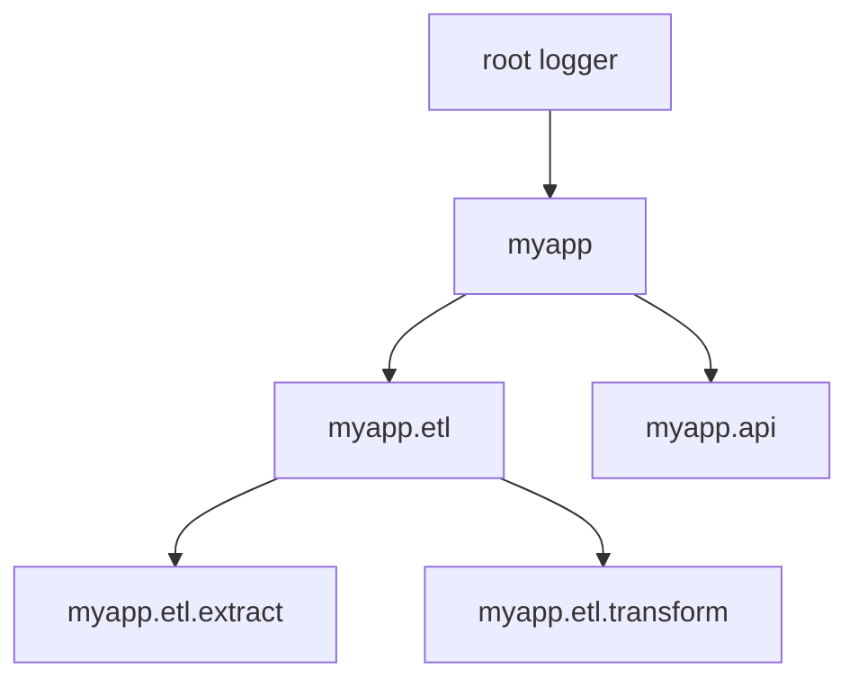

# Python Logging — Fundamentals

## Why Logging (Not Print)

```python
# BAD: print() for production code
print(f"Processing batch {batch_id}")  # Where does this go? Can you filter it? Turn it off?

# GOOD: logging module
import logging
logger = logging.getLogger(__name__)
logger.info("Processing batch %s", batch_id)  # Configurable, filterable, structured
```

| Feature | `print()` | `logging` |
|---------|-----------|-----------|
| Output destination | stdout only | File, stdout, network, custom |
| Severity levels | None | DEBUG, INFO, WARNING, ERROR, CRITICAL |
| Filtering | Manual | Built-in by level, module, custom |
| Disable in production | Comment out each line | Change config once |
| Timestamps | Manual | Built-in formatters |
| Module/line info | Manual | Automatic with `%(name)s` |
| Thread safety | No | Yes |

---

## Logging Module Basics

```python
import logging

# Get a logger for this module (standard practice)
logger = logging.getLogger(__name__)

# Log at different levels
logger.debug("Detailed diagnostic info: record_count=%d", count)
logger.info("Batch %s processed successfully", batch_id)
logger.warning("Retrying request (attempt %d/%d)", attempt, max_retries)
logger.error("Failed to connect to database: %s", str(e))
logger.critical("Pipeline halted — data corruption detected")
```

> **Always use `__name__`** as the logger name. This creates a hierarchy matching your package structure (`myapp.etl.extract`), making it easy to configure logging per module.

---

## Log Levels

The five standard levels form an ordered scale of increasing severity, shown below; the configured level acts as a cutoff so any message below it is discarded.


| Level | When to Use | Example |
|-------|------------|---------|
| DEBUG | Detailed diagnostic info (dev only) | Variable values, loop iterations |
| INFO | Confirmation that things work | "Loaded 5000 records from S3" |
| WARNING | Something unexpected but not broken | "Deprecated API used" |
| ERROR | A task failed but app continues | "Failed to process record X" |
| CRITICAL | App cannot continue | "Database unreachable, shutting down" |

```python
# Setting the level — messages below this level are ignored
logging.basicConfig(level=logging.INFO)

# DEBUG messages are now filtered out
logger.debug("This won't appear")   # ignored
logger.info("This will appear")     # shown
```

---

## Formatters

Formatters control what each log line looks like.

```python
import logging

# Basic format
logging.basicConfig(
    format='%(asctime)s - %(name)s - %(levelname)s - %(message)s',
    level=logging.INFO
)
# Output: 2024-01-15 10:30:45,123 - myapp.etl - INFO - Loaded 5000 records

# More detailed format for debugging
detailed_format = (
    '%(asctime)s | %(levelname)-8s | %(name)s:%(lineno)d | %(message)s'
)
logging.basicConfig(format=detailed_format, level=logging.DEBUG)
# Output: 2024-01-15 10:30:45 | INFO     | myapp.etl:42 | Loaded 5000 records
```

**Common format fields:**

| Field | Description | Example |
|-------|-------------|---------|
| `%(asctime)s` | Timestamp | 2024-01-15 10:30:45,123 |
| `%(name)s` | Logger name | myapp.etl.extract |
| `%(levelname)s` | Level name | INFO |
| `%(message)s` | Log message | Loaded 5000 records |
| `%(lineno)d` | Line number | 42 |
| `%(funcName)s` | Function name | process_batch |
| `%(process)d` | Process ID | 12345 |
| `%(thread)d` | Thread ID | 140234 |

---

## Handlers

Handlers determine where log messages go.

```python
import logging
from logging.handlers import RotatingFileHandler, TimedRotatingFileHandler

logger = logging.getLogger('pipeline')
logger.setLevel(logging.DEBUG)

# Handler 1: Console output (INFO and above)
console_handler = logging.StreamHandler()
console_handler.setLevel(logging.INFO)
console_handler.setFormatter(
    logging.Formatter('%(levelname)s - %(message)s')
)

# Handler 2: File output (all levels including DEBUG)
file_handler = logging.FileHandler('pipeline.log')
file_handler.setLevel(logging.DEBUG)
file_handler.setFormatter(
    logging.Formatter('%(asctime)s - %(name)s - %(levelname)s - %(message)s')
)

# Handler 3: Rotating file (prevents huge log files)
rotating_handler = RotatingFileHandler(
    'pipeline.log',
    maxBytes=10_000_000,  # 10 MB per file
    backupCount=5          # Keep 5 rotated files
)

# Handler 4: Time-based rotation (daily logs)
daily_handler = TimedRotatingFileHandler(
    'pipeline.log',
    when='midnight',
    backupCount=30  # Keep 30 days
)

# Add handlers to logger
logger.addHandler(console_handler)
logger.addHandler(file_handler)
```

---

## Basic Configuration

The simplest way to configure logging for scripts and small apps.

```python
import logging

# Quick setup for scripts
logging.basicConfig(
    level=logging.INFO,
    format='%(asctime)s - %(name)s - %(levelname)s - %(message)s',
    handlers=[
        logging.StreamHandler(),                    # Console
        logging.FileHandler('etl_job.log')          # File
    ]
)

logger = logging.getLogger(__name__)
logger.info("ETL job started")
```

**Dictionary-based config (recommended for production):**

```python
import logging.config

LOGGING_CONFIG = {
    'version': 1,
    'disable_existing_loggers': False,
    'formatters': {
        'standard': {
            'format': '%(asctime)s [%(levelname)s] %(name)s: %(message)s'
        },
    },
    'handlers': {
        'console': {
            'class': 'logging.StreamHandler',
            'formatter': 'standard',
            'level': 'INFO',
        },
        'file': {
            'class': 'logging.handlers.RotatingFileHandler',
            'filename': 'app.log',
            'maxBytes': 10485760,
            'backupCount': 5,
            'formatter': 'standard',
            'level': 'DEBUG',
        },
    },
    'loggers': {
        '': {  # root logger
            'handlers': ['console', 'file'],
            'level': 'DEBUG',
        },
        'noisy_library': {
            'level': 'WARNING',  # Silence verbose third-party logs
        },
    },
}

logging.config.dictConfig(LOGGING_CONFIG)
```

---

## Logger Hierarchy

Loggers form a tree based on dot-separated names. Child loggers propagate messages to parents.

```python
import logging

# These form a hierarchy:
root_logger = logging.getLogger()              # root
app_logger = logging.getLogger('myapp')         # child of root
etl_logger = logging.getLogger('myapp.etl')     # child of myapp
extract_logger = logging.getLogger('myapp.etl.extract')  # child of myapp.etl

# Message logged to 'myapp.etl.extract' propagates UP:
# myapp.etl.extract → myapp.etl → myapp → root
# Each ancestor's handlers will process it (unless propagate=False)

etl_logger.propagate = False  # Stop propagation here
```

The tree below illustrates this hierarchy: a message logged on a leaf logger such as `myapp.etl.extract` propagates upward through its ancestors, so each parent's handlers also see it unless propagation is disabled.



---

## Common Patterns for Data Engineering

### Logging in a Simple ETL Script

```python
import logging
from datetime import datetime

logging.basicConfig(
    level=logging.INFO,
    format='%(asctime)s [%(levelname)s] %(message)s',
    datefmt='%Y-%m-%d %H:%M:%S'
)
logger = logging.getLogger('daily_etl')

def run_etl():
    logger.info("Starting daily ETL job")
    
    # Extract
    logger.info("Extracting from source...")
    records = extract_data()
    logger.info("Extracted %d records", len(records))
    
    # Transform
    logger.info("Applying transformations...")
    transformed = transform(records)
    errors = len(records) - len(transformed)
    if errors > 0:
        logger.warning("Dropped %d invalid records during transform", errors)
    
    # Load
    logger.info("Loading to target...")
    load(transformed)
    logger.info("ETL complete: %d records loaded", len(transformed))

if __name__ == '__main__':
    try:
        run_etl()
    except Exception as e:
        logger.critical("ETL failed: %s", e, exc_info=True)
        raise
```

### Logging Exceptions with Traceback

```python
try:
    result = process_record(record)
except ValueError as e:
    # exc_info=True adds the full traceback
    logger.error("Failed to process record %s: %s", record['id'], e, exc_info=True)
except Exception as e:
    # logger.exception() is shorthand for logger.error(..., exc_info=True)
    logger.exception("Unexpected error processing record %s", record['id'])
```

---

## Interview Tips

> **Tip 1:** "Why use logging instead of print?" — "Print goes to stdout only, has no levels, no filtering, and no configurable destinations. The logging module supports severity levels, multiple outputs (file, console, network), timestamps, module context, and can be configured without code changes. In production pipelines, you need log rotation, centralized aggregation, and the ability to increase verbosity for debugging — print gives you none of that."

> **Tip 2:** "What log level would you use for 'record skipped due to missing field'?" — "WARNING — the system is still working but something unexpected happened. INFO is for normal operations. ERROR is for failures that prevent a task from completing. A skipped record is unexpected but not a failure — the pipeline continues. If the skip rate exceeds a threshold, that might escalate to ERROR."

> **Tip 3:** "How does the logger hierarchy work?" — "Loggers form a tree based on dot-separated names (like Python packages). `myapp.etl.extract` is a child of `myapp.etl`, which is a child of `myapp`. Messages propagate up the tree — each ancestor's handlers process them. This lets you configure logging at the package level (e.g., set all `myapp.etl.*` to DEBUG) without touching individual modules."
